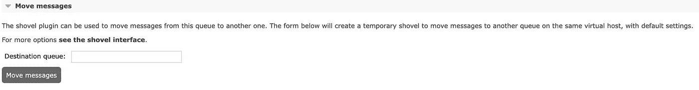
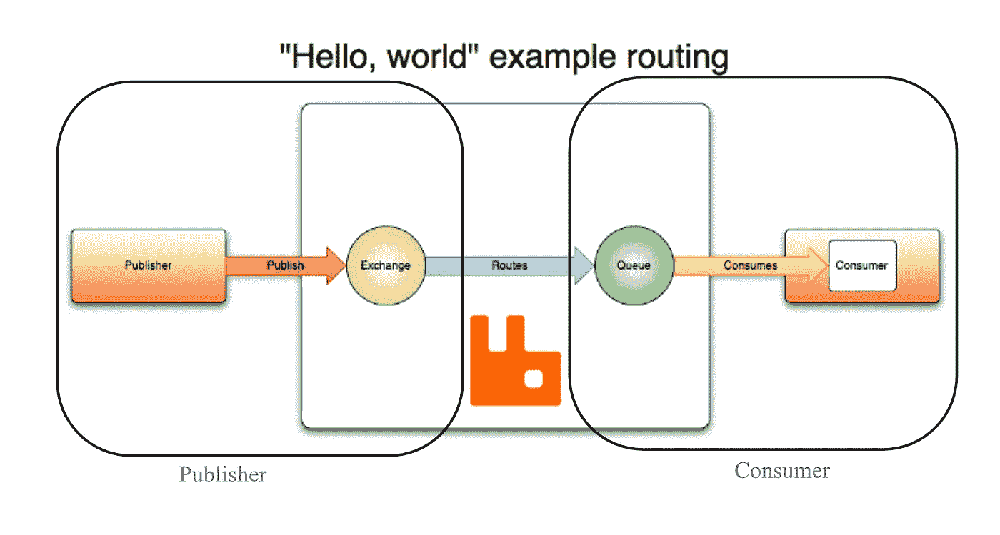

# 使用 Java 的 RabbitMQ

> 原文：<https://levelup.gitconnected.com/rabbitmq-with-java-fe4390be6e87>

有两种不同的通信方式，即同步和异步通信。今天我想讨论异步通信以及它与 RabbitMQ 的关系(在这篇文章的其余部分，我将使用 MQ)。此外，我将提供一些代码。

Mq 是一个开源的分布式消息代理，它使用高级消息队列协议(AMQP)协议，该协议是用于面向消息的中间件的[开放标准](https://en.wikipedia.org/wiki/Open_standard) [应用层](https://en.wikipedia.org/wiki/Application_layer)协议。AMQP 的定义特征是消息定向、排队、[路由](https://en.wikipedia.org/wiki/Routing)(包括[点对点](https://en.wikipedia.org/wiki/Point-to-point_(telecommunications))和[发布-订阅](https://en.wikipedia.org/wiki/Publish%E2%80%93subscribe))、可靠性和安全性。

在不同的服务中，我们将它用于不同的目的。比如发送不需要同步的邮件，在一些微服务进程之间进行管理。我们的一些电子邮件和通知并不需要立即发送。这就是为什么我们在这里使用 Mq，对我们的请求进行排队，当服务可用时，就执行并发送它们。

出于某些特定的原因，比如 POST、UPDATE 和 DELETE 进程，我们更喜欢使用 Mq 在服务之间进行通信。因为我们不希望受到我们正在处理的任何其他服务问题的影响。因此，我们将通过每个服务自己的流程来管理每个服务的问题和责任。

使用 Mq 为我们提供了一些好处，例如:

*   节省我们的时间
*   提高服务绩效
*   减少依赖性及其相关问题
*   分离责任

不幸的是，Mq 不是一颗银弹，它有一些我们面临的缺点；

*   当处理成千上万的数据时，速度很慢，需要时间。
*   无法将队列中的部分消息移动到目标队列。移动邮件时，所有邮件都会被移动。我希望我们能设法发送一部分。

在跳过代码细节之前，我还想添加我们使用的模型结构。

模型简介；

图片来源:[https://www.rabbitmq.com/tutorials/amqp-concepts.html](https://www.rabbitmq.com/tutorials/amqp-concepts.html)

这里有两个部分——发布者和消费者。我们将发布者和消费者分开，他们通常位于不同的服务上。这就是为什么我在这里把这篇文章分成两部分。但是有些设置对于依赖关系和 application.yml 配置这两个部分是必需的。

我用的是 spring-boot-starter-amqp 的 2.6.6 版本:

然后将 Mq 配置添加到我的 application.yml

# 出版者

我们只在 publisher 中配置交换部分，然后发送消息。

我如下配置了 Mq EXCHANGE。

注意，我在这里使用了 TopicExchange。我从 [RabbitMq](https://www.rabbitmq.com/tutorials/amqp-concepts.html) 地址引用的 TopicExchange 定义是；

> 主题交换基于消息路由关键字和用于将队列绑定到交换的模式之间的匹配，将消息路由到一个或多个队列。主题交换类型通常用于实现各种发布/订阅模式变体。主题交换通常用于消息的多播路由。

如果你想学习其他的交换类型，请点击[这里](https://www.rabbitmq.com/tutorials/amqp-concepts.html#exchanges)。

配置之后，现在我准备好将我的消息发布到该队列的交换中。为此，我使用了 ***convertAndSend()*** 方法。

# **消费者**

现在，我为消费者部分配置了队列配置。

我用队列、交换和死信队列定义配置了 Mq。

代码差不多准备好了。现在只差一步了。我还需要一个侦听器方法，我可以消费发布的消息。

**@RabbitListener** 应该用必需的参数添加到方法的顶部。

请注意您的发布者和消费者对象应该是相同的。

代码已经完全准备好了。

最后，您可以找到我为上面的类编写的测试类。

RabbitMqConfigurationTest

这里是 EnqueueService 类测试；

在下一篇文章中，我将分享另一个异步通信的例子，它是基于发布-订阅流/消息的 Kafka。

希望有帮助，

感谢阅读…

参考资料:

 [## 高级消息队列协议-维基百科

### 高级消息队列协议(AMQP)是面向消息的开放标准应用层协议

en.wikipedia.org](https://en.wikipedia.org/wiki/Advanced_Message_Queuing_Protocol)  [## AMQP 0-9-1 模型解释

### 本指南概述了 AMQP 0-9-1 协议，这是 RabbitMQ 支持的协议之一。AMQP 0-9-1…

www.rabbitmq.com](https://www.rabbitmq.com/tutorials/amqp-concepts.html)