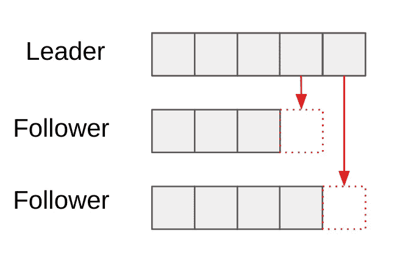
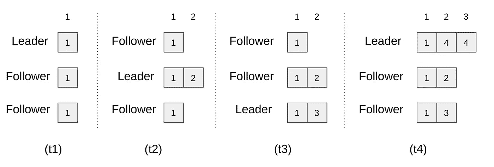
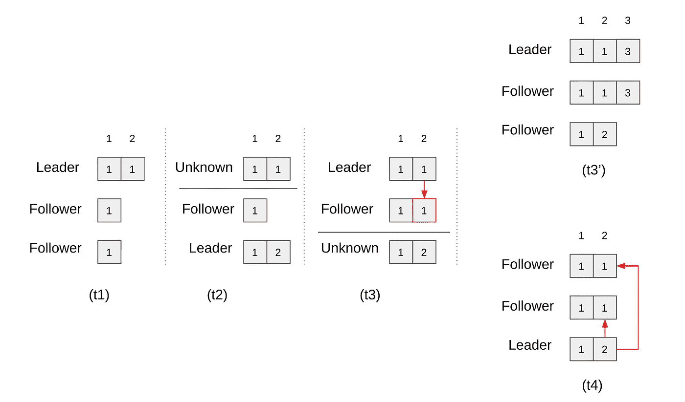

# Raft 共识协议更简单

> 原文：<https://levelup.gitconnected.com/raft-consensus-protocol-made-simpler-922c38675181>

相关帖子:

1.  Raft 共识协议变得更简单
2.  Raft 集群成员资格更改协议[ [链接](https://eileen-code4fun.medium.com/raft-cluster-membership-change-protocol-f57cc17d1c03)
3.  Raft 共识协议实现[ [链接](https://eileen-code4fun.medium.com/raft-consensus-protocol-implementations-2b487320a5fc)

> **背景**

过去三十年来，Paxos 一直是分布式共识协议的黄金标准。Paxos 表面上看起来很简单，实际上非常难以理解，尤其是当你开始考虑各种边缘情况时。随着大数据时代的到来，研究人员开始发现新一代的共识协议，这些协议更容易理解，更易于实施。其中，Raft 是主要的赢家之一，并在许多现实世界系统中被广泛采用(如 Kubernetes 中的 etcd)。Raft 是由斯坦福大学的 Diego Ongaro 和 John Ousterhout 发明的，并在 Diego 的博士论文中有详细的记载。他们进行了用户研究，以表明 Raft 实际上比 Paxos 更容易掌握，Pax OS 满足了他们的主要设计目标之一——可理解性。但是不要搞错了。分布式共识是一个如此复杂的主题，没有任何设计能够神奇地让它变得微不足道。我们能做的就是试着从不同的角度反复研究，直到也许有一天我们开始对它感到舒服。因此有了这篇博文。我想给 Raft 学习者提供一个替代迭戈 200 多页论文的选择。我觉得我的方式更简单。但我会让你来判断。

Raft 处理日志复制。直觉上，如果您设法让完全相同的日志序列出现在大多数机器上，那么您已经设法让那群机器在某些事情上达成一致。事实上，这就是所谓的总订单广播。如果您可以让日志的每个条目出现在机器集群中的相同位置，那么您可以使用它来实现一致性。例如，如果一台机器想要建议一个值，让我们假设它的最后一个日志条目在位置 *i* ，它可以尝试让其他机器把这个新值放在 *i+1* 。在集群中的大多数机器已经在 *i+1* 复制了该值之后，我们现在将该值称为在 *i+1* 提交的值。用 Paxos 的话来说，这实际上等同于提出一个价值观并让其他人接受它。

Raft 是基于领导者的协议。在正常运行过程中，节点群集将选举一个且只有一个领导者。其他节点是追随者。领导者接受客户写请求，并将它们复制给追随者。就这么简单。然而，当领导者失败时，所有错综复杂的事情就出现了，我将在这篇博文中谈到这一点。

> **简化尝试**

在这篇博文中，我将对 Raft 协议做三个简化。它们不影响核心算法，但它们让很多东西变得更容易理解。

1.  Raft 将集群中的节点称为状态机，日志序列是一系列要传递给状态机执行的命令。这具有研究的普遍性，但它使故事变得复杂。我将简化它，说我们只关心在大多数节点中安全地复制日志序列，不要担心状态机部分。这不会影响协议，因为状态机的执行只是在日志序列被正确复制到节点上之后，每个节点可以在本地执行的事情。
2.  Raft 谈到了日志序列中提交索引的概念。我将先忽略它，稍后再回来。没有它，节点不知道有多少日志序列被安全复制。他们只知道最终会被复制。这违反了共识协议的活动性要求。但是正如我们将在后面看到的，提交的索引只是每个节点中的一个易变状态，它们可以很容易地从集群的领导者那里获得。领导者自己有办法确定承诺指标。忽略承诺的指标最初会平滑学习曲线。
3.  Raft 为领导者定义了一个 AppendEntries RPC，用于向追随者发送日志条目。我将把它限制为一次只包含一个条目(即单数 AppendEntry)。在这篇博文中，很容易看出它并没有影响协议的核心。这只会让落后的跟随者追赶得更慢，因为现在他们一次只能从领先者那里收到一个条目。

> **正常操作过程**

先做简单的事情。我已经在背景部分提到了这一点。在正常操作过程中展开:

*   领导者一次接受一个客户端写请求(请求可能会并发出现，但从日志的角度来看，它们将被序列化)。
*   领导者首先将写请求附加到它自己的持久日志序列。
*   然后，领导者向它的每个追随者发送一个 AppendEntry RPC，指示他们也将这个写请求附加到他们的日志序列中。
*   在收到 AppendEntry RPC 后，跟随者将其附加到自己的日志序列中，然后向领导者响应成功。将会有一些检查来决定是否接受那个条目，但是它只在失败的情况下有用，我将在后面讲到。
*   在得到大多数( *n/2 + 1* )节点的成功响应后，领导者向客户端响应成功。此时，写请求被安全地复制到集群中。

正常操作过程

集群中的节点总数是所有节点都知道的静态配置。所以领导者，坦率地说，群体中的其他人，可以计算出多数所需的人数。更改成员资格(添加或删除节点)将在以后的博客文章中介绍。如果由于某种原因，领导者没有收到来自 AppendEntry RPC 的追随者的反馈(追随者崩溃或网络中断)，领导者将在后台永远重试。由于领导者只等待来自大多数节点的成功响应，少数失败不会阻塞系统。失败的 AppendEntry RPC 将以与日志序列相同的顺序重试。落后的跟随者最终会赶上并复制领导者的日志序列。这就是全部了。生活如此简单，没有那些不寻常但危险的复杂因素。

> **领袖选举**

现在已经到深水区了。很多情况下都需要领袖选举。例如，在启动时，管理员可能没有指定领导者，因此集群需要选举其领导者。或者领导者可能崩溃，然后作为追随者回来，在这种情况下，仍然没有领导者。并且将领导者与大多数节点隔离开。需要选举一个新的领导者来保持集群的运转，但是当旧的领导者回来时，我们需要调和这一点。

Raft 中最重要的概念来了:**术语**。就像总统的任期一样，领导人的任期也是有限的。任期—在实施中是一个单调递增的整数—为领导者的权力提供了一个关键的边界，它被用作一种冲突解决机制，以避免多领导者问题和旧/新领导者竞争。简而言之，具有较高术语数的领导者/节点占上风。我们来看看细节。顺便说一下，术语的概念也存在于许多其他现代的基于领导者的共识协议中。这似乎是一个很好的设计模式。

首先，集群如何发现它需要一个领导者选举？前面提到的 AppendEntry RPC 定期从领导者发送到追随者。即使没有客户端写请求，AppendEntry RPC 仍然被发送(只是其中没有任何条目)。那是心跳。如果追随者在某个配置的选举超时后没有听到领导者的心跳，它会认为领导者已经死亡，并开始选举以竞选新的领导者(可以说追随者成为了候选人)。随机选举暂停将用于避免太多的追随者一次提名自己，这可能导致分裂投票，没有赢家。该协议确实有一个重试选举的机制，即使发生这种情况，我们将在后面看到。

候选节点首先将其当前任期数从 *t* 增加到 *t+1* ，并向所有其他节点发出 RequestVote RPC。插话:到目前为止，我提到了两个 RPC:AppendEntry 和 RequestVote。事实上，这是你在 Raft 中唯一需要知道的两个 RPC。请注意，节点的当前术语号必须保存在持久存储中。每个接收节点检查他们是否已经为其他候选人投了任期 *t+1* 的票，如果没有，他们返回成功给这个候选人。这确保了每个节点在任何给定的任期内只为一个候选人投票。显然，这些信息也需要存储在持久存储中，以便在崩溃时幸存下来。当候选节点从大多数节点收到成功消息时，它将自己转换为领导者，并开始向所有其他节点发送 AppendEntry RPC。其他节点在接收到 AppendEntry RPC 时，知道为 *t+1* 选举了一个领导者。如果候选人失败，或者有两个候选人分裂选票，没有人会成为领导者。如果在选举超时后没有收到 AppendEntry RPC，其他节点将尝试自己竞选领导者。

还有另一个重要的因素使这项工作得以顺利进行。每个节点将把它们当前的术语编号放入它们发出的所有 RPC 请求和它们返回的所有响应中。这里有一个通用规则:**每当一个节点从另一个节点接收到一个术语号(无论是在传入的请求中还是在返回的响应中)，如果该术语号大于该节点的当前术语号，则该节点立即将其自身转换为追随者，而不管其当前状态(领导者或候选人)，并将其当前术语更新为这个新的更高术语。**要了解这一点为何至关重要，请考虑以下示例:

*   领导者向其追随者发送 AppendEntry RPC。追随者将同步到领导者的任期。在正常的运作过程中，领导者的任期数并不比任何追随者少。
*   如果任期为 *t* 的领导人与多数派分离，将为任期 *t+1* 选举另一位领导人。这是因为候选人必须将其任期从 *t* 增加到 *t+1* 才能竞选新的领导人。当旧的领导者回来时，它试图与多数交谈，并且某个节点保证返回任期 *t+1* ，因为必须已经达到多数来选举任期 *t+1 的新领导者。师*何老领导可以接着下台了。
*   如果候选人失败或两个候选人平分选票，其他节点或者在期限 *t* 内，或者在期限 *t+1* 内，如果它们已经被候选人联系过。任期 *t* 中的那些节点之一可以竞选任期 *t+1* 的领导者。如果大多数节点的当前术语仍然是 *t* ，则它可能成功。否则，只有术语 *t+1* 中的节点会成功，因为它们会将其当前术语递增到 *t+2* 以竞选领导者。

在我们完成领袖选举之前还有最后一点。到目前为止，我可能给你的印象是，任何有正确任期号码的候选人都可以赢得选举。不是这样的。想想看:如果一个处于正确任期但具有滞后日志序列的候选人赢得了新的领导者地位，它将开始将其日志序列复制到其他节点，有效地覆盖其他可能已经安全复制的日志序列。这违背了对客户端的承诺，因为群集对这些客户端写入做出了成功响应。所以我们必须制定最后一个规则:**一个节点只投票给一个其日志序列比其更完整的候选节点。**“更完整”被定义为来自更高术语的日志的最后一个条目(是的，当从客户端接收到日志条目时，我们必须记录术语编号)；如果项数相同，则取较长的对数序列。后面的部分很好理解。—在正常操作过程中，一些节点会比其他节点更紧密地跟随领导者。要理解前者，你必须回到我们的术语定义和普遍法则。你会看到这个词定义了一个新时代。在某种意义上，它类似于新鲜的概念。领导者选举尊重术语编号，具有较高术语编号的日志条目本质上是“较新的”。

> **修复破损日志序列**

节点上的日志序列可能会由于频繁的领导变更而被破坏，尤其是当节点本身成为领导并被多次丢弃时。如下图所示:

方框外的数字是日志条目索引。方框内的数字是这些日志条目的相应术语编号。(t1)第一个节点是术语 1 中的领导者，并将位置 1 处的日志复制到所有追随者。(t2)第一节点发生故障，第二节点成为第 2 项中的领导者，然后在其能够在位置 2 复制其新日志之前发生故障。(t3)第三节点在从其自身和第一节点获得投票后成为任期 3 中的领导者。它在复制位置 2 的新日志之前失败。(t4)第一个节点在第 4 项中再次成为领导者，并且它具有两个新的日志条目，它需要复制到跟随者。

在领导者选举部分，我们已经确定获胜的领导者包含最完整的日志序列。这是我们需要复制到整个集群的事实来源。因此，领导者负责“重置”其追随者的日志序列。其方式是通过相同的 AppendEntry RPC。将包括两个额外的参数:*先前条目索引*和*先前条目期限*。它们用于查找与领导者的日志序列共享的日志序列前缀。该日志序列前缀的结尾将是领导者的日志序列覆盖追随者的日志序列的起点。注意，领导者不需要发送其整个日志序列来进行比较。由于有序地附加日志条目以及 term 提供的单个前导保证，如果位置 *i* 处的日志序列与位置 *i* 处的另一个日志序列具有匹配的 term，则保证这两个日志序列直到位置 *i* 都具有共同的前缀。因此，AppendEntry 只需要包含额外的 *previous_entry_index* 和 *previous_entry_term* 。如果追随者回应不匹配，领导者只需在另一轮 AppendEntry 中回溯到 *i-1* 继续搜索。

> **承诺指标**

在“简化尝试”一节中，我承诺将回到这个问题。我们到了。追随者从 AppendEntry 中的领导者接收提交的索引。在正常操作过程中，当领导者在位置 *i* 处接收到来自大多数节点的对 AppendEntry 的成功响应时，它知道位置 *i* 被安全地复制(提交)。并且由于领导者按顺序复制日志条目，如果位置 *i* 被提交，那么位置 *i-1* 之前一定已经被提交。这就是为什么领导者只需要传达最后提交的索引，而追随者将知道他们的日志序列到该点都已提交。

不过，领导层的变动有一个警告。考虑以下事件:

方框外的数字是日志条目索引。方框内的数字是这些日志条目的相应术语编号。(t1)第一个节点是第 1 项中的领导者，然后它在能够复制位置 2 处的日志条目之前被网络分割开。(t2)第三节点通过从其自身和第二节点获得投票而成为第 2 项中的领导者。它在位置 2 有一个新的日志条目，但是在复制它之前就被网络分区了。(t3)第一个节点返回并成为第 3 项的领导者。它将其在位置 2 的日志条目复制到第二个服务器。但是这个日志条目是不安全的，即使它目前在三分之二的节点中被复制。因为(t4)可能发生在第一节点失效而第三节点回来成为第 4 项中的新领导者的情况下。只有在(T3’)的情况下才是安全的，在这种情况下，位置 3 处的新日志条目被复制到大多数节点中。到那时，即使第三个节点回来，由于领导者选举部分中的日志完整性规则，它也不能赢得选举。

因此，位置 *i* 仅当其在大多数节点中被复制并且其期限是当前期限时才被提交。

**关闭**

我希望您现在已经对 Raft 共识协议有了基本的了解。我可能会再写几篇后续的博客文章，谈谈实现和集群成员变更之类的事情。敬请关注。希望很快再次见到你。