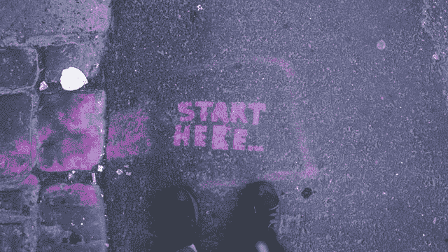
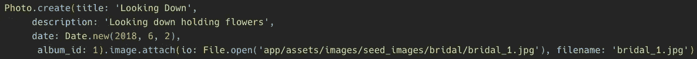

# Rails 图像上传 101

> 原文：<https://levelup.gitconnected.com/rails-image-upload-101-f9bf245e389b>


设计生态学家在 [Unsplash](https://unsplash.com/s/photos/computer-images?utm_source=unsplash&utm_medium=referral&utm_content=creditCopyText) 上拍摄的照片

想象一下没有任何图形的互联网。你不能去脸书看你二表哥最好的朋友的新宝宝，你不能今天第 46 次浏览 Instagram，还有 memes？没听说过！图像是我们享受网站和应用程序不可或缺的一部分，所以如果你是一个初出茅庐的 Rails 开发人员，你想把它们包含在你的项目中也就不足为奇了。然而，如果你向你最喜欢的搜索引擎寻求建议，你很容易被选项淹没。本文将引导您完成将照片应用到项目中的基本实现。

这是我们将要使用的技术:

*   [导轨](https://rubyonrails.org/) 6.1.1 ( [主动存储](https://guides.rubyonrails.org/v5.2.0/active_storage_overview.html)预装)
*   [主动存储验证](https://github.com/igorkasyanchuk/active_storage_validations) 0.9.2

# 我们开始吧



[Gia Oris](https://unsplash.com/@giabyte?utm_source=unsplash&utm_medium=referral&utm_content=creditCopyText) 在 [Unsplash](https://unsplash.com/s/photos/start-here?utm_source=unsplash&utm_medium=referral&utm_content=creditCopyText) 上拍照

## 设置活动存储

从跑步开始:

```
rails active_storage:install
```

活动存储将为您创建一个迁移，该迁移将为您设置所有必需的表。如果您导航到迁移，它应该如下所示:


CreateActiveStorageTables 迁移的屏幕截图

现在，这看起来很多，并且可能有一些你不能 100%理解的东西，但是不要让这些吓倒你！您可以在闲暇时随意研究这个问题的来龙去脉，但是现在，您可以相信活动存储知道它在做什么。继续跑吧:

```
rails db:migrate
```

## 添加关联

下一步是确保你的模特准备好接受照片。将这一行代码添加到将有图像附加到其上的任何模型中。

```
has_one_attached :image
```

随便你怎么称呼图像*:头像*、 *:main_image* 、 *:profile_pic* 最符合你项目的就好；这就是你在其他地方引用所附图片的方式。你也可以选择使用 *has_many_attached* ，但我们今天将专注于附加一个图像。

## 局部存储器

看一眼你的 *config/storage.yml* 文件。你可以选择与亚马逊 S3、谷歌云存储或微软 Azure Storage 等提供商建立托管服务。默认情况下，Active Storage 会将您设置为在本地托管映像，只要您的应用程序还在开发中，这完全没问题。如果你看到这个，你就可以走了！


本地托管的 storage.yml 文件的屏幕截图

## 强参数

如果你正在使用[强参数](https://api.rubyonrails.org/v6.1.0/classes/ActionController/StrongParameters.html)(你可能应该是！)，必须允许图像传入。为此，只需将您选择用来调用该图像的任何内容添加到允许的参数列表中


强参数的屏幕截图，在末尾标记了:image 键

# 添加图像


照片由[雅各布·欧文斯](https://unsplash.com/@jakobowens1?utm_source=unsplash&utm_medium=referral&utm_content=creditCopyText)在 [Unsplash](https://unsplash.com/s/photos/polaroid-pictures?utm_source=unsplash&utm_medium=referral&utm_content=creditCopyText) 上拍摄

## 上传照片

现在您已经设置好了，让我们创建一个允许您的用户上传照片的表单。


表单的屏幕截图，标记了:图像字段

如果您已经创建了表单，您只需添加以下内容:

```
<p><%= f.label :image%><%= f.file_field :image, accept: 'image/png, image/gif, image/jpeg' %></p>
```

*确保您使用之前选择的内容来代替*:图像*，但保留*图像/png、*等。同上。*

该代码创建了您在大多数网站上可能熟悉的文件上传结构，并且它限制用户只能选择*。png* ，*。gif* ，和*。jpg* 图像元素，帮助防止坏数据进入你的数据库。

## 播种您的数据库

可以用已经附加了图像的模型作为数据库的种子。如果您选择这样做，请确保将图像添加到您的项目中，以便其他开发人员可以访问它们。我选择把我的放在一个 *seed_images* 文件夹中，这样任何查看数据库的人都能清楚地看到东西在哪里。


应用程序目录的屏幕截图，显示图像的嵌套文件夹

一旦您准备好种子图像，就跳到您的 *db/seeds.rb.* 开始创建一个新实例，就像您通常会做的那样。最后，您将添加以下代码:

```
.image.attach(io: File.open('app/assets/images/seed_images/bridal/bridal_1.jpg'), filename: 'bridal_1.jpg')
```



示例种子文件代码的屏幕截图

File.open 的参数将是保存图像的相对路径，以及*。图像*将再次匹配您之前的选择。要为数据库设定种子，请运行:

```
rails db:seed
```

注意:一旦你开始添加图像到你的种子，它**将**减慢播种过程，如果你添加太多，你的数据库可能超时。考虑创建多个种子文件，或者可以在您的 *config/database.yml* 文件中延长超时期限。

# 确认


照片由 [Soragrit Wongsa](https://unsplash.com/@invictar1997?utm_source=unsplash&utm_medium=referral&utm_content=creditCopyText) 在 [Unsplash](https://unsplash.com/s/photos/organized?utm_source=unsplash&utm_medium=referral&utm_content=creditCopyText) 拍摄

当您使用数据库时，重要的是确保所有东西都在您期望的位置和方式，并防止不需要的元素偷偷通过。可以使用验证来确保这一点，但是请等待！没有针对图像附件的内置验证。幸运的是，我们有一个宝石！

输入，活动存储验证！

如果您还没有，请将此宝石添加到您的 gem 文件中:

```
gem 'active_storage_validations'
```

这块宝石可以帮助你做很多事情，但是让我们从最基本的开始。如果您想要验证图像是否已附加，请将此代码添加到您的模型中:

```
validates :image, attached: true
```

很好很容易！

# 显示图像


照片由[莱昂纳多·叶](https://unsplash.com/@yipleonardo?utm_source=unsplash&utm_medium=referral&utm_content=creditCopyText)在 [Unsplash](https://unsplash.com/s/photos/picture-in-museum?utm_source=unsplash&utm_medium=referral&utm_content=creditCopyText) 上拍摄

## 基本显示

现在我们已经上传了一些图像到我们的数据库，我们想在我们的应用程序中使用它们！您可以将此代码添加到您想要显示图像的视图中。确保您已经将变量 *@photo* 设置为您想要显示的实例和*。图像*应该与上面的选择相匹配

```
">
```

这是我们的基本图像标签，一个 ERB 标签找到我们照片的图像 URL，并将其输入到 *src。*

## 式样

您可以像平常一样将 CSS 类添加到这个标签中。因为你不知道用户上传的照片有多大，所以你应该小心不要全尺寸显示。一个有用的基本 CSS 样式是:

```
.full-img {object-fit: contain;height: 100%;width: 500px;padding-top: 20px;padding-bottom: 20px;}
```

如果你将这个类添加到你的 *img* 标签中，它将保持照片的长宽比，同时将它的宽度缩小到 500 像素(在这里阅读更多关于[对象适配](https://developer.mozilla.org/en-US/docs/Web/CSS/object-fit)如何工作的信息),并在顶部和底部添加填充，以防止它压到你页面上的其他内容。

选择什么造型由你自己决定！确保考虑到异常大的图片，你的应用程序很快就会看起来很棒。

# 结论


米克·豪普特在 [Unsplash](https://unsplash.com/s/photos/gallery?utm_source=unsplash&utm_medium=referral&utm_content=creditCopyText) 上的照片

图像是大多数用户上网的一个关键部分，它们可以为你的应用程序增加很多东西。有大量关于托管图像的信息，有时会让人感到不知所措。我希望这篇文章对您有所帮助，并且您的应用程序正在如您所愿地工作！*记住，这个指南为你设置了本地托管图像，这对开发和学习来说是极好的，但是一旦你的网站投入生产，你会想要使用一个提供商。*

在构建我的 Rails 应用程序时，我得到了积极的支持。如果您想看看这段代码的运行情况，可以在我的 GitHub 上找到开发版本。如果您有任何问题，请随时联系我！