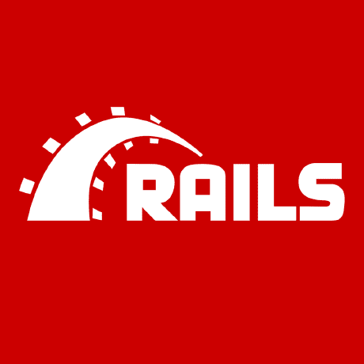

# Rails —分三步的嵌套表单

> 原文：<https://levelup.gitconnected.com/rails-nested-forms-in-three-steps-5580f0ad0e>



Rails 充满了魔力。表单助手，尤其是构建直接链接到 Ruby 对象的表单的能力，是 Rails 的魅力之一，我很难理解。

这是一个在 rails 中设置嵌套表单的快速指南。

首先，什么是嵌套表单？顾名思义，它是一种形式中的形式。更具体地说，嵌套表单创建或操作的模型不同于父表单的模型。

假设我们有两个模型——主人和狗。一个主人可以养很多只狗，一只狗属于一个主人。

```
class Owner < ActiveRecord::Base
 has_many :dogs
end
```

和

```
class Dog < ActiveRecord::Base
 belongs_to :owner
end
```

创建新狗的表单如下所示:

```
<h1>Create a new Dog:</h1><%= form_for(@dog) do |f|%> <div>
    <%= f.label :name%>
    <%= f.text_field :name%>
  </div><br>

  <div>
    <%= f.label :breed%>
    <%= f.text_field :breed%>
  </div><br>

  <div>
    <%= f.label :age%>
    <%= f.text_field :age%>
  </div><br>

  <div>
    <label for="dog_owner_id">Select an owner:</label>
    <%= f.collection_select :owner_id, owner.all, :id, :name, prompt: true%>
  </div><br>

  <%= f.submit %>

<% end %>
```

上面的表单使用户能够从已经保存到数据库中的所有者中选择所有者，但是如果他们需要创建一个新的所有者呢？让用户意识到这一点，然后去另一个页面创建一个主人，然后回到这个页面创建狗，这将是一个糟糕的用户体验。嵌套表单拯救世界！

**第一步—型号**

将`accepts_nested_attributes_for`方法添加到模型中，在我们的例子中，我们的主表单是用于狗的。这是为指定的关联(所有者)定义属性编写器的类方法。你可以在[这里](https://api.rubyonrails.org/classes/ActiveRecord/NestedAttributes/ClassMethods.html)阅读。

我们的所有者类现在看起来像这样:

```
class Dog < ActiveRecord::Base
 belongs_to :owner
 accepts_nested_attributes_for :owner
end
```

**步骤 2 —查看**

接下来，我们需要通过添加嵌套表单来更新视图。为此，我们将使用 [](https://api.rubyonrails.org/v5.2.3/classes/ActionView/Helpers/FormHelper.html#method-i-fields_for) `[fields_for](https://api.rubyonrails.org/v5.2.3/classes/ActionView/Helpers/FormHelper.html#method-i-fields_for)`，它像`form_for`一样产生一个 FormBuilder 对象。

```
<div>
  <h3>Or create a new owner:</h3>
  <%= f.fields_for :owner, Owner.new do |owner_attributes|%>
      <%= owner_attributes.label :name, "Owner Name:" %>
      <%= owner_attributes.text_field :name %>
  <% end %>
</div>
```

我们更新后的表单如下所示:

```
<h1>Create a new Dog:</h1><%= form_for(@dog) do |f|%> <div>
    <%= f.label :name%>
    <%= f.text_field :name%>
  </div><br>

  <div>
    <%= f.label :breed%>
    <%= f.text_field :breed%>
  </div><br>

  <div>
    <%= f.label :age%>
    <%= f.text_field :age%>
  </div><br>

  <div>
    <label for="dog_owner_id">Select an owner:</label>
    <%= f.collection_select :owner_id, owner.all, :id, :name, prompt: true%>
  </div><br> <div>
    <h3>Or create a new owner:</h3>
    <%= f.fields_for :owner, Owner.new do |owner_attributes|%>
        <%= owner_attributes.label :name, "Owner Name:" %>
        <%= owner_attributes.text_field :name %>
    <% end %>
  </div>

  <%= f.submit %>

<% end %>
```

**步骤 3a —控制器**

当用户提交原始表单时，控制器的动作是创建一只狗的新实例。对于嵌套表单，我们还需要创建一个新的所有者实例，并将该所有者与狗相关联。这是通过`build`方法完成的。

```
class DogsController < ApplicationController def new
   @dog = Dog.new
   @dog.build_owner 
  end end
```

**步骤 3b —控制器**

我们还需要更新控制器中的强参数。在狗模型中使用`accepts_nested_attributes_for`给这个类增加了一个新的属性。

```
class DogsController < ApplicationController def  dog_params
    params.require(:dog).permit(:name, :breed, :age owner_attributes: [:name])
  end

end
```