# Rails 一对多后端与 CRUD

> 原文：<https://levelup.gitconnected.com/rails-one-to-many-backend-with-crud-48acbfaf3a56>

在我上一篇 [**博客**](https://medium.com/@adamlee2388/building-a-rails-backend-df7efe849812)**中，我写了如何构建一个基本的 Rails 后端。在本文中，我将展示 CRUD 方法的例子以及如何建立一对多的关系。CRUD 是创建、读取、更新、删除的缩写。这些方法是用于操作数据库的四种基本方法。这些方法将被创建并放置在您的单个控制器中。**

**首先，我们将创建一些模型和控制器，用于构建一对多。对于这个例子，一对多将是海盗和船只。一个海盗属于一艘船，一艘船有很多海盗。要轻松开始，我们可以运行以下命令:**

**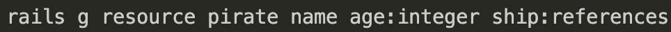**

**这个命令将创建你的模型和控制器，`ship:references`是开始建立这种关系的一个简单快捷的方法。从这个命令中，您的控制器和模型将被构建，在您的迁移文件和盗版模型中，您会注意到这也添加了一行额外的代码，这是构建我们将要构建的类之间的关系所需要的。**

**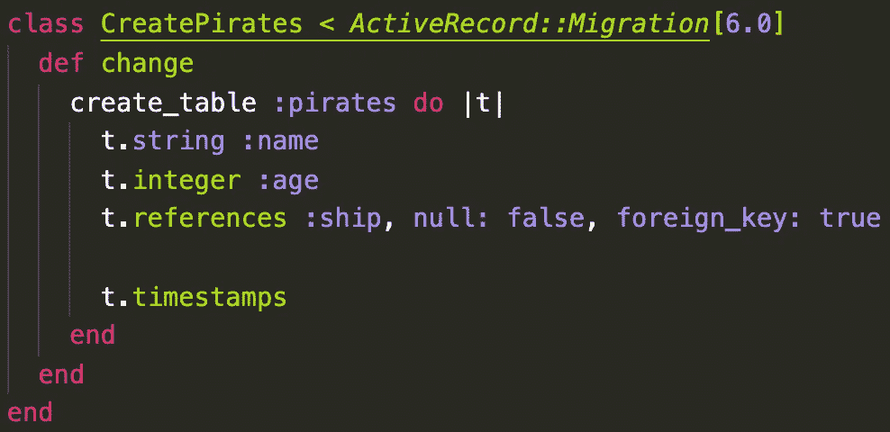**

**迁移文件**

**在迁移文件中，我们运行的命令的`ship:references`部分添加了`t.references :ship, null: false, foreign_key: true`。当我们马上创建船模和控制器时，我会向您展示那个迁移文件，这样您也可以看到不同之处。**

**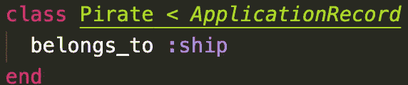**

**盗版模型**

**在这个模型中，我们运行的命令的`ship:references`部分自动输入这个文件中的`belongs_to :ship`。既然我们已经给了海盗一艘船的参考，我们应该制作船的模型、控制器和迁移文件。**

**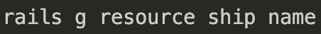**

**现在我们已经运行了这个命令，我们需要向我们的船模型添加一些代码。记住一艘船有许多海盗，而海盗属于一艘船。因此，在我们的船舶模型中，我们将拥有:**

**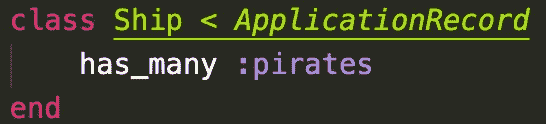**

**船模**

**这是没有任何引用(或`belongs_to`)任何其他类的迁移文件。注意这里没有`t.references`:**

**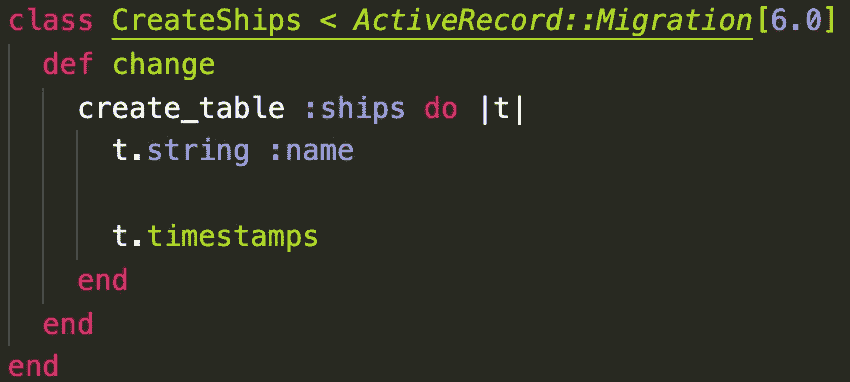**

**现在我们的关系已经建立，让我们去控制器并添加我们的 CRUD 动作。来自 CRUD 首字母缩写词的第一个方法是 create。虽然这是第一个方法，但我通常会创建一个 read 方法，在控制器中它实际上会被称为 index。我这样做是为了当我在种子文件、web 应用程序或 postman 中创建新的类实例时，我可以首先看到我正在处理的列表。**

**阅读(索引):**

**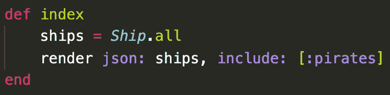**

**船舶控制器(索引动作)**

**这和我的盗版控制器指数法有一点点不同。不同的是`include: [:pirates]`块。这样做的结果如下:**

**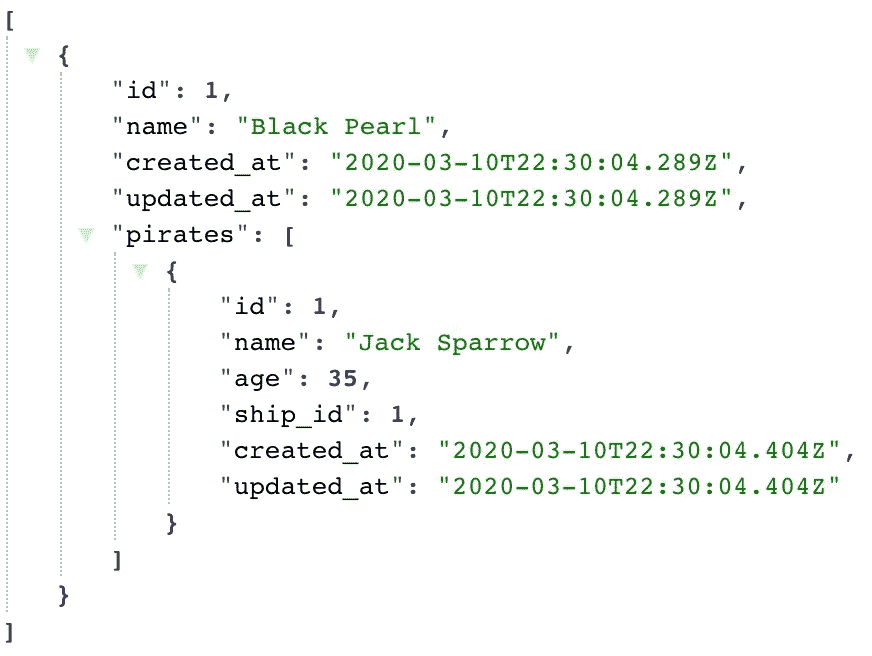**

**如你所见，现在不仅船被归还，而且船**也包括**任何属于这艘船的海盗。不包含任何内容的普通索引方法如下所示:**

**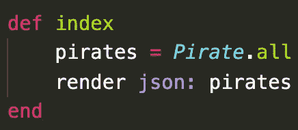**

**盗版控制器(索引动作)**

**我们要做的 CRUD 的下一个方法是创建:**

**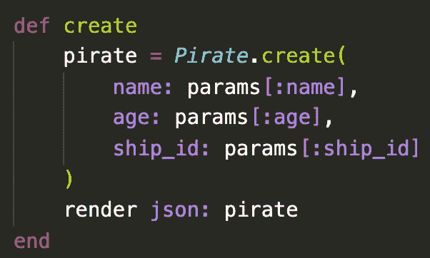**

**海盗控制器(创建动作)**

**在每一个创建方法中，你都将拥有你在创建方法中赋予类的属性，如上所示。如果您忘记了它们是什么，您可以检查您的迁移文件或您的模式。为了展示我的类之间的差异，这里有一个只有名称的 ship create 方法:**

**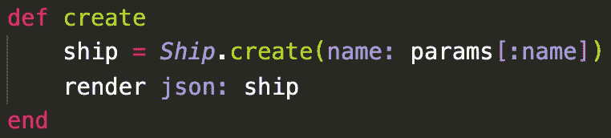**

**船舶控制器(创建活动)**

**下一个 CRUD 方法被更新:**

**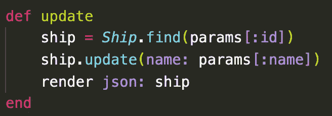**

**船舶控制器(更新活动)**

**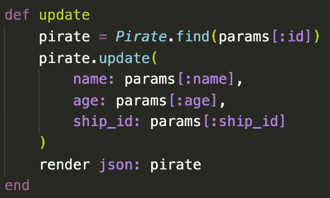**

**盗版控制器(更新操作)**

**请注意，使用 update 方法，我们将变量设置为等于`Prate.find`,这样我们可以在数据库中找到特定的盗版者，正如您所看到的，我们通过检查他们的 id 来找到特定的盗版者。销毁方法在这方面也是相似的:**

**销毁方法:**

**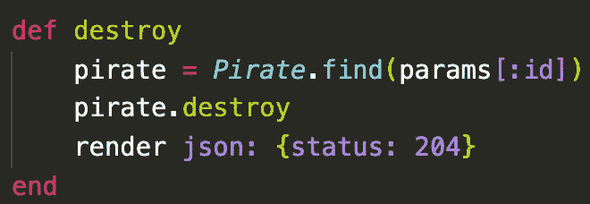**

**海盗控制器(摧毁行动)**

**这里，destroy 方法呈现状态 204。这种状态意味着“没有内容”,是删除后应该返回的正确状态。为了验证您是否获得了状态 204，您可以在 Postman 中测试它。**

**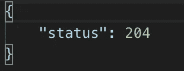**

**在创建 CRUD 方法之后，您要为后端做的最后一件事是转到 config 文件夹中的 routes.rb 文件，并进行以下更改:**

**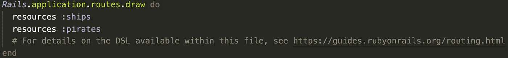**

**以前**

**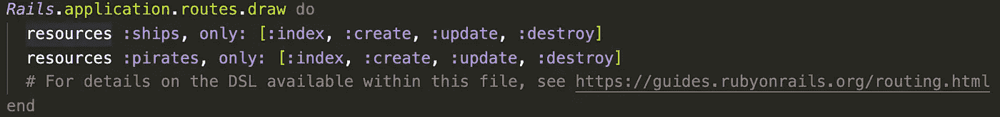**

**在...之后**

**这被称为资源路由，它允许你在一行代码中为一个足智多谋的控制器声明所有的公共路由。现在，数组中涉及的方法可以用于给定类的数据库表上。完成所有这些后，您几乎完全可以使用完整的 CRUD 了。**

**你需要做的最后一件事是激活 CORS。您需要进入您的 gem 文件并取消注释 cors gem:**

**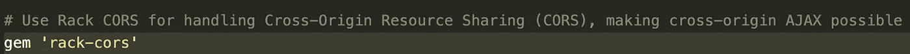**

**现在您已经完成了这一步，运行 bundle install 命令:**

**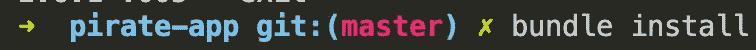**

**现在要完成，您需要转到 config/initialize 文件夹中的 cors.rb 文件，取消第 8–16 行的注释。**

**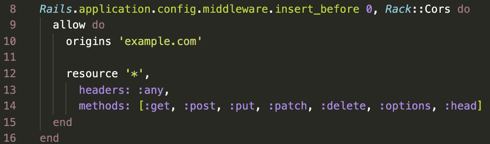**

**现在将第 10 行从 example.com 改为星号:**

**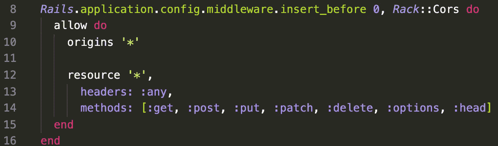**

**现在这已经完成了，你可以在 Postman 上测试你所有的方法了。如果您不确定这些方法的匹配 RESTful 路径是:Create 与 POST 相同，Read 与 GET 相同，Update 是 PATCH，Destroy 是 DELETE。**