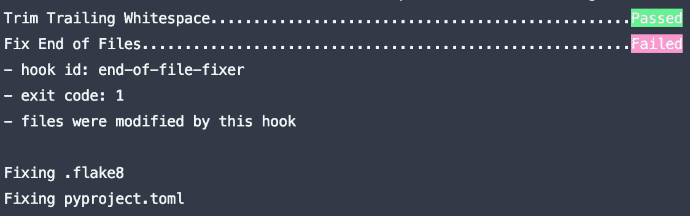
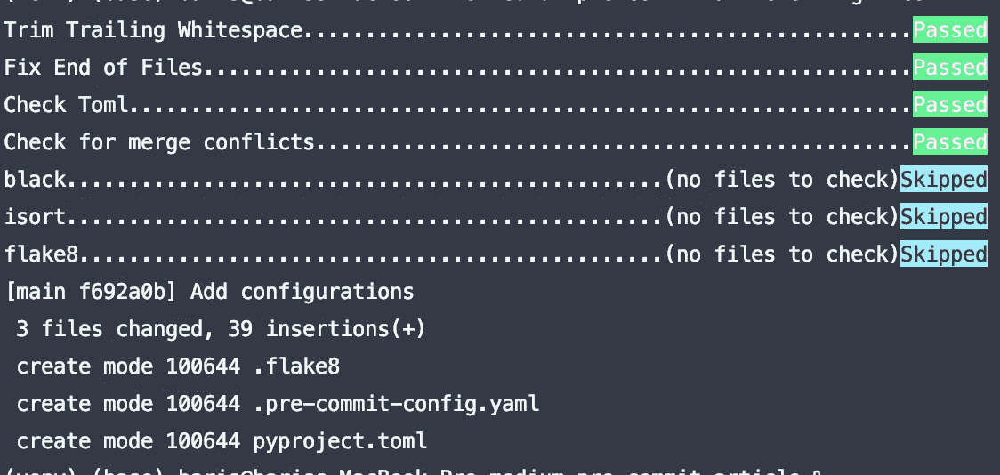
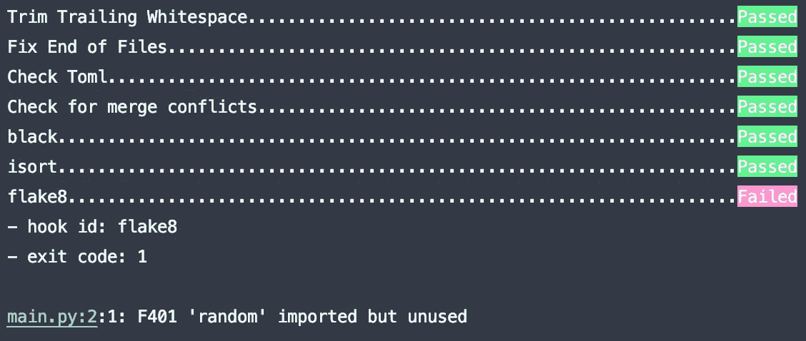
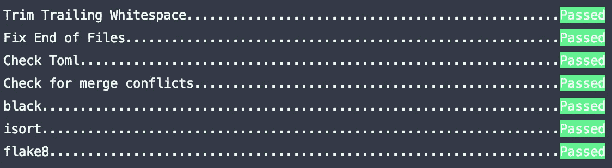
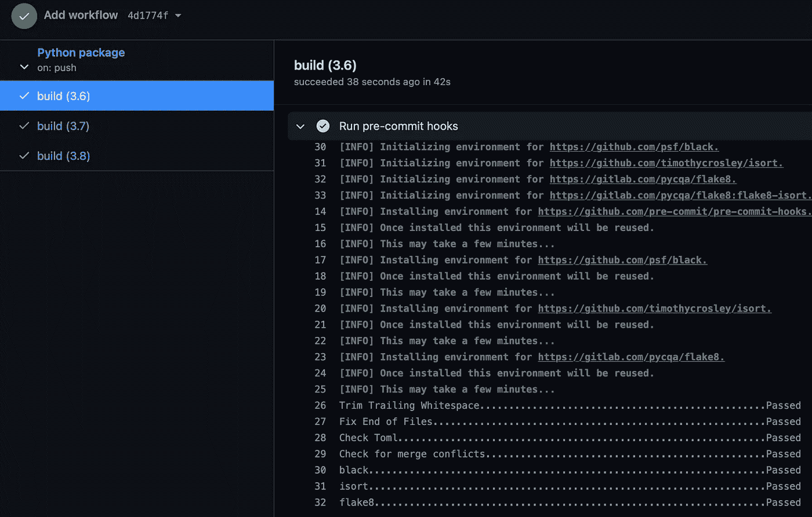

# 提高 Python 项目中的代码质量

> 原文：<https://levelup.gitconnected.com/raise-the-bar-of-code-quality-in-python-projects-7c49743f004f>

## 使用 isort、black、flake8 创建预提交挂钩。将它添加到 Github Actions 中，以自动化您的代码样式检查，并保持最高的质量。


所有东西组织起来看起来都更好，代码也是！杰夫·谢尔登在 [Unsplash](https://unsplash.com?utm_source=medium&utm_medium=referral) 上的照片

假设你被一份理想的工作录取了。你认为你将与最有才华的同事一起工作，你感到非常兴奋。在适应日之后，你终于坐在你的办公桌前，检查你将要做的项目。

经过一段时间后，您意识到一切看起来比它应该的要复杂，因为在项目中没有样式检查。许多开发人员都做出了贡献，他们都像往常一样有不同的编码风格。很难理解这个项目，对吗？如果项目的所有部分都遵循相同的风格，这将非常简单。或者，如果导入是有序的，并且既没有未使用的导入，也没有未使用的变量，那就非常简单了。

然而，该公司不想强迫开发人员在每次提交时考虑样式。他们能做什么？他们可以使用**预提交钩子**和 **CI 管道**！在本文中，我们将定义一个预提交钩子，并将一个 Github 动作作为 CI 添加到一个基本的 Python 项目中。

我不会详细解释预提交钩子或 GitHub 动作是如何工作的。然而，回忆简单的定义总是好的。

[Git 挂钩是](https://www.atlassian.com/git/tutorials/git-hooks):

> 每次 Git 存储库中发生特定事件时自动运行的脚本。它们允许您定制 Git 的内部行为，并在开发生命周期的关键点触发可定制的操作。

[Git 挂钩是必要的，因为](https://pre-commit.com/#introduction):

> **Git 钩子脚本**对于在提交给代码评审之前识别简单问题**很有用。我们在每次提交时运行钩子，自动指出代码中的问题，比如缺少分号、尾随空格和调试语句。通过**在代码评审**之前指出这些问题，这**允许代码评审者专注于变更的架构，而不是浪费时间在琐碎的风格吹毛求疵上。****

[预提交框架是](https://pre-commit.com/#introduction):

> 用于预提交钩子的多语言包管理器。你**指定一个你想要的钩子列表**，并且**在每次提交**之前管理用任何语言编写的钩子的安装和执行。预提交专门设计为不需要 root 访问权限。如果您的开发人员没有安装 node，但是修改了一个 JavaScript 文件，那么 pre-commit 会自动处理下载和构建 node，以便在没有 root 用户的情况下运行 eslint。

为了深入理解 Git 挂钩，您可以查看以下链接: [1](https://towardsdatascience.com/pre-commit-hooks-you-must-know-ff247f5feb7e) 、 [2](https://githooks.com) 、 [3](https://www.atlassian.com/git/tutorials/git-hooks)


[兰登](https://unsplash.com/@landall?utm_source=medium&utm_medium=referral)在 [Unsplash](https://unsplash.com?utm_source=medium&utm_medium=referral) 上拍照

我为这篇文章创建了一个新的存储库。你可以在这里查看一下。在添加任何配置之前，请先看看有两个包的[模块和](https://github.com/BarisSari/medium-pre-commit-article/commit/b1e22d6c72bb7780e69893292c9d1e8e0dda2742) `[src](https://github.com/BarisSari/medium-pre-commit-article/commit/b1e22d6c72bb7780e69893292c9d1e8e0dda2742)` [目录](https://github.com/BarisSari/medium-pre-commit-article/commit/b1e22d6c72bb7780e69893292c9d1e8e0dda2742)。你看看 [PEP 8](https://www.python.org/dev/peps/pep-0008/) ( [E302，E303，更多](https://pep8.readthedocs.io/en/release-1.7.x/intro.html#error-codes))都有造型误差:

src/bar/first_module.py

src/bar/first_module.py

src/foo/first_module.py

main.py

我们将从项目根目录下名为`.pre-commit-config.yaml`的文件开始，用于配置预提交挂钩:

```
$ touch .pre-commit-config.yaml
$ nano .pre-commit-config.yaml
```

当我们浏览这个配置文件时:

*   使用`exclude`关键字排除`.git`和`.tox`文件。预提交挂钩不会尝试修复这些文件。这是一个可选字段。
*   每次尝试提交时，预提交挂钩都会运行。我们为此使用了`default_stages: [commit]`关键字和值。这也是一个可选字段。其他可能的值有:`commit`、`merge-commit`、`push`、`prepare-commit-msg`、`commit-msg`、`post-checkout`、`post-commit`或`manual`。
*   如果预提交挂钩失败，其余步骤将不会运行。对于这种行为，我们将`fast_fail`设置为`true`。这也是一个可选字段。这是一个可选字段，默认值也是 false。

这些是[顶级配置](https://pre-commit.com/#pre-commit-configyaml---top-level)。您可以使用的其他字段有`default_language_version`、`files`、`minimum_pre_commit_version`和`repos`。我们将在配置文件中只使用`repos`。我们添加了几个存储库，它们将逐步运行:

*   第一个是[预提交钩子](https://github.com/pre-commit/pre-commit-hooks)。我们将它用于:`trailing-whitespace`(修剪行尾的空白)、`end-of-file-fixer`(检查所有文件是否以换行符结尾)、`check-toml`(检查 toml 文件的语法)、`check-merge-conflict`(检查您的更改是否会导致合并冲突)。
*   第二个是[黑](https://github.com/psf/black)，也就是*不折不扣的 Python 代码格式化器*。**黑色**自动修复几乎所有的造型错误。
*   第三个是 [isort](https://github.com/timothycrosley/isort) ，一个自动按照类型和名称对你的导入进行排序的库。它将 Python 的内置模块/包导入、第三方导入和项目模块/包导入分开。
*   最后一个是 [flake8](https://gitlab.com/pycqa/flake8) 。它使用 PEP-8 标准、pyflakes 和其他库评估您的代码。即使**黑**和**或**解决了大部分问题，你可能还是会有一些错误，比如[长串](https://github.com/psf/black/issues/1331)。

正如你所看到的，我们包括了几个库，除非你配置它们，否则它们可能会导致冲突。例如，当您使用默认配置时，**黑色**和**或**不同地处理长行导入。

在安装和运行预提交钩子之前，我们将为这些库创建配置文件，它们将是兼容的。同样，我们将在项目的根目录下创建所有的新文件。

运行以下程序，为**黑色**和**黑色**创建一个名为`pyproject.toml`的配置文件:

```
$ touch pyproject.toml
$ nano pyproject.toml
```

我发现默认的**最大线长**，**黑色 88，flake 8 79 太小了。因此我通常将线长参数设置为 100。当行太长时，很难一次看到所有代码，因为你应该向右滚动。但是，如果使用 GitHub、Gitlab 或者 Bitbucket，在不滚动的情况下，仍然会看到全角行。**

对于**或**，我们设置`black`轮廓和`multi_line_output`(即 [**垂直悬挂缩进**](https://pycqa.github.io/isort/#multi-line-output-modes) )参数。你可以在这个链接中找到更多关于 isort [黑色兼容性的信息。](https://pycqa.github.io/isort/docs/configuration/black_compatibility/)

**注意:**最好可以为**或**或[配置](https://pycqa.github.io/isort/docs/configuration/config_files/)创建一个名为`.isort.cfg`的新文件。你应该用`[settings]`而不是`[tool.isort]`。请检查下面的代码:

```
$ touch .isort.cfg
$ nano .isort.cfg
```

让我们为**片 8** 创建一个名为`.flake8`的配置文件:

```
$ touch .flake8
$ nano .flake8
```

如你所见，我给了`max-line-length`相同的值，并且我排除了一些可能会带来不必要麻烦的文件。如果您使用虚拟环境，您的项目中可能会有一个`venv`文件夹，您可以在其中安装相关的库。我可以向您保证，您不会希望 flake8 检查您的第三方库，因为这可能需要很长时间，并且 flake8 可能会发现大量的警告和错误。请不要更改您使用的第三方库的代码。如果您发现错误，请在存储库中打开问题和 PR。如果需要更多改动，就叉回购，修改使用。原因是并非所有的开发人员都拥有您所拥有的环境。所以，对你有用的东西对其他人或在生产中不会有用。

最后，我们将把所有这些配置文件添加到`Git`中。

```
$ git add .pre-commit-config.yaml pyproject.toml .flake8
```

好的，我们准备好了。我将通过 pip 安装`pre-commit`:

```
(venv) $ pip install pre-commit
(venv) $ pre-commit install
```

因为我们安装了预提交钩子，它将在每次提交时运行。让我们试着提交添加的配置文件，看看我们的钩子是否运行。

```
$ git commit -m "Add configurations"
```

它应该给出以下错误:



我们的配置文件末尾没有换行符

好吧，再试试:

```
$ git add .flake8 pyproject.toml
$ git commit -m "Add configurations"
```

预期产出如下:



我们这次承诺没有任何问题

这次成功了。预提交钩子跳过了**黑色**、**或**和**薄片 8** 步骤，因为我们没有在提交中添加任何 python 模块。如果我们添加它，它也会运行这些步骤。

在安装预提交挂钩之前，我已经提交了有错误的文件。我想要的是运行预提交钩子并修复这些错误。我们可以使用`pre-commit`的运行命令:

```
$ pre-commit run -a 
```

它将为所有文件运行预提交钩子(这就是`-a`的意思)。如果您使用相同的文件，您将需要运行此命令三次，以便:

1.  向模块添加新的空行，
2.  使用黑色重新格式化代码
3.  使用 isort 重新格式化导入。

之后，您应该会看到一个错误，因为**片 8** :



从 main.py 中删除未使用的导入行:

```
import random  *# An import which we will not use at all*
```

然后，您可以再运行一次来确认:



所有步骤都通过了。文件已准备好提交

运行以下命令提交文件并完成教程的第一部分:

```
$ git add main.py src/bar/first_module.py src/foo/first_module.py
$ git commit -m "Run pre-commit hooks"
```

[让我们检查文件的最终版本:](https://github.com/BarisSari/medium-pre-commit-article/commit/519227f392054f1c23ac1a6e41076e7b1e53c066)

src/bar/first_module.py

src/foo/first_module.py

main.py

它们看起来更优雅，对吗？以下是已修复的警告:

*   PEP 8: E302 期望在类或函数的定义之间有 2 个空行
*   PEP 8: E303 方法定义之间有太多空行(2)
*   PEP 8: E501 行太长(137 > 110 个字符)
*   PEP 8: W292 文件结尾没有换行

在教程的第二部分，我们将使用在 GitHub Actions 中创建的预提交钩子。[Github](https://github.com/features/actions)对它的定义如下:

> GitHub Actions 现在拥有世界一流的 CI/CD，可以轻松实现所有软件工作流程的自动化。直接从 GitHub 构建、测试和部署您的代码。按照您想要的方式进行代码审查、分支管理和问题分类。

GitHub Actions 提供了很多！这是一个简洁而健壮的工具。并且拥有全面的[文档](https://docs.github.com/en/free-pro-team@latest/actions/guides/building-and-testing-python)。我将使用[它建议的模板](https://github.com/actions/starter-workflows/blob/main/ci/python-package.yml):

我在`.github/workflows`目录下添加了这个文件。最后两步与示例模板不同:

1.  升级 pip 后，我们将通过 pip 安装预提交挂钩。
2.  预提交将对存储库中的所有文件进行初始化和运行，但排除的文件除外。

因为指定了三个 Python 版本，所以对于远程存储库的每个`push`将有三个不同的构建。这是它的样子:



预提交钩子的所有步骤都像预期的那样在 GitHub 上传递。

因此，每次提交然后推送到远程时，GitHub 工作流都会检查样式。此外，每次本地提交时，预提交挂钩将首先运行。它会阻止你犯错误，除非你使用`force push`。

您现在已经有了帮助您标准化项目样式的设置。恭喜你！

您可以在下面找到最新版本的存储库:

[](https://github.com/BarisSari/medium-pre-commit-article) [## baris sari/medium-提交前-文章

### 带有预提交钩子和 GitHub 动作的基本 python 项目

github.com](https://github.com/BarisSari/medium-pre-commit-article) 

# **结论**

在本地和 GitHub 动作中使用预提交钩子非常简单。并且**在大多数情况下，你甚至不需要手动修改你的代码**，因为预提交会自动修复它们。你的钩子会自动修好它们。然而，当您有一些坚持错误时，您应该检查预提交日志并进行更改。

请记住，拥有**预提交挂钩并不意味着**您的**项目与所有 PEP 规则**兼容。例如，对于 PEP-8，在命名函数时应该只使用小写字母和下划线。如果您定义了一个名为 TEST 的函数，预提交钩子将不会报错。你应该**知道哪些包含的库(黑，isort，flake8)能** **哪些不能**。尽管如此，如果您试图遵循 Python 的最佳实践，预提交钩子肯定会对您有所帮助。

**注意:**请记住，我给模块和包起了愚蠢的名字。我试图展示预提交挂钩是多么简单和有效。这就是为什么我尽量把模块和包做得傻傻的原因。您可以查看这个[要点](https://gist.github.com/sloria/7001839)以了解 Python 的一些最佳实践，比如命名约定。

**注 2:** 你也可以对其他编程语言使用预提交钩子。请检查[该链接](https://pre-commit.com/hooks.html)以查看所有支持的挂钩。

**注意-3:** 我正在使用 PyCharm，即使我使用它的提交&推送屏幕，它也运行预提交钩子。您可以检查您的 IDE 是否具有此功能，除非您使用 Git 的终端。

**注-4:** 还有其他很棒的 CI/CD 工具，比如 Travis，CircleCI，Jenkins。一旦你为你的项目设置和配置了一个预提交钩子，你总是可以通过添加几行代码把它包含到你最喜欢的 CI/CD 工具中。网上有很多例子。你可以去看看。

谢谢你一直读到最后！我期待听到你的回应。

# 资源

*   [黑知识库](https://github.com/psf/black) — [文档](https://black.readthedocs.io/en/stable/)
*   [Isort 知识库](https://github.com/pycqa/isort/) — [文档](https://pycqa.github.io/isort/)
*   [Flake8 知识库](https://gitlab.com/pycqa/flake8) — [文档](https://flake8.pycqa.org/en/latest/index.html#quickstart)
*   [人教版 8 风格指南](https://www.python.org/dev/peps/pep-0008/)
*   [PEP 8 错误代码](https://pep8.readthedocs.io/en/release-1.7.x/intro.html#error-codes)
*   [Git 挂钩](https://www.atlassian.com/git/tutorials/git-hooks)
*   [预提交挂钩](http://pre-commit.com)
*   [Github 工作流——用 Python 构建和测试](https://docs.github.com/en/free-pro-team@latest/actions/guides/building-and-testing-python#starting-with-the-python-workflow-template)