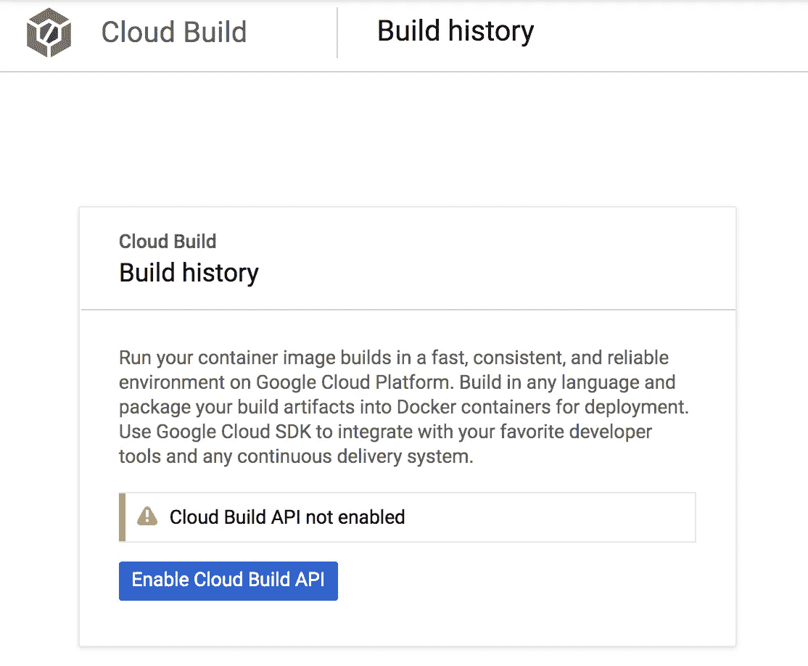

# 借助谷歌云平台，在 10 分钟内完成 10 个步骤，提升生产工作流程和应用程序

> 原文：<https://levelup.gitconnected.com/ramping-up-a-production-workflow-and-application-s-10-steps-in-10-minutes-with-google-cloud-ad2607a45907>

祖姆。好快啊！—原图，来源: [pixabay](https://pixabay.com/illustrations/superhero-girl-speed-runner-534120/) ，作者: [alan9187](https://pixabay.com/users/alan9187-2347/)

云端的 Web 应用— ***入门有那么容易吗？***

在今天“云饱和”的互联网中，让 web 服务快速启动和运行是一件容易的事情。例如，GitHub pages 是一个让个人网站在几分钟内运行起来的简单方法。我最近探索的另一个工具是 Heroku，它允许爱好者从他们的代码库中轻松地设置一个登台环境。然而，对于商业应用程序，创建 web 应用程序可能要复杂得多，例如从以下问题中可以观察到。

**建立一个可管理和可扩展的 web 应用程序用于生产环境怎么样—** 结合其他所需的基础设施和工作流，例如持续集成+持续部署/交付(CICD)管道？传统的方法是使用不同的服务来实现其中的每一个目标，这使得管理单个服务有时成为一场噩梦。

**另一个问题是建立和维护基础设施的成本，包括时间和金钱。**归结为两个因素，所选基础设施的技术壁垒和成本，以及能够克服这些壁垒的工程师。

谷歌云平台(GCP)的出现解决了这两个问题。但是在解释它如何解决这些问题之前，让我们先看看如何在 10 分钟之内通过 GCP 在云端的 web 应用程序建立一个生产工作流程。

# 10 个步骤，在 10 分钟内

以下是所采取步骤的简要概述:

1.  创建 GCP 项目 **(10 秒)**
2.  启用应用引擎 **(10 秒)**
3.  启用应用引擎管理 API **(10 秒)**
4.  启用云运行 **(10 秒)**
5.  为 CICD 工作流启用云构建 **(10 秒)**
6.  使用云构建跟踪代码变更 **(1 分钟)**
7.  使用适当的 IAM 角色配置云构建服务帐户 **(1 分钟)**
8.  添加应用引擎配置(至代码库) **(1 分钟)**
9.  添加云构建配置(到代码库) **(1 分钟)**
10.  将配置签入代码存储库，并触发 CICD 工作流进行部署。 **(4 分钟，包括构建时间)**

注意，对于以上，我们部署到 App Engine(标准)和 Cloud Run 作为节点应用。部署时，App Engine (Standard)需要代码库中有一个`app.yaml`文件，这将在步骤 8 中介绍。云运行使用 Docker 映像，因此这里假设应用程序中会有一个 Docker 文件。一个兼容 App Engine 和 Cloud Run 的项目示例可以在[这里](https://github.com/Weiyuan-Lane/slides/tree/demo/devfest-gui)看到。

总的来说，我们应该花大约 **9 分钟**从零开始，拥有两个具有 CICD 工作流的 web 应用程序，并直接从代码更改部署到 GCP。事实上，我已经做了这个过程[几次](https://www.linkedin.com/posts/liuweiyuan_where-do-i-start-i-had-this-mad-idea-activity-6592794697075392512-WCuq/)，并且设法实现了比那个更低的计时。

另一个值得注意的是，上面使用了 Cloud Run 和 App Engine，用于演示目的。在实际的生产使用中，我们只需要利用其中的一个，而不是运行两个相同的 web 应用程序。这只能意味着上述工作可以在更短的时间内更容易地完成。

# **10 个步骤，深入演练**

让我们仔细看看这 10 个步骤，以及每一步我们应该做什么。

## 步骤 1—创建 GCP 项目

因为我们要从头开始，所以在部署应用程序之前，我们需要创建一个新的 GCP 项目。你可以通过这个[链接](https://console.cloud.google.com/projectcreate)直接创建你自己的 GCP 项目。

## 步骤 2—启用应用引擎

如果您选择使用 App Engine 而不是云运行，这是您需要执行的步骤之一。

过程很简单——从导航菜单中，点击`App Engine`，然后点击`Dashboard`。你应该能看到如上图所示的`Create Application`按钮。点击后，您将进入一个流程，在该流程中，您可以为您的 App Engine 应用程序选择区域和环境(标准或灵活)。请注意，选定的区域以后不能更改，但环境可以随时更改。

有关适用的应用引擎环境的更多信息，请参见此处的。

## 步骤 3-启用应用引擎管理 API

作为第 2 步中应用引擎创建步骤的继续，我们需要启用应用引擎管理 API。

要执行此步骤，从导航菜单中点击`APIs & Services`，然后点击`Dashboard`。搜索`App Engine Admin API`，你应该会看到类似上图的带有`Enable`按钮的界面。

启用这个 API 允许我们使用`gcloud` SDK 直接部署应用程序，这将在后面的步骤中提到。

## 步骤 4—启用云运行

如果您选择使用云运行而不是 App Engine，您将必须执行此步骤。

要执行此步骤，从导航菜单中点击`Cloud Run`。您应该会看到带有`Start Using Cloud Run`按钮的界面，如上图所示。

## 步骤 5—为 CICD 工作流启用云构建

GCP 为 CICD 提供的产品是通过使用云构建的。我们可以配置云构建来测试、构建和部署我们的应用到应用引擎和云运行。

要访问上面的界面，从导航菜单中，点击`Cloud Build`。然后，单击`Enable Cloud Build API`在您的项目中启用云运行。

## 步骤 6—使用云构建跟踪代码变更

启用云构建之后，我们需要添加适当的配置，以便从代码存储库中跟踪和部署应用程序。我们从导航菜单开始这个过程，选择`Cloud Build`，然后选择`Triggers`。

一旦我们看到上面的界面，我们可以选择`Connect Repository`按钮继续到下面的屏幕。

此时，我们可以选择我们正在使用的代码库服务。因为我使用的演示项目是基于 GitHub 的，所以我选择了这个选项，如上所示。准备就绪后，选择`Continue`进入下一个界面，您将在这里为该 CICD 配置选择存储库。

选择存储库之后，该过程的最后一部分是添加触发器。该触发器将包含触发新构建发生的标准。

在触发器创建菜单中，我们选择“构建配置”下的上述选项`Cloud Build configuration file`，位置为`cloudbuild.yaml`，这一点很重要。这将与后面的步骤相关，该步骤包含为每个构建运行的步骤。

创建触发器时，还可以选择其他选项。其中一个选项是创建一个分支正则表达式，以标记测试或部署的分支为目标。

## 步骤 7—使用适当的 IAM 角色配置云构建服务帐户

为了让我们的 CICD 构建成功地将构建的应用部署到 App Engine 或云运行，我们需要在 GCP 的身份和访问管理(IAM)下分配适当的权限。

从导航菜单，从`IAM & admin`，然后点击`IAM`，可以进入上述界面。当为云构建分配权限时，确保将它分配给以项目 ID 为前缀的`@cloudbuild.gserviceaccount.com`服务帐户。您的项目 ID 可以在您的项目主页中找到。

## 步骤 8-添加应用引擎配置(到代码库)

如果您选择使用应用引擎而不是云运行，您将必须执行此步骤。App Engine 需要此配置来了解它所服务的应用程序的依赖关系和属性。基于上面的代码片段，将其添加到项目的根目录中，作为`app.yaml`。

应用引擎的配置因环境而异(标准与灵活)。务必检查可在[标准](https://cloud.google.com/appengine/docs/standard/nodejs/config/appref)和[灵活](https://cloud.google.com/appengine/docs/flexible/nodejs/reference/app-yaml)下配置的属性。

## 步骤 9—添加云构建配置(到代码库)

基于上面的代码片段，我们将它作为一个新文件`cloudbuild.yaml`添加到应用程序代码的根目录中。这个配置文件详细描述了 CICD 工作流中执行的步骤，比如运行测试、构建资产，然后部署应用程序。根据您决定在自己的项目中不使用的工具，请省略云运行或应用引擎的步骤。

有关云构建的配置文件格式和属性的更多详细信息，请参见此处的。

## 步骤 10-将配置签入代码存储库，并触发 CICD 工作流进行部署。

因为我们已经在最后两步中添加了配置文件，所以在使用它们之前，我们必须将它们签入代码存储库。一旦基于步骤 6 推送了提交，就会基于步骤 9 的配置触发新的构建，这将部署 App Engine 和云运行。

就是这样！我们已经完成了 10 分钟 10 步的过程。此时，您需要做的就是等待构建过程完成，以及 web 应用程序的部署过程触发。

# 回到最初的问题，GCP 如何解决面临的两个问题？

原图，来源: [pixabay](https://pixabay.com/illustrations/question-mark-pile-questions-symbol-2492009/) ，作者: [qimono](https://pixabay.com/users/qimono-1962238/)

**建立一个可管理和可扩展的 web 应用程序用于生产？**

来自 GCP，在其生态系统上面使用的工具——比如云构建和容器注册——能够分别满足 CICD 和 Docker 图像库的需求。所有这些工具都可以在 GCP 的 web 应用程序的同一个项目或范围内使用，使得管理和分离每个应用程序组的资源成为一项更简单的任务。

通过选择在 GCP 使用无服务器工具——app engine 或 Cloud Run，我们也可以利用无服务器带来的好处。其中一个好处是将扩展逻辑卸载到 GCP，让我们可以专注于应用逻辑，我们的产品。

**安装和维护应用程序需要巨大的金钱和时间成本？**

这两种成本类型都严重依赖于选定的基础架构(虚拟机？Kubernetes？码头工人？)和招聘工程师了解基础设施。有了更多经验丰富的工程师，您可以更快地启动和运行预期的基础架构，并可能缩短生产停机时间，尽管这是以前期投入更多财务资源为代价的。

逆，是一颗难以下咽的苦果。在专业技术上的吝啬可能会以牺牲安装速度为代价降低成本。但是，可能会有持久的不利影响，例如选择不当且成本高昂的基础架构，比预期更长的停机时间，或者规划不当的基础架构很快成为遗留问题，最终会花费更多的时间和金钱来重写。

与云提供商(如 GCP)进行无服务器合作，通过降低基础设施的复杂性解决了这个问题，同时仍然达到了可靠性和功能方面的行业标准。以 App Engine 为例——它可以[轻松配置](https://cloud.google.com/appengine/docs/standard/nodejs/config/appref)，基础设施问题被 GCP 抽象掉了。这减少了每天分配工程师解决基础设施问题的必要性，使企业能够将资源集中在他们的产品上。

至于应用引擎和云运行的实际成本，请查看 GCP 的[定价计算器](https://cloud.google.com/products/calculator/)。根据我的经验，我已经连续几个月运行基本上免费的 AppEngine 应用程序(由于 GCP 的免费层),但是如果输入流量增加，它们也可以扩展，并且我将只为我在任何时候使用的东西付费。

这是所有的乡亲。希望你们喜欢上面的演示，以及我对 GCP 无服务器的看法。