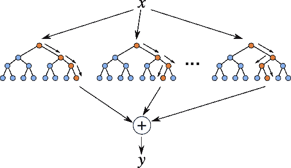
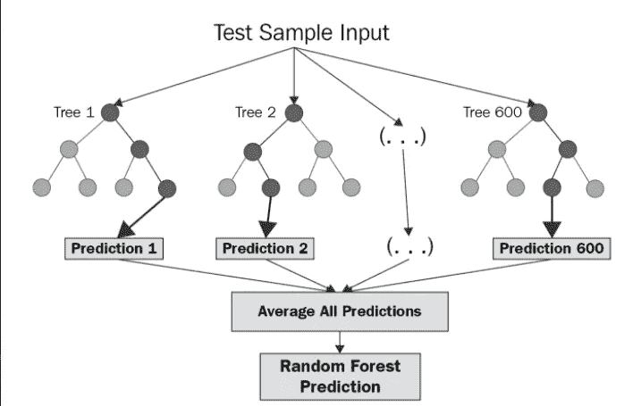
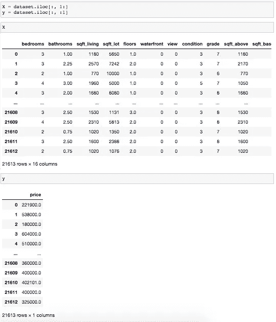
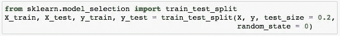
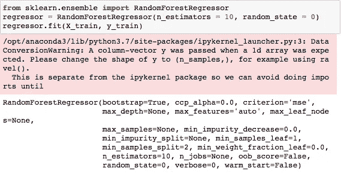
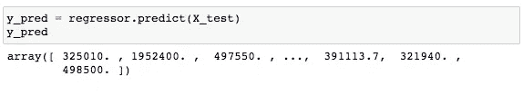
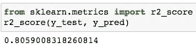

# 随机森林回归

> 原文：<https://levelup.gitconnected.com/random-forest-regression-209c0f354c84>

**随机森林回归**是一种监督学习算法，使用**集成学习**方法进行回归。集成学习方法是一种将来自多个机器学习算法的预测相结合的技术，以做出比单个模型更准确的预测。

上图显示了随机森林的结构。你可以注意到这些树并行运行，它们之间没有相互作用。随机森林通过在训练时间期间构建几个决策树并输出类别的平均值作为所有树的预测来运行。为了更好地理解随机森林算法，我们来看一下步骤:

1.  从训练集中随机选取 *k* 个数据点。
2.  构建与这些 *k* 数据点相关的决策树。
3.  选择你想要建造的树的数量，重复步骤 1 和 2。
4.  对于一个新的数据点，让你的每一个 *N* 树预测该数据点的 *y* 值，并将该新数据点分配给所有预测的 *y* 值的平均值。

随机森林回归模型强大而准确。它通常在许多问题上表现出色，包括具有非线性关系的特征。然而，缺点包括如下:没有可解释性，可能容易发生过拟合，我们必须选择模型中包括的树的数量。

# 让我们看看随机森林回归的作用！

既然我们对随机森林回归模型的工作原理有了基本的了解，我们就可以在真实数据集上评估它的性能了。与我之前的帖子类似，我将使用美国金县的房屋销售数据。

导入库、导入数据集、处理空值并删除任何必要的列之后，我们就可以创建随机森林回归模型了！

***第一步:确定你的因变量(y)和自变量(* X)**

我们的因变量将是*价格*，而我们的自变量是数据集中剩下的列。

***第二步:将数据集拆分成训练集和测试集***

训练和测试分割的重要性在于，训练集包含模型从中学习的已知输出。然后，测试集根据从训练集中获得的信息来测试模型的预测。

***步骤 3:在整个数据集上训练随机森林回归模型***

从包含集成学习的 sklearn 包中，我们导入类 **RandomForestRegressor** ，创建它的一个实例，并将其赋给一个变量。参数 *n_estimators* 在你的随机森林中创建 *n* 棵树，其中 *n* 是你传入的数量。我们过了 10 分钟。的。 *fit()* 函数允许我们训练模型，根据数据值调整权重以达到更好的精度。经过训练后，我们的模型就可以进行预测了，这就是所谓的*。预测()*法。

***第四步:预测测试集结果***

既然我们已经成功地创建了随机森林回归模型，我们必须评估它的性能。

R score 通过与因变量的平均线进行比较，告诉我们模型与数据的拟合程度。如果分数接近 1，则表明我们的模型表现良好，反之，如果分数远离 1，则表明我们的模型表现不佳。

我们获得了大约 81%的准确率。让我们将其与之前的回归模型得出的分数进行比较:

*   [**简单线性回归**](/beginners-guide-to-simple-and-multiple-linear-regression-models-d2d5dbe9e704) : 50%
*   [**多元线性回归**](/beginners-guide-to-simple-and-multiple-linear-regression-models-d2d5dbe9e704) : 65%
*   [**决策树回归**](/decision-tree-regression-df9e24ffe59a) : 65%
*   [**支持向量回归**](https://medium.com/swlh/support-vector-regression-explained-for-beginners-2a8d14ba6e5d) : 71%
*   **随机森林回归:** 81%

我们可以看到，我们的随机森林回归模型做出了迄今为止最准确的预测，与上一个模型相比提高了 10%!

# 结论

在本指南中，我们回顾了随机森林回归模型的基础知识。我们了解到以下情况:

*   集成学习。
*   构造随机森林回归模型时的过程。
*   随机森林回归的利弊。
*   R score 评估我们模型的准确性。
*   随机森林回归模型在所有 6 个回归模型中表现最好。

感谢您的阅读。非常感谢您的反馈！

# 分级编码

感谢您成为我们社区的一员！升级正在改变技术招聘。在最好的公司找到你最理想的工作。

 [## 提升——改变招聘流程

### 🔥让软件工程师找到他们热爱的完美角色🧠寻找人才是最痛苦的部分…

作业. levelup.dev](https://jobs.levelup.dev/talent)