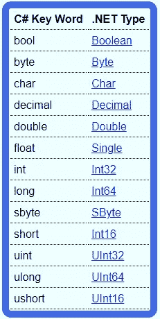

# 随机的。净事实

> 原文：<https://levelup.gitconnected.com/random-net-facts-79e4d3fd16e2>

在这一页上，你会发现一堆与 C#和。总的来说是网络。


帕特里克·托马索在 [Unsplash](https://unsplash.com?utm_source=medium&utm_medium=referral) 上拍摄的照片

# 系统。ValueType 是引用类型！

CLR 基于以下标准区分值类型和引用类型:

> 值类型是从`System.ValueType`派生的类型

因此，`System.ValueType`是一个引用类型。

# 垃圾收集何时发生？

当 0 代满的时候。

# 具有终结器的对象可以保证至少到达第一代

当创建具有终结器的对象时，对该对象的引用也存储在终结队列中。当对象不再被任何东西引用并且发生了垃圾收集时，GC 可以看到它仍然被终结队列引用。所以它到了第一代。当垃圾回收发生时，会引发一个事件，终结线程被唤醒并开始运行，然后将运行由对象定义的终结器方法。终结在不同的线程上而不是由 GC 完成的原因是，终结可能需要一段时间，这会阻塞 GC 进程，从而阻塞所有应用程序线程。

# Int32 和 Int 的区别

`Int32`是一个. NET 类，可以用在任何。网语，例如`Int32 x = 10;`
`int`但是，是 C#特有的(大概还有其他。NET 语言)并直接映射到`Int32`。
使用一种或另一种没有区别(除了一种情况，更多信息见下一节)。
`Int32 x = new Int32();`和`int x;`
完全一样使用`new`操作符不在堆上分配内存，也不装箱`int`。

下表显示了 C#关键字和。网络:



选择 C#关键字 short、int 和 long 显然是因为它们的位长(16、32 和 64)。

# Int32 与 Int

## 列举型别

`Int32`和`int`在任何情况下都可以相互替换使用，除非将其用作枚举的支持类型。

枚举的支持类型可以是任何整数类型(除了`Char`)，默认为`Int32`。

然而，如果你觉得需要显式地声明支持类型为`Int32`，你必须使用关键字`int`。

这样做的原因是因为`Int32`不是一个关键字，你可以创建你自己的名为`Int32`的类，但是枚举不允许从这个类派生，因为它不是一个整型。

所以为了避免混淆，编译器团队决定让你使用关键字而不是类型名。

## Int32 比 Int 好

我更喜欢使用。NET 类名而不是 C#关键字，因为。NET 类名赋予了更多的含义。

以`Single`*`Double`为例，`*Single*`使用 32 位存储，`Double`使用 64 位存储。*

*`Int32`告诉你是 32 位，`Int64`告诉你是 64 位(比`long`好多了)。*

*。NET 类名在任何针对。NET framework，但是 C#关键字只能在 C#中使用(除非其他语言也偶然使用相同的关键字)。*

# *并非所有的类都是引用类型*

*这是因为结构和枚举只是从`[System.ValueType](http://msdn.microsoft.com/en-us/library/system.valuetype%28v=vs.71%29.aspx)`派生的类。*

# *转换。ToInt32()与造型*

*`Convert.ToInt32()`和铸造使用(`int`)会产生不同的结果。编辑以下代码:*

```
*Convert.ToInt32(23.6);
(int)23.6;*
```

*我们总是被告知，当转换成`Int32`时，小数部分被去除，然而这不是`ToInt32()`方法的情况。*

*转换将去掉小数部分并输出 23，但是`ToInt32()`方法使用舍入，因此输出 24。*

# *LINQ 的“关键词”并不是真正的关键词*

*[LINQ](http://msdn.microsoft.com/en-us/library/bb397933.aspx) 在综合 **Q** 查询中代表 **L** 语言**并于 2002 年引入。净 3.5。这基本上是一种用类似 SQL 的语法查询数据的方法。
下面给出了一个 LINQ 查询表达式的例子:***

```
*int[] numbers = new int[7] { 0, 1, 2, 3, 4, 5, 6 };
var numQuery =
            from num in numbers
            where (num % 2) == 0
            select num;*
```

*虽然`from`、`where`和`select`这几个词看似是关键词，其实不然。
变量名有可能是`from`、`where`或`select`。*

*这是因为这些单词仅在上下文中被视为关键字。编译器寻找单词`from`，并且知道这是 LINQ 查询的开始。因此，只有在 LINQ 查询的上下文中，这些单词才会被视为关键字。他们决定这样设计的原因是因为在引入 LINQ 之前，程序员可能一直使用`from`、`where`或`select`作为变量名，在 C#中引入一个新特性应该不会打破这一点。*

# *为什么 LINQ 不像在 SQL 中那样在“from”子句前使用“select”子句？*

*LINQ 在`select`条款之前先有`from`条款有两个原因。
1。它允许您使用智能感知。如果首先声明了`select`子句，IntelliSense 将无法工作，因为`from`子句会告诉您变量名和类型。
2。`from`逻辑上先发生，后发生`select`，而不是反过来。*

*不知道为什么 SQL 决定让它反过来。*

# *If 语句和布尔方法*

*在 if 语句中使用布尔返回方法作为操作数时要小心。在下面的例子中，方法`iWontExecute()`永远不会被执行:*

*这是因为在第一个`if`语句中，第一个操作数是`true`。
由于使用的是 OR 运算符，所以第二个操作数是什么并不重要，整个表达式都会求值到`true`。
同样在第二条`if`语句中，第一个操作数是`false`。
因为这是 AND 运算符，所以不管第二个操作数是什么，整个表达式都将计算为`false`。*

*如果你想让`iWontExecute()`执行，你必须把它作为前两个`if`语句的第一个操作数。
在第三和第四个`if`语句中，方法`iWillExecute()`确实执行了，因为它的返回值将决定`if`语句的最终求值。*

*如今，大多数 ide(如 Visual Studio)会为前两条`if`语句提供编译时警告(“检测到不可到达的表达式代码”)。*

# *静态类*

*静态类直接来源于`System.Object`。静态类不可能从任何其他类派生，因为这没有任何意义。继承只适用于对象，不能创建静态类的实例。*

*一个静态类，一旦编译成 IL 代码，就会同时标记上`abstract`和`sealed`。这是有意义的，因为您不能实例化一个`abstract`类，并且不能派生一个`sealed`类。*

# *重写方法和可访问性*

*如果重写一个方法，被重写的方法必须和父类一样严格，或者不如父类严格。*

*这样做的原因是，任何派生类都可以被转换为父类。如果你试图调用这个对象上的 overriden 方法，这个对象现在被转换为父类，它将不起作用，没有任何意义。*