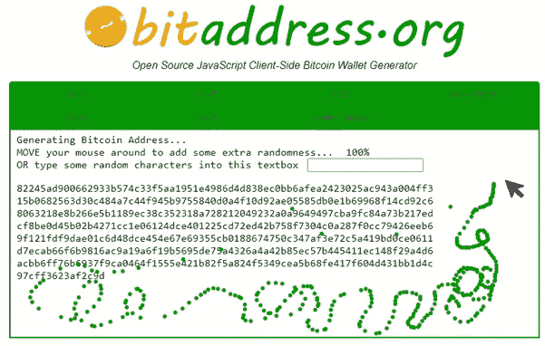

# 随机数:区块链最重要的东西！

> 原文：<https://levelup.gitconnected.com/random-numbers-the-single-most-important-thing-in-blockchain-e850d4e23a51>

## 密码学系列 I —为什么随机数如此重要？

随机数可能是密码学世界中最重要的东西。没有随机数，网络安全就无法存在。随机数是互联网安全的支柱，它让我们能够在互联网上安全地进行交易。每次我们访问 HTTS 网站，我们都使用随机数。HTTPS 结尾的 S 代表“安全”,这意味着网站的数据在传输过程中使用 TLS(传输层安全)加密，以前称为 SSL(安全套接字层)。随机数还帮助我们创建[比特币地址](/blockchain-addresses-transactions-and-transaction-fees-f540c4ed6bc7)。

SSL 使用 RNG(随机数生成器)来创建加密数据的密钥，以便我们可以安全地浏览在线访问网站，使用信用卡进行在线支付，基本上是安全的在线，减少了黑客进行“中间人攻击”的可能性，即有人“监听”您的互联网通信并窃取您的信息。

好吧，但是随机数不仅对加密你的在线数据很重要！**在区块链，随机数是签约交易中最重要的东西！**随机数创建允许我们创建安全的私有密钥(密钥对的一部分),您每次发送或接收比特币或密码时都会用到它！

为什么有一个非常随机的源来创建私钥很重要？嗯，因为如果它不够随机，黑客可以猜出你的私钥，然后偷走你的比特币！

随机数在密码学中也非常重要。生成随机数听起来很简单，但事实并非如此。一点也不。如果让我随机生成一个两位数的随机数，我可能会说 87。我的选择是随机的吗？还是我受到了我的文化和个人经历的影响？我对 87 的选择可能不是那么随意。8 在中国文化中是个幸运数字，7 是 c 罗的号码。可能是因为这些原因 87 才在我脑子里蹦出来的。

同理，计算机也很难产生随机数。计算机并不关心当地文化或足球比赛，但一切都是在计算机中定义的。计算机代码没有随机性。计算机是确定性的，这意味着在给定某个初始状态和输入的情况下，它们总是产生相同的输出。

关于随机性重要性的冷事实:德国可能因为缺乏随机性而输掉了二战。纳粹德国用来加密战争中使用的信息的恩尼格玛机被英国炸弹破解，该机由艾伦·图灵开发，利用了恩尼格玛机缺乏随机性的特点。在那之后，英国盟军能够监听到这些信息，并最终采取必要的行动打败纳粹德国。

这就是为什么我们需要有特殊的方法和途径来生成随机数，这在密码学中很重要。随机数是加密的基石，因为它们允许生成唯一的密钥。它们还消除了生成数字的推理和可预测性，使攻击者很难访问这些信息。攻击者将没有办法或机制来推断这些数字是如何生成的，这使得破解和发现密钥是如何创建的变得更加困难。

把熔岩灯放在区块链的文章里，这不是随机的！

那么，如何才能产生完全随机数呢？生成随机数有不同的方法，比如硬件设备可以基于一些用作种子的随机数据生成相当随机的数字。这也称为随机种子，它是用于初始化随机数生成的数据。

顺便说一下，有很多哲学上的讨论围绕着是否有可能产生真正的随机数，但我不会进入那个。假设有很多方法可以生成非常随机的东西！

选择一个好的随机种子对于加密安全性至关重要。如果随机种子不够随机，比如说数字 87，黑客可以很容易地发现用来产生一对加密密钥的种子。然而，如果随机种子具有高熵，黑客就很难或不可能发现种子。让我们看一些可以产生高熵随机种子源的例子:

*   Linux 内核可以从击键计时和鼠标移动中产生熵。一些开源项目允许来自音频和视频源的种子数据
*   Linux 系统有 */dev/urandom* 伪随机数发生器，它从计算机硬盘上收集的噪音中产生随机性。您可以通过在命令行界面中键入 *cat /dev/urandom* 来尝试一下。这个随机种子来自于噪音和你执行的随机动作你是你的计算机，它对于每台计算机的活动都是非常独特的
*   Windows 使用不同的熵源，如主板数据、CPU、中断计时、鼠标移动和击键计时
*   硬件生成的随机种子由 CPU 模块生成
*   从计算机麦克风随机收集的声音
*   传感器测量计算机硬盘内的空气湍流
*   Cloudflare 使用来自 80 个熔岩灯的图像作为随机性和熵的种子源。哦，我们的熔岩灯来了！
*   DNA 测序数据
*   电子在亚原子粒子中的运动
*   光线变化
*   细菌是如何生长繁殖的

…您可以为我们的随机数列出更多潜在的种子，但最重要的是它可以从中创建随机产品。当然，其中一些随机种子比其他的更方便，我们大多数人不需要从一组 80 个熔岩灯中产生随机性。

通过随机鼠标移动生成的比特币密钥

当谈到创建一个新的比特币钱包时，大多数人依赖于他们的比特币钱包应用程序提供的任何东西。通常，这些移动比特币钱包有某种 PRNG——伪随机数发生器——来增强钱包私钥。但是，有些人对这些钱包不够信任。他们更喜欢创造自己的随机种子。有不同的方法来创建你自己的随机种子，但你可以，例如，玩一个[比特币纸钱包](https://www.bitaddress.org/)创建，你自己输入随机性。请注意，纸质钱包也有一些缺点，它不是最方便用户使用的东西。如果你打算使用纸质钱包，在把你的数百万美元存入钱包之前，确保你学会了如何存钱和取钱。！

如您所见，生成随机数对于所有加密活动都非常重要，计算机可以使用多个 PRNG(伪随机数生成器)来生成相当随机的数字。我说相当随机，而不是 100%随机，因为实现 100%随机几乎是不可能的。或者是？你怎么想呢?？

下一篇文章，我会讲质数。质数是仅次于随机数的第二种成分，它可以为区块链交易签名、加密和许多其他加密应用程序提供私钥。让我们开始吧！！！

**🚀请关注我，也请查看我的🧱区块链课程:**

**🐶** [**有史以来第一次 Dogecoin 课程**](https://www.udemy.com/course/-dogecoin-course-the-first-complete-dogecoin-course/?referralCode=9416B1408224CE309DD8)

**👨‍🎓** [**金融科技、云和网络安全课程**](https://www.udemy.com/course/fintech-technologies-cloud-and-cybersecurity/?referralCode=F1D4EA005A2881735A36)

**📖** [**完整的 NFTs 教程**](https://www.udemy.com/course/the-complete-nft-course-learn-everything-about-nfts/?referralCode=AAEE908D13D0E2276B19)

**👨‍🎓** [**Unblockchain 课程**](https://www.udemy.com/course/blockchain-deep-dive-from-bitcoin-to-ethereum-to-crypto/?referralCode=B8463EE382E6D313304B) **—脑洞大开的区块链课程**