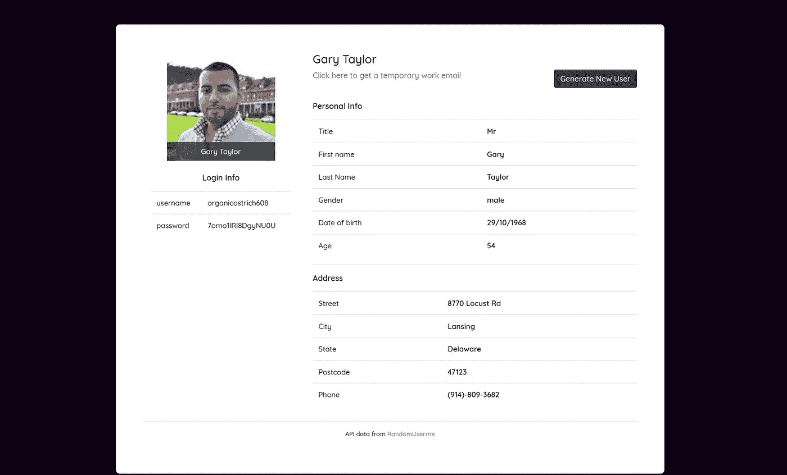

# 带有 API + Vue.js 的随机用户生成器

> 原文：<https://levelup.gitconnected.com/random-user-generator-with-api-vue-js-dd60b2f82772>

在这个简短的教程中，我们将构建一个仅在客户端技术上运行的随机用户生成器。这个工具对于那些想在网站上注册临时使用而不泄露真实信息的用户来说很有用。它还将链接到一个临时的电子邮件生成器，他们可以在那里接收电子邮件。

随着可用的 API 服务越来越多，无需在后端工作就可以构建简单而有用的工具。该项目从[随机用户](https://randomuser.me/) API 获取数据，执行快速密码生成操作和日期格式化，并将用户配置文件数据返回给用户。我们开始吧！

对于样式，我将使用 Bootstrap 和 Vue.js 来处理客户端脚本。我们将从 CDN 中使用 Vue，而不是通常的 CLI 工具。这是为了保持项目第一部分的简单性。

# 步骤 1:创建布局

如果您熟悉 bootstrap，这一部分对您来说应该很容易。我使用了简单的引导类和一些从网上得到的自定义样式。

(运行于 codepen:【https://codepen.io/redwolf333/pen/dyJRmWr】T2

在这里，我使用表格来样式化用户数据，主要使用引导样式和一些自定义样式。我还添加了谷歌字体链接和一个脚本源到 Vue3 库中。我们还有一个 app.js，我们将在那里为应用程序编写 Vue 代码。您可以花一些时间研究标记并理解布局。

# 步骤 2:创建 Vue 应用程序

我们需要创建一个 Vue app 实例，并将其绑定到 id 为“app”的元素。这是在 html 布局中创建的。为了创建 Vue 应用程序，我们将绑定将加载到 html 模板中的初始数据:

此外，我们更新了 html 布局，以显示 JavaScript 代码中定义的数据:

# 步骤 3:创建所需的函数

我总是喜欢将我的代码分解成单元函数，以鼓励重用和扩展。对于这个项目，我们需要少量的功能来执行以下任务:

*   从随机用户 API 获取数据
*   更新我们在 Vue 数据()部分中定义的字段
*   生成密码

我们将在下面的代码片段中定义这三个函数:

fetchDataAPI 使用 async 关键字来返回一个承诺(异步执行)并确保 fetch 请求和 json 函数按顺序运行。因此，这两个函数像普通函数一样运行，并返回具体的值。

对于 updateFields 函数，我传递了“that”参数，并在 fetchDataAPI 函数中做了同样的事情。这是因为这些函数影响另一个作用域中的数据，所以我们通过“This”键盘将作用域设置为调用者的作用域。为了更好地理解，我们将在稍后阶段实现它。

# 步骤 4:应用程序加载时发送请求

目前，我们所拥有的只是在 data()函数中设置的默认值。然而，我们想要的是，在加载应用程序时，除了生成另一个配置文件的选项之外，用户还应该加载一个新的配置文件。

为此，我们将使用 Vue 的挂载功能。一旦触发了 Vue 的 mounted 事件，就会调用此函数(当应用程序完全装载到“app”id 上时)。下面是它在 Vue.createApp()调用中的情况:

在 data()函数之后，我们插入了 mounted()函数(第 21 行)。这将调用先前定义的获取数据的 fetchDataAPI 函数，并调用 updateFields 函数来更新当前数据。注意使用“this”的范围识别。

# 步骤 5:创建生成数据的方法

在 html 模板中，您会注意到一个按钮，上面写着“生成新用户”。这使用了一个 Vue 事件处理程序，它在被单击时触发一个名为 getUser()的方法。我们将在 Vue createApp 函数中定义这个方法:

# 步骤 6:运行您的应用程序

目前就这些。您可以运行您的应用程序，看看它是如何工作的。如果你遇到任何问题，请告诉我。

下面是完整的代码:

HTML 代码:

JavaScript 代码:

# 链接

项目的 GitHub 库:[https://github.com/joshuaetim/vue-user-generator](https://github.com/joshuaetim/vue-user-generator)

项目现场演示:【https://joshuaetim.github.io/vue-user-generator/ 

随机用户 API:【https://randomuser.me/ 