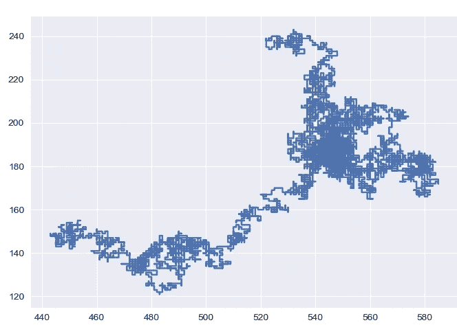
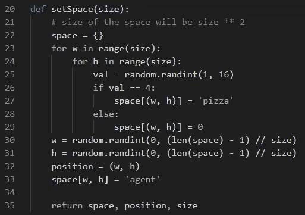
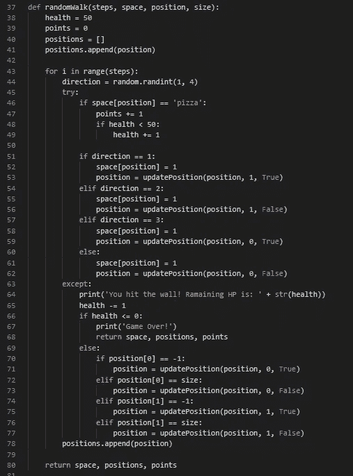
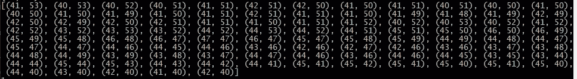
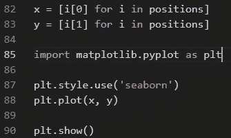
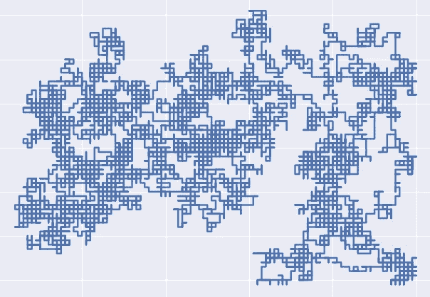
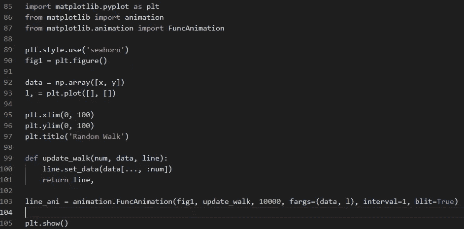

# 用 Python 随机漫步

> 原文：<https://levelup.gitconnected.com/random-walk-with-python-5ea118afa0c5>

# 用 Python 随机漫步

计算机科学太神奇了！即使是简单的、基于规则的算法也能展示复杂的行为，创造出美丽的东西。随机漫步就是这些算法中的一种。

它被用于金融市场模拟、物理学、计算机网络、心理学，甚至赌博。实际上，包含某种形式随机性的宇宙的任何方面都可以借助于随机行走来模拟。

看看这个由随机漫步算法设计的伦敦伟大雕塑:

[图片](https://commons.wikimedia.org/wiki/File:Antony_Gormley_Quantum_Cloud_2000.jpg\)由[安迪·罗伯特](http://distributedresearch.net/blog)拍摄

这就是为什么知道如何实现这个算法如此重要。接下来我们将使用 python 来完成。

**实现**

我将编写 2 个主函数和 1 个辅助函数。第一个函数将生成 2 个痴呆空间，第二个函数模拟在此空间上的随机行走。辅助函数将更新我们的步行者在空间中的位置。

为了让这个过程更有趣，我给了我们的步行者点数和生命值等属性。二维地图上有许多比萨饼。如果行者踩到披萨所在的点，会获得 1 点，增加 1 点生命值(但不超过 50)。此外，如果一个步行者击中虚拟墙(生成空间的限制)，它将失去 1 点生命值。让我们加上一个条件，如果步行者的健康达到 0，游戏就结束了。好玩吧。让我们写一些代码。

空间生成:

通过面积大小。我们将有正方形的空间，正方形的面积等于其边长的平方。如果超过 100，在生成的空间中将有 1000 个数据点。我将存储在元组对象中的空间。每个元组将有关于比萨饼的数据，以及沃克是否访问过它。还有，让我们随机化助步器的初始位置。

行走模拟:

神奇的事情发生了。一个随机发生器会给我们 1-4 范围内的数字来决定下一步行动的方向。每走一步，我们都会检查是否找到了披萨，是否碰到了墙。根据情况，步行者的统计数据将被更新。此外，步行者的每一个动作都会被记录下来，这样我们以后就可以看到了。

运行模拟 100 次后，沃克的动作看起来是这样的:

你可以看到每一步的位置是如何变化的。但是盯着元组的原始数组并不有趣，让我们来想象一下日期。

**可视化**

下面是如何实现简单的可视化:

首先从元组中提取 x 和 y 坐标，然后将它们提供给 **matplotlib** 。它会画出类似这样的图(但绝不会相同，因为我们处理的是随机事件):

不过还是那句话，看静态图像给我们带来的乐趣不多，我们来动画化一下行走的过程。

我们是这样做的:

首先让我们声明空数组，这些空数组将在将来用我们的 walker 的步数填充。其次是情节的大小。每个坐标(x 和 y)应该与您生成的空间大小相匹配。然后编写一个函数，从原始数组中取出一个数据点，并将其添加到线性数组中。并最终将这一切传递给 **FuncAnimation** 函数。

我们的行者还活着。

**完整代码:**

**结论**

学习算法和计算模型对于开发者和研究者来说是非常重要的。今天我们演示如何使用随机漫步算法。这似乎不仅适用于广泛的领域，而且超级好玩。

不断学习，不断成长！