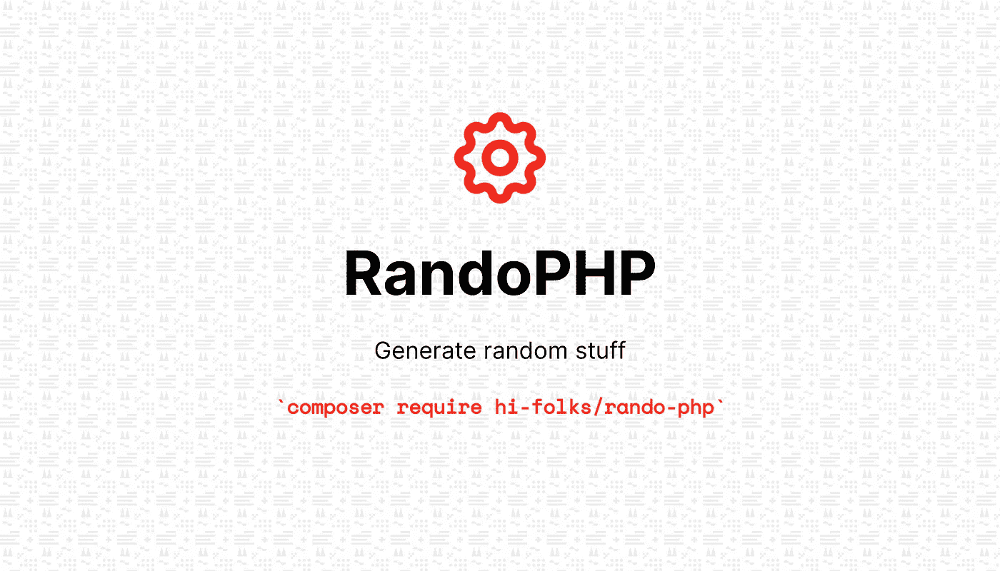

# RandoPHP，一个用于生成随机值的 PHP 包

> 原文：<https://levelup.gitconnected.com/randophp-is-a-php-package-for-generating-random-values-4d3ade58c976>



RandoPHP 是一个 PHP 开源包，用于生成随机数、字符、字符串和序列。使用该软件包，您可以:

*   **Draw** :从一个数组中抽取随机项(样本)。当你想“画”一些数字或项目时，这很有用；
*   **生成**:用于创建随机项，如整数、字节、布尔、浮点、经纬度坐标、字符(数字、字母、字母数字)以及序列，如整数或字符数组。

通过流畅的界面，您可以控制一些行为，如:

*   最小值和最大值；
*   您要创建多少个项目；
*   对于需要或不需要重复的序列(例如在数组[1，5，3，1，1]中，值 1 是重复的)。

# 为什么选择 RandoPHP

我开始编写 RandoPHP，以便包装所有的方法、函数和途径来生成值。每次我在应用程序中需要一些随机值时，我都会看到我在编写相同的代码，应用相同的控制和验证。然后，我决定用开源包发布它。

# 装置

您可以通过 composer 安装软件包:

```
composer require hi-folks/rando-php
```

源代码可用:【https://github.com/Hi-Folks/rando-php 

# 使用

一旦你安装了这个包，你可以导入自动加载文件(如果你没有使用提供导入所有需要的文件的框架),然后通过“use”语句在你的 PHP 文件中声明正确的类:

```
require __DIR__ . "/vendor/autoload.php";
use HiFolks\RandoPhp\Randomize;
```

# 产生随机的东西

## 生成字符

有时你想获得一个随机字符，例如一个**数字字符**(‘0’..'9'):

```
Randomize::char()->numeric()->generate();
```

或者你可能想要一个字母字符..z 或 A..z’):

```
Randomize::char()->alpha()->generate();
```

你可以生成两者，**字母或数字字符** ('a '..z 或 A..z 或 0..'9').

```
Randomize::char()->alphanumeric()->generate();
```

您可以生成一个**小写字符**(‘a’..z’):

```
Randomize::char()->alpha()->lower()->generate();
```

您可以生成一个**大写字符**(‘A’..z’):

```
Randomize::char()->alpha()->upper()->generate();
```

你可以生成一个特殊字符。
特殊字符是'之一！" #$% & '()*+，-。/:;< = >？@[\]^_`{|}~':

```
$specialChar = Randomize::char()->specialCharacters()->generate();
```

## 生成布尔值

有时你想获得一个**随机布尔**真或假(抛硬币，是或否，红色或蓝色枕头…):

```
$randomBool = Randomize::boolean()->generate(); // true or false
```

## 生成一个浮点

有时你想获得一个**随机浮动**(默认最小-最大范围 0.0-1.0)。例如，您想要生成一个范围在 0.0 到 1.0 之间的随机数:

```
$randomFloat = Randomize::float()->generate();
```

或者可以设置范围，例如 0.0 到 90.0，相当于->min(0)->max(90):

```
$randomFloat = Randomize::float()->min(0)->max(90)->generate();
```

## 生成一个整数

有时你想获得一个随机整数。

```
$randomNumber = Randomize::integer()->generate();
```

默认情况下，您将获得一个介于 0..100.

如果你想定制范围(最小和最大)，你有一些方法，比如 *min()* ， *max()* ， *range()* 和一个构造。

比如你想掷骰子，可以用 *min()* 和 *max()* 的方法:

```
$randomNumber = Randomize::integer()->min(1)->max(6)->generate();
```

同样的事情用*()*的方法，代替*()*min 和*()*:

```
$randomNumber = Randomize::integer()->range(1,6)->generate();
```

您可以使用快捷方式帮助器生成一个整数，用 min 和 max 调用构造函数:

```
$randomNumber = Randomize::integer(1,6)->generate();
```

## 生成字节

有时候你想获得一些**随机字节** ( **十六进制**)。例如，您想要生成随机 RGB 颜色(十六进制格式的十六进制三元组):

```
$randomRGB = Randomize::byte()->length(3)->generate();
```

## 生成日期

有时你想获得一个随机日期。例如，您想要生成一个随机日期:

```
$randomDate = Randomize::datetime()->generate();
```

默认情况下，是当前年份的第一天到最后一天之间的日期。

如果要定义范围，例如范围从 2020 年 1 月 1 日到 2020 年 1 月 10 日，相当于-> min(' 2020–01–01 ')-> max(' 2020–01–10 '):

```
$randomDate = Randomize::datetime()->min(‘2020–01–01’)->max(‘2020–01–10’)->generate();
```

您甚至可以使用 *format()* 方法为生成的随机日期指定您喜欢的格式:

```
$randomDate = Randomize::datetime()->format(‘d-M-Y’)->generate();
```

可以使用 *min()* 和 *max()* 配合 *format()* :

```
$randomDate = Randomize::datetime()->min(‘2020–01–01’)->max(‘2020–01–10’)->format(‘d-M-Y’)->generate();
```

对于最新的示例，您可以获得类似于“05-Jan-2020”的内容。

## 生成序列

有时，你想获得一些随机序列。例如，您想掷骰子 15 次:

```
$randomRolls = Randomize::sequence()->min(1)->max(6)->count(15)->generate();
// [3,6,5,5,2,2,4,1,4,4,5,4,5,2,6]
```

有时你想获得一些随机充电序列。例如，长度为 10:

```
$randomChars = Randomize::sequence()->chars()->count(10)->generate();
// ["b","q","f","k","o","o","m","i","z","h"]
```

或者您可能需要数字字符序列。

```
$randomChars = Randomize::sequence()->chars()->numeric()->count(10)->generate();
// ["9","5","8","6","5","4","2","9","7","2"]
```

或者您可能需要按字母顺序排列字符序列。

```
$randomChars = Randomize::sequence()->chars()->alpha()->count(10)->generate();
// ["t","f","U","O","r","Y","C","S","g","J"]
```

是的，甚至两者都有。

```
$randomChars = Randomize::sequence()->chars()->alphanumeric()->count(10)->generate();
// ["L","5","h","A","c","q","C","W","F","z"]
```

你想要 20 个小写字母作为字符串，你可以使用 *asString()* 方法:

```
$randomString = Randomize::sequence()->chars()->alphaLowerCase()->count(20)->asString()->generate();
// "ybmzekmvvqpzviswdhob"
```

你想要一个有 20 个大写字母的字符串:

```
$randomString = Randomize::sequence()->chars()->alphaUpperCase()->count(20)->asString()->generate();
// "LIYSENBIJRSBWVMEFEVA"
```

有时你想得到一些没有重复的随机数字数组。例如，您想玩“彩票”(从 1 到 90 抽取数字，不重复):

```
$randomTombola = Randomize::sequence()->min(1)->max(90)->count(90)->noDuplicates()->generate();
```

有时你想获得一些没有重复的**随机字母数组**。

```
$randomChars = Randomize::sequence()->chars()->count(10)->noDuplicates()->generate();
// ["e","j","b","s","o","z","x","i","c","l"]
```

或者你可能想要没有重复的数字字符数组。例如，长度为 10:

```
$randomChars = Randomize::sequence()->chars()->numeric()->count(10)->noDuplicates()->generate();
// ["6","0","8","9","4","3","5","7","2","1"]
```

或者您可能希望**字母数组**没有重复。

```
$randomChars = Randomize::sequence()->chars()->alpha()->count(10)->noDuplicates()->generate();
```

如果你想要**字母数字**(字母和数字)**数组**没有重复。

$ randomChars = randomChars::sequence()-> chars()->字母数字()-> count(10)-> no duplicates()-> generate()；

## 随机字符串

如果你想生成随机字符串(字母数字，只有字母，只有数字，没有重复，小写，大写等)，你可以使用随机字符生成。

使用 Randomize::chars()生成字符串:

```
$string = Randomize::chars()->generate();
```

默认行为是:

*   10 个字符；
*   仅限字母(a-z)；
*   小写；
*   允许重复(字符串“aba”与“a”字符重复)。

您可以使用一些方法和参数来更改默认值。
设置字符类型(数字、字母、字母数字等)的可用方法:

*   alpha():用于选择‘A-Z’，‘A-Z’；
*   字母数字():用于选择“a-z”、“A-Z”、“0–9”；
*   numeric():用于选择“0–9”；
*   alphaLowerCase():用于选择“a-z”；
*   alphaUpperCase():用于选择“A-Z”；
*   specialCharacters():用于选择！"#$%&'()*+,-./:;<=>？@[\]^_`{|}~

你也有一些方法来“控制”输出，例如避免重复:

*   unique():它生成每个字符最多出现一次的字符串。

例如，如果要生成一个包含 16 个数字字符的字符串(“0”-“9”):

```
$string = Randomize::chars(16)->numeric()->generate();
// "1607986939661884"
```

你可以得到类似这样的“1607986939661884”。

如果您想获得一个包含 20 个字符、小写字母和字母(' a'-'z ')的字符串，并且您想避免字符重复，您应该使用 *alphaLowerCase()* 和 *unique()* 方法:

```
$string = Randomize::chars(20)->alphaLowerCase()->unique()->generate();
// "tibuxmhwndjprzlagsqc"
```

您可以获得类似这样的内容:“tibuxmhwndjprzlagsqc”。

如果你想获得一个 20 个字符的字符串，包含字母和特殊字符，你应该使用 *specialCharacters()* 和 *alpha()* 方法:

```
$string = Randomize::chars(20)->specialCharacters()->alpha()->generate();
// "NZ`,{of)<-CeusEX+U<n"
```

您可以获得类似这样的内容:" NZ`,{of)

# Draw random stuff

If you have a list of values and you want to extract/select/draw one or more elements, you could use *Draw* class，而不是 *Randomize* 。
使用 **Draw** 类需要声明 *HiFolks\RandoPhp\Draw* :

```
use HiFolks\RandoPhp\Draw;
```

例如，如果您有一个带有某种编程语言的数组，并且您想要选择一个:

```
use HiFolks\RandoPhp\Draw;$randomLanguage = Draw::sample([“PHP”, “Python”, “Golang”, “Javascript”])->snap();
// "PHP"
```

使用 *snap()* 方法可以获得数组中的一个元素。

如果你想获得一个数组作为结果，你可以使用 *extract()* 方法代替 *snap()* :

```
$array=[“React.js”, “Vue.js”, “Svelte.js”, “Angular.js”, “Alpine.js”, “Vanilla js”];$randomJs = Draw::sample($array)->extract();
```

提取三个可以在下一个项目中使用的 JS 框架:

```
$array=[“React.js”, “Vue.js”, “Svelte.js”, “Angular.js” , “Alpine.js”, “Vanilla js”];
$randomJs = Draw::sample($array)->count(3)->extract();
```

提取三个 JS 框架(允许重复):

```
$array = [“React.js”, “Vue.js”, “Svelte.js”, “Angular.js”, “Alpine.js”, “Vanilla js”];$randomJs = Draw::sample($array)->count(3)->allowDuplicates()->extract();
```

# 警告

在引擎盖下，RandoPHP 使用了一些原生 PHP 函数，如:
-array _ rand():【PHP Doc for array _ rand】([https://www.php.net/manual/en/function.array-rand.php](https://www.php.net/manual/en/function.array-rand.php))；
-random _ int():【PHP Doc for random _ int】([https://www.php.net/manual/en/function.random-int.php](https://www.php.net/manual/en/function.random-int.php))；
-shuffle():【PHP Doc for shuffle】([https://www.php.net/manual/en/function.shuffle](https://www.php.net/manual/en/function.shuffle))；
-random _ bytes():【PHP Doc for random _ bytes】([https://www.php.net/manual/en/function.random-bytes](https://www.php.net/manual/en/function.random-bytes))。

这些 PHP 函数使用了一个不适合加密目的的伪随机数生成器。

# 一些笔记

要提交想法或功能请求或问题，请查看您的请求是否已经存在[https://github.com/Hi-Folks/rando-php/issues](https://github.com/Hi-Folks/rando-php/issues)。如果它不存在，您可以创建一个新的[https://github.com/Hi-Folks/rando-php/issues/new](https://github.com/Hi-Folks/rando-php/issues/new)

支持的 PHP 版本有:“8.0”、“7.4”、“7.3”。

所有这些版本都在 CI/CD 工作流中使用。如果您想了解所使用的工作流程，请前往[https://github.com/Hi-Folks/rando-php/blob/master/.github/workflows/php.yml](https://github.com/Hi-Folks/rando-php/blob/master/.github/workflows/php.yml)

RandoPHP 是与开源许可证一起发布的:“麻省理工学院许可证(MIT)”。