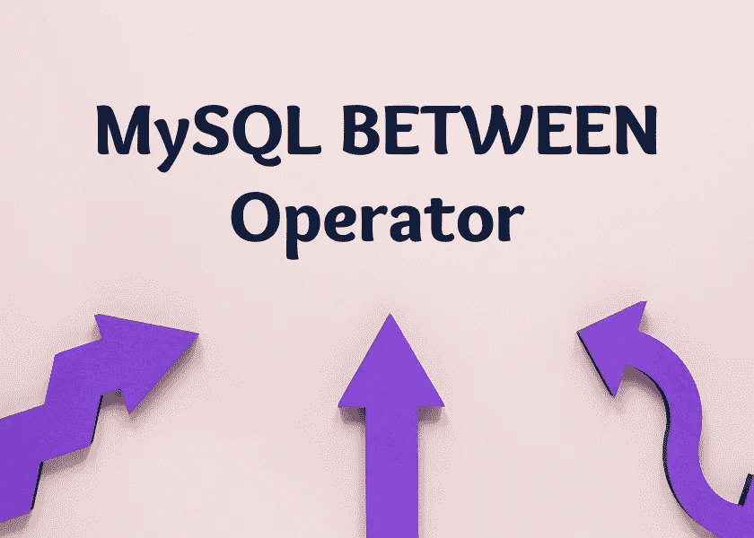

# 用 MySQL 中的 BETWEEN 运算符进行基于范围的过滤

> 原文：<https://levelup.gitconnected.com/range-based-filtering-with-the-between-operator-in-mysql-bbeaff1ce01d>

这篇文章介绍了使用 MySQL `BETWEEN`操作符在`WHERE`子句中进行过滤。继续阅读我为任何学习如何使用 MySQL 的人创建的优质 MySQL 内容节选…

当你[订阅***【OpenLampTech】***时事通讯](http://openlamptech.substack.com)时，收到一本我的电子书*《给每个人的 10 个 MySQL 技巧】****绝对免费*** 。



## 推荐阅读

请访问这些 MySQL 初学者友好文章中的任何一篇，获取更多免费学习资源:

*   [SELECT 子句查询— MySQL 初学者基础系列。](https://joshuaotwell.com/select-clause-queries-mysql-beginner-basics-series/)
*   [用 WHERE 子句限制行数— MySQL 初学者系列](https://joshuaotwell.com/limit-rows-with-the-where-clause-mysql-beginner-series/)

## MySQL 网间运营商概述

对于范围类型的条件过滤器，我们可以使用`BETWEEN`操作符。一个`BETWEEN`搜索过滤器查询允许您指定一个值应该在*和*之间的上限和下限——或者一个限制范围，以便包含在返回的结果集中。

`BETWEEN`运算符查询是包含性的，意味着任何返回的查询结果 ***都包含*** 指定范围的指定上下限(或界限)。如果这个概念令人困惑，不要担心，因为我们将看到示例查询来消除任何疑问。

## MySQL BETWEEN 运算符语法

使用`BETWEEN`的基于范围的过滤查询的语法由`BETWEEN`关键字以及由`AND`关键字分隔的两个范围边界组成:

```
BETWEEN lower_limit AND upper_limit
```

`BETWEEN`运算符查询可以测试数值、字符串和时态(日期和时间)数据的范围。

通过在 ***OpenLampTech*** 时事通讯中投放价格合理的分类广告，让您的品牌、产品或服务获得其所需的关注度[。谢谢大家的支持！](https://ko-fi.com/s/7dfe9ce108)

## 运算符查询之间的 MySQL 数值范围

在这个使用 Sakila 数据库“category”表的示例查询中，我们使用`BETWEEN`操作符来查看“category_id”列值在 1 到 5 之间的那些行，包括边界、范围限制:

```
+-------------+-----------+
| category_id | name      |
+-------------+-----------+
|           1 | Action    |
|           2 | Animation |
|           3 | Children  |
|           4 | Classics  |
|           5 | Comedy    |
+-------------+-----------+
5 rows in set (0.06 sec)
```

下面是一个使用了*小于或等于*和*大于或等于*条件运算符的等价查询:

```
+-------------+-----------+
| category_id | name      |
+-------------+-----------+
|           1 | Action    |
|           2 | Animation |
|           3 | Children  |
|           4 | Classics  |
|           5 | Comedy    |
+-------------+-----------+
5 rows in set (0.04 sec)
```

## 运算符查询之间的 MySQL 下限和上限位置

注意，在使用`BETWEEN`时，我们应该始终将较小的滤波器要求(或下限)放在第一位:

此查询不返回任何行，因为“category_id”值不可能同时大于或等于 5 ***和*** 小于或等于 1。

## 操作员查询之间的 MySQL 日期范围

您不仅可以对数字数据使用`BETWEEN`操作符，还可以过滤日期范围。在本例中，我使用了一个包含以下数据的“朋友”表:

```
+------------+------------+
| first_name | birthday   |
+------------+------------+
| Max        | 1975-01-23 |
| Mary       | 1978-03-23 |
| Charlie    | 1971-08-22 |
| Humpty     | 1971-11-22 |
| Roger      | 1975-08-22 |
| Jim        | 1975-05-05 |
| Jupyter    | 1978-07-22 |
+------------+------------+
7 rows in set (0.00 sec)
```

日期范围`BETWEEN`过滤器相对简单。确保将较早的日期指定为下限，将最近的日期指定为上限。

如果我希望从“friends”表中检索“birthday”列值在 1975 年 5 月 5 日和 1975 年 9 月 1 日之间的所有行，我可以对这些特定日期使用`BETWEEN`,如以下查询所示:

```
+------------+------------+
| first_name | birthday   |
+------------+------------+
| Roger      | 1975-08-22 |
| Jim        | 1975-05-05 |
+------------+------------+
2 rows in set (0.06 sec)
```

## 运算符查询之间的 MySQL 字符串和文本范围

字符串和文本数据`BETWEEN`操作符查询需要一点*通过* t。因为这种类型的`BETWEEN`对文本数据的过滤取决于 [MySQL 字符集和排序规则设置](https://dev.mysql.com/doc/refman/8.0/en/charset-general.html)，所以一些结果可能会不同。

在我的 MySQL 开发学习环境中，字符集和排序规则设置为以下值:

```
+----------+--------------------+
| char_set | collat             |
+----------+--------------------+
| utf8mb4  | utf8mb4_0900_ai_ci |
+----------+--------------------+
1 row in set (0.00 sec)
```

我将对“friends”表中的样本数据执行一些简单的`BETWEEN`操作符查询:

```
+------------+-----------+
| first_name | last_name |
+------------+-----------+
| Max        | Maxer     |
| Mary       | Murphy    |
| Charlie    | Charles   |
| Humpty     | Dumpty    |
| Roger      | Dodger    |
| Jim        | Russ      |
| Jupyter    | Moonbeam  |
+------------+-----------+
7 rows in set (0.00 sec)
```

要查找“姓氏”列值在“M”和“Z”之间的任何行，我使用以下查询:

```
+------------+-----------+
| first_name | last_name |
+------------+-----------+
| Max        | Maxer     |
| Mary       | Murphy    |
| Jim        | Russ      |
| Jupyter    | Moonbeam  |
+------------+-----------+
4 rows in set (0.00 sec)
```

此查询筛选“姓氏”列值介于“A”和“D”之间的任何行:

```
+------------+-----------+
| first_name | last_name |
+------------+-----------+
| Charlie    | Charles   |
+------------+-----------+
1 row in set (0.00 sec)
```

请注意，此查询中没有返回任何行，因为没有介于“A”和“C”之间的“last_name”列值:

同样，请记住字符集和排序规则在涉及文本和字符串数据的`BETWEEN`范围查询中起着重要作用。

## 运算符查询之间的 MySQL 使用 NOT 关键字求反范围

您可以通过使用带有`BETWEEN`的`NOT`关键字来否定`BETWEEN`查询的界限:

```
+-------------+-------------+
| category_id | name        |
+-------------+-------------+
|           6 | Documentary |
|           7 | Drama       |
|           8 | Family      |
|           9 | Foreign     |
|          10 | Games       |
|          11 | Horror      |
|          12 | Music       |
|          13 | New         |
|          14 | Sci-Fi      |
|          15 | Sports      |
|          16 | Travel      |
+-------------+-------------+
11 rows in set (0.00 sec)
```

通过使用`NOT BETWEEN 1 AND 5`作为过滤条件，在查询结果中返回‘category _ id’值不是 1 到 5(包括那些界限)的所有行。

加入***【MySQL 学习层】*** 会员，发现优质文章、深度指南、教学视频等等。拥有此会员资格，您可以访问未在任何地方发布的独家内容。随着新内容的定期添加，[继续学习任何级别的 MySQL](http://ko-fi.com/joshlovescoffee/tiers)。

基于操作符范围的过滤功能强大，在定位表中的特定行时非常有用。在您的查询中有意义的地方尝试一下，以了解更多信息。

如果你在代码中看到任何错误或有任何问题，请在下面的评论中回复。非常感谢帮助我提供准确内容的建设性反馈。

喜欢你读过的？看到什么不正确的吗？请在下面评论，感谢阅读！！！

# 行动的号召！

感谢你花时间阅读这篇文章。我真心希望你发现了一些有趣和有启发性的东西。请在这里与你认识的其他人分享你的发现，他们也会从中获得同样的价值。

访问[投资组合-项目页面](https://wp.me/P28ctb-3KD)查看我为客户完成的博客帖子/技术写作。

[**咖啡是我绝对喜欢的饮料。**](https://ko-fi.com/joshlovescoffee)

要在最新的博客文章发表时收到来自本博客(“数字猫头鹰散文”)的电子邮件通知(绝不是垃圾邮件)，请点击“点击订阅！”按钮在首页的侧边栏！(如有任何问题，请随时查看 [Digital Owl 的散文隐私政策页面](https://wp.me/P28ctb-3gI):电子邮件更新、选择加入、选择退出、联系方式等……)

请务必访问[“最佳”](https://joshuaotwell.com/where-blog_post-in-digital-owls-prose-best-of/)页面，收集我的最佳博文。

[Josh Otwell](https://joshuaotwell.com/about/) 作为一名 SQL 开发人员和博客作者，他热衷于学习和成长。其他最喜欢的活动是让他埋头于一本好书、一篇文章或 Linux 命令行。其中，他喜欢桌面 RPG 游戏，阅读奇幻小说，并与妻子和两个女儿共度时光。

免责声明:本文中的例子是关于如何实现类似结果的假设。它们不是最好的解决方案。所提供的大多数(如果不是全部)示例都是在个人发展/学习工作站环境中执行的，不应被视为生产质量或就绪。您的特定目标和需求可能会有所不同。使用那些最有利于你的需求和目标的实践。观点是我自己的。

*有何贵干？*

*   *免费 [MySQL 查询语法真言 PDF](https://ko-fi.com/s/3631fc7d00) 备忘单。记住这个咒语的查询语法顺序。*
*   *你想开一个博客吗？我用 WordPress 写博客。让我们都在提供的计划上省钱。*
*   *通过在 ***OpenLampTech*** 时事通讯中投放价格合理的分类广告，让您的品牌、产品或服务获得所需的关注[。](https://ko-fi.com/s/7dfe9ce108)*
*   *需要托管你的下一个网络应用程序或 WordPress 网站吗？我使用并强烈推荐 [Hostinger](https://www.hostg.xyz/aff_c?offer_id=6&aff_id=94641) 。他们有很好的价格和服务。*
*   *[作为一名自学成才的开发人员，我逐渐认识到的 5 个事实](https://ko-fi.com/post/5-Truths-Ive-Come-To-Realize-As-a-Self-taught-Dev-R5R2BL9J6)*
*   *今天就在我的 [Kofi 商店](https://ko-fi.com/joshlovescoffee#)发现优质的 MySQL 学习资料吧！*

****披露*** :本帖中的一些服务和产品链接是附属链接。在没有额外费用给你，你应该通过点击其中一个购买，我会收到佣金。*

*当您[订阅***【OpenLampTech】***简讯](http://openlamptech.substack.com)时，收到一本我的电子书*《给每个人的 10 个 MySQL 技巧】****绝对免费*** 。*

*通过在 ***OpenLampTech*** 时事通讯中投放价格合理的分类广告，让您的品牌、产品或服务获得其所需的关注度[。谢谢大家的支持！](https://ko-fi.com/s/7dfe9ce108)*

**原载于 2022 年 5 月 25 日 https://joshuaotwell.com*[](https://joshuaotwell.com/range-based-filtering-with-the-between-operator-in-mysql/)**。***