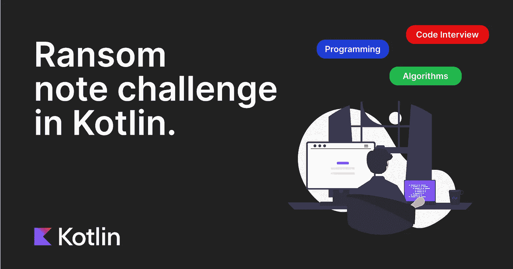

# 科特林的勒索信挑战

> 原文：<https://levelup.gitconnected.com/ransom-note-challenge-in-kotlin-bfe334fe2e15>

## 微软根据 LeetCode 最常问的面试问题。

给定一个任意的赎金通知字符串和另一个包含来自所有杂志的信件的字符串，写一个函数，如果赎金通知可以从杂志中构造，该函数将返回 true 否则，返回*假*。

**杂志上的每个字母在你的勒索信里只能用一次。**

考虑这个例子:

`"a", "b" -> false`

`"aa", "ab" -> false`

`"aa", "aab" -> true`

# 哈希快速回顾

在下面的解决方案中，我们使用 hashmap 来保存数据。因此，在展示解决方案之前，快速回顾一下**哈希**非常重要。

**哈希**用于将任意大小的数据映射到固定大小的数据。

一个**哈希映射**是一个可以将*键*映射到*值*的结构。他们使用散列函数智能地计算出在哪里存储元素。所有操作*读取*、*插入*和*删除*花费恒定的时间`O(1)`。

如果两个键映射到相同的值，就会发生**冲突**。

处理*碰撞*的一种常见方式是使用**链接**。用**链接** *键*和它们的*值*不直接存储在数组中。每个数组元素是零个或多个键/值对的列表。在这种情况下，哈希映射操作的时间是找到存储桶的时间(常量时间)，加上遍历列表的时间。

# 解决方案

一个可能的解决方案是统计*库*串中的出现次数，并保存在`hashmap`中。之后，循环赎金*注意*并减少遇到的每个字符的值。如果 hash 内的对应值小于零，则返回**假**，否则返回**真**。

## 时间和空间复杂性

**时间**复杂度等于弹匣管柱的`O(m)`和赎金管柱的`O(n)`。最后的结果是`O(m) + O(n).`

**空间**复杂度等于`O(n)`内存中保存`hash`的空间。

在结束之前，我建议你喜欢并分享这篇文章，并留下评论。它不会让你付出任何代价，同时鼓励我继续创作其他类似的内容。谢谢你的支持。

下节课再见。😉

# 本系列的其他帖子

 [## 在数组中寻找不重复的数字。

### 给定一个非空的整数数组，除了一个元素外，每个元素都出现两次。找到那个单身的。

levelup.gitconnected.com](/find-the-non-duplicate-number-in-an-array-e7d56544b5d6)