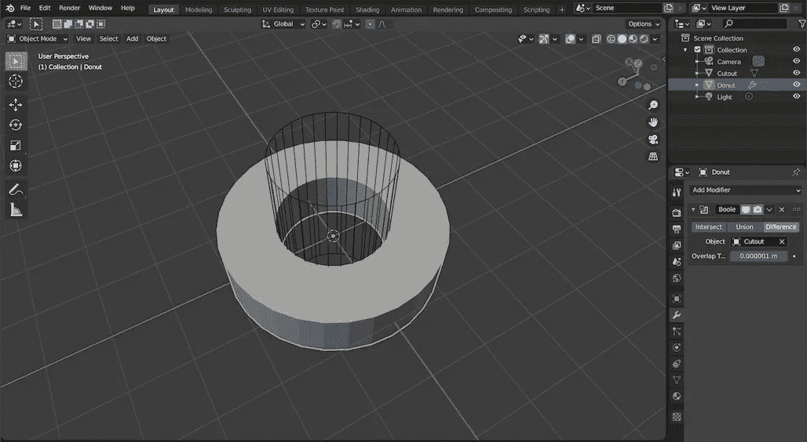

# 通过脚本在 Blender 中快速生成网格

> 原文：<https://levelup.gitconnected.com/rapidly-spawn-printable-meshes-via-blender-python-9ff5c3af6379>

简单的 Python 快速而干净地制作耗时的零件

*这是系列文章的第 2 部分，记录了在模块化系统中构建 Blender 插件以生成可打印组件的每个步骤，但是这篇文章完全可以独立阅读。*

*TL；DR:底部是完整脚本的要点——相当短&有文档字符串。*

当我开始使用 Blender 为电子项目建模 3D 可打印组件时，一个早期和令人惊讶的挑战是如何为 PCB 和用螺钉将组件固定在一起的地方制作支架安装点。


做一个不那么高级的甜甜圈能有多难？

我花了比我想承认的更长的时间来依赖布尔修饰符和处理它们产生的工件和非流形几何图形。



线框。这么多线框。每个公制硬件直径的线框。(线框设置位于“对象属性>视口显示”面板中)

在某些情况下，使用布尔修饰符仍然是正确的选择，我花在使事情过于复杂上的所有时间都被证明是有用的，可以找到一些技巧来解决非流形问题(即避免使用修饰符)。但对于更有经验的建模者来说，更简单的方法显然是首选，即在对象模式下为其中一个圆周添加圆形网格，将对象切换到编辑模式并添加另一个圆形网格，然后使用“桥边循环”来连接它们。


单个对象中的多个网格&从“添加[一个东西]”菜单中调整网格参数

这种方法可能会生成比严格必要的更多的面，但是因为这里的目标是制造而不是渲染，所以我没有发现它会导致任何性能或输出问题。桥接循环边，并选择所有生成的面，只需将它们挤出到所需的高度，这是一个简单的编写脚本的过程！


在编辑模式下(面)—“A”选择全部，“E”拉伸，“数字”选择目标距离，“返回”提交

要编写网格操作的脚本，最好使用 Blender Python `BMesh`模块，而不是直接使用 GUI 的信息编辑器面板中记录的`bpy.ops.mesh`对象。与许多 3D 对象 API 相比，`BMesh`模块仍然提供对更高阶网格函数的访问，在这些 3D 对象 API 中，交互只能通过直接操纵顶点&面索引来进行，但它作为一个后台进程工作，因此避免了重复调用`bpy.ops`的额外开销(例如，查看每个添加到活动撤销堆栈)。

在某些方面，可能对任何有前端开发经验的人都有帮助，`BMesh`可以被描绘成像影子 DOM 一样工作——下面是`BMesh` [医生](https://docs.blender.org/api/current/bmesh.html)对此的看法:

> “注意，与`bpy`不同，BMesh 不一定对应于当前打开的混合文件中的数据，BMesh 可以被创建、编辑和释放，而无需用户查看或访问它。”

当使用`bmesh`时，您可以使用`bmesh.new()`在内存中实例化它，然后添加场景中不存在的新几何体，或者通过转换场景中的现有网格，在新实例化的网格上调用`.from_mesh(some_mesh_in_scene)`。重要的是要记住，后者从场景中移除网格，因此一旦编辑完成，Python 脚本必须释放所有权并将其作为网格放回到场景中。考虑到这一点，我认为遵循这个程序将遵循的步骤会变得容易得多。

1.  创建一个`BMesh`
2.  用几何图形填充它
3.  转换为场景友好型`Mesh`
4.  添加到场景

该脚本将结合自定义`Standoff`类的`class`定义，一个用于挤出在类外定义的平面几何体的函数，因为它不仅对`Standoff`类网格有用，还可用于更多形状，一个用于将可编辑的`BMesh`转换为`Mesh`对象的函数，该对象也将在`Standoff`类外定义，以及一个当脚本作为`__main__`运行时执行的`test`函数。这个测试函数将在场景中添加一个单独的`Standoff`网格，并模仿这个模块在集成到一个更大的 Blender 插件中时的行为。在高层次上，在实现之前编写接口，脚本将如下所示:

```
import bpy
import bmeshclass Standoff:
    # initializer

    # public class method returning Mesh based on current class attr # internal class methods creating BMesh with Standoff geometry# def a function for extruding planes to a desired distance# def a function for returning Mesh from input BMesh# def a test function to create a Standoff and add mesh into sceneif __name__ == "__main__":
    test()
```

要开始这个脚本，导入两个必需的模块:`bpy`和`bmesh`，并定义`Standoff`类:

```
class Standoff:
    def __init__(self, name='Std', m_diam=3, depth=3, segments=64):         
        self.name = name
        self.depth = depth
        self.segments = segments
        self.radii = {
            "inner": m_diam/2,
            "outer": m_diam*1.25
            }
```

设置默认参数似乎是一个很好的保护措施，3 似乎是一个合理的数字(到目前为止，M3 是我的项目中相当常见的直径)。使用更高的分段数而不是“阴影平滑”给了我很好的打印效果——但肯定有更好的方法，我错过了。因为无论何时更新新的直径，都需要更新`self.radii`对象的属性，所以应该将其抽象为一个方法:

```
class Standoff:
    def __init__(self, name='Std', m_diam=3, depth=3, segments=64):         
        self.name = name
        self.depth = depth
        self.segments = segments
        self.radii = self.__radii(m_diam) def __radii(m_diam):
        return { "inner": m_diam/2, "outer": m_diam*1.25 }
```

`Standoff`类的一个实例将提供一个`Standoff.mesh(args)`接口函数，接受`depth`和`m_diam`属性的新输入，并返回准备添加到场景中的网格数据。

```
class Standoff:
    # ...
    def mesh(self, depth=None, m_diam=None):
        if depth:
            self.depth = depth
        if m_diam:
            self.radii = self.__radii(m_diam)
        bm = self.__create_drum_bmesh()
        return bmesh_to_mesh(bm)
```

`__create_drum_bmesh`方法为`Standoff`类提供了独特的`bmesh`几何图形:

```
class Standoff:
    # ...
    def __create_drum_bmesh(self):
        """
        returns new bmesh instance for current self geom values
        """
        bm = bmesh.new() to_extrude = self.__make_footprint(bm)
        extrude_faces(bm, to_extrude["faces"], self.depth) return bm
```

在这个方法中，`extrude_faces`也可以用在任何一组需要挤压的面上…所以它也存在于`Standoff`类之外。目前，`Standoff._make_footprint(bm)`是最后一个需要定义来启动和运行的类特有的东西。正如在`_create_drum_bmesh`中调用的那样，`_make_footprint`应该返回一个包含关键字`faces`的字典:

```
class Standoff:
    # ....
    def __make_footprint(self, bm):
        """
        takes bmesh instance,
        returns dict with keys 'faces', 'edges' from
        bmesh.ops.bridge_loops
        """
        def circumference(radius):
            """
            for radius, create circle in bm, return edges list
            """
            edges = []
            circ = bmesh.ops.create_circle(
                bm,
                radius=radius,
                segments=self.segments,
                cap_ends=False
                )
            [ edges.append(e) for v in circ["verts"]
              for e in v.link_edges
              if e not in edges ]
            return edges edges = [ e for r in self.radii.values() for e in
                  circumference(r) ]
        bridged = bmesh.ops.bridge_loops(bm, edges=edges)
        return bridged
```

包装在`circumference`函数中的`bmesh.ops.create_circle`方法，加上之前在“编辑模式”下向对象添加圆形网格的可视化演示，很好地展示了`bmesh` API 是如何工作的。对于它们的第一个参数，`bmesh.ops`方法引用一个特定的`bmesh`实例，就像一个人在编辑模式下与一个网格交互，对这个实例做一些事情，然后返回。与`bpy.ops`操作符不同，`bmesh.ops`方法通常返回字典，提供对`bmesh`的子集或相关修改属性的访问。在`create_circle`的情况下，键`"verts"`后面有一个已创建顶点的列表。在这种情况下，`circumference`函数使用 list comprehension 来遍历它，获取每个顶点的`link_edges` list 属性中的边的值，仅追加那些尚未被发现附加到先前迭代的顶点的边。

创建内部和外部边，通过调用每个半径值的`circumference`函数选择结果边，并使用`bmesh.ops.bridge_loops`方法桥接这些边。这个方法返回一个带有`faces`和`edges`键的字典。

创建这个桥接足迹，并返回对其字典的访问，填充了在`_create_drum_bmesh`中调用`extrude_from_flat`所需的接口。在`Standoff`类之外，`extrude_from_flat`可以定义为:

```
def extrude_faces(bm, faces, depth=1.0):
    extruded = bmesh.ops.extrude_face_region(bm, geom=faces)
    verts=[ e for e in extruded["geom"]
            if isinstance(e, bmesh.types.BMVert) ]
    del extruded bmesh.ops.translate(bm, verts=verts, vec=(0.0, 0.0, depth))
```

`bmesh.ops.extrude`方法在`bmesh`中创建了额外的几何图形，但是考虑到单一责任原则，它们本身并不转换几何图形。在我看来，这是一个特别容易描绘出`bmesh`模块与在 GUI 中抽象的&Blender 操作接口的例子。在许多`bmesh.ops.extrude`方法之间有细微的区别(但是在结果上有显著的差异),并且有大量的可选参数来配置它们的行为。

一旦从挤压返回的`geom`序列中过滤出`bmesh.types.BMVert`实例并将其复制到新创建的列表中，就可以并且应该从内存中删除`extruded`对象，以确保`bmesh`和结果`mesh`保持有效状态。最后，调用`bmesh.ops.translate`方法——在这个实例中，通过相对于`bmesh`实例的对象矩阵沿 z 轴的`depth`值平移顶点(该方法还接受一个`space`参数来设置不同的相对变换原点)。

随着这个逻辑的完成，所需的隔离几何现在存在于一个`bmesh`中，如在`Standoff`类初始化器的`bmesh_to_mesh( self._create_drum_bmesh() )`调用中返回的。剩下的工作就是实现这个函数，它将处理对一个`bmesh_to_mesh`的转换并从内存中清除`bmesh`，然后将为`Standoff`类实例创建的结果`mesh`添加到场景中。在`Standoff`类之外，`bmesh_to_mesh`可以写成:

```
def bmesh_to_mesh(bm, me=None):
    if not me:
        me = bpy.data.meshes.new("Mesh")
    bm.to_mesh(me)
    bm.free()
    return me
```

通过用一个默认的`me=None`参数和一个处理它的条件来编写这个函数，它也可以处理更新一个现有的`Mesh`实例。

在生产中，将`Mesh`添加到场景中会在其他地方处理，所以现在，该操作的一个基本版本可以发生在一个测试函数中，当模块作为 main 运行时使用:

```
def test(m_diam=2.5, depth=3, name="Standoff"):
    def add_mesh_to_collection(me, name): 
        """
        gets reference to collection in active bpy.context,
        creates new object with 'me' Mesh arg as obj data value
        links created object into referenced collection
        """ collection = bpy.context.collection.objects
        obj = bpy.data.objects.new(name, me)
        collection.link(obj)
        return obj std = Standoff(m_diam=m_diam, depth=depth, name=name)
    add_mesh_to_collection(std.mesh(), std.name)if __name__ == "__main__":
    test()
```


通过脚本创建，3D 打印工具->分析菜单显示干净的流形几何图形，因为使用了正确的' bmesh.ops.extrude '任务方法。

从这里开始，这个`Standoff`类可以被扩展来创建稍微复杂一点的几何图形，并允许通过 UI 菜单动态调整模型——但是这些将在单独的文章中讨论。本系列的下一篇文章将记录如何创建一个附加组件，在一个定制的 Blender UI 元素后面注册这个脚本，配置为传递`metric_diameter`、`depth`和`segments`参数的可调值。

现在，完整的要点如下——感谢您的阅读，以及对如何改进我的代码或解释的任何意见。