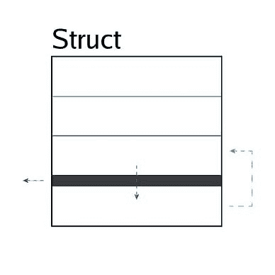

# 说唱歌手在 API 开发中摧毁谷歌软件工程师

> 原文：<https://levelup.gitconnected.com/rapper-destroys-google-software-engineer-in-api-development-9a1faef3dc49>

照片由 [Disgo](https://github.com/switchupcb/disgo) 拍摄

[DiamondBurned](https://github.com/diamondburned) 是 2023 年谷歌的一名软件工程师实习生，在该公司工作每月能拿到 11000 美元。这位程序员创建了许多涉及 Discord 的开源库，不要忘记一个名为 [Arikawa](https://github.com/diamondburned/arikawa) 的 API 包装器。这个软件允许其他开发者使用 Go 编程语言与 Discord 进行交互；而不是创建他们自己的 API 包装器来这样做。

Yung Quant 是一名说唱歌手，他被亚马逊(广告部)的最后一轮拒绝，并被禁止参加 2022 年谷歌招聘冻结的面试。这位说唱歌手还创建了许多开源库，包括一个名为 [Copygen](https://github.com/switchupcb/copygen) 和 [Disgo](https://github.com/switchupcb/disgo) 的基于类型的代码生成器；另一个用于在 Go 中创建不和谐机器人的 API 包装器。

**与有川相比如何？**

谷歌是一个被超过 90%的互联网用户使用的搜索引擎巨头。鉴于这些资质，人们会预测 Arikawa 软件比 Disgo 更好。然而，预测可能是错误的。我们基于易用性、架构设计和原始代码性能比较了每个库，以确定哪个库是 Go 中更好的 Discord API 包装器。

这是结果，你可以自己决定。

# 易用性

## 有川

Arikawa 的程序员接口以标准格式(基于函数)提供:当开发人员希望发送消息*(至 Discord)* 时，开发人员必须查看 Arikawa 的 API 文档，以获取向 Discord 发送消息的 Go 函数。在 Arikawa 中，这个请求被分成多个函数*(每个函数有不同的参数)* : `Client.SendEmbedReply`、`Client.SendEmbeds`、`Client.SendMessage`、`Client.SendMessageComplex`、`Client.SendMessage`、`Client.SendTextReply`。不幸的是，按原样使用这些函数缺乏发送消息的语义背后的信息。对每个函数使用严格的参数还会阻止开发人员访问其他功能，如文本到语音转换和组件*(在 Discord 的 API 文档中列出)*。

由于 Arikawa 使用基于函数的 API，因此对 API 函数参数的任何更新都需要开发人员在自己的代码中添加或删除那些参数；编译 Go 程序设计语言的一种规范。当 Discord API 更新时，这会导致不必要的开销，这种情况经常发生。客观地说，仅在 2022 年，Discord API 文档就已经更新了**400 多次**。

## 迪斯戈

Disgo 的程序员接口以基于结构的格式提供:当开发人员希望发送消息*(至 Discord)* 时，开发人员必须检查 Discord API 文档，以获得向 Discord 发送消息的端点(`Create Message`)的名称。由于 Disgo 是 Discord API 的 1:1 实现，开发者会立刻明白在 go 中使用哪个 struct 因为创建结构是语言的基本操作。

Disgo 提供了发送任何请求的单一函数:`Send(*Client)`。在发送消息的上下文中，该函数是`CreateMessage.Send(*Client)`。因此，开发人员将能够使用 Disgo 的 API，而无需接触它提供的文档。相反，开发人员可以通过使用 Discord 的 API 文档来理解他们的 Go 代码是如何工作的。这提供了对开发人员正在使用的 API 的深入理解，同时也从浏览器的额外标签中保存了它们。

因为 Disgo 是基于结构的，所以可以忽略对 API 的结构参数的任何添加；因为在编译的 Go 编程语言中不需要设置每个字段。这使得 Discord API 更新时的开销更少，这种情况经常发生。Disgo 通过创建 [Dasgo](https://github.com/switchupcb/dasgo) 解决了这个问题，Dasgo 是一个类型库，任何 go API 包装器都可以使用它来维护不一致对象的 Go 表示。

# 建筑设计

## 有川(请求)

Arikawa 请求函数保持无副作用。Arikawa 实现了速率限制器，但未能在其功能*(即*[*sendmessage complex*](https://github.com/diamondburned/arikawa/blob/0f0c9686348aeda8e25cb715be7c05292cfa5455/api/send.go#L152)*)*内使用它。这没有被发现，因为它的限速器测试使用了模拟。结果是开发者必须实现他们自己的速率限制器，以避免他们的不和谐机器人被禁止。不太好。

## 有川(事件)

创建一个 WebSocket 连接，并使用发送到事件处理函数的事件。然而，这些函数涉及类型断言和反射的使用，这对性能(在热路径内)带来了巨大的冲击，这是 DiamondBurned *(API 包装器创建者)*更容易实现的代价。尚不清楚是否对网关发送事件正确实施了速率限制。

## Disgo(请求)

Disgo 请求函数没有副作用。Disgo 的速率限制实现——可定制并通过集成测试进行测试——确保这些请求的并发调用不会导致速率限制。这允许开发人员遵守 Discord API 速率限制，而无需额外的工作。

## Disgo(事件)

创建一个 WebSocket 连接，并使用发送到事件处理函数的事件。这些函数不使用类型断言或反射，这使得 Disgo 的实现成为迄今为止最快的 Discord API 包装器。此外，Disgo 的[选择性事件处理](https://github.com/switchupcb/disgo/blob/v10/_contribution/concepts/EVENTS.md#selective-event-processing)防止处理终端开发者不使用的事件。Disgo 还维护网关发送事件的速率限制，这样开发人员无需额外工作就可以遵守 Discord API 网关速率限制。

# 比较

Disgo 更容易使用，保持了更好的架构设计、更好的性能和更快的代码速度。Disgo 已经存在了 9 个月，有 3 个贡献者。Arikawa 已经存在了 36 个月，有 32 个贡献者。此外，Disgo 保持了迄今为止 Go API 包装器中 Discord API 的最高覆盖率。

## 性能(请求)

Disgo 使用`[fasthttp](https://github.com/valyala/fasthttp)`库来发送请求。这个库比 Arikawa 使用的标准库`net/http`快 10 倍。然而，由于 Discord 的违约率限制，这个因素对大多数开发者来说并不重要。

## 绩效(事件)

Disgo 不使用类型断言或反射来处理事件，而 Arikawa 使用。Disgo 的选择性事件处理防止任何开发者不使用的事件影响性能。仅基于理论，Disgo 在两个库之间保持最快的网关实现。

## 测试

测试代码是开发人员的热门话题。谷歌值得称赞的正常运行时间要求会让你相信它的天才保持了更好的测试代码，对吗？这里不是这样的。Arikawa 提供了一个集成测试，覆盖了 **2.8%的 Discord REST API** ，并实现了其功能的一个未指定的百分比。Disgo 的特点是集成测试覆盖了**42.6%的 Discord REST API** 和**实现了其 100%的功能。**

*这些测试在开发人员提交的每个变更上运行，以确保问题在更新发布之前得到解决。*

# 精英统治的神话

关于**有川 vs. Disgo** 开发者有什么要说的？有川在 Github 上保持 351 颗星，而 Disgo 只保持 38 颗星。这表明开发人员发现 Arikawa 比 Disgo 更有趣，尽管 Disgo 在 API 消费的每个方面都占据主导地位。此外，Arikawa 在 Discord Go 社区中获得了一个专用频道，而 Disgo 的请求被否决了。所以现在的 Discord Go 社区更看重 Arikawa 而不是 Disgo。当然，在一个崇尚信誉胜于技术性能的行业，这并不奇怪。

 [## 程序员的薪酬差距

### 程序员拿多少工资是由什么决定的？

levelup.gitconnected.com](/the-pay-disparity-of-programmers-c6b9472a8a06) 

[开关 CB](https://switchupcb.medium.com/?source=post_page-----9a1faef3dc49--------------------------------)

## 什么是 Disgo？

[View list](https://switchupcb.medium.com/list/what-is-disgo-78e1dc5847c9?source=post_page-----9a1faef3dc49--------------------------------)5 stories