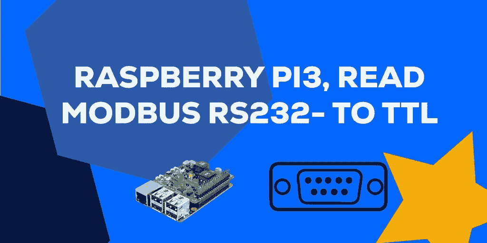
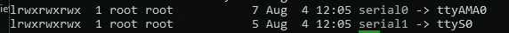
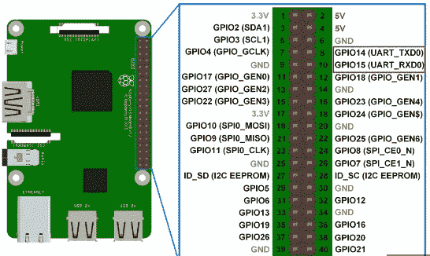
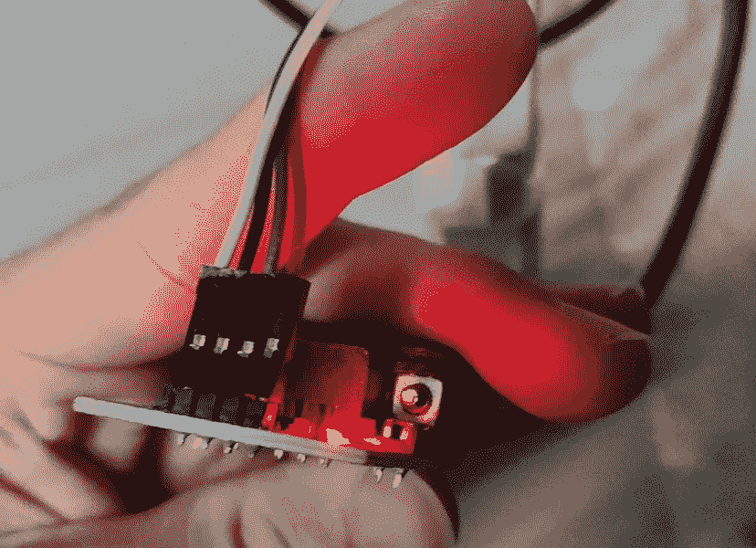
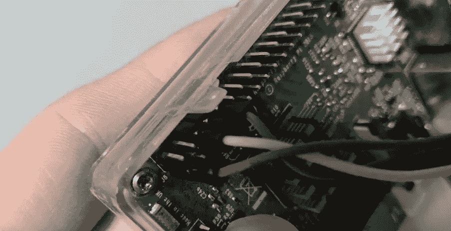
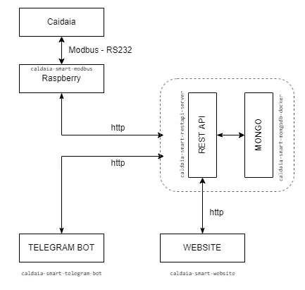

# Raspberry PI3 — Modbus 连接(RS232 至 TTL — UART) 2023

> 原文：<https://levelup.gitconnected.com/raspberry-pi3-setup-modbus-connection-rs232-to-ttl-uart-af366d4feaf8>



在本指南中，我将向您展示如何设置您的 raspberry PI3 通过 TTL 串行端口(和 RS232 通信模块)与 Modbus 通信

默认情况下，在新的 Raspberry Pi IOS 安装上，`UART0` ( *异步串行通信协议*)是为“登录 Shell”保留的。

要将`UART0`用于其他应用程序，您需要**通过本地配置关闭**到登录 Shell 的连接。所以，在你的覆盆子终端输入:

*   `sudo raspi-config`

选择`interfacing options`，选择`serial`，回答:

*   **否**到"*您希望通过序列号*访问登录 shell 吗？"

和

*   **YES** to " *您想要启用串行端口硬件吗*？"

选择`finish`，然后用`sudo shutdown -r now`重启

现在还有一个步骤来完成配置。设备启动后，使用 shell 命令编辑文件`config.txt`:

*   `sudo nano /boot/config.txt`

在文件的底部添加这两行:

`enable_uart=1`

`dtoverlay=disable-bt`

仔细检查拼写，然后在退出时保存文件。

然后，您需要编辑的第二个文件是文件`cmdline.txt`，因此使用命令:

*   `sudo nano /boot/cmdline.txt`

它应该是这样的:

```
console=tty1 root=PARTUUID=ede33e1e-02 rootfstype=ext4 fsck.repair=yes rootwait
```

如果有`console=/dev/ttyAMA0,115200`,您应该移除它。

仔细检查拼写，然后在退出时保存文件。然后用`sudo shutdown -r now`重启


现在，你应该可以走了。可以从`dev/serial0`口读取数据！！



如果你得到许可错误尝试:sudo usermod -a -G tty pi

为了将树莓连接到 Modbus，我使用了亚马逊上售价约 10 欧元的 MAX3232 RS232 转 TTL 转换器。

开始接线之前，请确保知道在哪里连接引脚！在 Raspberry PI3 中，UART 引脚是`GPIO14`和`GPIO15`。请务必仔细检查官方文档和数据表，以确保硬件布线的正确性！



Raspberry PI3 文档 UART 引脚



RS232 至 TTL 接线



树莓 GPIO 布线

概括地说，这是我如何连续处理获得的数据的概要:



作为树莓上读取串口的库，我用的是`modbus-serial` (nodejs)。还有其他好的选择，比如`py-modbus`，或者在`C`处理通信。

用于通信的端口是`/dev/serial0`！

如果你喜欢我的文章，请不要忘记点击👏👏👏推荐给其他人👏👏👏。

请随意提问、发表意见或提出更好的解决方案。别忘了在[推特](https://twitter.com/fabchiarani)和 [GitHub](https://github.com/Xiryl) 上关注我！