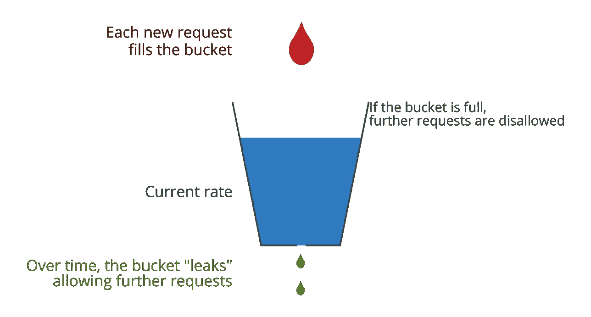
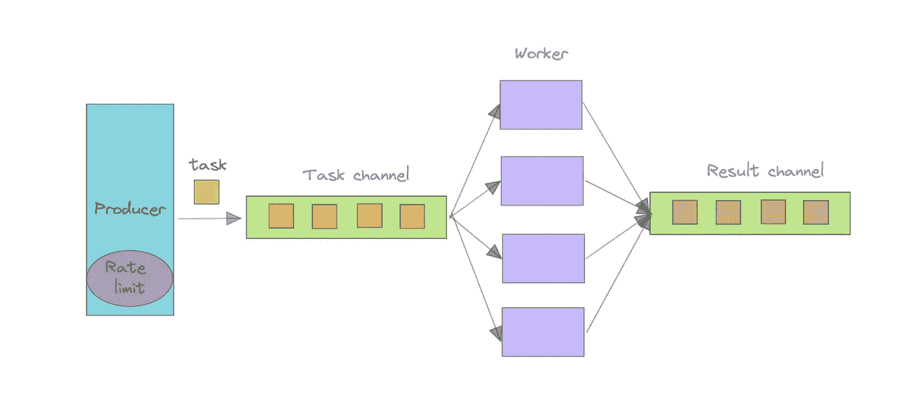

# Golang 的速度限制和工人池

> 原文：<https://levelup.gitconnected.com/rate-limit-plus-worker-pool-in-golang-8df5b8cab378>

这篇文章是关于如何使用速率限制策略和 worker pool 模式来发出大量 HTTP 请求。


照片由[索海布·阿尔·哈尔萨](https://unsplash.com/@sohaib_alkharsa?utm_source=medium&utm_medium=referral)在 [Unsplash](https://unsplash.com?utm_source=medium&utm_medium=referral) 上拍摄

代码可在 [GitHub](https://gist.github.com/jerryan999/ef0aa671b0f15b73c8dbd225f411a963) 上获得。

# 先决条件

Go [速率限制器](https://pkg.go.dev/go.uber.org/ratelimit)包是限制请求速率的最简单的方法。这是我们在这个职位上唯一的先决条件。



图片由[链接](https://www.mikeperham.com/2020/11/09/the-leaky-bucket-rate-limiter/)提供。

该软件包提供了漏桶速率限制算法的 Golang 实现。如果你对算法不熟悉，可以看看关于它的文章。

[](https://betterprogramming.pub/4-rate-limit-algorithms-every-developer-should-know-7472cb482f48) [## 每个开发人员都应该知道的 4 种速率限制算法

### 实现速率限制的初学者指南

better 编程. pub](https://betterprogramming.pub/4-rate-limit-algorithms-every-developer-should-know-7472cb482f48) 

# 真实世界的例子

假设我们需要向第三方 API 发出许多 HTTP 请求来获取一些数据。API 的速率限制为每分钟 X 个请求。

以确保我们不会超过限速。我们必须对我们的请求使用速率限制。

例如:

*   我们的目标网站是:[https://httpbin.org/get](https://httpbin.org/get)
*   通过给定不同的查询参数，可以模拟多个请求，如[https://httpbin.org/get?i=1,](https://httpbin.org/get?i=1,)https://httpbin.org/get?i=2,等。
*   分级限制为每分钟 100 个请求。

如何使用速率限制包和工人池模式来实现我们的目标？

# 体系结构

我们程序的架构很简单。我们的架构中有一些重要的组件:



速率限制加工人池体系结构

## 任务结构

*Task* struct 用于存储每个请求和响应的结果。

```
type Task struct {
   seq        int        // task number seq
   url        string
   data       []byte
   err        string
   statusCode int
   duration   time.Duration
   handleBy   string    // worker name
}

func (t Task) String() string {
   return fmt.Sprintf("seq: %d, URL: %s, handleBy: %s, duration: %d, statusCode: %d, err: %s ...", t.seq, t.url, t.handleBy, t.duration, t.statusCode, t.err)
}
```

## 任务已更改

*Task Chan* 是任务的容器，下面的生产者会将每个任务发送给它。

## 生产者

生产者组件生成所有的任务，并将其发送给*任务变更*以供下游流程使用。

```
// generate tasks and send to task chan
func producer(rl ratelimit.Limiter) <-chan Task {
   var tasks []Task
   for i := 0; i < 1000; i++ {
      url := "https://httpbin.org/get?i=" + fmt.Sprintf("%d", i)
      tasks = append(tasks, Task{seq: i, url: url})
   }   

   out := make(chan Task)
   go func() {
      defer close(out)
      for _, task := range tasks {
         rl.Take()
         out <- task
      }
   }()

   return out
}
```

这里最重要的功能是我们使用*速率限制器*来控制任务生成速度。因此，我们可以确保不超过下游 HTTP 速率限制。

## `RateLimiter`

速率限制器包定义了漏桶速率限制算法的实现。

下面是创建一个速率限制器的代码，限制为每分钟 500 个请求。

```
rl := ratelimit.New(500, ratelimit.Per(60*time.Second))
```

## 结果频道

*Result Chan* 是另一个任务容器；它包括所有已完成的任务及其由工作人员生成的结果。

## 工人池

每个工人将分别处理来自*任务变更*的任务，并将结果发送给*结果变更*。

```
func worker(name string, taskChan <-chan Task, resultChan chan<- Task) {
   for task := range taskChan {
      start := time.Now()
      body, code, err := Get(task.url)
      if err != nil {
          task.err = err.Error()
      }

      task.statusCode = code
      task.data = body
      task.handleBy = name
      task.duration = time.Duration(time.Since(start).Milliseconds())

      resultChan <- task
 }
}
```

以下是如何启动五个工人，并等待他们完成。

```
 // ... 
 numWorker := 5

 var wg sync.WaitGroup
 for i := 0; i < numWorker; i++ {
    wg.Add(1)
    go func(x int) {
       defer wg.Done()
       worker(fmt.Sprintf("worker-%d", x), taskChan, resultsChan)
  }(i)

// ...
```

完整代码可在 [GitHub](https://gist.github.com/jerryan999/ef0aa671b0f15b73c8dbd225f411a963) 上获得。

我希望你喜欢读这篇文章。如果你愿意支持我成为一名作家，可以考虑注册[成为](https://jerryan.medium.com/membership)中的一员。你还可以无限制地访问媒体上的每个故事。

# 分级编码

感谢您成为我们社区的一员！在你离开之前:

*   👏为故事鼓掌，跟着作者走👉
*   📰查看[升级编码出版物](https://levelup.gitconnected.com/?utm_source=pub&utm_medium=post)中的更多内容
*   🔔关注我们:[Twitter](https://twitter.com/gitconnected)|[LinkedIn](https://www.linkedin.com/company/gitconnected)|[时事通讯](https://newsletter.levelup.dev)

🚀👉 [**加入人才集体，找到一份令人惊喜的工作**](https://jobs.levelup.dev/talent/welcome?referral=true)