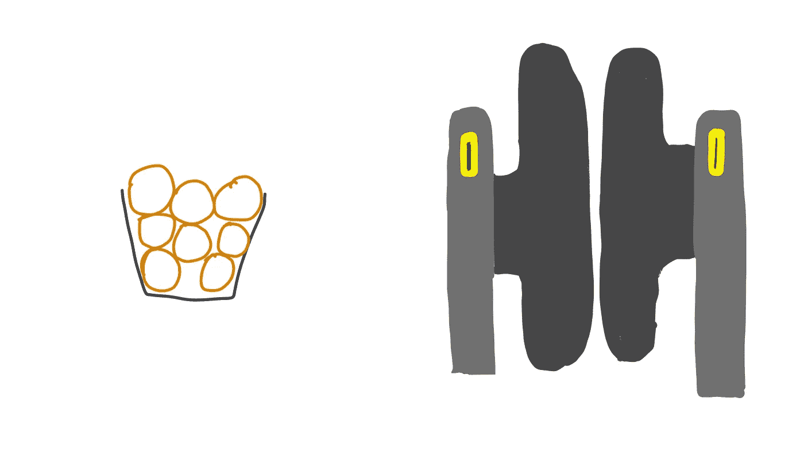
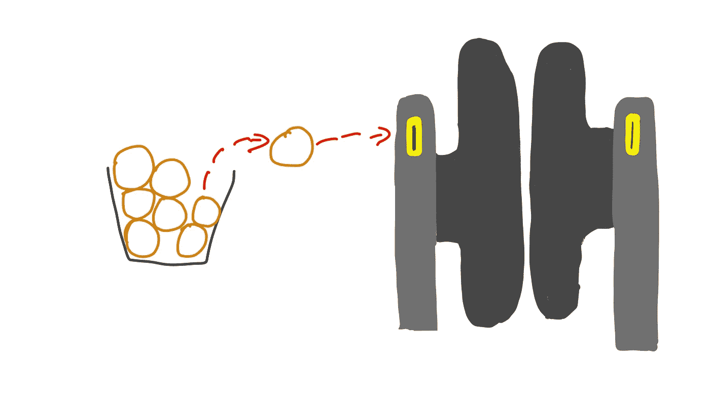
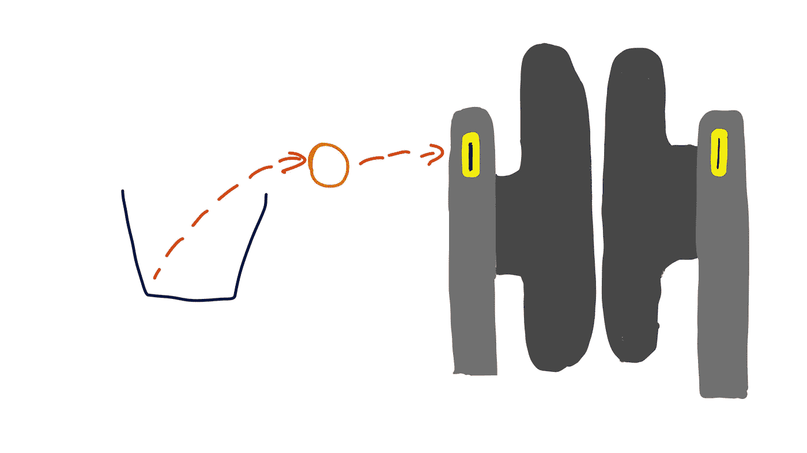
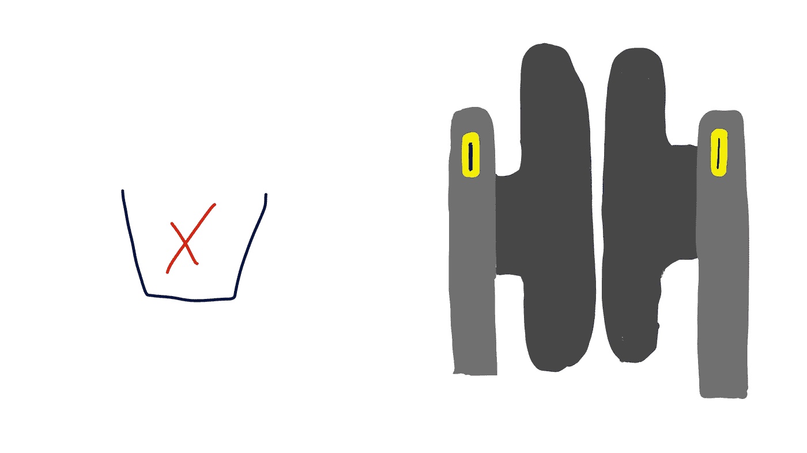
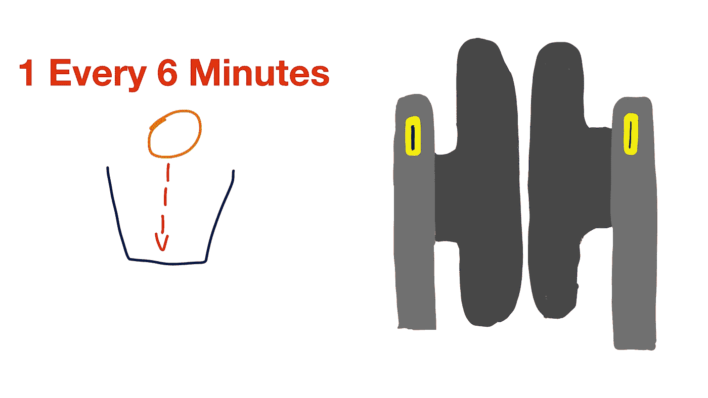
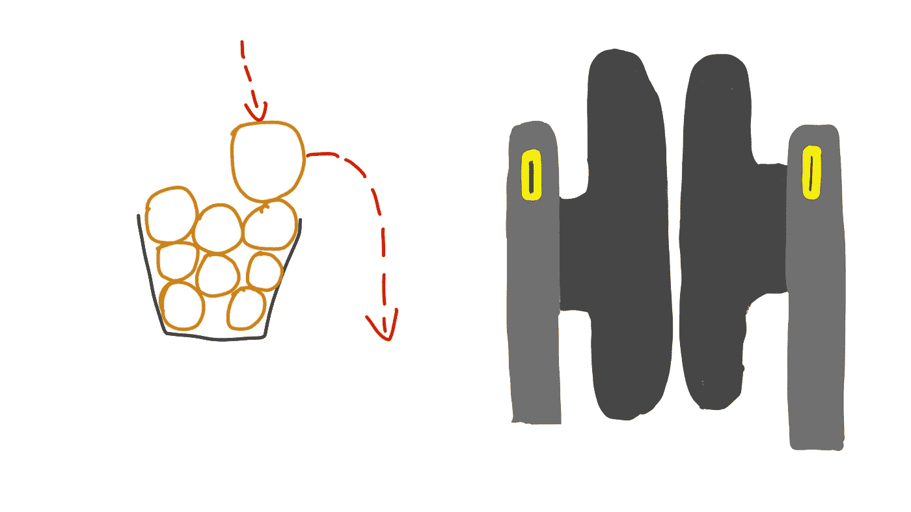
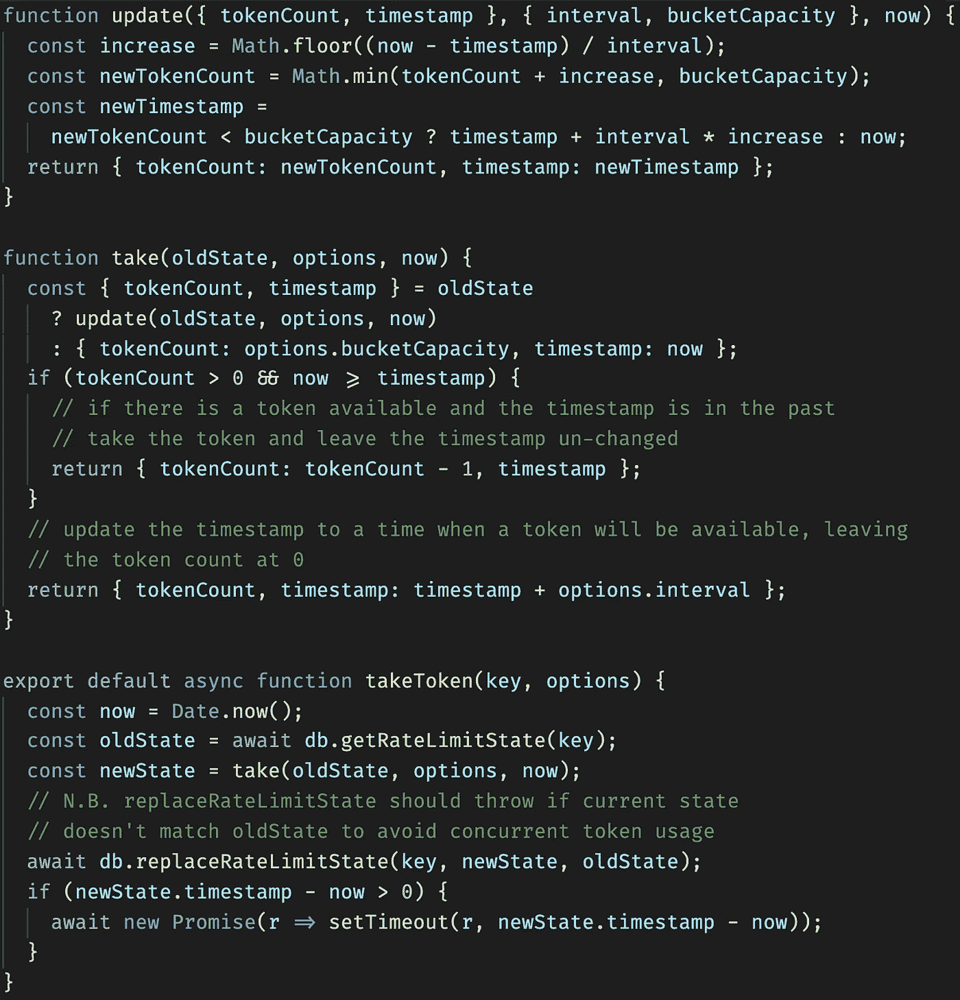
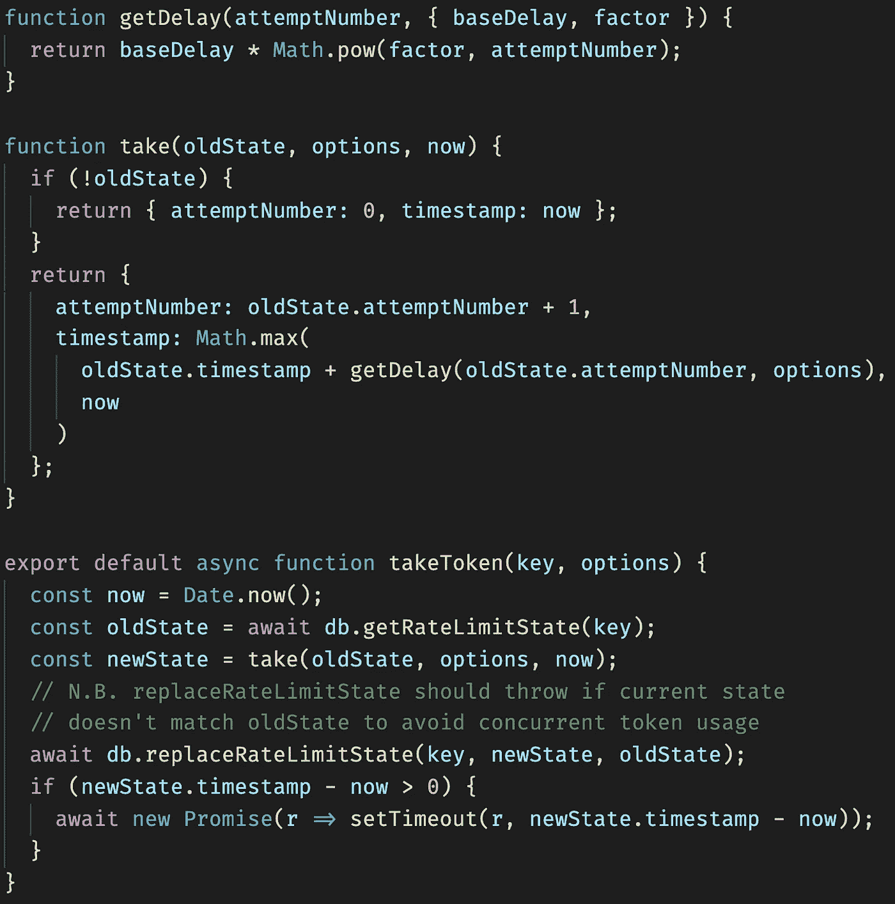

# JavaScript 中的速率限制示例指南

> 原文：<https://levelup.gitconnected.com/rate-limiting-a0783293026a>

## 学习两个你应该避免的速率限制策略和两个你应该使用的策略，以及如何在 Node 和 JavaScript 中实现它们。

速率限制是降低安全风险的一种有效且相对容易的方法。它不会是保护应用程序的唯一方法，甚至可能不是保护应用程序的最重要的方法，但它应该一直放在您的工具箱中。

我们来看一个案例，攻击者试图猜测用户的密码。如果你设置一个密码每天可以尝试的次数的限制，它将削弱黑客的攻击，并保证你的用户的安全。

> 如果你不限制速率，攻击者可以使用你的 CPU 和内存来破解你的用户密码！

如果您意外地允许用户从您的数据库中读取任意记录，而不是只读取他们应该有权访问的记录，如果他们每分钟只能读取一条未经授权的记录，而不是每分钟提取 1000 条记录，那么问题会小得多。

> 速率限制使得受到损害的影响不那么严重

在这篇文章中，我们将考虑两种好的速率限制类型，但首先让我们看看一些不好但常用的例子。

# 固定窗口速率限制—不要使用它

固定窗口速率限制非常简单。你可以这样说——每个用户每小时可以向我的 API 发出 10 个请求。实现很简单:

1.  为当前小时的每个用户保留一个计数器
2.  每当用户发出请求时，递增计数器
3.  如果计数器超过阈值，则拒绝请求
4.  每小时开始时重置所有计数器

问题是，这可能非常令人沮丧，也非常不公平。

在一个小时结束前开始请求的❌用户比在一个小时开始时开始请求的用户在开始的几分钟内会发出更多的请求。

❌:如果用户的使用量超出你的预期，将会受到非常严厉的处罚。例如，如果我每小时发出 10 个请求，我可以在一秒钟内发出 10 个请求，但发出 11 个请求需要一个多小时。这似乎不公平。

# 滑动窗口速率限制—不要使用这个

在这里，我们不说“你可以每小时发出 10 个请求，与时钟上的小时一致”，而是说“你可以在一个小时的任何时段发出 10 个请求”。这意味着，如果您在半小时内每分钟发出 2 个请求，那么您必须等待半小时才能发出更多请求，此时您在接下来的半小时内每分钟最多可以发出 2 个请求。

✅这感觉不那么不公平了。不管你什么时候开始提出要求，你都会得到同样的待遇。

❌:不幸的是，仍然很容易出现这样的情况，你必须等整整一个小时才能提出更多的请求，这真的很糟糕。

❌让这种方法更糟糕的是，我们现在必须跟踪每个请求的时间戳，以便准确地计算用户被允许发出多少个请求。

# 令牌桶速率限制

令牌桶速率限制是一个相当容易实现的系统。您所需要的只是一个表示用户拥有多少“令牌”的计数器，以及该计数最后一次增加的时间戳。

一桶令牌，带有一个需要令牌才能通过的门

这种工作方式最容易想象为一桶令牌和一个需要令牌才能通过的门。每当我们走过大门(发出请求)时，我们从桶中提供一个令牌。

从桶中取出令牌以通过门

如果我们一直走过大门(提出请求)，我们最终会用完令牌。

使用最后一个令牌

现在，当我们试图再做一个请求时，我们将无法再做了，因为我们已经用完了令牌。

没有更多的代币了

幸运的是，当我们忙于获取令牌来发出请求时，另一个后台进程正在以设定的时间间隔添加令牌。例如，如果我们坚持每小时 10 个请求的模式，则每 6 分钟添加一个令牌

每 6 分钟一个代币

这意味着我们在一个请求和下一个请求之间最多需要等待 6 分钟，这感觉公平得多。

只要我们平均每 6 分钟发出的请求不超过一次，我们就永远不会用完令牌。如果我们发出请求的频率低于每 6 分钟一次，最终桶将被令牌填满。此时，任何新的代币都将从桶中掉出并丢失。

满满一桶代币

存储桶的大小控制着我们被允许的“突发”程度，添加令牌的频率控制着我们被允许长期维持的最大请求率。例如，如果存储桶大小为 10，并且每 6 分钟添加一次新令牌，我们可以在第一个小时内发出 20 个请求(第一个瞬间最多 10 个，然后每 6 分钟 1 个)，但是如果我们这样做，从那时起我们将只能每 6 分钟发出 1 个请求。从长远来看，这相当于每小时只允许 10 个请求。

✅:不管你什么时候开始请求，这都是公平的——在你第一次请求时分配一个新的存储桶

✅:这从来都不是惩罚性的——你最多只需要等待添加代币的时间

✅:这实现起来很有效——你需要存储的只是每个用户的时间戳和令牌数

JavaScript 中从头实现速率限制的代码只有 35 行左右(带注释):

桶速率限制的实现

[在代码沙箱上打开](https://codesandbox.io/s/bucket-rate-limiting-demo-mvqd4?fontsize=14&hidenavigation=1&theme=dark)

> 注意:这种方法有时也被称为“漏桶”速率限制，但在我看来，这个比喻更令人困惑。

# 指数延迟率限制

你应该熟悉的另一种速率限制是“指数延迟”。这仅适用于以下情况:

*   你想对你认为的虐待进行惩罚
*   你有一个自然点“重置”的速度限制

指数延迟几乎只有一个用例，那就是**密码**。

处理密码的错误方式是在尝试一定次数后就把人锁在门外。这有两个问题:

1.  如果你忘记了密码，你的账户很容易被永久锁定。
2.  其他人可以滥用这一功能来永久锁定您的帐户，他们可以很快做到这一点。

指数速率限制不存在这两个问题，至少程度不同。

在指数速率限制下，最初的几次尝试很快，随后的尝试会很快变得越来越慢。试图使用蛮力的攻击者最终将需要一段时间来尝试足够不同的密码，而试图拒绝合法用户访问的攻击者如果想要长时间锁定用户，则需要花费同样长的时间。

指数延迟的代码甚至比桶速率限制的代码更简单，我们的`takeToken`函数和以前完全一样。

指数延迟速率限制的实现

[打开代码沙箱](https://codesandbox.io/s/exponential-rate-limiting-demo-p5est?fontsize=14&hidenavigation=1&module=%2Fsrc%2Fexponential.js&theme=dark)

# 结论

*   使用存储桶速率限制来保护 API，因为它对于合法用户是公平的和相称的，同时限制滥用的用户。
*   对密码使用指数延迟率限制，并在任何成功登录后重置延迟。
*   在按用户名应用指数速率限制之前，您应该对每个 IP 地址应用桶速率限制，以防止有人使用相同的密码攻击每个用户名。

如果你正在使用 Node.js，并且你不喜欢维护你自己的速率限制实现(你绝对不应该),你可以使用我的:[https://www.atauthentication.com/docs/rate-limit](https://www.atauthentication.com/docs/rate-limit)