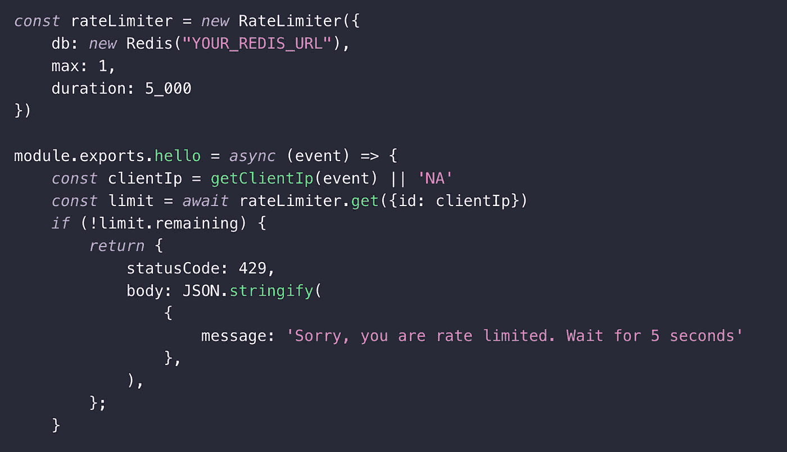

# 限制无服务器应用程序的速率

> 原文：<https://levelup.gitconnected.com/rate-limiting-your-serverless-applications-d718da5710d0>

无服务器最大的好处之一就是它即使在巨大的流量高峰时也能扩展。但不幸的是，无论是在财务上还是技术上，扩展都不是免费的。这就是为什么开发人员需要控制他们的应用程序的可伸缩性。以下是您在无服务器应用程序中需要速率限制机制的主要原因:

**1-保护您的资源:**如果您提供公共 API，流量高峰会降低服务质量，并可能导致所有用户的服务中断。您需要保护您的系统免受这种级联故障以及自己造成的 DDoS 事件的影响。您的应用程序中的一个 bug 可能会在您的系统中引发这样的问题。在失败的情况下无限期重试端点的内部进程很容易耗尽您的资源。

**2-管理用户配额:**您可能想要为您的用户定义配额，以便公平使用您的服务。此外，如果您以不同的定价等级提供服务，您的业务模式可能需要配额。

**3-控制成本:**现实生活中有很多例子说明不受控制的系统会导致巨额账单。由于其高度可伸缩性，这对于无服务器应用程序来说是相当大的风险。限速将帮助你控制这些成本。

在不同的层中有多种可选的速率限制解决方案。我将列出 3 个主要的问题，并简要分析利弊。

**1-函数的并发级别:**

云提供商创建多个容器来扩展您的无服务器功能执行。您可以设置并发容器/实例的最大数量限制。虽然这可以帮助您限制并发性，但它不能控制一秒钟内调用函数的次数。

这里你可以限制 AWS Lambda 和 Google Cloud 的并发性。

优点:

*   没有开销
*   易于配置

缺点:

*   不是一个完整的解决方案。仅控制并发性。每秒执行的次数没有限制。

**2-API 网关上的速率限制**

如果您通过 API 网关访问您的函数，您可以将您的速率限制策略应用到 API 网关。 [AWS](https://docs.aws.amazon.com/apigateway/latest/developerguide/api-gateway-request-throttling.html) 和 [GCP](https://medium.com/google-cloud/rate-limit-your-api-usage-with-cloud-endpoints-quotas-1270da55d2bf) 都有如何配置其解决方案的指南。

优点:

*   没有开销
*   易于配置

缺点:

*   仅适用于使用 API 网关的情况。
*   它不支持更复杂的情况，如每个用户或每个 IP 的配额。

**3-Redis 利率限制**

这是最完整、最强大的解决方案。有许多基于 Redis 的限速库可用。在[杰瑞米·戴利的博文](https://www.jeremydaly.com/throttling-third-party-api-calls-with-aws-lambda/)中，他拒绝将 Elasticache 作为一个可能的解决方案，称`*this adds a "non-serverless" component and another thing to manage*`。这里[upshish](https://upstash.com)以其无服务器模式和按请求定价成为一个很好的选择。

优点:

*   功能强大，您可以实现适合您的用户模型的定制逻辑。
*   可扩展的解决方案。了解 Github 如何使用 Redis 进行速率限制
*   丰富的生态系统，众多开源库: [redis_rate](https://github.com/go-redis/redis_rate) ， [redis-cell](https://github.com/brandur/redis-cell) ， [node-ratelimiter](https://github.com/tj/node-ratelimiter)

缺点:

*   使用 Redis 的开销。

# 代码:Redis 的速率限制

多亏了速率限制库，对应用程序代码应用速率限制变得非常容易。下面的示例代码限制每秒每个 IP 执行 AWS Lambda 函数:

完整示例请访问教程。

# 参考书目

 [## 限速策略和技术|云架构中心

### 本文档解释了为什么使用速率限制，描述了速率限制的策略和技术，并解释了…

cloud.google.com](https://cloud.google.com/architecture/rate-limiting-strategies-techniques)  [## 用 AWS Lambda 抑制第三方 API 调用- Jeremy Daly

### 在无服务器的世界中，我们经常得到这样的印象:我们的应用程序可以无限制地扩展。用右手…

www.jeremydaly.com](https://www.jeremydaly.com/throttling-third-party-api-calls-with-aws-lambda/)  [## 通过云端点配额限制您的 API 使用率

### 速率限制有助于保护您的 API 使用和保护您的账单。但是，如何以一种简单的方式设置这些配额…

medium.com](https://medium.com/google-cloud/rate-limit-your-api-usage-with-cloud-endpoints-quotas-1270da55d2bf)  [## 我们如何在 Redis 中使用分片的复制限速器来扩展 GitHub API

### 大约一年前，我们迁移了一个旧的速率限制器，以便为更多的流量提供服务，并适应更具弹性的…

github.blog](https://github.blog/2021-04-05-how-we-scaled-github-api-sharded-replicated-rate-limiter-redis/)  [## INCR -雷迪斯

### 将存储在 key 中的数字加 1。如果密钥不存在，则在执行操作之前将其设置为 0…

redis.io](https://redis.io/commands/incr#pattern-rate-limiter)  [## 使用速率限制器扩展您的 API

### Paul Tarjan 2017 年 3 月 30 日工程可用性和可靠性对于所有 web 应用程序和……

stripe.com](https://stripe.com/blog/rate-limiters) 

*原载于 2021 年 5 月 3 日 https://blog.upstash.com***。**