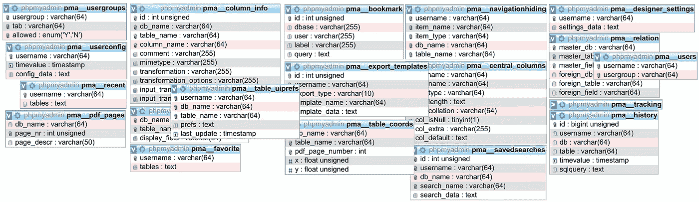
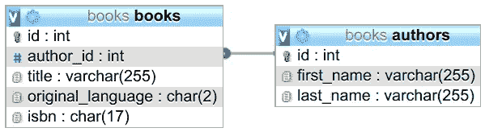
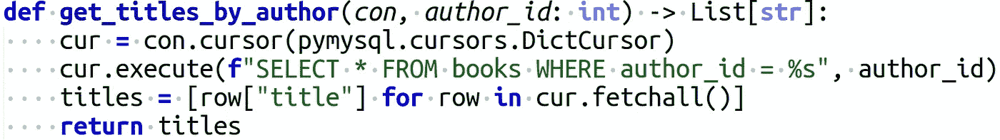
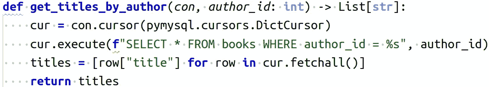
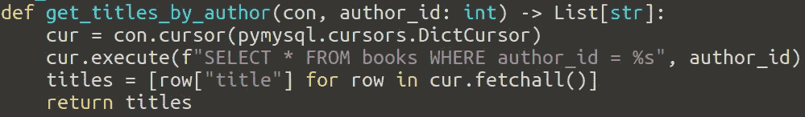

# 原始 SQL 与查询生成器和 ORM

> 原文：<https://levelup.gitconnected.com/raw-sql-vs-query-builder-vs-orm-eee72dbdd275>

## 如何与您的关系数据库对话



图片来源:马丁·托马斯拍摄的 phpmyadmin 截图

数据库是几乎所有 web 应用程序存储状态的核心。因此，处理与数据库的交互对于确保应用程序持续运行至关重要。与大多数关系数据库交互的方式是 SQL——SQL 的 ***S*** *结构化****Q****uery****L****语言*。SQL 使得切换实际的数据库系统或使用该数据库的客户机变得极其简单。到处都是 SQL 而已。你需要一个*数据库驱动*，然后你可以进行典型的 CRUD 交互:**C**create， **R** ead， **U** pdate 和**D**delete data。

读完这篇文章，你会知道什么时候使用原始 SQL，一个查询生成器和一个 ORM。您还将知道如何在 Python 中使用它们。

本文中的所有代码都是可运行的。你只需要[初始化数据库](https://gist.github.com/MartinThoma/95b603226f84f3be25f4eaf2393fba9e)并添加环境变量。我使用 [direnv](https://direnv.net/) 来设置环境变量:

# **原始 SQL**

*原始 SQL，*有时也叫*原生 SQL，*是最基本、最底层的数据库交互形式。你用数据库的语言告诉数据库做什么。大多数开发人员应该了解 SQL 的基础知识。这意味着如何创建表和视图，如何选择和连接数据，如何更新和删除数据。对于更复杂的东西，如[存储过程](https://en.wikipedia.org/wiki/Stored_procedure)，T-SQL，PL-SQL，关于索引及其效果的深入知识，你将很难找到有知识的人。SQL 比许多开发人员想象的要强大得多。例如，我不知道[如何用 SQL](http://wiki.postgresql.org/wiki/Mandelbrot_set) 创建 Mandelbrot 集合。

为了说明原始 SQL 语句的问题，以一个图书门户为例。用户可以看到关于书籍的数据，例如书名、原文和作者:



每本书都有一个作者，但是每个作者可能有任意数量的书。

对于一个作者页面，我们被给定了`authors.id`，并希望看到该作者写的所有`books.title`的列表:

您需要通过“pip install pymysql”安装驱动程序 pymysql

装饰器是项目可能会经常用到的实用程序代码。

从积极的一面来看，原始 SQL 会发生什么是非常清楚的。你只需要 Python 和 SQL 的知识。无需深谙第三方软件。

然而，使用原始 SQL 有六个不好的方面需要注意。

## 问题 1: SQL 注入


图片来源: [xkcd](https://xkcd.com/327/)

SQL 注入是对在 SQL 查询中有占位符的服务的攻击，攻击者可以以意想不到的方式填充占位符。例如:

```
sql = "SELECT user_id FROM users WHERE name='{name}' AND pw='{pw}';"
```

采用这种方法，攻击者可以在`pw`中填入`' OR name='admin' AND '1'='1`,在名称中留空。这将导致查询

```
SELECT user_id 
FROM users
WHERE name='' AND pw=''
OR name='admin' AND '1'='1'
```

这将基本上告诉应用程序，用户作为管理员登录。

当然，对引号进行转义，而不是直接粘贴到用户输入中，这才是你应该做的。但是开发者会犯错。原始 SQL 查询很容易犯这种错误。

## 问题 SQL 命令中的拼写错误

字符串编程的第一个明显问题是子语言中的错别字不能被编辑器发现。

```
sql = "SELECT * FROM books;"
```

## 问题 3:缺少编辑器支持

这个问题很愚蠢，但对于许多语言/编辑器来说仍然是一个公开的问题:当开发人员仅仅用他们语言中的一个字符串编写他们的 SQL 时，编辑器应该如何知道这个字符串需要被解析？编辑器如何知道他们想要语法高亮和自动完成？

你可以在上面的例子中看到，语法突出显示不见了，但是让我给你一些著名编辑器的截图:



崇高文字 3.2，截图由马丁托马斯拍摄



VS 代码 1.47，截图由马丁·托马斯拍摄



vim 8.1，截图由马丁·托马斯拍摄

相比之下，下面是一个`query.sql`文件中的相同查询:


崇高文字 3.2，截图由马丁托马斯拍摄


VS 代码 1.47，截图由马丁·托马斯拍摄


vim 8.1，截图由马丁·托马斯拍摄

我也试过皮查姆。除了琴弦有另一种颜色，看起来都一样。它不识别字符串包含 SQL。

如果您确实需要原始查询，并且仍然希望突出显示语法，那么您可以将每个查询放在它自己的 query.sql 文件中。这样，编辑器知道如何使用 SQL 语法高亮显示。

## 问题 4:表或列名中的拼写错误

```
sql = "SELECT * from boks;"
```

这组错误更难发现。现在，检查代码不仅需要知道 SQL 如何工作，还需要知道您的数据。更准确地说是数据库模式。

## 问题 5:变革管理

数据库会随着时间而变化。对于原始 SQL，您通常得不到任何支持。您必须自己迁移模式和所有查询。

## 问题 6:查询扩展

如果您有一个分析查询，如果您可以对它进行轻微的修改就好了。例如，假设跟踪数据，您想知道有多少用户点击了一个按钮。对此，您可能有一个“基本查询”。根据使用案例，您可能希望针对特定的时间框架或用户特征进行过滤。当您有原始 SQL 时，可以扩展查询，但这很麻烦。您需要接触原始查询并添加占位符。

# **查询生成器**

用您使用的编程语言编写的库，使用本地类和函数来构建 SQL 查询，称为*查询构建器*。查询构建器通常有一个[流畅的接口](https://en.wikipedia.org/wiki/Fluent_interface)。这意味着查询是由使用方法链接的面向对象接口构建的:

```
query = Query.from_(books) \
             .select("*") \
             .where(books.author_id == aid)
```

还有一些图形工具，有时也被称为查询构建器，但在本文中我不是指它们。

JavaScript [Knex](http://knexjs.org/) ，PHP 有[主义](https://www.doctrine-project.org/projects/doctrine-dbal/en/2.10/reference/query-builder.html#sql-query-builder)，Java 有 [QueryDSL](http://www.querydsl.com/) 和 [JOOQ](http://www.jooq.org/) 。

Pypika 是 Python 中查询构建器的一个例子。上面的示例查询可以像这样构建和执行:

请注意，结果查询仍然与原始代码中的相同。它只是以另一种方式建造的。这意味着数据库性能仍然相同。并且查询构建不是一项复杂的任务，所以应用程序的整体性能应该保持不变。

您还可以看到，连接处理仍然像以前一样完成。与原始 SQL 示例相比，代码的总行数增加了 3 行。但是，该查询更容易扩展和重用。例如，您可以想象您有一组复杂的连接和许多 WHERE 语句。对于一个普通的 SQL 查询，您将开始在那里添加选项。使用查询生成器，扩展和重用查询变得更加简单。为了使其可重用，您可以在某处公开查询`q`。

查询生成器可防止所提供零件中的打字错误。上例中的`select`、`.from_`、`.where`。它对列名没有帮助，因为它们仍然只是字符串。换句话说:查询构建器解决了问题 1 和 2，解决了问题 3，但仍然有问题 4 和 5。

# ORM:对象关系映射器

ORMs 为每个数据库表创建一个对象。这样，就有了一个语言本地的表示，因此所有的语言生态系统特性，比如自动完成和语法突出显示都可以工作。

ORMs 在很多语言中都极其流行:Java 有 [Hibernate](http://hibernate.org/) ，PHP 有[雄辩](https://laravel.com/docs/5.0/eloquent)，Ruby 有 [activerecord](https://guides.rubyonrails.org/active_record_basics.html) ，JavaScript 有 [Sequelize](https://sequelize.org/) 和 [TypeORM](https://typeorm.io/) ，Python 有 [SQLAlchemy](https://www.sqlalchemy.org/) 。

以下是使用 SQLAlchemy 的图书示例:

ORM 很酷的一点是，它们有时有助于改变。在 Python 中，有一个 [Alembic](https://alembic.sqlalchemy.org/en/latest/) ，它可以自动检测你的模型相对于数据库最后已知状态的变化。然后，Alembic 可以为您创建模式迁移文件。它们看起来像这样:

最初需要在代码中表示数据库，这样就有了表示数据库表的对象。完成最初的工作后，您需要确保数据库与查询构建器代码库同步。当您只需要编写新的查询时，您从这种努力中获得的是更快的开发。由于您还可以获得语法突出显示和自动格式化，它还可以通过使查询更容易阅读来减少维护。

## 过量提取问题

当您使用 ORM 执行查询时，您往往会得到超出您需要的结果。例如，如果您想直接使用 ORM 进行上面的图书查询，您可以像这样定义外键:

然后数据库接收这两个查询:

```
SELECT authors.id         AS authors_id, 
       authors.first_name AS authors_first_name, 
       authors.last_name  AS authors_last_name 
FROM   authors 
WHERE  authors.id = 1;SELECT books.id        AS books_id, 
       books.title     AS books_title, 
       books.author_id AS books_author_id 
FROM   books 
WHERE  1 = books.author_id
```

这是低效的，原因有多种:

1.  我根本不想要作者信息。
2.  数据库需要执行两个查询，而不是一个。
3.  我不想要图书 ID 或作者 ID。当然，这是一个无关紧要的小例子。但是想象一下，您的查询将返回几百行，也有几百列。也许有些会填充相当大的内容，例如 [LONGBLOB](https://mariadb.com/kb/en/longblob/) 。

当然，你可以这样做:

这导致了以下查询:

```
SELECT authors.id         AS authors_id, 
       authors.first_name AS authors_first_name, 
       authors.last_name  AS authors_last_name, 
       books_1.id         AS books_1_id, 
       books_1.title      AS books_1_title 
FROM   authors 
       LEFT OUTER JOIN books AS books_1 
                    ON authors.id = books_1.author_id 
WHERE  authors.id = 1
```

现在更糟了。我起初认为这是一个错误，但我认为这很好地展示了如何在使用 ORM 时以一种非常复杂的方式获得正确的结果。当然，正确的方法应该是:

这导致了以下查询:

```
SELECT books.title AS books_title 
FROM   books, 
       authors 
WHERE  authors.id = 1
```

这个例子的重点不是 ORM 使得做正确的事情变得困难。最后一个例子当然很容易理解。但是它们也使得创建查询变得容易，而这些查询在某种程度上是错误的。假设您收到了`orms2.py`或`orms3.py`示例进行回顾。他们做了正确的事情，单元测试也不慢。你能确定找出不必要的复杂性吗？当所需的查询变得更加复杂时。

对于原始的 SQL 和查询构建器，您必须不怕麻烦地提出类似的复杂查询。在那里很难编写太复杂的查询，并且很容易发现它们。

## N+1 问题:初始提取不足

假设您想打印一份包含作者姓名的所有书籍的列表。在原始 SQL 中，您将执行以下查询:

```
SELECT b.id, 
       b.title, 
       a.first_name, 
       a.last_name 
FROM   books AS b 
       LEFT JOIN authors AS a 
              ON b.author_id = a.id
```

对于 ORM，您可能想这样做:

它看起来很好，因为在 for 循环中没有看到`session.query`，但是对于其中的每个元素，它都会触发一个查询。因此，如果您在第一个查询中收到了`n`本书，您将执行您可能不知道的`n`查询。您有`n+1`个查询，而不是`1`。

## 泄漏抽象问题

抽象是一枚双面硬币:一方面，它简化了事物。开发人员不必处理数据库交互和查询构建的细节。另一方面，开发人员不知道他们实际上从数据库中查询了什么，也不知道他们发送了多少查询。由于这个原因，一些交互比他们需要的效率更低([例子](https://www.youtube.com/watch?v=3TJfR1Ta4GU))。ORM 可能不知道就在下一行代码中触发了一个非常相似的查询，它可以与第一行结合起来。例如，假设您有一个图书门户，人们可以在那里给出一个作者列表，然后您返回给他们这些作者写的所有图书的列表。您可能会尝试这样做:

现在，您为每个作者发送一次查询。当然，您可以在一个查询中做到这一点。您应该这样做，因为尽管上面的循环看起来不错，但您在两者之间有一个网络连接。这是使用单个查询的方法:

# 奖金:LINQ

语言集成查询(简称:LINQ)在 C#中可用，并且可能是查询构建者试图解决的问题的内置解决方案。这里有一个来自维基百科的[例子:](https://en.wikipedia.org/wiki/Language_Integrated_Query#Language_extensions)

```
var results =  **from** c **in** SomeCollection
               **where** c.SomeProperty < 10
               **select** **new** {c.SomeProperty, c.OtherProperty};
```

这真是太棒了，不是吗？

# 查询类型和渐变

我使用了一个非常简单的示例查询。当然，查询会变得更加复杂。我自己编写了几百行的查询。有两组典型的工作负载: [OLTP](https://en.wikipedia.org/wiki/Online_transaction_processing) 和 [OLAP](https://en.wikipedia.org/wiki/Online_analytical_processing) 。OLTP 工作负载有大量的小型插入/更新/删除，而 OLAP 工作负载运行少量复杂的选择查询进行分析。

当然，如果您处于大多数查询都相当简单的场景中，那么切换到查询构建器或 ORM 是很容易的。但是如果您有复杂的查询，切换到 ORM 甚至是不可能的。

这就是渐变发挥作用的地方。类似于 [Python 支持逐步输入](https://medium.com/analytics-vidhya/type-annotations-in-python-3-8-3b401384403d)，一些 ORMs 查询构建器允许你使用原始 SQL。一些查询构建器允许您首先使用字符串作为表名和列名，然后根据需要转换为对象。如果你可以只取感觉自然的抽象量，你的开发速度不会受到阻碍。如果你有一个复杂的查询，你首先想得到正确的，只需写它的原始数据。稍后查询构建器仍然可以将其更改为表达式。

# 结论

原始 SQL 肯定是与数据库交互的最强大的方式，因为它是数据库的本地语言。缺点是您可能会使用特定于该数据库的特性，这使得将来的数据库切换更加困难。另一个缺点是缺少语法高亮和自动完成等核心编辑器特性。扩展查询很麻烦，SQL 注入的风险也更高。

与原始 SQL 相比，查询构建器增加了很少的开发开销，没有相关的运行时开销，并且防止了 SQL 关键字中的拼写错误。它们使扩展查询变得更容易，而使 SQL 注入变得更困难。

orm 提供了最高形式的抽象，不仅可以防止 SQL 关键字中的拼写错误，还可以防止表名和列名中的拼写错误。无论是从学习曲线的角度还是从初始开发开销的角度来看，它们都比查询构建器需要更长的启动时间。因为它们抽象了很多，所以执行昂贵的查询或太多查询的风险更高。

# 信用

非常感谢 [Marcel Kost](https://www.linkedin.com/in/marcel-kost/) 和 [Adrian Vogelsgesang](https://www.linkedin.com/in/adrian-vogelsgesang-95485a7a/?originalSubdomain=de) ，他们为本文指出了许多有趣的方面。他们建立了在 Tableau 内部使用的超级数据库，所以当涉及到复杂的查询以及数据库系统如何处理这些查询时，他们是专家。谢谢你🤗