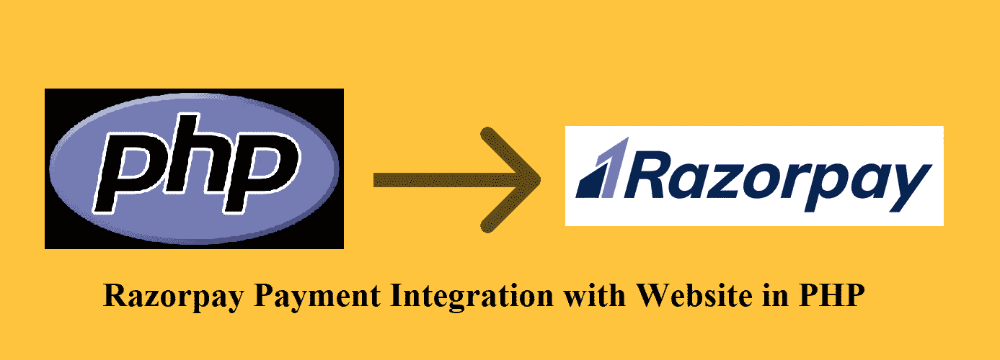
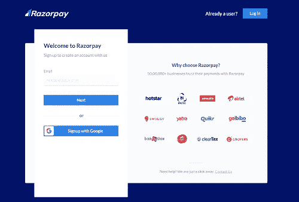
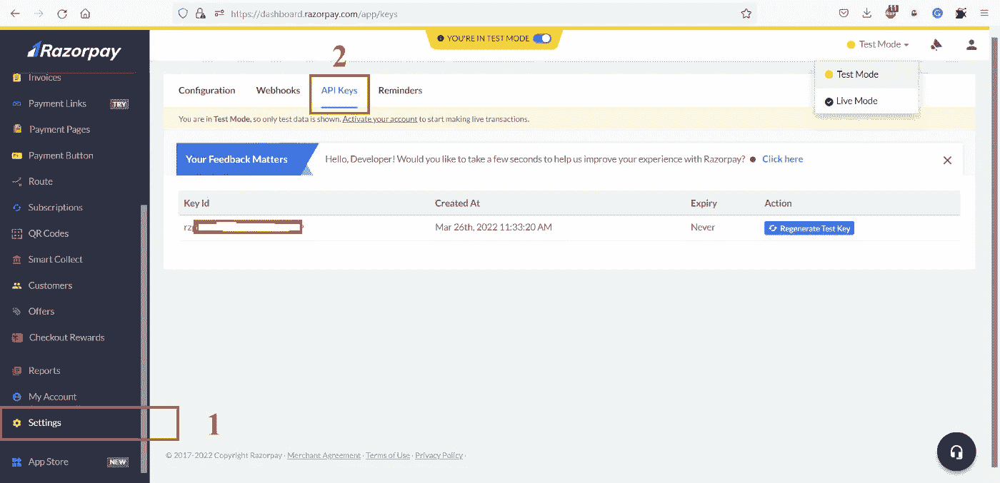
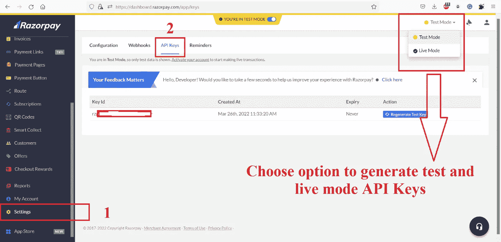

# Razorpay 支付网关与 PHP 网站的集成

> 原文：<https://levelup.gitconnected.com/razorpay-payment-gateway-integration-with-website-in-php-e25dd1c10c5e>



本教程的目的是向我们展示如何通过使用[**razor pay**](https://rzp.io/i/2wiHeXb3dt)API 和库在 PHP 中集成支付网关和我们的网站。

我们需要遵循这些步骤来实现这一点。

1.  用这个注册 [**网址**](https://rzp.io/i/2wiHeXb3dt) 创建 [**Razorpay**](https://rzp.io/i/2wiHeXb3dt) 账户。
2.  从仪表盘中获取 [**Razorpay**](https://rzp.io/i/2wiHeXb3dt) 密钥 id 和秘密 Id。
3.  创建 HTML 表单以获取订单详细信息。
4.  使用 [**Razorpay**](https://rzp.io/i/2wiHeXb3dt) 库创建订单详情。
5.  执行付款以获得付款。

让我们从给出的步骤开始，一个一个地详细说明。

**第一步:Razorpay 账户创建** —要创建 [**Razorpay**](https://rzp.io/i/2wiHeXb3dt) 账户，请 [**点击此处**](https://rzp.io/i/2wiHeXb3dt) 并填写所需的详细信息。您也可以使用您的 google mail 帐户来创建帐户。



Razorpay 注册屏幕

**第二步:API 密钥生成—** 当您拥有 [**Razorpay**](https://rzp.io/i/2wiHeXb3dt) 的账户时，请转到仪表板并创建 API 密钥，为此，请转到:**设置= > API 密钥**



API 密钥生成的导航屏幕

在上面的屏幕中，您需要为**测试**和**实时**模式生成 **API 密钥**，并保存**密钥 Id** 和**密钥秘密**。下面你会找到每种模式的导航。



测试和实时模式 API 密钥生成屏幕

**步骤 3:创建您的 HTML 表单** —在您的网站上创建一个 HTML 表单，其中包含必需的字段，以便将其传递到 [**Razorpay**](https://rzp.io/i/2wiHeXb3dt) 库，并检索订单 id 和支付步骤所需的更多详细信息。这是一个 HTML 表单域的例子。物品名称、数量、金额、物品描述、物品地址、用户名等。

一旦创建了 HTML 表单，下一步就是在 [**Razorpay**](https://rzp.io/i/2wiHeXb3dt) 库的帮助下创建订单细节。

**步骤 4:使用**[**razor pay**](https://rzp.io/i/2wiHeXb3dt)**库**创建订单细节——在创建订单细节之前，您需要从 GitHub 上的 releases 部分下载最新的 [**razorpay-php.zip 文件**](https://github.com/razorpay/razorpay-php/releases/) 。razorpay-php.zip 是预编译的，包含了所有的依赖项。

现在，让我们按如下方式创建订单详细信息。

```
<?php/* In this config file you may set Keyid and secret id of the Razorpay and other credentials*/
require('config.php');/* This is from downloaded Github folder just put in directory and using here */
require('razorpay-php/Razorpay.php');
session_start();
use Razorpay\Api\Api;$api = new Api($keyId, $keySecret);
$orderData = [
    'receipt'         => 3456,
    'amount'          => $_POST['amount'] * 100,
    'currency'        => $_POST['currency'],
    'payment_capture' => 1
];
$razorpayOrder = $api->order->create($orderData);
$razorpayOrderId = $razorpayOrder['id'];
$_SESSION['razorpay_order_id'] = $razorpayOrderId;
$displayAmount = $amount = $orderData['amount'];
?>
```

**注意:**在上面的例子中，**收据** ID 可以是任何东西，**金额**应该是 100 的倍数，因为 Razorpay 只接受一个派萨，这是印度最小的货币单位 INR。**例如**，如果我们将 10 卢比/-作为订单金额，那么我们需要将 **10*100 = 1000** paisa 传递给 Razorpay 订单创建流程。一旦我们将这些细节传递给订单创建 API，我们将收到 **$razorpayOrderId** ，我们将把它存储在会话中以供进一步处理。

我们将把所有的支付细节存储到一个数组中，编码成 JSON，并返回到**支付 PHP 文件**来执行支付。你可以创建下面的 json 数组样本，把它发送到付款 PHP 文件。

```
<?php
$data = [
    "key"               => $keyId,
    "amount"            => $amount,
    "name"              => $_POST['item_name'],
    "description"       => $_POST['item_description'],
    "image"             => "",
    "prefill"           => [
    "name"              => $_POST['cust_name'],
    "email"             => $_POST['email'],
    "contact"           => $_POST['contact'],
    ],
    "notes"             => [
    "address"           => $_POST['address'],
    "merchant_order_id" => "12312321",
    ],
    "theme"             => [
    "color"             => "#F37254"
    ],
    "order_id"          => $razorpayOrderId,
];
?>
```

**第 5 步:执行支付以获得支付—** 作为这一步的一部分，您必须获得编码的 JSON 数据并按如下方式解析它，并且为了执行支付功能，我们需要将 checkout JavaScript 文件作为 **checkout.js** 包含在内。请参见下面的示例代码。

```
<button id="rzp-button1" class="btn btn-primary">Pay with Razorpay</button>
<script src="https://checkout.razorpay.com/v1/checkout.js"></script>
<form name='razorpayform' action="verify.php" method="POST">
    <input type="hidden" name="razorpay_payment_id" id="razorpay_payment_id">
    <input type="hidden" name="razorpay_signature"  id="razorpay_signature" >
</form>
<script>
var options = <?php echo $json_data?>;
options.handler = function (response){
    document.getElementById('razorpay_payment_id').value = response.razorpay_payment_id;
    document.getElementById('razorpay_signature').value = response.razorpay_signature;
    document.razorpayform.submit();
};
options.theme.image_padding = false;
options.modal = {
    ondismiss: function() {
        console.log("This code runs when the popup is closed");
    },
    escape: true,
    backdropclose: false
};
var rzp = new Razorpay(options);
document.getElementById('rzp-button1').onclick = function(e){
    rzp.open();
    e.preventDefault();
}
</script>
```

上面的代码包括 checkout.js 来处理[**razor pay**](https://rzp.io/i/2wiHeXb3dt)check out 功能。它还从支付 PHP 文件中获取数据，并将其传递给 [**Razorpay**](https://rzp.io/i/2wiHeXb3dt) 选项处理程序。 [**Razorpay**](https://rzp.io/i/2wiHeXb3dt) 付款 id 和签名用于在此过程中验证付款细节。

如果你有兴趣学习 Google Apps 脚本和自动化你的 Google Workspace？一定要试试这本**电子书**上的 [**谷歌应用套件脚本:初学者指南**](https://www.amazon.com/dp/B0BTJC9X5R)

我希望这篇文章对你有用，如果你有任何问题，请在评论中告诉我。

非常感谢。快乐学习！

对于与本文相关的任何疑问或任何其他技术建议，我们可以在**C**[**lueby here**](https://clueby.com/dilipk)上聊天。