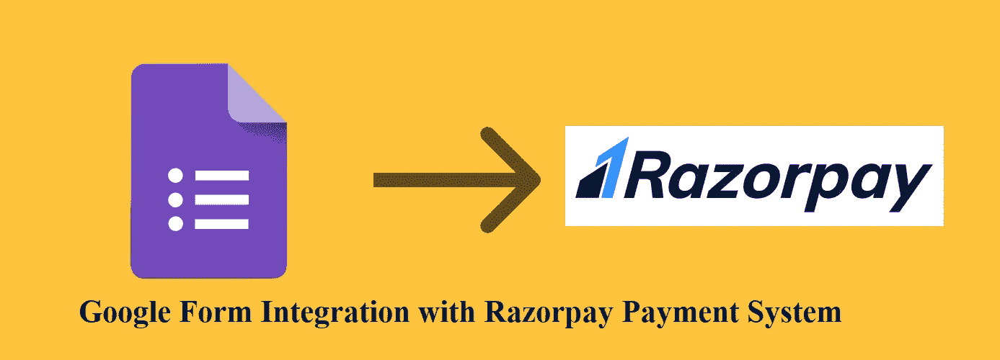
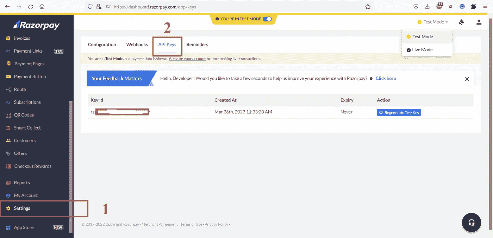
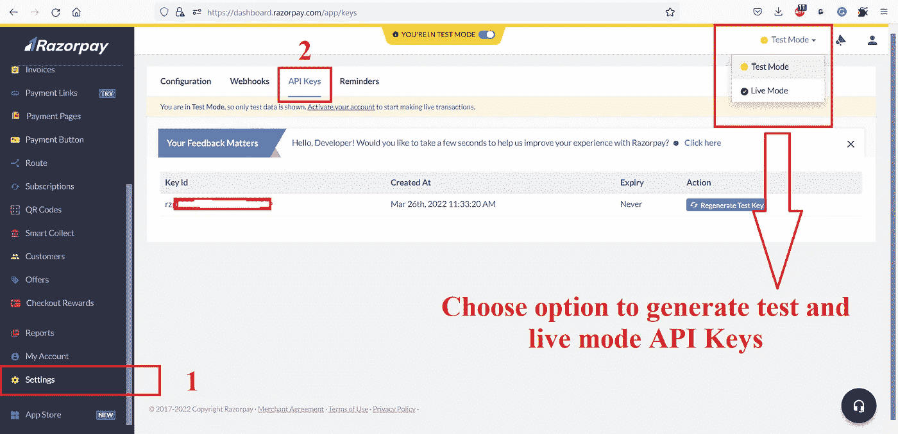
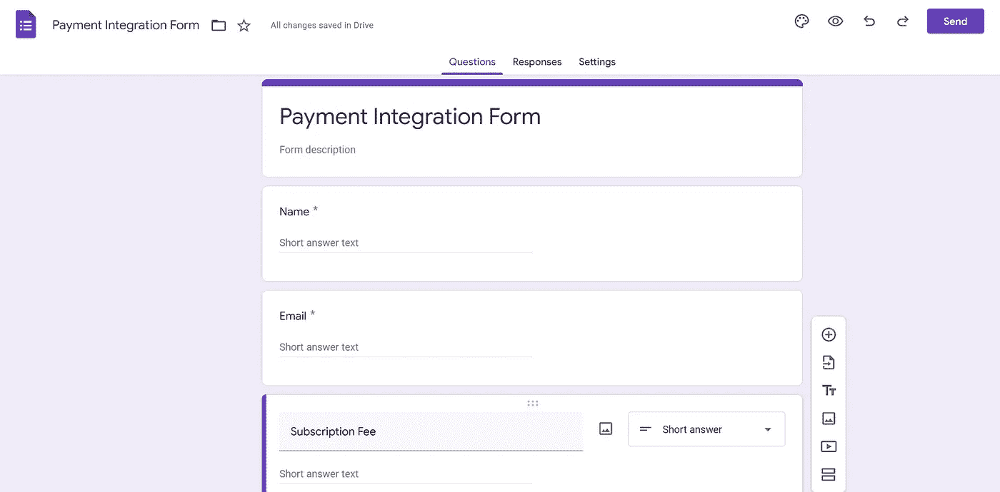
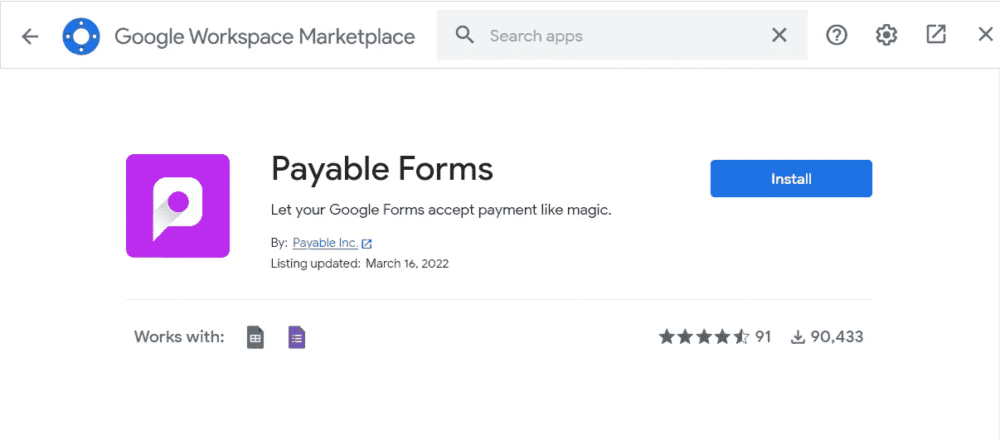
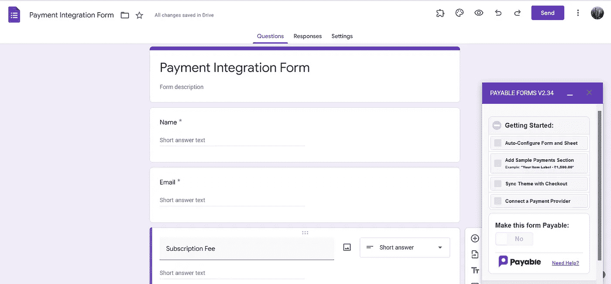
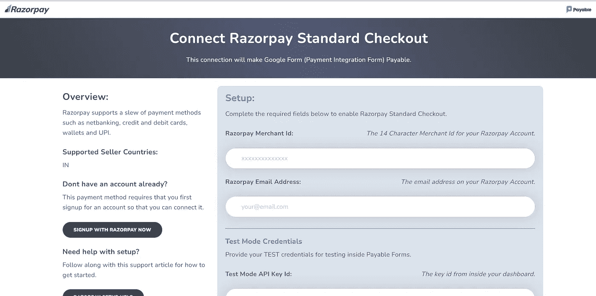

# Razorpay 支付网关与谷歌表单的集成

> 原文：<https://levelup.gitconnected.com/razorpay-payment-integration-with-google-form-3b5802d5dc0d>

在本文中，我们将了解如何将支付网关与 Google Forms 集成。例如，在当今世界，一切都在朝着数字系统发展，例如活动、研讨会、小店的在线订单等等。这些类别中的任何一个都可能会有小额费用或任何订阅费，因此在这种情况下，我们会在 Google 表单中获取详细信息，并在离线模式下收集付款，但当我们多次将客户详细信息与收集的付款进行匹配时，我们仍可能会错过一些付款。

为了避免这样的问题，有一个非常简单可靠的方法可以让客户或顾客使用相同的谷歌表单进行在线支付。

让我们看看我们需要什么来建立这样一个可靠的系统

1.  要收取付款，您需要一个 [**Razorpay**](https://rzp.io/i/2wiHeXb3dt) 支付网关账户。
2.  带有必填字段的谷歌表单。
3.  一个整合了 [**Razorpay**](https://rzp.io/i/2wiHeXb3dt) 和谷歌表单的谷歌表单插件。

**步骤 1: Razorpay 账户创建** —要创建 [**Razorpay**](https://rzp.io/i/2wiHeXb3dt) 账户，请 [**点击此处**](https://rzp.io/i/2wiHeXb3dt) 并填写所需的详细信息。您也可以使用您的 google mail 帐户来创建帐户。

Razorpay 注册屏幕

**第二步:API 密钥生成—** 当您拥有 [**Razorpay**](https://rzp.io/i/2wiHeXb3dt) 账户时，请转到仪表板并创建 API 密钥，为此，请转到:**设置= > API 密钥**

API 密钥生成的导航屏幕

在上面的屏幕中，您需要为**测试**和**实时**模式生成 **API 密钥**，并保存**密钥 Id** 和**密钥秘密**。下面你会找到每种模式的导航。

测试和实时模式 API 密钥生成屏幕

现在我们已经完成了第一部分，我们将继续第二部分，这将是谷歌表单和附加安装。以下是步骤。

**第 4 步:创建谷歌表单** —创建一个带有必填字段的谷歌表单。参考截图，以供参考。

谷歌表单截图

**第四步:安装用于集成的附加组件** —为了将您的 [**Razorpay**](https://rzp.io/i/2wiHeXb3dt) 支付账户与您的谷歌表单集成，一旦您创建了包含必填字段的谷歌表单，您只需在上面安装**支付表单**附加组件。请参考下面的截图以获得帮助。

一旦你点击附加选项，附加屏幕将出现，只需输入**应付表格**并点击回车。附加组件会过来安装它。请找到截图供参考。

支付表单附加组件安装屏幕

在你安装了可支付表单附加组件后，它会询问你一些基本的权限；只要允许它们，你的 Google 表单上就会出现 Payable Forms 设置窗口，如下图截图所示。

支付表单设置窗口屏幕

让我们一步步详细了解每个设置:

1.  **自动配置表单 ans 表:**Payable add-on 基于您的 Google 表单输入字段生成一个 Google 电子表格，包括付款 id 和状态列。这只不过是你的回应表。
2.  **添加样本付款部分:**这个选项基本上是添加一些输入字段的样本部分到您的谷歌表单，以便可以接受付款。您可以从这些字段中选择最适合您的业务需求的字段，并删除其余的字段。
3.  **同步主题和结帐:**除了设计你的结帐表单之外，别无他法。如果你已经为你的谷歌表单选择了一个主题，Payable 将为结帐页面使用一个相似的主题。
4.  **连接支付提供商:**这是支付集成的重要组成部分。您将看到各种支付网关的列表，在这里您需要选择 [**Razorpay**](https://rzp.io/i/2wiHeXb3dt) 选项，并填写一些 Razorpay 相关信息，如— [**Razorpay**](https://rzp.io/i/2wiHeXb3dt) 商家 ID(商家 ID 位于您的 [**Razorpay**](https://rzp.io/i/2wiHeXb3dt) 仪表板下您的个人资料图像图标下)、电子邮件地址、用于测试和实时模式的 API 密钥(我们在创建 [**Razorpay**](https://rzp.io/i/2wiHeXb3dt) 时保存了 API 密钥)下面是截图，供大家参考。

Razorpay 设置屏幕

耶！我们已经完成了 [**Razorpay**](https://rzp.io/i/2wiHeXb3dt) 与 Google Forms 的集成。现在有一个叫**的按钮让这个表单成为应付款**。启用它，您的集成就完成了。付款可以在测试模式下进行测试，也可以在**应付表单**设置下实时处理。您可以启用测试模式，开始填写表单，测试流程直到结帐，然后在您的 Google 回应表中检查回应。

如果你有兴趣学习 Google Apps 脚本和自动化你的 Google Workspace？一定要试试这本**电子书**上的“ [**谷歌应用套件脚本:初学者指南**](https://www.amazon.com/dp/B0BTJC9X5R) ”

我希望这篇文章对你使用 Google form 设置支付系统有所帮助。非常感谢，祝你学习愉快！