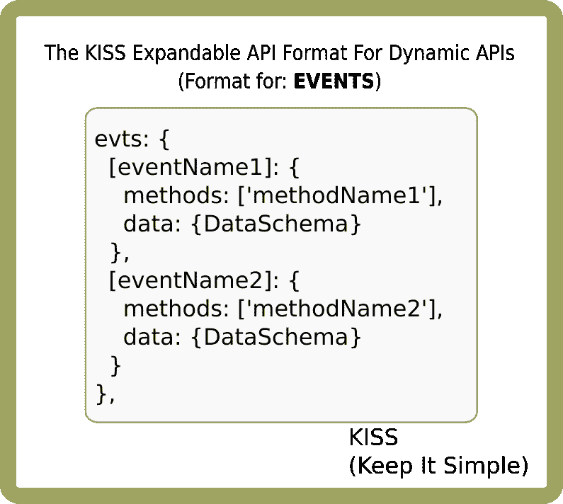

# 重新思考 Web APIs 的动态性和运行时适应性

> 原文：<https://levelup.gitconnected.com/re-thinking-web-apis-to-be-dynamic-and-run-time-adaptable-a1e9fb43cc4>

# 介绍

所有 web 应用程序最重要的方面之一是应用程序编程接口(API)，因为它是一种粘合剂，允许给定通信通道的两端确切地知道该做什么。因为 API 的健壮性、可伸缩性和可靠性非常重要，所以大量的*人工*工作都投入到了维护静态 API 上。事实上，[许多](https://www.google.com/search?rlz=1C1CHBF_enUS857US857&ei=d0KFXq29AcnQ-gSH8ZuQBg&q=api+designer+jobs&oq=api+designer+jobs&gs_lcp=CgZwc3ktYWIQAzICCAA6BAgAEEc6BAgAEEM6BQgAEIMBOgkIABBDEEYQ-wE6BwgAEIMBEEM6CQgAEEMQRhD5AToFCAAQkQI6BggAEBYQHlC5oRBYr8QQYOPMEGgAcAJ4AIABuQGIAYoSkgEEMC4xN5gBAKABAaoBB2d3cy13aXo&sclient=psy-ab&ved=0ahUKEwjt1LKLzsjoAhVJqJ4KHYf4BmIQ4dUDCAs&uact=5)科技公司为设计和维护 API 留出了全职岗位*只是*。这些年来，我们显然忽略了一个问题:API 从来就不应该是静态的。

可以说，一个给定的 web 应用程序的好坏取决于它能够访问和显示的数据。虽然我们很幸运地生活在一个充满数据来源的世界，但我们最终只会使用我们可以访问的数据源(因此，从数学上来说，可能只占世界数据的很小一部分)。通常，每个数据源都有自己独特的 API 需求，每当要使用新的数据源时，这就成了一个大麻烦。通常，它需要足够的时间来阅读冗长的 API 文档，迭代与 API 一样健壮的代码，并让开发人员远离待办事项中的其他任务。每次新加入一个数据提供者都会产生这种时间和开发成本。

即使一个应用程序只需要关注一个数据源，比如它自己的后端，现有的 API 模型仍然会使迭代变得不必要的耗时。我认为，一个只依赖于一个数据源的 web 应用程序可能会很快变成一个非常无聊的应用程序，因为通常情况下，它的用户需要不断的参与和不同种类的刺激。

让我们分析一下我认为最常用的 API 模型:(大大简化)

在这个模型中，我是这样看的:

*   服务器*拥有 API，客户端开发者必须及时更新冗长的 API 文档*
*   客户端发出*请求*，服务器*响应*
*   客户端期待一个单独的*响应*，因此如果在服务器执行所请求的服务时发生了什么，它将不会被传递回客户端。此模型中没有通知，只有响应。
*   通信是单向的；请求是单向的，响应是双向的。
*   当服务器的 API 改变时，所有的客户端在更新它们的请求方法*之前*被阻止*与服务器通信，除非*服务器提供对*以前*版本的访问。这是一个可怕的模型，因为它不可靠，或者即使可靠，它也是昂贵的，因为服务器必须维护所有版本的代码，以便老客户可以使用它。较新版本的代码*包括错误修复*和其他*增强*，所以无论如何，客户坚持使用旧的错误代码可能会适得其反。

退一步来真正思考一下我们在网络上的交流点是什么样子可能会更有益。下图对此进行了说明。在图中，我仍然使用术语“服务器”和“客户端”,因为这是大家仍然熟悉的，但我更喜欢用术语“IO 节点”来表示每个点。

这张图片缩小了之前的模型，以考虑给定网络上的许多 IO 节点。以下是如何看待这一模式:

*   每条线代表双向 IO
*   每个客户端和服务器都可以看作 IO *节点*
*   每个 IO *节点*可以在任何给定时间发出或监听事件。因此，每个节点都可以拥有自己的*API，它希望在任何给定的时间点公开这些 API。是的，*客户端*可以有一个 API。*
*   由于这些事件在运行时*已知*，每一方都可以传递它可以发出和监听的事件；即，每个节点可以传送*其* API。这意味着如果一个外部 IO 节点出现，由“服务器 3”表示，它可以将它的 API 传送给任何或所有节点，并且那些节点将知道如何与那个新节点通信，所有这些都不需要事先知道它的 API。
*   然而，更重要的是，每个节点可以传达其*节点类型*，这样，如果两个节点相同，它们可以被认为是*对等方*，并且可以推断出对等方一定*已经知道*彼此的 API。
*   这个模型*只有*像各方必须同意的 API *格式*一样健壮，但是如果格式*简单*就可以工作！

# 一点题外话

我喜欢把客户机和服务器想象成相隔很远的物理距离。事实上，这已经是真的了，因为通信必须穿越长长的电缆、卫星的反弹等等。客户端可以从服务器获得的响应应该需要一些时间。然而，我喜欢采取更极端的观点。我喜欢把客户想象成去一个完全不同的星球旅行的人，比如火星或冥王星。那个客户端会离得更远，为了生存，她必须不断地与地球上的 IO 服务器通信。

在她天文旅行的几年里，这种交流的双方很可能会以某种方式发生变化，双方都必须适应彼此的交流。我们亲爱的宇航员将没有机会熟悉最新的 API 文档，她将不得不简单地处理服务器发送给她的任何东西。她*观察到的*所说的“最新 API”从地球的角度来看已经是几个旧版本了(物理学)，所以也许如果服务器只能维护几个以前的版本，她就有机会幸存下来。

这可能是一个极端的模型，但仍然可以应用于我们的网络不断变化的需求和 API。当去遥远星球旅行的时候，我们会做好准备。

# KISS 动态 API 格式

如果我可以引用 60 年代一个古老而有价值的首字母缩略词的话，[“KISS”](https://en.wikipedia.org/wiki/KISS_principle)，“KISS 原则指出，大多数系统如果保持简单而不是变得复杂，它们会工作得最好；因此，简单应该是设计的关键目标，应该避免不必要的复杂。”-维基百科

这是我设计的“KISS 动态 API 格式”的设计目标。如果高级格式的描述不适合便利贴，那就违背了 KISS 原则。概括地说，KISS 格式如下所示:

在最高级别，格式很简单:每个 IO 节点指定其标签和版本。如果进行通信的给定节点呈现与另一个节点相同的标签和版本，则它可以被认为是*对等方*，此时，该节点将不需要任何额外的信息。同行已经知道对方的能力。然而，不是对等节点的节点*会*需要更多的信息:支持的事件和方法。(注:这里讨论的重点是 IO 模型。可以实现一个独立的安全模型来帮助验证 IO 节点是否是他们所说的那样)

如果任何节点发生变化，它们必须更新它们的 API，并将这个新的 API 与更新的版本进行通信。然后，如果检测到版本不匹配，接收此信息的 IO 节点可以选择更新其 API 缓存。

如果没有指定标签，客户端将只能依赖自己的别名来使用该 API。因为客户端*已经知道*它正在与之通信的域、端口和名称空间，所以对于它来说，创建它想要的任何别名(例如`apis['localhost:8080/chatRoom']`)可能是一种直接的方式。如果没有指定版本，客户端将不得不总是假设版本不匹配，并在每个新连接开始时请求完整的 API 有效负载；即，客户端将不能依赖或利用 API 缓存。因此，尽管版本控制是可选的，但强烈建议您这样做。

每个节点可以有自己的一组事件和方法。“evts”意味着节点将*发出*那些事件，而“方法”意味着节点将*监听*那些事件(并分别运行自己的同名方法)。

# 吻:“evts”格式

让我们深入到“evts”格式，看看它会是什么样子:(同样，必须适合便利贴)

这里,“evts”将采用以下形式:JSON *对象*,其中对象属性是事件名称，其对应的值也是可选的 JSON 对象，但是强烈推荐。这使得编写多个事件和按事件组织事情变得容易。

每个事件名称指向一个 JSON 对象，该对象包含以下可选但强烈推荐的属性:

*   **方法**:字符串的*数组*，每个字符串代表发出该事件的方法名。如果不同的方法发出相同的事件，这使得接收者很容易通过方法名来组织事件数据。如果省略，接收方将不得不以一种更通用、更不组织的方式缓存发出的数据。
*   **数据**:客户端可以接收并用来验证输入数据的模式。建议在模式中使用默认值，因为这些值也表示数据的类型(在 Javascript 中，`typeof (variable)`告诉我们原语的类型)。在我看来，这使得代码更简单，可读性更好。
*   **ack** :一个布尔值，表示发出的事件是否期望被确认。(这可能需要，也可能不需要，将在后续文章中解释。然而，知道代码在等待 ack 时是否阻塞，以及 ack 何时不会被发送，可能是有用的。

# KISS:使用“evts”格式的示例

在本例中，该 API 标签为“mainServer ”,版本为 1.02。它将发出事件“itemRxd”和“msgRxd”。客户端可以预期发出“itemRxd”的方法要么是“getItems”，“toBeAdded”，要么都不是。仍然由服务器指定发出该事件的方法，以便客户端可以正确地组织其数据。当服务器发出“itemRxd”时，客户端可以期望数据 JSON 包含“progress”，它被指定为类型 Number(默认为 0)，以及“item”，它被指定为类型 Any(默认为空对象)。这样，*类型*和*默认值*都以简单紧凑的方式表示。随着时间的推移，服务器可能希望制作“item”类型的“Item”，而不是“Any”，以帮助客户端验证每个项目(例如:`Item = {name: '', description: '', unitCost: ''}`)。

这里有一个例子:

另一个事件是“msgRxd”。这个条目没有指定任何方法，只指定了数据的模式。客户可以期待收到“日期”和“消息”。由于没有指定方法，客户端可以预期事件来自服务器上的任何或所有方法。

# 亲吻:“方法”格式

“evts”容器描述了给定节点的*输出*,“方法”描述了该节点的*输入*，以及相应的响应。格式可能是这样的:

格式是一个 JSON 对象，其中的属性表示支持的方法名。每个方法名指向一个相应的 JSON 对象，它描述了:

*   **msg** :接收节点期望的消息模式(一个“msg”JSON 对象)
*   **resp** :节点期望响应的响应模式，如果有的话。如果响应指定由方括号包围的架构，则指定该架构的数组。

实时提供这些模式的一个潜在好处是可以自动创建 UI；也就是说，某些类型可以帮助确定哪些 UI 元素最适合这些类型，尤其是如果这些类型是原语。例如，如果给定的消息模式指定了字符串和数字类型，则字符串类型可以转换为`<input type="text" />`，而数字类型可以转换为`<input type="number" />`。整个表单控件可能可以用这种方式动态创建。同样，文本响应可能会附加到`

`元素上。样式仍然可以在很大程度上由 CSS 来处理。

# KISS:使用“方法”格式的示例

在这个例子中，API 指定了两个方法，“getItems”和“getItem”。“getItems”没有指定“msg”模式，所以“msg”可以是任何内容(或者什么都不是),因为它将被忽略。该方法将只返回“Item”类型的数组。项目模式被定义为“id”、“name”和“desc”的 JSON 对象，都是空字符串(类型 String)。然而，“getItem”方法指定了一个“msg”模式，一个带有属性“id”和格式字符串(默认为空字符串)的 JSON 对象。当客户端调用此方法时，服务器期望客户端提供正确类型(字符串)的 id。它会以 Item 类型响应。

# 结论

这里给出了一个冗长的，但希望不会太混乱的讨论，关于 API 如何被动态化，以便它们可以适应通信信道双方所做的改变。对于许多人来说，这很可能是一个非常新的概念，所以我的下一篇文章将描述这一点的确切实现，它将与 [nuxt-socket-io](https://www.npmjs.com/package/nuxt-socket-io) v1.0.22 一起发布。开始时会有痛苦，因为这是一个学习曲线，但我希望我们在爬过曲线后都会感到高兴(是的，我们正在一起爬过曲线)。