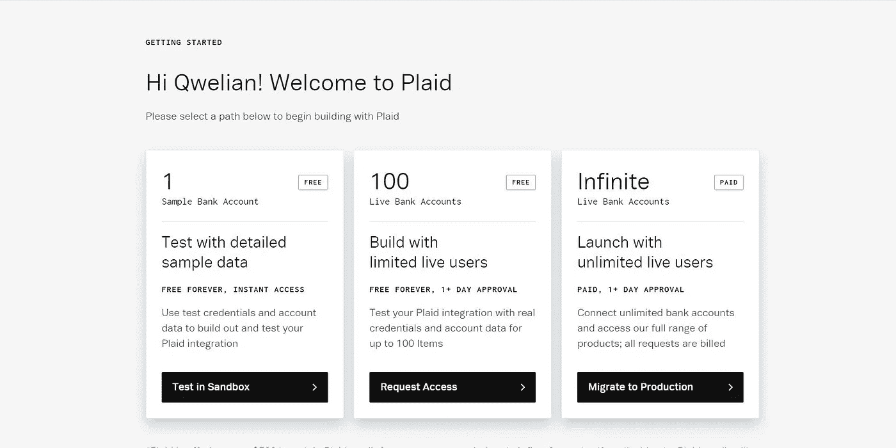
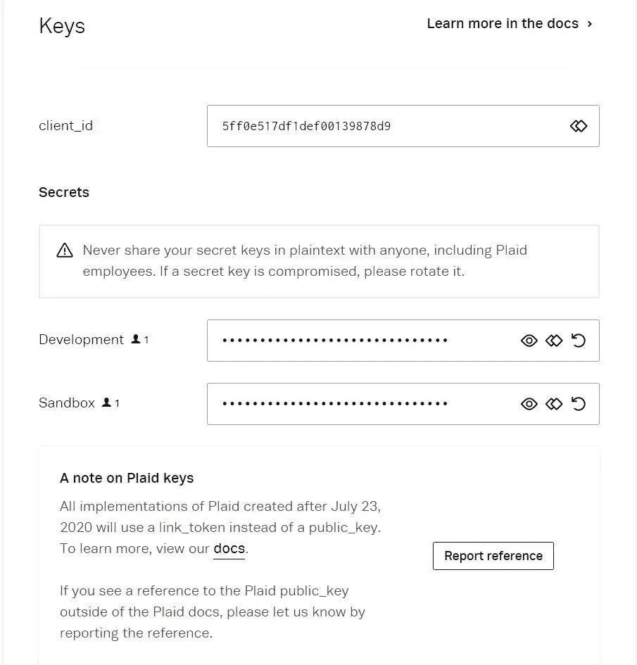
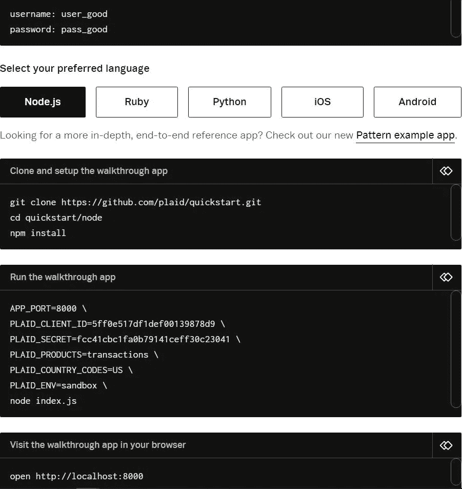
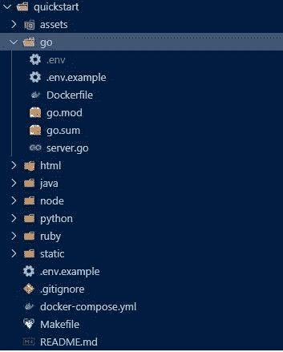
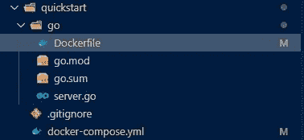
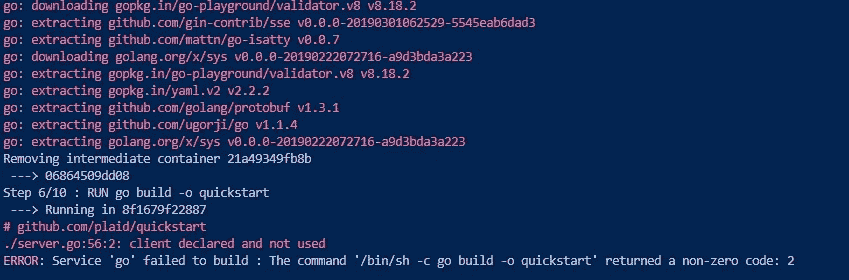
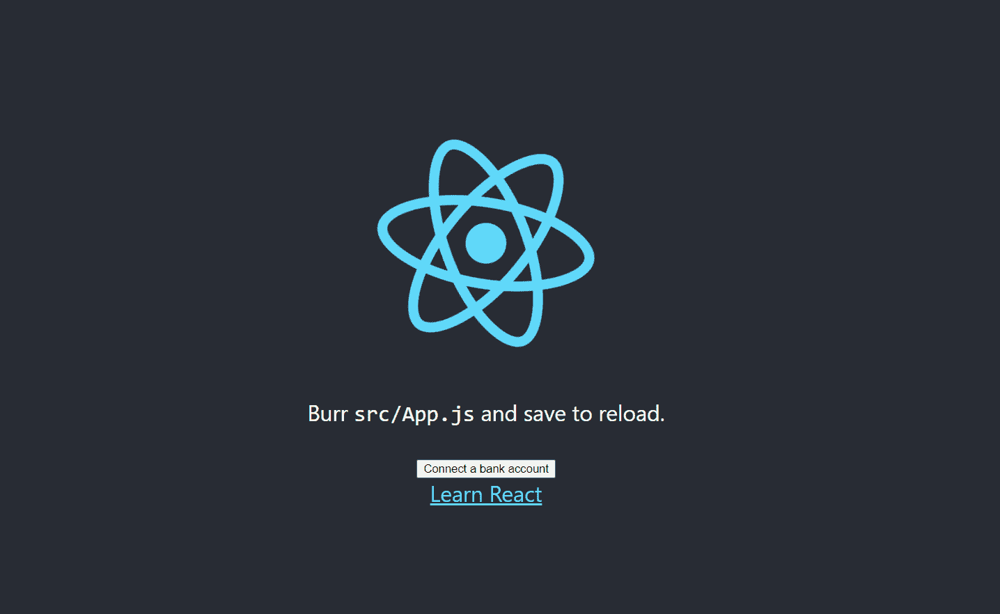

# 使用 React and Go 使用 Plaid API

> 原文：<https://levelup.gitconnected.com/react-and-go-f0e8d958d4a2>

## 一个现代的全栈 REST 应用

Plaid 是一个流行的 API，它通过 REST 端点公开用户的银行信息。我们将利用他们的服务创建一个 REST API 来创建授权信息。然后，我们将创建一个 react 应用程序，该应用程序使用 API 为用户创建身份验证令牌。记住，你可以点击 view raw 按钮来复制你需要的任何代码。本教程假设您熟悉 React 和 fullstack 开发。此回购可在此处找到:

[](https://github.com/qweliant/BetterPlaidQuickstart) [## qweliant/BetterPlaidQuickstart

### 设置 plaid 服务器和 react 客户端的快速入门

github.com](https://github.com/qweliant/BetterPlaidQuickstart) 

首先，我们需要前往 [Plaid](https://dashboard.plaid.com/signin) 获取我们的 API 键。



登录格子后的登陆页面

导航到“设置”选项卡并单击“密钥”以查看您的 API 密钥。



格子花呢的信用

我们将使用沙盒环境，该环境使用不同于开发的测试密钥。注意在左边栏有一个标签，写着 API。点击它，您将看到关于 Plaid 的重定向 uri 的部分。点击 add new uri，添加 [http://localhost:80](http://localhost:3000) 和 [http://localhost:](http://localhost:3000) 3000。这将控制链接发生后重定向的位置。如果您单击登录页面中的“在沙盒中测试”按钮，您将被带到显示测试用户凭据的页面。



针对多种语言的快速入门资料库。因为客户端是后端不可知的，所以你可以为这个项目使用你选择的语言

我们不一定要运行他们的确切设置，但接下来我们将通过 go not so quickstart repo 来设置后端。

## 后端

为您的项目创建一个项目目录。那就跑

```
git clone [https://github.com/plaid/quickstart.git](https://github.com/plaid/quickstart.git)
```

删除 Makefile、Readme 和除 go 以外的所有文件夹。

以前



在...之后



这些预配置了 docker 文件，使部署变得容易。我们不会讨论 docker 容器的部署，但是我们会使用 docker for desktop 来部署它们。如果您需要安装，请查看 [Docker](https://www.docker.com/products/docker-desktop) 获取您的操作系统的安装说明。这将是一个非常简单的 docker 设置，是 noob 友好的，所以你应该能够理解下面的基础知识。下一步我们应该做的是编辑 docker-compose.yml 文件，我们需要删除其他示例的容器设置过程，并从. env 文件中获取环境变量。编辑后，文件应该如下所示。

跑步:

```
docker-compose up -d --build 
```

将构建图像并启动一个容器。如果我们查看 docker 文件，我们可以看到我们的应用程序是如何构建的。go 版本是为官方 go 形象指定的。然后创建一个目录，我们将所有内容复制到其中。将根目录更改为 go 文件夹后，我们获得所需的包并构建二进制文件。接下来，我们提取二进制文件将在其上运行的映像，将二进制文件复制到映像中，并通过端口 8000 公开应用程序。顺便说一下，你应该删除复制 html 和静态信息的行。我们的 docker 文件应该如下所示:

如果您运行了上面的 docker-compose 命令，如果您还没有删除 html 和静态副本，您应该会看到关于 env 变量或错误的警告。让我们创建一个。env 文件与 docker-compose 文件在同一个文件夹中。该文件将定义您的格子凭证。结果应该是这样的:

在进入前端之前，我们应该做的最后一件事是编辑 server.go 中的部分代码。这是因为 quickstart repo 的行为不像预期的那样。这可能是因为我自己的无知，但按照官方回购的步骤会导致环境错误。

```
Attaching to quickstart_go_1go_1 | 2021/01/21 18:05:14 Error loading .env file. Did you copy .env.example to .env and fill it out?
```

也许你不能运行 Makefiles，所以如果你尝试一个普通的设置，可能会有一个问题。将客户机放在 init 函数中也有一个问题。



然而，如果 env 变量留在 init 中，您将得到一个 API 错误。

```
{"error": "Post /link/token/create: unsupported protocol scheme \"\""}
```

首先，我们将在 init 函数之外设置环境变量和客户机。

所以不要

我们有

第二，如果我们看一下主函数的开头，我们应该把它从

到

再次运行 docker-compose 命令将启动 API。现在是出去喝水或快速散步的好时机。接下来，我们将完成 react 设置。我们倒数第二个创造将产生一个按钮，执行数千个银行账户的 Oauth。

## 反应

好了，我们回来了，恢复了精神，补充了水分，为前端做好了准备。通过在我们的 go 文件夹所在的父目录中运行`npx create-react-app plaid` 来启动应用程序

我们将首先为前端设置 docker 文件，并将客户端服务添加到 docker 合成文件中。让我们通过再次打开 docker-compose 文件来开始后面的部分。要为客户机添加服务，只需将其添加到 go 部分之后。该文件将更改为如下所示:

接下来，我们想在 plaid 目录中添加一个 Dockerfile 文件。在其中，我们定义了构建 production react 应用程序并将其放在 nginx 服务器上的步骤。这方面的文档将是:

接下来，我们需要为配置服务器的 nginx 创建一个文件夹。将文件夹命名为 nginx，并添加一个名为 conf.d 的文件。这将我们的服务器配置为在容器的端口 80 上提供静态构建(html、js、cs 等)。

现在尝试运行 docker-compose，看看 hello world react 应用程序是否托管在端口 80 上。需要注意的是我们的应用所服务的端口。因为登录后浏览器导航需要重定向 uri，所以您需要为 dev 和 container 环境解析 uri。这可能需要进行单独的 docker-compose 和 Dockerfile 设置，或者将 env 中的 uri 从 80 更改为 3000。我将把它留给你

我们现在需要添加 axios 和 react-plaid 库来处理状态和客户机/服务器通信。确保您在 plaid 目录下创建并运行:

```
yarn add axios react-plaid-link
```

现在让我们打开 src 文件夹，添加一个名为 Link.js 的文件。react plaid hooks 库中的链接过程使得执行 auth 变得非常容易。有了它，我们将调用`/api/create_link_token`从 Plaid 获取一个链接令牌。这将为用户的银行帐户初始化 Plaid 验证链接流。如果用户成功链接，将生成一个访问令牌。访问令牌需要永久保存在您选择的 DB 中，以便访问不同的 Plaid 端点。现在，它作为一个值存储在服务器上。将下面的代码复制到 Link.js 文件中。

运行完`docker-compose up -d --build`之后，您应该能够转到 localhost:80 并连接一个虚拟帐户。



恭喜你。您现在正在实施金融科技银行即服务应用程序。有点像…咩咩…好吧好吧。感谢您的观看。请随时通过我的[社交网站](https://twitter.com/Qwelian_Tanner)联系我，或者通过 [linkedin](https://www.linkedin.com/in/qdt/) 联系我。祝你有美好的一天！