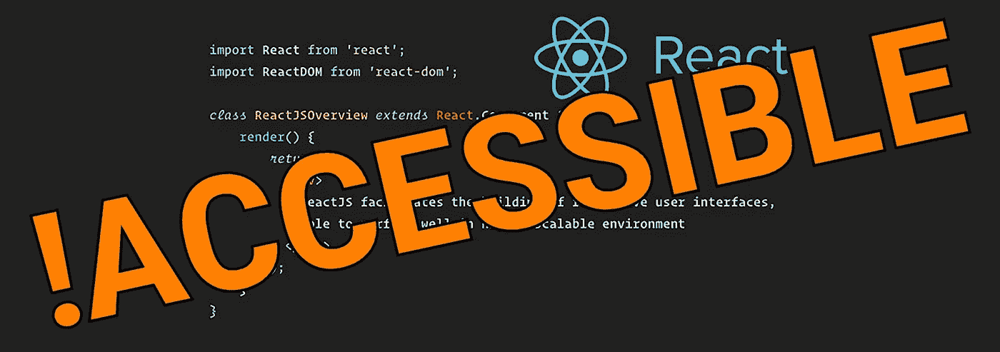

# React 及其同类产品不“可访问”

> 原文：<https://levelup.gitconnected.com/react-and-its-ilk-are-not-accessible-d46b46c34d37>



我经常感到不安的是，人们如何声称知道可访问性，然后声称不知何故，神奇地，这些基于客户端脚本的渲染系统满足可访问性的最低要求。

我已经做了 40 年的编程，做了 10 年的可访问性和效率顾问，让我告诉你一些事情。如果你的页面没有脚本化优雅的降级——一种很奇特的说法“如果 JavaScript 被阻止/不可用，你的页面仍然工作”——那么它不符合可访问性的最低要求。在 WCAG 的“可感知”部分下，这是一个失败，因为在这种情况下用户得不到任何内容！

我并不是说客户端脚本本身是错误的或者不好的。正如我之前写的，[高质量的 JavaScript 应该增强已经工作的页面](https://deathshadow.medium.com/accessibility-101-good-client-side-javascript-should-enhance-an-already-working-page-not-be-the-bf92741d2310)。这正是 React、Vue 等在轨道可访问性上的问题，因为它们不是以这种方式工作的。

如果你使用诸如 Electron 或 nw.js 之类的东西来制作全栈应用程序，这很好，因为你可以完全控制正在使用的 UA；更不用说 JavaScript 必须存在才能让这种技术工作。尽管如此，对于普通浏览器中普通网站的用户来说，这是一个巨大的中指。

正如我一位去世的好友曾经说过的:

> 关于谁会访问你的网站，我们唯一能确定的是，我们完全不知道谁会访问你的网站。

你不知道他们正在使用什么 UA，他们将启用/禁用什么，他们因为工作可以关闭什么，或者像 JavaScript 这样的东西是否与媒体目标相关。

以至于许多开发人员对优雅的退化不屑一顾——对 JavaScript 来说是*；对于 CSS 对于图像；甚至对 HTML 本身来说*——也是为什么这么多公司现在被拖进法律体系的主要原因。

对于网站建设来说，除了担心那些在有着各种花哨功能的图形显示器上视力良好的用户之外，还有更多事情要做。

# 但是 React 不输出 HTML 是什么意思？

不，不是的。令人不安的是，许多使用 React 并为其辩护的人似乎认为，仅仅因为 JSX**看起来**像 HTML，它就被神奇地创造成了 HTML。**不是！！！**

JSX——“JavaScript XML”是一种类似 XHTML 的格式，它在构建过程中对服务器端做出反应，编译成一堆“createElement”指令，直接将东西应用于 DOM，或者在它们的情况下，是毫无意义的浪费时间的“虚拟 DOM”废话。

我们可以在最简单的“Hello World”例子中看到这一点…事实上，这是他们自己的第一个例子！

他们有这样的标记:

```
<div id="root"></div>
```

然后这个脚本

```
ReactDOM.render(
  <h1>Hello, world!</h1>,
  document.getElementById('root')
);
```

人们认为因为它看起来像 HTML，所以它就是 HTML。不，不是的！！！如果你看客户端是不是把< h1 >中的标记当做标记？**不，不是的！！！**发送到客户端的是:

```
<div id="root"></div><script id="rendered-js">
ReactDOM.render( /*#__PURE__*/
  React.createElement("h1", null, "Hello, world!"),
  document.getElementById('root')
);
</script>
```

*为了代码清晰起见，我编辑了格式。*

H1 并不存在于标记中，而是由 JavaScript 在无用的“虚拟 DOM”上生成，并最终直接应用于动态 DOM。因此，它不符合可感知性的可访问性要求，并且对于大部分用户来说是没有用的——见鬼，它甚至不存在。数百万使用 noScript 浏览器插件的用户？所有人都用盲文阅读器吗？工作空间受限的人？你在叫他们都滚开！

因此，如果你认为 React 或任何其他 JavaScript 前端框架“生成 HTML ”,你对它是如何工作的了解还不够，不能为它辩护。它生成 DOM 元素，有区别！


框架更容易！！！它们让你更有效率！您需要他们来帮助协作！它使得其他开发人员可以快速上手！工作少了。确保你不会重复你自己！开销损失可以忽略不计！

# 所以不用？

我会说这取决于你用它做什么。我个人认为，对于不能正确处理 DOM 的人来说，这是一堆臃肿的垃圾。像所有其他前端框架一样，它声称的优势是赤裸裸的谎言。它不容易创建东西，它不会让你更有效率，它不会让这些东西更容易维护，它也不是真正的高性能！从基于“页面装载邪恶”的荒谬想法的 SPA 垃圾到移动不属于客户端的东西！

总的来说，所有这类无意义的“框架”垃圾都散发着邓宁-克鲁格的味道。使用这些系统的人对 HTML、CSS、JavaScript、用户代理或可访问性知之甚少，甚至没有意识到他们的工作越来越多，结果网站越来越糟糕；就像那些创建它们的人对这些主题了解不多，无法告诉其他人如何去做一样！

当然，有些情况下功能永远无法访问。谷歌地图就是一个惊人的例子。但是，即使在这样的极端情况下，这些框架通常也会导致一切变得臃肿、缓慢和难以处理。我永远也不会理解为什么编写两到十倍于所需的代码，这依赖于各种各样的额外步骤，需要大量的库，而对关注点的适当分离却莫名其妙地变得“更容易”,而不是“更好”或“更简单”。