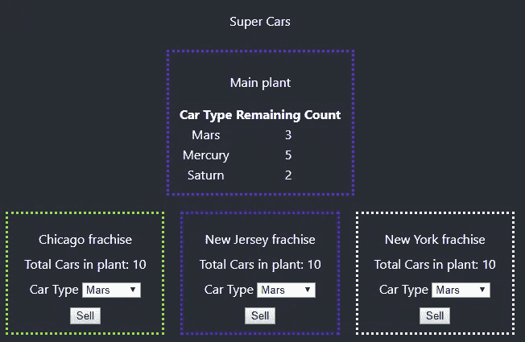
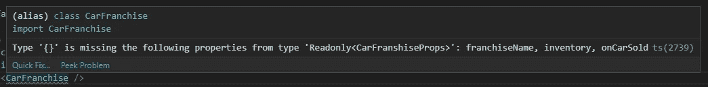
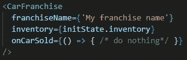

# 使用 Typescript 进行反应和还原

> 原文：<https://levelup.gitconnected.com/react-and-redux-with-typescript-42823d09eccc>

在本帖中，我们将使用 redux 创建一个 react 应用程序进行状态管理。最重要的是，我们将在 typescript 中完成这一切。您需要掌握一定程度的 ReactJS 和 Redux 方面的工作知识。即使你不知道，官方文档中的 [react](https://reactjs.org/docs/getting-started.html) 、 [redux](https://redux.js.org/introduction/getting-started) 、 [react-redux](https://react-redux.js.org/introduction/quick-start) 和 [typescript](http://www.typescriptlang.org/docs/home.html) 是一个很好的起点。我们走吧。


React + Typescript + Redux

Redux 为状态管理问题提供了一个很好的解决方案，react 在这方面做得很好。我们将把 typescript 应用到这个组合中，并得到一个强类型的 react-redux 应用程序。我们并不真的*需要* Typescript，但是它有很大的优势。代码维护大大增加，我们可以在开发过程中防止错误，我们可以更好地推理我们的应用程序，等等。

最初，让 redux 正常工作而不出错有点麻烦。我发现经常使用`[any](https://www.typescriptlang.org/docs/handbook/basic-types.html#any)`。在其他几个地方，我无法编译应用程序，因为我不能满足`connect` HOC 的需求。我查看了几个例子，包括[*typescript+react-redux*](https://redux.js.org/recipes/usage-with-typescript)食谱，这是一个很好的例子，但是我仍然遇到了问题。我终于找到了正确的地方，这就是我想通过这篇文章分享的。

*请注意，在示例应用程序中，我强调了 redux 部分，因此保留了 create-react 应用程序中的一些样式，并添加了一些不是最好的 CSS。*

我们的应用程序是一个假设的`Super Cars`工厂和特许经营管理系统。超级汽车工厂有 3 种类型的汽车——火星、水星和土星。特许经营在不同的地理位置。当一个经销商卖出一辆汽车时，该信息必须与工厂一起更新，然后传播回所有经销商。



我们假设的汽车特许经营管理系统

工厂列出所有类型的汽车和每种类型的剩余数量。当一个特许经销商选择一种汽车类型并点击*销售*时，主工厂中的计数必须减少，并且同样的计数传播回所有的特许经销商，保持主工厂作为*真相的唯一来源*。

让我们定义我们的 redux 商店的结构。我们创建一个具有一个属性的接口。它是一个`[Map](https://developer.mozilla.org/en-US/docs/Web/JavaScript/Reference/Global_Objects/Map)`结构，保存了`CarType`枚举和汽车数量。

现在我们创建一个默认状态，并在应用程序启动时将其传递给整个应用程序，

`configureStore`提供了我们的 reducer 的实现，它操作动作并返回修改后的状态而不改变状态(redux 101)。

是时候连接第一个组件到商店了— `carFranchise.tsx` **。在我们想象的应用程序中，这代表特定地理州的特许经营权。该部门的职责是:**

*   显示特许经营名称
*   显示工厂中汽车的总数
*   选择车型
*   把车卖了。一个按钮，点击它所选择的卡式被认为是出售

在整个设计过程中，我们不希望组件知道任何关于应用程序状态管理系统的信息。这保持了职责的明确性，并支持松散耦合。

我们给汽车特许经营组件的道具一个形状，以帮助它履行上面列出的职责。

*   特许权名称——显示特许权名称的道具
*   库存——提供库存总体细节的道具
*   oncarsald—汽车售出时调用的回调。

组件的其余部分处理使用道具和管理内部状态。

当我们使用这个组件时，我们需要提供所有的 3 个属性，否则编辑器(Visual Studio 代码)会抱怨，



错误错误无法前进！！

这确保了我们不会出错，并减少了许多细微的错误。如果我们指定了所有的属性，它会工作得很好。



没有更多错误:)

最初，我提到应用程序的真实来源是植物。从技术上讲，它是 redux 商店。现在让我们检查一些需求，

*   主工厂应该是库存信息的提供者，任何汽车特许经销商都应该得到这些信息。
*   特许经销商出售新车时，必须通知我们的工厂。
*   此外，同样的信息应该传递回所有的特许经营，使他们与主要信息同步。

输入`container component`，它将商店连接到实际的组件。

我们的目标是使用`carFranchise.tsx`组件，并将信息从 redux 存储传递给它。我们的容器组件是一种纯粹的连接器。它*将*给定的组件连接到存储，并负责处理这个任务的最基本的职责，在 typescript 中也是如此。只有容器组件知道 redux 存储，而不是底层组件。现在就来看看，详细分解一下。

ConnectedCarFranchise 组件

*   **mapStateToProps** :负责使用应用状态，并根据主组件的要求返回全部或部分道具。请注意，我们已经给了它形状。这是通过创建从函数`mapStateToProps`返回的类型`PropsFromStore` **，**来完成的。如果我们仔细观察，它有一个属性 **inventory，**与我们试图连接到 carFranchise.tsx 的商店`CarFranshiseProps`的主要组件所需的属性之一完全相同。
*   **mapDispatchToProps** :负责*在组件必须传达影响商店的信息的情况下，将信息从组件转发回商店*。这可以是更新存储、添加到存储或者从存储中删除，但是当然不要改变存储。类似于`mapStateToProps`的返回类型，我们将赋予 mapDispatchToProps 返回的类型以形状。`DispatchFromProps`即**。**您还会注意到，这个接口中的一个属性是`onCarSold`，它与 carFranchise.tsx 的`CarFranshiseProps`中的一个属性完全相同。
*   **connect():** 这是来自 redux 的 HOC，它帮助将我们的组件连接到 store。我们的目标也是对 HOC 进行强类型化，所以我们为通用的 connect()函数指定了类型。我们指定类型并传递所需的回调和要连接到存储的组件。我们自己有一个真正类型化的 redux 组件，随时可以使用。请注意，您可以查看`connect` HOC 的类型定义文件，以查看所有的方法签名，并清楚地了解所有可用的选项。

```
connect<PropsFromStore, DispatchFromProps, {}, RootState>(mapStateToProps, mapDispatchToProps)(CarFranchise);
```

但是最后道具`franchiseName`怎么了？我们故意忽略了这一点，因为我们希望在使用组件时提供该值。如果我们甚至希望从商店提供这个属性，我们可以改变这个行为。我们所要做的就是将该属性添加到接口`PropsFromStore`中，并确保在我们从`mapStateToProps`返回对象时提供该属性。

该组件现在可以使用了，

ConnectedCarFranchise 组件使用

我们必须为该组件提供的唯一道具是`franchiseName`，其余的将由商店提供。

应用程序中还有另一个组件，用于显示汽车类型及其数量的完整列表。这也是通过从存储中读取数据并使用与我们用于`carFranchise.tsx`完全相同的流程来完成的。

总结我们的实施情况，

*   我们已经创建了一个 react 应用程序，通过 redux 使用 typescript 进行互连。关注点被隔离，组件不知道应用程序的状态管理器。
*   自从我们使用 Typescript 以来，我们已经使它成为强类型。它不太容易出现运行时错误，因为我们可以在开发过程中捕捉到许多错误。提高代码的可读性。

redux 中有许多高级概念，用于管理复杂状态、规范化、选择器、动作创建器、异步操作以及其他一些有趣的方面，我强烈推荐您学习这些概念。我也在经历这个学习过程，每天都在发现有趣的事情。

我希望您在使用 typescript 的 react + redux 应用程序中享受到了*强类型化*的乐趣。该应用程序的完整源代码就在这里— [*汽车特许经营经理*](https://github.com/EmmanuelPonnudurai/CarFranchise)

编码快乐，感谢您的阅读。