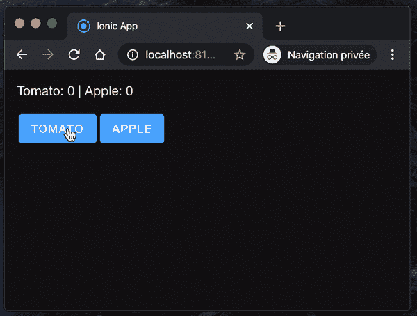
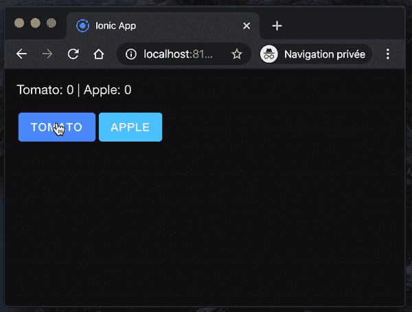

# React 和 Web 工作人员

> 原文：<https://levelup.gitconnected.com/react-and-web-workers-c9b60b4b6ae8>

## 如何在 React 应用程序中与 Web 工作者交互


托拜厄斯·图利乌斯在 [Unsplash](https://unsplash.com/s/photos/free?utm_source=unsplash&utm_medium=referral&utm_content=creditCopyText) 拍摄的照片

我每天分享[一个窍门](https://medium.com/@david.dalbusco/one-trick-a-day-d-34-469a0336a07e)直到(可能不是)2020 年 4 月 19 日新冠肺炎隔离期结束。离希望中的好日子还有 12 天。

我最近发布了[领带追踪器](https://tietracker.app.link)，这是一款简单、开源的免费时间追踪应用⏱。

在它的特性中，完全离线模式的开发尤其有趣。从架构的角度来看，我必须找到一个解决方案，在不阻塞用户界面的情况下，为了统计或导出的目的，计算用户可能记录的许多条目。

这就是为什么我想借助 [Web Workers API](https://developer.mozilla.org/en-US/docs/Web/API/Web_Workers_API/Using_web_workers) 来解决我的问题。

这个应用程序是用 [Ionic](https://ionicframework.com) + [React](https://reactjs.org) 开发的，所以让我跟你分享一下我的配方😉。

# 模拟阻塞的用户界面

在试用 Web Workers 之前，让我们首先尝试开发一个小应用程序，它包含一个实际上阻塞用户界面的动作。

在下面的组件中，我们处理两种状态，两个计数器。其中一个在每次按钮点击时递增，而另一个调用函数`incApple()`，该函数循环一段时间，因此阻止用户交互。

```
import {
    IonContent,
    IonPage,
    IonLabel,
    IonButton} from '@ionic/react';
import React, {useState} from 'react';
import {RouteComponentProps} from 'react-router';

import './Page.css';

const Page: React.FC<RouteComponentProps<{ name: string; }>> = ({match}) => {

    const [countTomato, setCountTomato] = useState<number>(0);
    const [countApple, setCountApple] = useState<number>(0);

    function incApple() {
        const start = Date.now();
        while (Date.now() < start + 5000) {
        }
        setCountApple(countApple + 1);
    }

    return (
        <IonPage>
            <IonContent className="ion-padding">
                <IonLabel>Tomato: {countTomato} | Apple: {countApple}</IonLabel>

                <div className="ion-padding-top">
                    <IonButton 
                     onClick={() => setCountTomato(countTomato + 1)}
                     color="primary">Tomato</IonButton>

                    <IonButton 
                     onClick={() => incApple()} 
                     color="secondary">Apple</IonButton>
                </div>
            </IonContent>
        </IonPage>
    );
};

export default Page;
```

正如您在下面的动画 Gif 中所注意到的，当我启动“苹果计数器”时，“番茄计数器”上的用户交互不再有任何效果，不会触发任何新的组件渲染，因为该函数当前正在阻塞 JavaScript 线程。



# 推迟网络工作者的工作

记住上面的例子，让我们尝试一下 Web Workers，以便推迟我们的“苹果计数器”功能。

## 网络工作者

将 Web Worker 添加到您的应用程序的最简单的方法是将其作为资产发布。在我的 Ionic React 应用程序中，这些在目录`public`中找到位置，这是我们创建的一个新文件`./public/workers/apple.js`。

在解释以下代码的流程之前，有两件事**需要注意:**

1.  应用程序和网络工作者是两回事。它们不共享状态，不共享库，它们是独立的，只能通过消息进行通信。
2.  网络工作者无法访问 GUI、`document`和`window`。

如果你熟悉 Firebase，在某种程度上，你可以把 Web Worker 理解为你自己的私有功能，不是云，而是本地功能。

我们的 web worker 的入口点是`onmessage`,它基本上是一个从我们的应用程序触发的调用监听器。在我们正在注册的函数中，我们检查是否提供了相应的`msg`，这让我们可以将 web worker 用于多种用途，并且在运行与之前相同的函数`incApple()`之前，我们还修改了当前的计数器值。最后，我们不是直接更新状态，而是通过一个`postMessage`将值返回给应用程序。

```
self.onmessage = async ($event) => {
    if ($event && $event.data && $event.data.msg === 'incApple') {
        const newCounter = incApple($event.data.countApple);
        self.postMessage(newCounter);
    }
};

function incApple(countApple) {
    const start = Date.now();
    while (Date.now() < start + 5000) {
    }
    return countApple + 1;
}
```

## 与网络工作者互动

为了与 web worker 交互，我们首先需要向组件添加一个引用点。

```
const appleWorker: Worker = new Worker('./workers/apple.js');
```

因为我们使用消息进行通信，所以我们应该注册一个侦听器，当 web worker 发出一个结果时，它会负责更新计数器状态。

```
useEffect(() => {
    appleWorker.onmessage = ($event: MessageEvent) => {
        if ($event && $event.data) {
            setCountApple($event.data);
        }
    };
}, [appleWorker]);
```

最后，我们更新函数`incApple()`来调用 web worker。

```
function incApple() {
    appleWorker
         .postMessage({msg: 'incApple', countApple: countApple});
}
```

Tada，就这样🎉。现在，即使“拦截器代码正在运行”，您也应该能够与 GUI 交互了。正如您在下面的动画 Gif 中所注意到的，即使阻塞循环是由 web worker 执行的，我仍然能够递增我的番茄计数器。



组件，以备不时之需:

```
import {
    IonContent,
    IonPage,
    IonLabel,
    IonButton
} from '@ionic/react';
import React, {useEffect, useState} from 'react';
import {RouteComponentProps} from 'react-router';

import './Page.css';

const Page: React.FC<RouteComponentProps<{ name: string; }>> = ({match}) => {

    const [countTomato, setCountTomato] = useState<number>(0);
    const [countApple, setCountApple] = useState<number>(0);

    const appleWorker: Worker = new Worker('./workers/apple.js');

    useEffect(() => {
        appleWorker.onmessage = ($event: MessageEvent) => {
            if ($event && $event.data) {
                setCountApple($event.data);
            }
        };
    }, [appleWorker]);

    function incApple() {
        appleWorker
            .postMessage({msg: 'incApple', countApple: countApple});
    }

    return (
        <IonPage>
            <IonContent className="ion-padding">
                <IonLabel>Tomato: {countTomato} | Apple: {countApple}</IonLabel>

                <div className="ion-padding-top">
                    <IonButton 
                     onClick={() => setCountTomato(countTomato + 1)}
                     color="primary">Tomato</IonButton>

                    <IonButton 
                     onClick={() => incApple()} 
                     color="secondary">Apple</IonButton>
                </div>
            </IonContent>
        </IonPage>
    );
};

export default Page;
```

# 摘要

Web Workers 确实是一个有趣的概念。让我试验一下，我肯定会在未来的项目中再次使用它们。它的代码是开源的，可以在 [GitHub](https://github.com/peterpeterparker/tietracker) 上获得。如果你有任何反馈，甚至更好，有兴趣作出贡献，给我你最好的拉请求，这将是真棒😎。

呆在家里，注意安全！

大卫