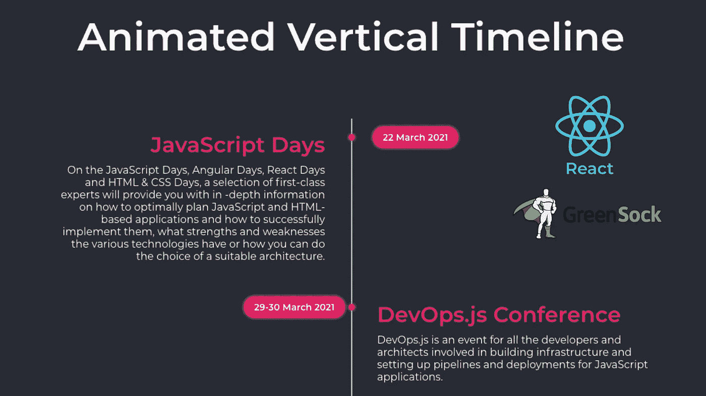
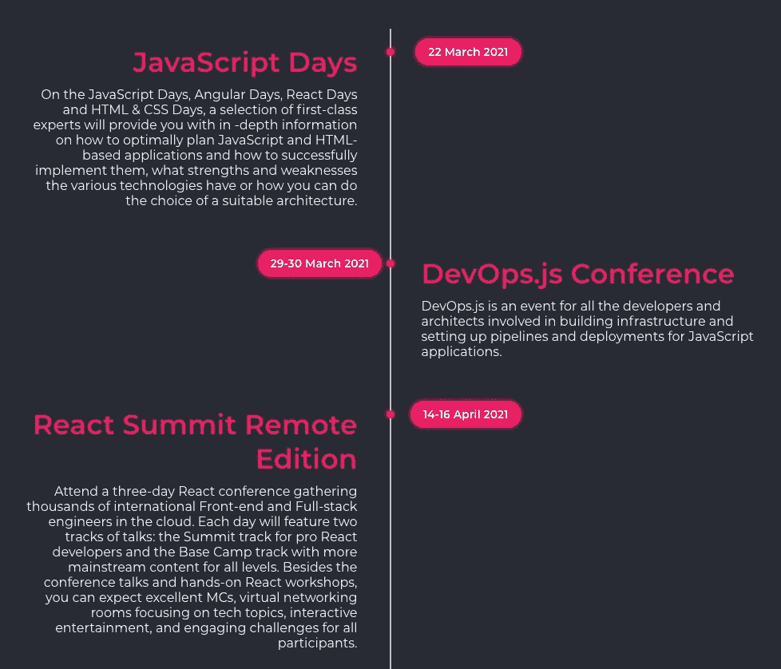

# 反应动画时间线

> 原文：<https://levelup.gitconnected.com/react-animated-timeline-c85ea6758a8f>

## 用 GreenSock 和 React 构建的动画垂直时间轴



在本文中，我们将为动画垂直时间轴构建一个 React 组件。这个想法是创建一个垂直的时间线，当用户上下滚动时，这个时间线的项目会产生动画效果。

为了实现这个想法，我们将使用工具`create-react-app`来创建 React 应用程序，并为我们提供构建时间轴原型所需的所有功能。

动画是用格林斯托克(GSAP)完成的，每个项目都有自己的子元素动画。



时间轴示例

时间线的每个元素将由以下三个元素组成:标题、描述和日期，每个元素都有自己的动画。

查看第一个元素上方的图像，日期从右边滑动，标题和描述从左边滑动，但是第二个元素的动画从相对的两边滑动，日期从左边，标题和描述从右边。

现在我们已经讨论了这个想法，让我们建立我们的项目，并开始创建时间表。

📝*如果你还没有安装 Node.js 可以从官网* [*下载*](https://nodejs.org/en/download/) *安装。*

# 项目设置

让我们从创建 React 应用程序开始，我们将在其中开发时间轴组件。

```
npx create-react-app [name_of_project_directory]
```

创建应用程序后，运行`npm start`，转到`http://localhost:3000`，检查您的应用程序是否启动并运行。

# 时间轴组件

现在我们已经准备好了应用程序，让我们创建`Timeline`组件。

首先，我们需要创建一个名为`Timeline.js`的文件，从一个空组件开始，为此，将下面的内容放入文件中。

```
const Timeline = () => {
  return 'Timeline component'
}
```

现在，将您的组件添加到`App.js`文件中，您应该能够在浏览器中看到字符串`Timeline component`

下一步是添加将呈现时间轴 HTML 结构的代码，但是首先，我们需要定义我们想要用来表示时间轴及其项目的数据结构。让我们使用一个简单的对象数组，如下例所示。

时间轴数据示例

现在我们知道了数据结构，我们可以添加代码来迭代数组并呈现时间轴 HTML。

时间轴组件 HTML 结构

此时，您可以在文件`App.js` t 中创建一个数组，并将其传递给`Timeline`组件来测试上面的代码。

```
<Timeline items={itemsArray} />
```

如果您返回浏览器，您应该看到一个简单的无序列表，其中包含您在数组中创建的项目。

📝*时间线的风格取决于你的品味，我从 Shanchit Sharma 在这个*[*codepen*](https://codepen.io/web_designer_sanchit/pen/eLjvyw)*中所做的惊人工作中获得了灵感。*

现在我们有了组件的结构，我们需要添加动画。

# 添加动画

为了制作时间轴的动画，我们将使用 GreenSock 和它的 ScrollTrigger 插件。

让我们从创建一个从起点到终点的动画函数开始。

动画功能

上面的函数接收动画元素和方向(根据用户滚动向上或向下)。它检查元素将从哪一侧开始被激活，并应用偏移量。设置坐标后，它使用函数`gsap.fromTo`在定义的坐标之间激活元素。这个功能足以让时间轴中的项目从左向右滑动到中央。

但是在我们调用这个函数之前，我们需要注册 ScrollTrigger 插件并传递要被动画化的元素。为此，一旦 HTML 被加载到浏览器中，我们将使用钩子`useEffect`来注册插件。

时间轴组件(useEffect)

这个函数将注册插件并搜索任何包含 CSS 类`.animate`的元素。每个元素将开始隐藏，并在事件`onEnter`(当向下滚动时滚动动作到达元素)和事件`onEnterBack`(当向上滚动时滚动动作经过元素)时触发功能`animateFromTo`。在事件`onLeave`中，元素将被隐藏，因为滚动动作已经将它留在后面，这样，它可以在下一次滚动动作触发其`onEnter`或`onEnterBack`事件时被激活。

这就是了，下面你可以找到`Timeline`组件的完整代码。

时间轴组件

有了上面的代码，你可以更进一步，尝试时间线 HTML 结构、样式和动画的新变体。

# 包扎

在尝试了上面的代码之后，这里有一些值得一提的地方:

*   格林斯托克(GSAP)是一个伟大的工具来建立动画/用户体验。这是非常好的记录，有广泛的例子和插件。
*   `create-react-app`是引导和原型化 React 应用程序或组件的伟大工具。

如果你有任何建议或贡献，欢迎在下面评论。编码快乐！