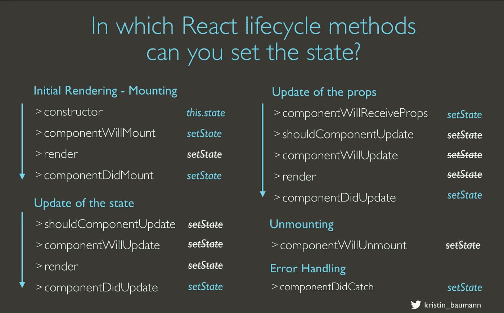

# React Cheatsheet — this.setState()

> 原文：<https://levelup.gitconnected.com/react-cheatsheet-this-setstate-8bc12c5f40f5>

## 选择正确的生命周期方法

> 这篇博文现在在我的个人博客上。

在中可以并且应该使用`**this.setState()**` 的只有这些 React 生命周期方法:`componentDidMount` *、* `componentDidUpdate` 和`componentWillReceiveProps`。也可以用`componentWillMount` 方法设置，但建议用`constructor`代替。

React 16 中新增，也可以在`componentDidCatch` *中设置。*

*2018 年 8 月更新*:以下生命周期方法被认为是遗留的，应该在新代码中避免:`componentWillMount`、`componentWillUpdate`和`componentWillReceiveProps.`在这里阅读更多关于遗留方法[的内容。](https://reactjs.org/docs/react-component.html#legacy-lifecycle-methods)

*React Cheatsheet —在正确的生命周期方法中使用 this.setState()*

这张幻灯片是我的 [React 工作坊](https://medium.com/@kristin_baumann/my-full-day-react-workshop-b30aa5199908)的一部分。

查看 [React 文档](https://facebook.github.io/react/docs/react-component.html)或[本文](/componentdidmakesense-react-lifecycle-explanation-393dcb19e459)以获得关于生命周期方法和`setState()`的更多信息。