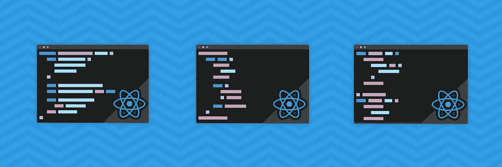
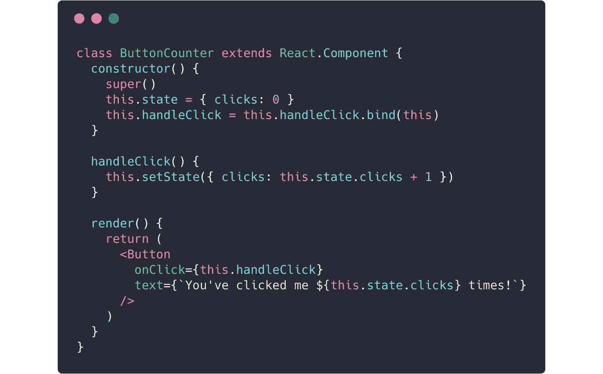
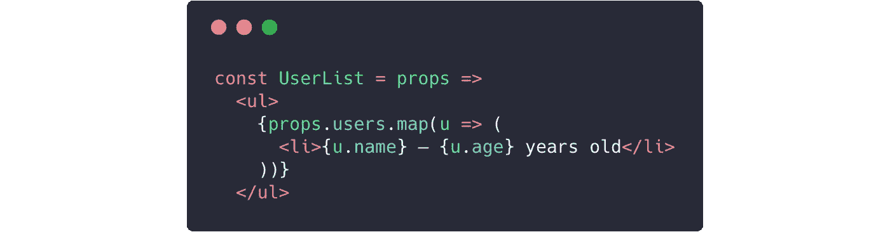
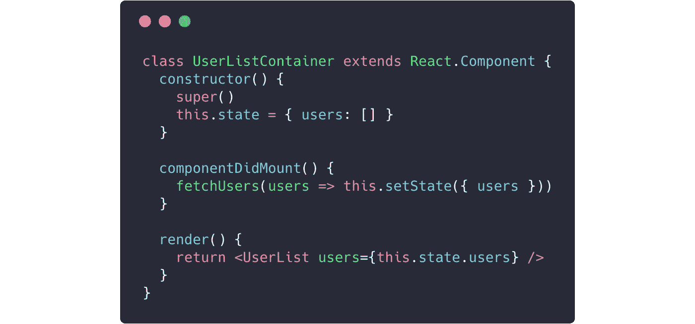
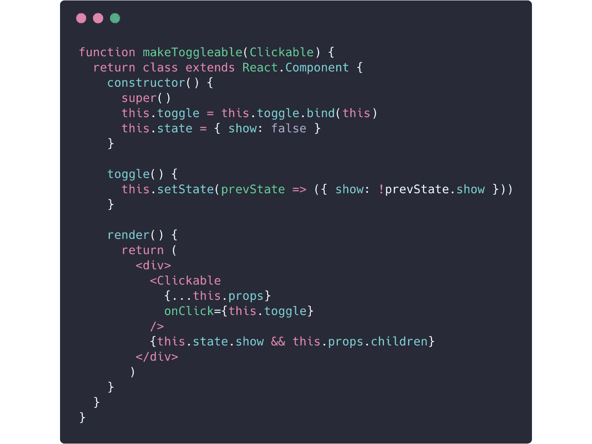
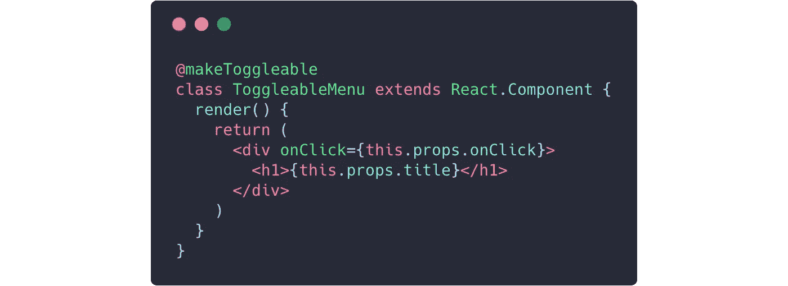
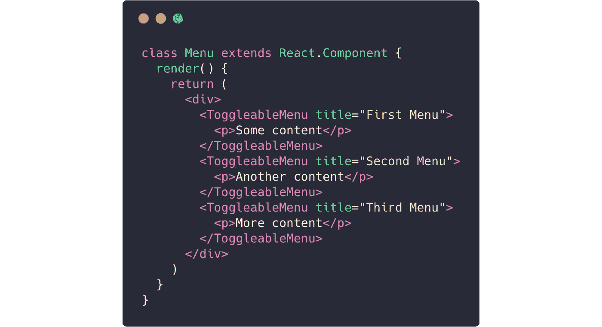
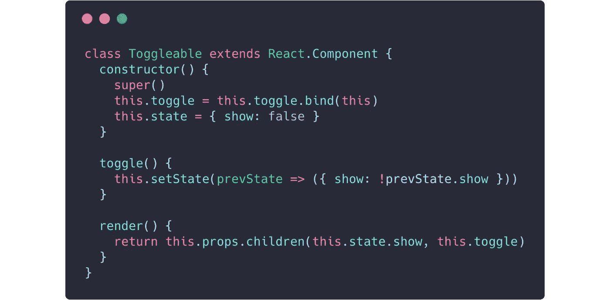
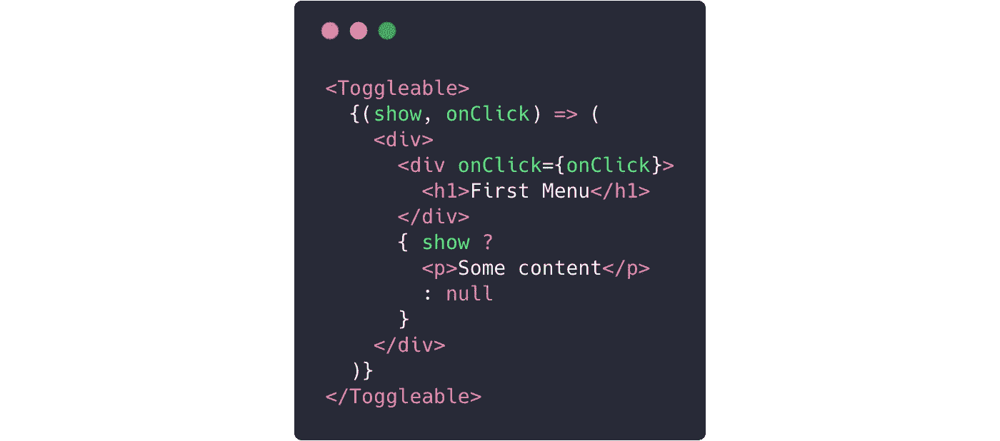
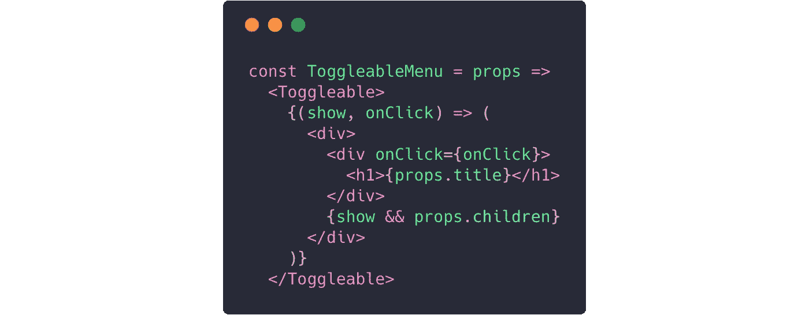

# 反应组件模式

> 原文：<https://levelup.gitconnected.com/react-component-patterns-ab1f09be2c82>

## 有状态 x 无状态，容器 x P **表示**，hoc，渲染回调等等

我已经有一段时间没有和 [**React**](https://facebook.github.io/react/) — *脸书的一个库一起使用 JavaScript —* 构建用户界面了，有几个概念我希望在我刚开始的时候就知道。本文试图总结我在迄今为止的经历中所学到的一些模式——对于即将进入这个基于组件的世界的开发人员来说可能也是有用的。

# 有状态 x 无状态组件

正如有状态和无状态的 web 服务一样，React 组件也可以在应用程序使用期间保持和操作状态(**有状态** ) —或者只是一个简单的组件，它接受输入属性并返回要显示的内容(**无状态**)。

一个简单的**无状态**按钮组件，仅依赖于道具:

要点: [stateless.js](https://gist.github.com/gmatheus/88966b08a45eba7575a721f7dccdd606#file-01-stateless-js)

和一个**有状态**计数器组件示例(使用`Button`组件):

要旨: [stateful.js](https://gist.github.com/gmatheus/88966b08a45eba7575a721f7dccdd606#file-02-stateful-js)

如您所见，最后一个构造函数持有一个组件状态，而第一个是一个简单的组件，通过 props 呈现文本。这种关注点的分离看起来很简单，但是使得`Button`组件高度可重用。

# 容器 x 表示组件

当处理外部数据时，我们可以将组件分成这两个新的类别。**容器**负责到达位于 React 范围之外的数据，比如连接到 *Redux* 或*Relay*——而**表示层**组件不依赖于应用程序的其余部分，只依赖于它自己的状态或收到的道具。让我们以一个用户列表作为**表示性**组件示例:

要点: [presentational.js](https://gist.github.com/gmatheus/88966b08a45eba7575a721f7dccdd606#file-03-presentational-js)

这个列表可以使用我们的**容器**组件进行更新:

要点: [container.js](https://gist.github.com/gmatheus/88966b08a45eba7575a721f7dccdd606#file-04-container-js)

这种方法将数据提取与渲染分开，并使`UserList` 可重用。如果你想进一步了解这种模式，丹·阿布拉莫夫有一篇很棒的文章对其进行了精确的解释。

# 高阶组件

当您想要重用一个组件逻辑时，高阶组件—或者仅仅是***hoc****—*是有用的。它们是 JavaScript 函数，将一个组件作为参数，并返回一个新组件。

假设您需要构建一个可扩展的菜单组件，当用户单击它时，它会显示一些子内容。因此，您可以简单地创建一个通用的 **HOC** 来处理它，而不是控制其父组件的状态:

要点: [hoc.js](https://gist.github.com/gmatheus/88966b08a45eba7575a721f7dccdd606#file-05-hoc-js)

这种方法允许我们使用 JavaScript *装饰器*语法将我们的逻辑应用到我们的`ToggleableMenu`组件:

要点: [hoc-usage.js](https://gist.github.com/gmatheus/88966b08a45eba7575a721f7dccdd606#file-06-hoc-usage-js)

现在我们可以把任何孩子传给`ToggleableMenu`组件:

要点: [hoc-menu.js](https://gist.github.com/gmatheus/88966b08a45eba7575a721f7dccdd606#file-07-hoc-menu-js)

如果你熟悉 [Redux 的](http://redux.js.org/) `connect`或 [React 路由器的](https://github.com/ReactTraining/react-router) `withRouter`功能，你已经在使用 **HOCs** ！

# 呈现回调

使组件逻辑可重用的另一个好方法是将你的组件子组件变成一个函数——这就是为什么**渲染回调**也被称为子组件的**函数。我们可以以可扩展菜单 **HOC** 为例，使用**渲染回调**模式重写它:**

要点: [render-callback.js](https://gist.github.com/gmatheus/88966b08a45eba7575a721f7dccdd606#file-08-render-callback-js)

现在我们可以传递一个函数作为我们的`Toggleable`组件的子组件:

要点: [render-callback-usage.js](https://gist.github.com/gmatheus/88966b08a45eba7575a721f7dccdd606#file-09-render-callback-usage-js)

上面的代码已经使用了一个函数作为子函数，但是，如果我们想像在我们的 **HOC** 示例(多个菜单)中一样重用它，我们可以简单地创建一个使用`Toggleable`逻辑的新组件:

gist:[render-callback-usage-reusable . js](https://gist.github.com/gmatheus/88966b08a45eba7575a721f7dccdd606#file-10-render-callback-usage-reusable-js)

我们全新的`ToggleableMenu`组件已经可以使用了:

要点:[render-callback-menu . js](https://gist.github.com/gmatheus/88966b08a45eba7575a721f7dccdd606#file-11-render-callback-menu-js)

我们的`Menu`组件看起来与我们的 **HOC** 示例完全一样！

当我们想要改变呈现的内容本身而不管**状态**操作时，这种方法非常有用:正如你所看到的，我们已经将**呈现**逻辑移到了我们的`ToggleableMenu`子函数中，但是将**状态**逻辑保留到了我们的`Toggleable` 组件中！

# 进一步阅读

上面的例子只是你可以在你的 **React** 代码中使用的一些模式的*基础*，如果你真的想更深入地了解这些主题，我建议你看一看这个伟大的东西:

*   [陈宸反应组分模式](https://www.youtube.com/watch?v=YaZg8wg39QQ)
*   [反应模式](https://github.com/chantastic/reactpatterns.com)
*   [外观和容器组件](https://medium.com/@dan_abramov/smart-and-dumb-components-7ca2f9a7c7d0)
*   [深度反应高阶组件](https://medium.com/@franleplant/react-higher-order-components-in-depth-cf9032ee6c3e)
*   [用作子组件](https://medium.com/merrickchristensen/function-as-child-components-5f3920a9ace9)
*   [重组](https://github.com/acdlite/recompose)
*   [降档](https://github.com/paypal/downshift)

 [## 学习 React -最佳 React 教程(2019) | gitconnected

### 前 45 名 React 教程。课程由开发人员提交并投票，使您能够找到最佳反应…

gitconnected.com](https://gitconnected.com/learn/react)