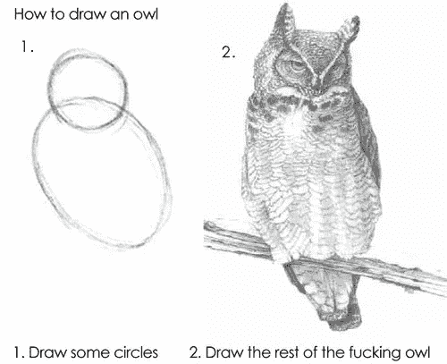
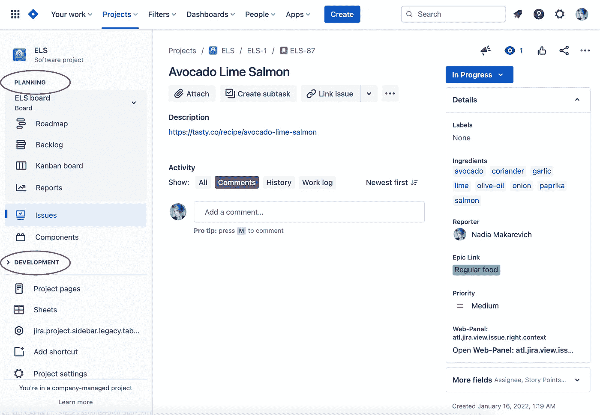

# React 组件组合:如何正确使用

> 原文：<https://levelup.gitconnected.com/react-components-composition-how-to-get-it-right-fb52ea06632a>


React 中最有趣和最具挑战性的事情之一是没有掌握一些高级的状态管理技术或如何正确使用上下文。更复杂的是，我们应该如何以及何时将代码分成独立的组件，以及如何正确地组合它们。我经常看到开发人员陷入两个陷阱:要么他们没有足够快地提取它们，并以同时做太多事情的巨大组件“巨石”而告终，这是维护的噩梦。或者，特别是在被之前的模式烧过几次之后，他们过早地提取组件，这导致了多个抽象的复杂组合、过度工程化的代码，并且再次成为维护的噩梦。

我今天想做的是提供一些技术和规则，可以帮助确定何时以及如何按时提取组件，以及如何不陷入过度工程化的陷阱。但是首先，让我们刷新一些基础知识:什么是合成，哪些合成模式对我们可用？

# 反应组分组成模式

## 简单组件

简单组件是 React 的基本构建块。他们可以接受道具，有一些状态，尽管他们的名字很复杂。接受`title`和`onClick`属性并呈现按钮标签的`Button`组件是一个简单组件。

```
*const Button = ({ title, onClick }) => <button onClick={onClick}>{title}</button>;*
```

任何组件都可以渲染其他组件——这就是组合。一个`Navigation`组件，呈现那个`Button`——也是一个简单的组件，组成其他组件:

```
*const Navigation = () => {
  return (
    <>
      // Rendering out Button component in Navigation component. Composition!
      <Button title="Create" onClick={onClickHandler} />
      ... // some other navigation code
    </>
  );
};*
```

有了这些组件和它们的组合，我们可以实现我们想要的复杂的 UI。从技术上来说，我们甚至不需要任何其他的模式和技术，所有这些都只是改善代码重用或解决特定用例的好方法。

## 容器组件

容器组件是一种更高级的组合技术。与简单组件的唯一区别是，它们允许传递特殊属性`children`，React 有自己的语法。如果我们上一个例子中的`Button`接受的不是`title`而是`children`，那么它将被写成这样:

```
*// the code is exactly the same! just replace "title" with "children"
const Button = ({ children, onClick }) => <button onClick={onClick}>{children}</button>;*
```

从`Button`的角度来看，这与`title`没有什么不同。不同之处在于消费者方面，`children`语法很特殊，看起来像普通的 HTML 标签:

```
*const Navigation = () => {
  return (
    <>
      <Button onClick={onClickHandler}>Create</Button>
      ... // some other navigation code
    </>
  );
};*
```

任何事情都可以进入`children`。例如，除了文本之外，我们可以在那里添加一个`Icon`组件，然后`Navigation`由`Button`和`Icon`组件组成:

```
*const Navigation = () => {
  return (
    <>
      <Button onClick={onClickHandler}>
        <!-- Icon component is rendered inside button, but button doesn't know -->
        <Icon />
        <span>Create</span>
      </Button>
      ...
      // some other navigation code
    </>
  )
}*
```

`Navigation`控制进入`children`的内容，从`Button`的角度来看，它只是呈现消费者想要的任何内容。

在本文中，我们将进一步研究这种技术的实际例子。

还有其他的组合模式，像[高阶组件](https://www.developerway.com/posts/higher-order-components-in-react-hooks-era)、[传递组件作为道具](https://www.developerway.com/posts/react-component-as-prop-the-right-way)或者[上下文](https://www.developerway.com/posts/how-to-write-performant-react-apps-with-context)，但是那些应该只用于非常特殊的用例。简单组件和容器组件是 React 开发的两大支柱，在尝试引入更高级的技术之前，最好先完善它们的使用。

现在，您已经了解了它们，您已经准备好实现尽可能复杂的 UI 了！

好吧，我是在开玩笑，我不会在这里写一篇“如何画猫头鹰”的文章😅



是时候制定一些规则和指导方针了，这样我们就可以轻松地构建复杂的 React 应用程序了。

# 什么时候是提取成分的好时机？

我喜欢遵循的核心 React 开发和分解规则是，我编写的代码越多，我对它们的感受就越强烈，它们是:

*   总是从顶部开始实施
*   仅在实际需要时提取组件
*   总是从“简单”的组件开始，只有在真正需要的时候才引入其他的组合技术

任何试图“提前”思考或从小的可重用组件开始“自下而上”的尝试总是以过于复杂的组件 API 或缺少一半必要功能的组件而告终。

当一个组件太大的时候，第一条规则是**。对我来说，一个组件的合适尺寸是它能完全适合我的笔记本电脑的屏幕。如果我需要滚动来通读组件的代码——这是一个很明显的信号，它太大了。**

让我们现在开始编码，看看这在实践中会是什么样子。我们今天将从头开始实现一个典型的吉拉页面，不多不少(嗯，算是吧，至少我们要开始了😅).


这是我个人项目的一个问题页面的屏幕，我把我最喜欢的在线食谱保存在这里🍣。如您所见，我们需要在其中实现:

*   带有徽标的顶部栏、一些菜单、“创建”按钮和一个搜索栏
*   左侧边栏显示项目名称、可折叠的“规划”和“开发”部分，其中包含项目(也分为多个组)，下方是未命名部分，其中包含菜单项
*   一个大的“页面内容”部分，显示当前问题的所有信息

因此，让我们开始在一个大组件中编写所有这些代码。它可能看起来像这样:

```
*export const JiraIssuePage = () => {
  return (
    <div className="app">
      <div className="top-bar">
        <div className="logo">logo</div>
        <ul className="main-menu">
          <li>
            <a href="#">Your work</a>
          </li>
          <li>
            <a href="#">Projects</a>
          </li>
          <li>
            <a href="#">Filters</a>
          </li>
          <li>
            <a href="#">Dashboards</a>
          </li>
          <li>
            <a href="#">People</a>
          </li>
          <li>
            <a href="#">Apps</a>
          </li>
        </ul>
        <button className="create-button">Create</button>
        more top bar items here like search bar and profile menu
      </div>
      <div className="main-content">
        <div className="sidebar">
          <div className="sidebar-header">ELS project</div>
          <div className="sidebar-section">
            <div className="sidebar-section-title">Planning</div>
            <button className="board-picker">ELS board</button>

            <ul className="section-menu">
              <li>
                <a href="#">Roadmap</a>
              </li>
              <li>
                <a href="#">Backlog</a>
              </li>
              <li>
                <a href="#">Kanban board</a>
              </li>
              <li>
                <a href="#">Reports</a>
              </li>
              <li>
                <a href="#">Roadmap</a>
              </li>
            </ul>

            <ul className="section-menu">
              <li>
                <a href="#">Issues</a>
              </li>
              <li>
                <a href="#">Components</a>
              </li>
            </ul>
          </div>
          <div className="sidebar-section">sidebar development section</div>
          other sections
        </div>
        <div className="page-content">... here there will be a lot of code for issue view</div>
      </div>
    </div>
  );
};*
```

现在，我甚至还没有实现其中一半的必要项，更不用说任何逻辑了，而且组件已经太大了，无法一目了然。在 [codesandbox](https://codesandbox.io/s/jira-page-one-big-component-twe6l8?file=/src/jira-issue-page.tsx) 中看到。那就好，意料之中！所以，在继续之前，是时候把它分成更容易管理的部分了。

我唯一需要做的就是创建一些新的组件，并将代码复制粘贴到其中。我还没有任何高级技术的用例，所以一切都将是一个简单的组件。

我将创建一个`Topbar`组件，它包含所有与顶栏相关的内容，`Sidebar`组件包含所有与边栏相关的内容，正如你所猜测的，还有一个`Issue`组件包含我们今天不打算涉及的主要部分。这样，我们的主要`JiraIssuePage`组件就剩下这段代码了:

```
*export const JiraIssuePage = () => {
  return (
    <div className="app">
      <Topbar />
      <div className="main-content">
        <Sidebar />
        <div className="page-content">
          <Issue />
        </div>
      </div>
    </div>
  );
};*
```

现在让我们来看看新的`Topbar`组件的实现:

```
*export const Topbar = () => {
  return (
    <div className="top-bar">
      <div className="logo">logo</div>
      <ul className="main-menu">
        <li>
          <a href="#">Your work</a>
        </li>
        <li>
          <a href="#">Projects</a>
        </li>
        <li>
          <a href="#">Filters</a>
        </li>
        <li>
          <a href="#">Dashboards</a>
        </li>
        <li>
          <a href="#">People</a>
        </li>
        <li>
          <a href="#">Apps</a>
        </li>
      </ul>
      <button className="create-button">Create</button>
      more top bar items here like search bar and profile menu
    </div>
  );
};*
```

如果我实现了所有的项目(搜索栏，所有的子菜单，右边的图标)，这个组件也会太大，所以它也需要被分割。这个案例可以说是一个比上一个更有趣的案例。因为，从技术上来说，我只要从中提取`MainMenu`组件，让它足够小就可以了。

```
*export const Topbar = () => {
  return (
    <div className="top-bar">
      <div className="logo">logo</div>
      <MainMenu />
      <button className="create-button">Create</button>
      more top bar items here like search bar and profile menu
    </div>
  );
};*
```

但是只提取`MainMenu`使得`Topbar`组件对我来说稍微*更难*阅读。之前看`Topbar`的时候，我可以把它描述为“实现顶栏中各种东西的组件”，只在需要的时候关注细节。现在的描述应该是“一个组件，它实现了顶栏中的各种东西，并组成了一些随机的`MainMenu`组件”。阅读流量毁了。

这让我想到了组件分解的第二条规则:当提取更小的组件时，不要半途而废。组件应该被描述为“实现各种东西的组件”或者“将各种组件组合在一起的组件”，而不是两者。

因此，`Topbar`组件的一个更好的实现应该是这样的:

```
*export const Topbar = () => {
  return (
    <div className="top-bar">
      <Logo />
      <MainMenu />
      <Create />
      more top bar components here like SearchBar and ProfileMenu
    </div>
  );
};*
```

现在读起来容易多了！

与`Sidebar`组件完全相同的故事——如果我实现了所有的项目，那么它就太大了，所以需要拆分它:

```
*export const Sidebar = () => {
  return (
    <div className="sidebar">
      <Header />
      <PlanningSection />
      <DevelopmentSection />
      other sidebar sections
    </div>
  );
};*
```

参见[code sandbox](https://codesandbox.io/s/jira-page-splitting-into-components-yje3qe?file=/src/jira-issue-page.tsx)中的完整示例。

然后每当组件变得太大时重复这些步骤。理论上，我们只需使用简单的组件就可以实现整个吉拉页面。

# 什么时候引入容器组件？

现在有趣的部分来了——让我们看看什么时候应该引入一些高级技术，以及为什么。从容器组件开始。

首先，我们再来看看设计。更具体地说，在侧边栏菜单的规划和发展部分。



这些不仅共享相同的标题设计，而且有相同的行为:点击标题折叠部分，在“折叠”模式下会出现小箭头图标。我们将它实现为两个不同的组件— `PlanningSection`和`DevelopmentSection`。当然，我可以在它们中实现“崩溃”逻辑，毕竟这只是一个简单的状态问题:

```
*const PlanningSection = () => {
  const [isCollapsed, setIsCollapsed] = useState(false);
  return (
    <div className="sidebar-section">
      <div onClick={() => setIsCollapsed(!isCollapsed)} className="sidebar-section-title">
        Planning
      </div>

      {!isCollapsed && <>...all the rest of the code</>}
    </div>
  );
};*
```

但是:

*   即使在这两个组件之间也有很多重复
*   这些部分的内容实际上对于每个项目类型或页面类型都是不同的，所以在不久的将来会有更多的重复

理想情况下，我想封装折叠/展开行为的逻辑和标题的设计，同时让不同的部分完全控制内部的项目。这是容器组件的完美用例。我可以将上面代码示例中的所有内容提取到一个组件中，并将菜单项作为`children`传递。我们将有一个`CollapsableSection`组件:

```
*const CollapsableSection = ({ children, title }) => {
  const [isCollapsed, setIsCollapsed] = useState(false);

  return (
    <div className="sidebar-section">
      <div className="sidebar-section-title" onClick={() => setIsCollapsed(!isCollapsed)}>
        {title}
      </div>

      {!isCollapsed && <>{children}</>}
    </div>
  );
};*
```

和`PlanningSection`(和`DevelopmentSection`和所有其他未来部分)将变成这样:

```
*const PlanningSection = () => {
  return (
    <CollapsableSection title="Planning">
      <button className="board-picker">ELS board</button>

      <ul className="section-menu">... all the menu items here</ul>
    </CollapsableSection>
  );
};*
```

我们的根`JiraIssuePage`组件将会有一个非常相似的故事。现在看起来是这样的:

```
*export const JiraIssuePage = () => {
  return (
    <div className="app">
      <Topbar />
      <div className="main-content">
        <Sidebar />
        <div className="page-content">
          <Issue />
        </div>
      </div>
    </div>
  );
};*
```

但是一旦我们开始实现可以从侧边栏访问的其他页面，我们会看到它们都遵循完全相同的模式——侧边栏和顶栏保持不变，只有“页面内容”区域发生了变化。感谢我们之前所做的分解工作，我们可以在每一个页面上复制粘贴该布局——毕竟没有那么多代码。但是由于它们都是完全相同的，所以最好只提取实现所有公共部分的代码，只留下对特定页面进行更改的组件。“容器”组件的又一个完美案例:

```
*const JiraPageLayout = ({ children }) => {
  return (
    <div className="app">
      <Topbar />
      <div className="main-content">
        <Sidebar />
        <div className="page-content">{children}</div>
      </div>
    </div>
  );
};*
```

我们的`JiraIssuePage`(以及未来的`JiraProjectPage`、`JiraComponentsPage`等等，所有未来的页面都可以从侧边栏访问)变成了这样:

```
*export const JiraIssuePage = () => {
  return (
    <JiraPageLayout>
      <Issue />
    </JiraPageLayout>
  );
};*
```

如果我想用一句话来总结这个规则，它可能是这样的:当需要共享一些视觉或行为逻辑来包装仍然需要在“消费者”控制下的元素时，提取容器组件。

## 容器组件—性能用例

容器组件的另一个非常重要的用例是提高组件的性能。从技术上来说，演奏与作曲的讨论有点跑题，但在这里不提它是一种犯罪。

在实际的吉拉中，侧边栏组件是可拖动的——你可以通过左右拖动它的边缘来调整它的大小。我们如何实现这样的东西呢？我们可能会引入一个`Handle`组件，侧边栏的`width`的一些状态，然后监听“mousemove”事件。一个基本的实现应该是这样的:

```
*export const Sidebar = () => {
  const [width, setWidth] = useState(240);
  const [startMoving, setStartMoving] = useState(false);
  const ref = useRef<HTMLDivElement>(null);

  useEffect(() => {
    if (!ref.current) return;
    const changeWidth = (e: MouseEvent) => {
      if (!startMoving) return;
      if (!ref.current) return;

      const left = ref.current.getBoundingClientRect().left;
      const wi = e.clientX - left;

      setWidth(wi);
    };

    ref.current.addEventListener('mousemove', changeWidth);

    return () => ref.current?.removeEventListener('mousemove', changeWidth);
  }, [startMoving, ref]);

  const onStartMoving = () => {
    setStartMoving(true);
  };

  const onEndMoving = () => {
    setStartMoving(false);
  };

  return (
    <div className="sidebar" ref={ref} onMouseLeave={onEndMoving} style={{ width: `${width}px` }}>
      <Handle onMouseDown={onStartMoving} onMouseUp={onEndMoving} />
      ... the rest of the code
    </div>
  );
};*
```

然而，这里有一个问题:每次我们移动鼠标都会触发状态更新，这又会触发整个`Sidebar`组件的重新呈现。虽然在我们基本的侧边栏上它并不明显，但当组件变得更加复杂时，它会使“拖动”明显滞后。容器组件是一个完美的解决方案:我们所需要的就是在容器组件中提取所有繁重的状态操作，并通过`children`传递其他的东西。

```
*const DraggableSidebar = ({ children }: { children: ReactNode }) => {
  // all the state management code as before

  return (
    <div
      className="sidebar"
      ref={ref}
      onMouseLeave={onEndMoving}
      style={{ width: `${width}px` }}
    >
      <Handle onMouseDown={onStartMoving} onMouseUp={onEndMoving} />
      <!-- children will not be affected by this component's re-renders -->
      {children}
    </div>
  );
};*
```

我们的`Sidebar`组件将变成这样:

```
*export const Sidebar = () => {
  return (
    <DraggableSidebar>
      <Header />
      <PlanningSection />
      <DevelopmentSection />
      other Sections
    </DraggableSidebar>
  );
};*
```

那样的话`DraggableSidebar`组件仍然会在每次状态改变时重新渲染，但是它会非常便宜，因为它只是一个 div。并且`children`中的所有内容都不会受到这个组件的状态更新的影响。

在[这个代码沙箱](https://codesandbox.io/s/jira-page-container-components-wrb88p?file=/src/components/sidebar.tsx)中查看容器组件的所有例子。为了比较糟糕的重新渲染用例，[请看这个 codesandbox](https://codesandbox.io/s/jira-page-container-components-with-bad-rerenders-6ipo1x?file=/src/components/sidebar.tsx) 。在这些例子中，拖动侧边栏时注意控制台输出— `PlanningSection`组件在“坏”实现中不断地记录日志，而在“好”实现中只记录一次。

> 如果你想更多地了解各种模式以及它们如何影响 react 性能，你可能会发现这些文章很有趣:[如何编写高性能 react 代码:规则、模式、注意事项](https://www.developerway.com/posts/how-to-write-performant-react-code)、[为什么自定义 React 挂钩会破坏你的应用程序性能](https://www.developerway.com/posts/why-custom-react-hooks-could-destroy-your-app-performance)、[如何根据上下文编写高性能 React 应用程序](https://www.developerway.com/posts/how-to-write-performant-react-apps-with-context)

# 这个状态属于这个组件吗？

除了大小之外，另一个可以表明组件应该被提取的因素是状态管理。确切地说，是与组件功能无关的状态管理。让我告诉你我的意思。

皇家吉拉工具条中的一个项目是“添加快捷方式”项目，当你点击它时会打开一个模态对话框。你将如何在我们的应用中实现它？模态对话框本身显然将成为它自己的组件，但是在哪里引入打开它的状态呢？类似这样的？

```
*const SomeSection = () => {
  const [showAddShortcuts, setShowAddShortcuts] = useState(false);

  return (
    <div className="sidebar-section">
      <ul className="section-menu">
        <li>
          <span onClick={() => setShowAddShortcuts(true)}>Add shortcuts</span>
        </li>
      </ul>
      {showAddShortcuts && <ModalDialog onClose={() => setShowAddShortcuts(false)} />}
    </div>
  );
};*
```

你可以在任何地方看到类似这样的事情，并且在这个实现中没有任何犯罪行为。但是如果我正在实现它，并且如果我想从组合的角度使这个组件变得完美，我会将这个状态和与之相关的组件提取出来。原因很简单——这个状态与`SomeSection`组件无关。此状态控制当您单击快捷方式项目时出现的模式对话框。这使得阅读这个组件对我来说有点困难——我看到一个组件是“section ”,下一行是一些与“section”无关的随机状态。因此，与上面的实现不同，我将把该项和实际属于该项的状态提取到它自己的组件中:

```
*const AddShortcutItem = () => {
  const [showAddShortcuts, setShowAddShortcuts] = useState(false);

  return (
    <>
      <span onClick={() => setShowAddShortcuts(true)}>Add shortcuts</span>
      {showAddShortcuts && <ModalDialog onClose={() => setShowAddShortcuts(false)} />}
    </>
  );
};*
```

此外，section 组件变得更加简单:

```
*const OtherSection = () => {
  return (
    <div className="sidebar-section">
      <ul className="section-menu">
        <li>
          <AddShortcutItem />
        </li>
      </ul>
    </div>
  );
};*
```

在[代码沙箱](https://codesandbox.io/s/jira-page-add-shortcuts-dialog-wb3iq8?file=/src/components/sidebar.tsx)中看到它。

按照同样的逻辑，在`Topbar`组件中，我将把控制菜单的未来状态移到`SomeDropdownMenu`组件，把所有与搜索相关的状态移到`Search`组件，把所有与打开“创建问题”对话框相关的东西移到`CreateIssue`组件。

# 什么是好的组件？

今天结束前最后一件事。在总结中我想写“在 React 中编写可伸缩应用的秘密是在正确的时间提取好的组件”。我们已经讨论了“正确的时间”，但是什么是“好的组件”呢？到现在为止，我们已经讨论了所有关于写作的内容，我想我已经准备好在这里写一个定义和一些规则了。

一个“好的组件”是一个我第一眼就能很容易读懂并理解它做什么的组件。

一个“好的组件”应该有一个好的自描述名称。`Sidebar`对于呈现侧栏的组件来说，这是一个好名字。`CreateIssue`对于处理问题创建的组件来说，这是一个好名字。`SidebarController`对于呈现特定于“问题”页面的侧栏项目的组件来说，这不是一个好名字(这个名字表明该组件具有某种通用目的，而不是特定于特定页面)。

一个“好的组件”不会做与其宣称的目的无关的事情。仅在顶栏中呈现项目并仅控制顶栏行为的组件是一个好组件。`Sidebar`控制各种模态对话框状态的组件不是最好的组件。

# 结尾项目符号

现在我可以写了😄！在 React 中编写可伸缩应用的秘密是在正确的时间提取好的组件，仅此而已。

**什么是好的组件？**

*   大小，这允许阅读它没有滚动
*   名称，这表明它做什么
*   没有无关的状态管理
*   易于阅读的实现

**什么时候应该将一个组件拆分成更小的组件？**

*   当组件太大时
*   当组件执行可能影响性能的繁重状态管理操作时
*   当组件管理不相关的状态时

**一般的组件构成规则是什么？**

*   总是从最顶层开始实施
*   仅当您有实际的用例时才提取组件，而不是提前提取
*   总是从简单的组件开始，仅在实际需要时引入高级技术，而不是提前引入

这就是今天的全部内容，希望你喜欢阅读，并发现它有用！下次见，✌🏼

*最初发表于*[*【https://www.developerway.com】*](https://www.developerway.com/)*。网站上有更多这样的文章*😉

[*订阅简讯*](https://www.developerway.com/) 、[*在 LinkedIn*](https://www.linkedin.com/in/adevnadia/) *或* [*上关注 Twitter*](https://twitter.com/adevnadia) *以便在下一篇文章出来时立即获得通知。*

# 分级编码

感谢您成为我们社区的一员！升级正在改变技术招聘。 [**在最好的公司**找到你最完美的工作](https://jobs.levelup.dev/talent) **，而不仅仅是你的*下一份工作*。**

[](https://jobs.levelup.dev/talent) [## 提升——改变招聘流程

### 🔥让软件工程师找到他们热爱的完美角色🧠寻找人才是最痛苦的部分…

作业. levelup.dev](https://jobs.levelup.dev/talent)