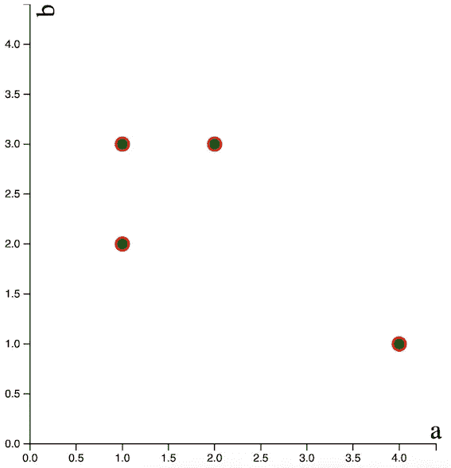

# D3 图表的反应组件

> 原文：<https://levelup.gitconnected.com/react-components-for-d3-charts-4912942a7e1d>


艾萨克·史密斯在 [Unsplash](https://unsplash.com?utm_source=medium&utm_medium=referral) 上拍摄的照片

D3.js 是在浏览器中制作交互式视觉效果的一个很好的工具。这也可能是一件非常棘手的事情。为了减轻这种痛苦并保持理智，我最近开始重构我以前用 D3 编写的一些图表——现在使用 React 功能组件。

# 将 D3 打包成可重用的组件

将 D3 和 React 结合起来的好处在于，您实际上将视觉效果捆绑到一个可调用的 HTML 样式的标签中。您可以传入参数以方便定制和更新，任何不能在服务器端进行的数据争论都可以在顶层进行。这里有一个简单的散点图，用 D3 写的:



基本散点图

我是这样画的:

```
import React, { useState, useEffect } from “react”;
import ScatterChart from “./ScatterChart”;export default function App(props) {
    const [data, setData] = useState([]);useEffect(() => {
        setData([{‘a’:1,’b’:2},
            {‘a’:4,’b’:1},
            {‘a’:2,’b’:3},
            {‘a’:1,’b’:3}])
    },[])if (!data) {
    return null
    }return (
        <div style={{height:’50%’,width:’50%’,marginTop:10,display:’inline-block’}}>
            <ScatterChart data={data} xVal={‘a’} yVal={‘b’}/>
        </div>
    )
}
```

多好的*啊*啊？将它放入一个 div 中，用于放置/调整大小，并将任何变量作为参数传入。不乱。太好了。

在这个例子中，我在 [useEffect()](https://reactjs.org/docs/hooks-reference.html) 钩子中硬编码了一个样本数据集。通常，我会从后端获取这些数据，并将其传递给散点图组件。如果我想要前端过滤器选项，那么我可以通过[状态](https://reactjs.org/docs/faq-state.html)处理数据变化。在第一次呈现组件之前，我们需要等待 setData 实际返回数据，因此如果数据为空，则返回 null。

# 编写 D3 图表组件

让我们来看看它是如何构造的。如果你想一起玩，你可以从你的终端使用 npx create-react-app 命令来生成一个游乐场环境。用“npm i d3”将 d3 添加到您的项目文件夹中，并将上述内容复制到您的“App.js”文件中。向“src”目录添加一个名为“ScatterChart.js”的新文件。

首先添加一些样板代码:

```
import * as d3 from ‘d3’;import React, { useRef, useEffect } from ‘react’;export default function ScatterChart(props) {
    const ref = useRef()
    const height = 460,
        width = 460
    return (
        <svg
            viewBox={“0 0 “ + height + “ “ + width}
            ref={ref}
        />
    )
}
```

这里，我们已经定义并导出了我们的功能组件散点图，并定义了一些初始参数(高度、宽度和 ref)。 [useRef()](https://reactjs.org/docs/hooks-reference.html) React 钩子在我们的 D3 代码和我们返回的渲染 SVG 之间提供了一个引用。后面的代码片段将按顺序放在已定义的参数和 return 语句之间。

我们需要获取我们的 svg 引用并设置一些初始参数。为此，添加一个 useEffect 挂钩。

```
useEffect(() => {
    const svgElement = d3.select(ref.current)
                         .append(“g”)
                         .classed(“svgElement”, true)
                         .attr(“height”, height)
                         .attr(“width”, width)
 },[])
```

如果我们的数据从来没有改变，图表的其余部分可以从同一个钩子中画出。我喜欢给自己一个选项，能够更新/过滤数据集，而不必重写我的组件，因此我使用第二个 useEffect 挂钩来绘制我的图表的其余部分。我需要获取我在前一个钩子中引用的元素，然后再设置几个参数。请注意，我们现在引用了我们的道具。

```
useEffect(() => {
    const svgElement = d3.select(ref.current).select(“g.svgElement”)
    var margin = { top: 10, right: 10, bottom: 10, left: 30 };
    var xValMax = d3.max(props.data,function(d){return     (d[props.xVal])})*1.1
    var yValMax = d3.max(props.data,function(d){return (d[props.yVal])})*1.1
},[props.data])
```

从父组件(在本例中为“App”，如 App.js 中所定义的)传递给我们的组件的任何参数都可以通过“props.parameterName”来访问。道具的使用使得 React 组件在存储 D3 视觉效果时非常方便。首先，我可以传递我的数据。这意味着父组件可以获取、修改数据集并将其分发给多个子组件。其次，我可能想要更改的任何属性都可以设置为变量，并通过从父级传入参数来更改。在这个例子中，我只使用了 xVal 和 yVal(分别在 x 轴和 y 轴上测量的属性)。我也可以传入文本颜色，圆圈颜色，大小等等…我们稍后会讲到。

接下来，我想定义我的轴。

```
//define x axis
var xScale = d3.scaleLinear()
               .domain([0,scatterDomMax])
               .range([margin.left, 400]);var xAxis = svgElement.append(“g”)
                      .call(d3.axisBottom(xScale))
                      .attr(“class”,”x-axis”)
                      .attr(“transform”, “translate(0,”+(400)+“)”);
//x label
svgElement.append(“text”)
          .attr(“class”,”scatterLabels”)
          .style(“text-anchor”, “end”)
          .attr(“x”, 405)
          .attr(“y”, 395)
          .style(“font-size”,”24px”)
          .style(“fill”,”black”)
          .text(props.xVal);//define y axis
var yScale = d3.scaleLinear()
               .domain([0,scatterDomMax])
               .range([400,0])var yAxis = svgElement.append(“g”)
                      .call(d3.axisLeft(yScale))
                      .attr(“class”,”y-axis”)
              .attr(“transform”,“translate(“+ margin.left +“, 0)”)
//y label
svgElement.append(“text”)
          .attr(“class”,”scatterLabels”)
          .attr(“transform”, “rotate(-90)”)
          .attr(“y”, margin.right + 18)
          .attr(“dy”, “1em”)
          .style(“text-anchor”, “end”)
          .style(“font-size”,”24px”)
          .style(“fill”,”black”)
          .text(props.yVal);
```

最后，我们到了有趣的部分；更新周期。使用 [d3.join()](https://observablehq.com/@d3/selection-join) 我们可以相对容易地处理数据的变化。

```
svgElement.selectAll(“circle”)
          .data(props.data, d => d)
          .join(enter => (
              enter.append(“circle”)
         .attr(“cx”, function (d) { return xScale(d[props.xVal]); })
         .attr(“cy”, function (d) { return yScale(d[props.yVal]); })
         .attr(“r”, function(d) {return 6})
         .attr(“class”,”circles”)
         .style(“stroke”, “red”)
         .style(“stroke-width”, “2px”)
         .style(“fill”, “green”)
          .call(enter => (
              enter.transition().duration(800)
            ))
        ),
        update => (
            update
            .call(update => (
            update.transition().duration(800)
            ))
        ),
        exit => (
            exit
            .call(exit => {
            exit.transition().duration(400)
            .style(“opacity”,0)
            .remove()
            })
        )
    )
```

这里，我们抓取任何附加到 svg 元素的圆圈(第一次传递时将为 0 ),并附加从父元素传递下来的数据。enter 函数将为数据集中的每个点在 svg 中添加一个圆，在调用平滑过渡之前添加一些样式(可以参数化)，平滑过渡将在网页加载时播放。如果添加了数据点，它们将通过相同的 enter 函数传递。更新的数据点通过 update 函数转换，而不再存在的数据点通过 exit 函数传递，并转换出视图。

# 用参数替换道具

我们最初的散点图函数接受了*道具*参数，这允许我们通过*道具传递任意数量的参数。参数名称。*问题是，我希望能够在不改变组件代码的情况下改变样式。我需要定义默认参数，这样我就可以*可选地*在从‘app . js’调用这个组件时使用我的样式。

做到这一点很简单——我们用我们希望能够更改的任何参数的默认值替换 *props* ,并简单地将这些变量传递给组件中的相关点。下面是一个我们传递默认高度/宽度参数的例子:

```
export default function ScatterChart({
                                 height = 460,
                                 width = 460
                                 })
    return (
        <svg
            viewBox={"0 0 " + height + " " + width}
            ref={ref}
        />
    )
}
```

现在，如果我们从' App.js '调用<scatterchart>，那么高度和宽度将默认为 460。例如，如果我们调用<scatterchart height="500" width="500">，那么高度和宽度将分别设置为 500。这非常适合搭配不同的颜色/风格。</scatterchart></scatterchart>

现在你知道了。将来我会在网站和我的 git 账户上发布新的 D3 组件。所以如果你感兴趣的话，请留意这些。

在那之前—