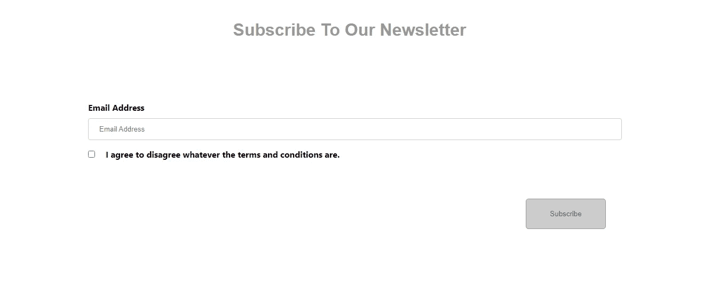
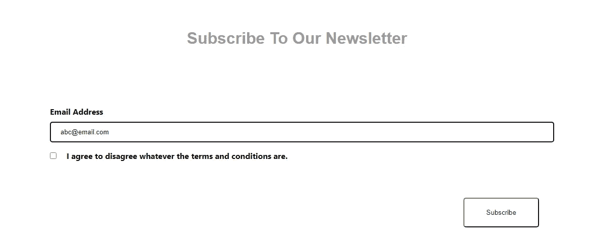
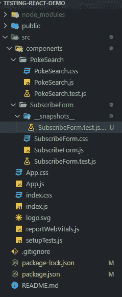

# 用 React 测试库和 Jest 测试 React 组件

> 原文：<https://levelup.gitconnected.com/react-components-testing-with-react-testing-library-and-jest-5c13135ede8f>


照片由[阿诺德·弗朗西斯卡](https://unsplash.com/@clark_fransa?utm_source=medium&utm_medium=referral)在 [Unsplash](https://unsplash.com?utm_source=medium&utm_medium=referral) 拍摄

在我们的上一篇文章中，我们已经介绍了 Jest 的用法来测试我们的 JavaScript 代码[用 Jest](https://medium.com/gitconnected/start-testing-your-javascript-code-with-jest-81e04f546a3e) 开始测试您的 JavaScript 代码。我们将进一步扩展这个主题，介绍我们如何使用 React 测试库和 Jest 来测试我们的 React 组件。

React 测试库和 Jest 通过`create-react-app`提供了开箱即用的支持，我们不需要单独安装它们。React 测试库(RTL)构建在 DOM 测试库之上，因为测试将使用实际的 DOM。这允许测试尽可能模拟用户与 DOM 交互的方式。它非常容易使用，提供了一系列断言方法(从 Jest 扩展而来)，用户事件模拟等等。

`create-react-app`使用 Jest 作为它的测试运行程序。Jest 将查找使用以下命名约定命名的测试文件(根据官方网站):

*   带有的文件。__tests__ 文件夹中的 js 后缀。
*   带有. test.js 后缀的文件。
*   后缀为. spec.js 的文件。

今天，我们将探讨如何呈现要测试的组件，在组件中找到正确的元素，并执行快照测试。让我们开始创建一个新的`create-react-app`项目:

```
npx create-react-app testing-react-demo
```

创建完成后，将目录更改为您创建的应用程序，并在您想要的代码编辑器中打开该目录。

您应该已经在 *src* 文件夹中看到了 *App.test.js* 。

你可以删除这个文件，或者留下它。在本次演示中，我将删除它，因此您不会看到它包含在测试套件中。

接下来我通常会创建一个*组件*文件夹，并将属于该组件的文件(如 CSS 和测试文件)包含在该文件夹中。创建*组件*文件夹后，再创建两个名为 *SubscribeForm* 和 *PokeSearch* 的文件夹。这是我们今天要写一些测试的两个组件。

让我们在 SubscribeForm 文件夹中创建第一个简单组件:

*订阅表单. js*

这是一个简单的组件，其中我们有一个电子邮件地址的输入字段，以及一个点击“订阅”的按钮。该按钮首先被禁用，并在任何文本输入到输入字段之前阻止单击。这个按钮似乎是我们可以创建的完美测试用例之一。

该按钮在文本输入前被禁用:



该按钮在文本输入后启用:



紧接着就是这个，我们要创建另一个组件，叫做 PokeSearch(我不是口袋妖怪的粉丝，但是 Poke API 很好演示)。作为另一个足够简单的例子，我们有一个组件，它有一个 useEffect 钩子来从 API 获取信息，并在屏幕上显示它(Pokemon name)。在获取结果之前，我们向用户显示一个“…正在加载…”的文本。

*PokeSearch.js*

让我们开始测试这两个组件。对于我们的第一个组件 SubscribeForm 组件，我们创建了一个名为 *SubscribeForm.test.js* 的新文件。我们遵循了命名约定，以便我们的测试运行人员能够识别它。为了创建测试，我们将需要来自*测试库/反应*的`render`和`screen`以及来自*测试库/用户事件*的用户事件。此外，记得导入我们想要测试的组件。

```
import React from 'react';
import { render, screen } from '@testing-library/react';
import userEvent from '@testing-library/user-event';
import SubscribeForm from './SubscribeForm';
```

我们可以首先创建一个测试来确保我们的按钮在页面第一次加载时被禁用，因为在电子邮件地址字段中没有输入。

```
it("The subscribe button is disabled before typing anything in the input text box", () => {
    render(<SubscribeForm />);

    expect(screen.getByRole("button", {name: /subscribe/i})).toBeDisabled();
});
```

从上一篇文章中，我们知道我们将为我们的测试命名，并提供一个回调函数，其中包括断言。

首先，我们使用 render 方法在附加到 document.body 的容器中呈现要测试的组件(顺便说一下，Jest 26 和之前的版本使用 jsdom 作为默认环境)。在呈现出组件之后，我们需要找到正确的元素(即按钮)来进行测试。我们可以使用 RTL 的查询方法来做到这一点。DOM 中的元素可以通过它们的可访问性角色和名称(稍后将详细介绍)、文本或者我们给元素的测试 id 来找到。官方声明给予了优先权。他们建议通过角色或文本(每个人都可以访问)、语义 HTML(替代文本，如 img、area 等)和测试 id(用户看不到或听不到这些，因此如果您无法理解前面的任何方法，请使用这些方法)进行查询。

```
<div data-testid="test-element" />
```

```
screen.getByTestId('test-element')
```

你可以在这里找到更多关于优先级的信息:
[关于 React 测试库的查询](https://testing-library.com/docs/queries/about#priority)

您可以这样做来找出您的组件中的可访问角色:您可以在该组件的测试中编写`screen.getByRole("")`,它会失败，但会给您可访问性信息和那些元素的名称。

```
Here are the accessible roles:

      heading:

      Name "Subscribe To Our Newsletter":
      <h1 />

      --------------------------------------------------
      textbox:

      Name "Email Address":
      <input
        id="email"
        name="email"
        placeholder="Email Address"
        type="email"
        value=""
      />

      --------------------------------------------------
      checkbox:

      Name "I agree to disagree whatever the terms and conditions are.":
      <input
        id="agreement_checkbox"
        name="agreement_checkbox"
        type="checkbox"
      />

      --------------------------------------------------
      button:

      Name "Subscribe":
      <button
        class="button"
        disabled=""
        name="subscribe-button"
        type="submit"
      />

      --------------------------------------------------
```

从这里我们知道我们有不同的可访问性角色，比如按钮、文本框、复选框和标题。为了定位我们的订阅按钮，我们需要定位角色“按钮”。在定位角色之后，我们特别想要具有可访问名称“Subscribe”的按钮，如所提供的可访问性信息中所述(名称“Subscribe”)。“名称”的这个值可以从一个元素的可见或不可见属性中导出，按钮中的文本就是其中之一。为了搜索它的名字，我们通常把名字上不区分大小写的 regex，放到 getByRole ( `{name: /subscribe/i}`)的第二个对象参数中。得到那个按钮后，我们要检查这个按钮是否被禁用(应该是禁用的)。

然后我们有第二个测试。在这个测试中，我们模拟用户事件，在文本框中输入内容，并启用按钮。

```
it("The subscribe button becomes enabled when we start typing in the input text box", () => {
    render(<SubscribeForm />);

    userEvent.type(screen.getByRole("textbox", {name: /email/i}), "abc@email.com");

    expect(screen.getByRole("button", {name: /subscribe/i})).toBeEnabled();
});
```

我们使用相同的步骤将 SubscribeForm 呈现给文档，并使用“type”的用户事件在我们想要的元素上键入一些文本，在本例中，它是 textbox，我们可以通过可访问的角色和名称来选择它(回头参考我们刚才获取的可访问性信息)。第二个参数`userEvent.type()`是您想要输入的文本。输入文本后，我们现在可以期待按钮被激活。

最后，我们正在对 React 组件进行快照测试。我们需要使用 react-test-renderer 为快照渲染一个纯 JavaScript 对象(不依赖于 DOM)。

```
npm install react-test-renderer
```

安装并导入后，我们可以使用渲染器在 JavaScript 对象中创建 SubscribeForm 组件。最后，我们使用 Jest 中的 toMatchSnapshot()函数来启动快照测试。

```
it("Test to match snapshot of component", () => {
    const subscribeFormTree = renderer.create(<SubscribeForm />).toJSON();
    expect(subscribeFormTree).toMatchSnapshot();
})
```

当您第一次运行这个测试时，它将创建一个新的文件夹(在您运行测试后自动创建)，在您的目录中称为*_ _ 快照 __* ，在本例中，是 SubscribeForm 文件夹。

```
PASS  src/components/PokeSearch/PokeSearch.test.js
 PASS  src/components/SubscribeForm/SubscribeForm.test.js
 › 1 snapshot written.

Snapshot Summary
 › 1 snapshot written from 1 test suite.

Test Suites: 2 passed, 2 total
Tests:       5 passed, 5 total
Snapshots:   1 written, 1 total
Time:        2.519 s
Ran all test suites.

Watch Usage: Press w to show more.
```



你可以在里面找到一个快照文档。

*subscribe form . test . js . snap*

既然测试套件注意到了您之前的组件快照。如果您再次运行测试，它将获取组件的另一个快照，并将其与*_ _ snapshot _ _*文件夹中的快照进行比较。如果它们不同，测试将会失败。这有助于确保我们的 UI 组件不会被意外更改。让我们尝试对我们的 SubscribeForm 组件进行更改，并再次运行测试。我们将把“订阅我们的时事通讯”改为“订阅他们的时事通讯”。

```
<h1>Subscribe To Their Newsletter</h1>
```

然后我们再次进行测试。

```
PASS  src/components/PokeSearch/PokeSearch.test.js
 FAIL  src/components/SubscribeForm/SubscribeForm.test.js
  ● Test to match snapshot of component expect(received).toMatchSnapshot() Snapshot name: `Test to match snapshot of component 1` - Snapshot  - 1
    + Received  + 1 @@ -1,10 +1,10 @@
      <div
        className="container"
      >
        <h1>
    -     Subscribe To Our Newsletter
    +     Subscribe To Their Newsletter
        </h1>
        <form
          className="form"
        >
          <label 22 | it("Test to match snapshot of component", () => {
      23 |     const subscribeFormTree = renderer.create(<SubscribeForm />).toJSON();
    > 24 |     expect(subscribeFormTree).toMatchSnapshot();
         |                               ^
      25 | }) at Object.<anonymous> (src/components/SubscribeForm/SubscribeForm.test.js:24:31) › 1 snapshot failed.
Snapshot Summary
 › 1 snapshot failed from 1 test suite. Inspect your code changes or press `u` to update them.Test Suites: 1 failed, 1 passed, 2 total
Tests:       1 failed, 4 passed, 5 total
Snapshots:   1 failed, 1 total
Time:        3.817 s
Ran all test suites.Watch Usage: Press w to show more.
```

…测试失败了。如果这是有意的更改，我们可以通过按“u”将快照更新到最新状态。通过这样做，我们的*_ _ snapshot _ _*文件夹中的快照文件将得到更新，所有的测试都将重新运行，并且这一次它们都通过了。这和我们上次用的(酶库)挺像的。

```
PASS  src/components/PokeSearch/PokeSearch.test.js
 PASS  src/components/SubscribeForm/SubscribeForm.test.js
 › 1 snapshot updated.Snapshot Summary
 › 1 snapshot updated from 1 test suite.Test Suites: 2 passed, 2 total
Tests:       5 passed, 5 total
Snapshots:   1 updated, 1 total
Time:        2.504 s
Ran all test suites.Watch Usage: Press w to show more.
```

因此，这是测试我们的 SubscribeForm 组件的完整脚本。

注意:在每次测试之后，Jest(全局注入)会自动执行一个清理过程(`afterEach(cleanup)`)来防止内存泄漏。

最后，我们还想异步测试我们的组件(PokeSearch)。

```
import React from 'react';
import { render,screen,waitForElementToBeRemoved } from '@testing-library/react';
import PokeSearch from './PokeSearch';

it("Loading is shown until the Pokemon is fetched", async () => {
    render(<PokeSearch />);

    expect(screen.getByText('...Loading...')).toBeInTheDocument();

    await waitForElementToBeRemoved(screen.queryByText('...Loading...'));
});
```

首先，我们可以测试“...正在加载..."文本被正确地呈现到屏幕上。我们需要查询包含“的正确元素...正在加载..."，并使用断言方法检查它是否在 DOM 中。然后，我们可以使用 RTL 提供的异步函数，通过加载文本元素来解决，以便在获取结果后消失。除此之外，官方网站还推荐使用`queryBy...`来查询从 DOM 中消失的元素。

在测试了加载的文本之后，我们可以在获取之后测试用例。在这个测试案例中，我们不想用真正的 API 进行测试(我们只是确保我们的组件工作正常)，我们可以模拟 fetch 函数。当承诺被解析时，我们通过 fetch 函数修复返回的数据。之后，我们将呈现 PokeSearch，fetch 调用用于获取我们的假数据。数据返回后，我们将尝试使用`findBy...`(异步情况下使用`findBy...`)来查找包含文本“bulbasaur”的元素，并检查该元素是否在 DOM 中。

```
it("The Pokemon name is displayed correctly after it has been fetched", async () => {
    // Mock the browser fetch function
    window.fetch = jest.fn(() => {
        const pokemon = { name: 'bulbasaur', weight: 69, height: 7 };

        return Promise.resolve({
          json: () => Promise.resolve(pokemon),
        });
    });
    render(<PokeSearch />);
    const pokemonName = await screen.findByText('bulbasaur');
    expect(pokemonName).toBeInTheDocument(); 
});
```

希望这能让您了解如何开始测试 React 组件。