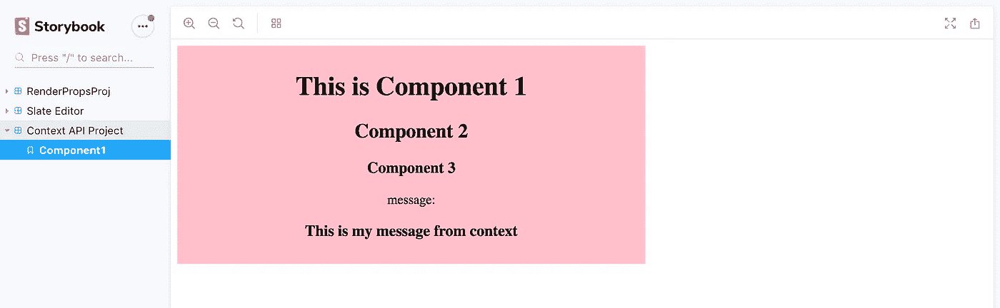

# React 上下文 API 作为状态管理库的替代

> 原文：<https://levelup.gitconnected.com/react-context-api-as-an-alternative-to-state-management-libraries-cd061e3f70a2>


照片由[基里尔·彼得罗巴甫洛夫](https://unsplash.com/@kirill23?utm_source=medium&utm_medium=referral)在 [Unsplash](https://unsplash.com?utm_source=medium&utm_medium=referral) 拍摄

过去，我通常使用 MobX 或 Redux 之类的库来管理我的应用程序的状态，并在整个应用程序中公开我希望全局访问的值。它使我不必通过 props 传递东西，还将重用的数据和动作与简单的组件级逻辑隔离开来。React 的新上下文 API 为这些较小的用例引入了一个简单的解决方案。仍然有 Redux 和 MobX 是正确答案的实例，但是很多时候使用 React 的上下文 API 可以完成工作。

在这篇文章中，我将对上下文做一个基本的介绍，并快速演示如何用值初始化上下文，然后在我的应用程序中的其他地方访问这些值。

我在我的故事书游乐场中构建这个，这样我就不会启动一个全新的应用程序。你可以在我之前的一篇博文中读到我是如何构建这个环境的:

[](https://medium.freecodecamp.org/how-to-build-a-react-development-playground-using-storybook-667ef9808e9f) [## 如何使用 Storybook 构建 React 开发平台

### 最近，我一直想尝试新事物，在我的 React 组件中测试新技术或模式，并且…

medium.freecodecamp.org](https://medium.freecodecamp.org/how-to-build-a-react-development-playground-using-storybook-667ef9808e9f) 

# React 的上下文 API 是什么？

> 上下文提供了一种通过组件树传递数据的方式，而不必在每一层手动向下传递属性。— [React JS 文档](https://reactjs.org/docs/context.html)

当您拥有许多组件想要使用的全局数据时，例如主题属性、用户数据等，这是非常有益的。

使用上下文有三个主要步骤:

1.  创建您的上下文
2.  将它提供给你的应用
3.  在嵌套组件中使用它

现在，让我们构建一个在嵌套组件中呈现消息的简单应用程序。

随着我们的深入，这将更有意义，但是作为一个概述:在这个例子中，我将渲染`Component1`，它将渲染`Component2`，它将渲染`Component3`。`Component1`是为应用程序提供上下文的地方，而`Component3`是使用上下文的地方。

# 步骤 1:创建您的上下文

首先，您必须为您的上下文定义默认值。这仅在您试图在提供者之外消费您的上下文的情况下使用。为了简化，我的默认值也将是我的初始值，这在下一步中更有意义。但是现在，在下面的代码中你可以看到一个已定义的`initialValue`对象。这个对象负责保存上下文的键值对。在这种情况下，只是一个字符串消息。

```
const initialValue = {  message: "This is my message from context"}export const MyContext = React.createContext(initialValue)
```

# 步骤 2:将这个值提供给你的应用程序

接下来，我们需要让我们的应用程序知道这个值是什么，在这种情况下，我们将为它提供上面定义的`initialValue`。您可以通过包装组件来实现这一点，该组件包含您希望访问这些信息的应用程序部分。例如，如果您有一些只有您的`navBar`需要知道的用户数据，您可以只将`navBar`包装在特定于用户数据的上下文中。

在这个例子中，我们想用包含我的初始值的`Provider`包装一个顶级组件(`Component1`)。为此，我实现了以下内容:

```
export const Component1 = () => (  
  <MyContext.Provider value={initialValue}>
    <HomeWrapper>      
      <h1>This is Component 1</h1>
      <Component2 />    
    </HomeWrapper>  
  </MyContext.Provider>
)
```

# 第三步:消费你的上下文的价值

最后一步是在`Provider`的子组件中消费应用程序的价值。这是通过用您的上下文的消费者包装消费子组件来实现的，可以通过导入您的上下文并像`<MyContext.Consumer></MyContext.Consumer>`一样呈现它的消费者来访问它。

一旦你在`Consumer`中，我将使用渲染道具模式来访问我的上下文的值。我也可以析构值，只引入我需要的值对象的键。

有关实际实现，请参见下面的代码。

```
import { MyContext } from './Component1'

const Component3 = () => (
  <MyContext.Consumer>
    {({message}) => <>
      <h3>Component 3</h3>
      message: <h3>{message}</h3>
    </>}
  </MyContext.Consumer>
)
```

如果你想了解更多关于渲染道具的知识，可以看看我关于这个主题的博文。链接在文末。

太神奇了！现在，让我们看看这一点的实际应用，看看我们是否将我们的信息价值转化为`Component3`。我们可以通过使用 Storybook 为`Component1`创建一个故事来测试这一点，并查看它是否在嵌套的`Component3`中呈现上下文值。我的故事是这样写的:

```
import React from 'react'
import { storiesOf } from '@storybook/react'
import { Component1 } from './Component1'storiesOf('Context API Project', module)
  .add('Component1', () => <Component1 />)
```

然后应该会输出类似下面的截图:



耶！我们现在看到在`MyContext`的`initialValue`中定义的消息在`Component3`中呈现。成功！

现在，想象一下这方面的所有用例，以及为什么它是有用的…遵循单一责任原则，我们已经提取出这些信息的存储，并让上下文来管理它，而组件只需要担心消费它和显示它。这为我们的组件提供了更大的可重用性，因为我可以更改上下文，然后它可以显示不同的消息。

在创建主题上下文的情况下，您可以将多个主题作为一组字体、颜色等的值。针对各种品牌或外观。然后，为了更改组件的显示，您需要将提供程序中的值更改为不同的主题。因为嵌套组件都只依赖于上下文值，没有什么是硬编码的，也不需要重新定义。

为了进一步澄清，我在下面包括了该项目的完整代码:

资源:

[](https://reactjs.org/docs/context.html) [## 上下文反应

### 上下文提供了一种通过组件树传递数据的方法，而不必每次都手动传递属性

reactjs.org](https://reactjs.org/docs/context.html) [](https://medium.freecodecamp.org/how-to-build-a-react-development-playground-using-storybook-667ef9808e9f) [## 如何使用 Storybook 构建 React 开发平台

### 最近，我一直想尝试新事物，在我的 React 组件中测试新技术或模式，并且…

medium.freecodecamp.org](https://medium.freecodecamp.org/how-to-build-a-react-development-playground-using-storybook-667ef9808e9f) [](/improve-code-reusability-with-reacts-render-prop-pattern-1928beaee1a4) [## 使用 React 渲染模式提高代码的可重用性

### 如果您是一名 React 开发人员，并且每天都在使用新的和/或以前构建的组件，您很可能…

levelup.gitconnected.com](/improve-code-reusability-with-reacts-render-prop-pattern-1928beaee1a4)