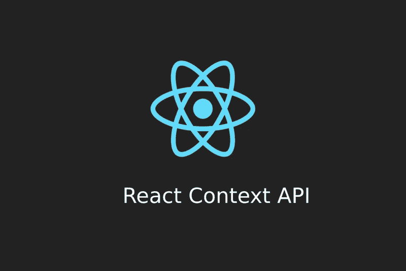
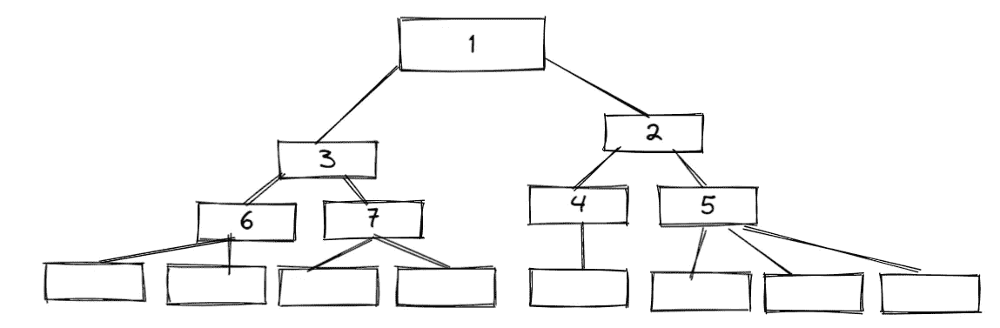
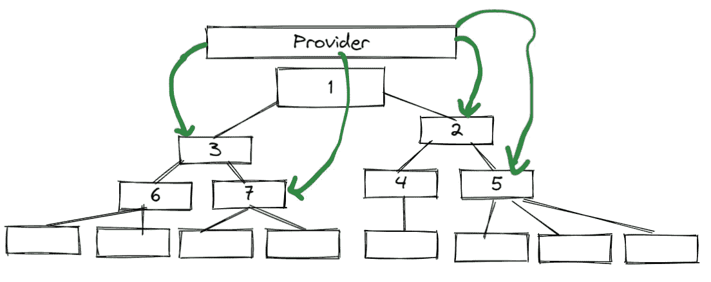

# 逐步反应上下文 API

> 原文：<https://levelup.gitconnected.com/react-context-api-step-by-step-f1ee25d90c55>

## 用一个示例应用程序在 5 分钟内学会



我练习过的学习 redux、states 或 framework 等概念的最好方法之一就是边做边学。不是简单的盲目跟着一个教程走。首先，浏览文档或几个视频(但我首先建议在浏览视频之前阅读文档，因为即使是创建视频教程的人也要浏览文档并学习)。然后你可以用学习和逆向工程的概念建造一些东西，并学习它是如何真正工作的。

> 如果你愿意支持我成为一名作家，考虑报名参加[成为](https://freelancingcult.medium.com/membership)的媒体成员。这样我就可以花更多的时间来分享知识。每月只需 5 美元，你就可以无限制地使用 Medium。

> “所以先阅读官方文档，然后通过构建和逆向工程来学习”

[](https://reactjs.org/docs/context.html) [## 上下文反应

### 上下文提供了一种通过组件树传递数据的方法，而不必每次都手动传递属性

reactjs.org](https://reactjs.org/docs/context.html) 

## 为什么我们需要上下文 API

React 主要处理组件和状态。React 应用程序中有父组件和子组件。组件的父子关系创建了一个组件树。



反应组件树

我们可以很容易地通过 props 从上到下发送组件状态。例如，组件 1 中的状态可以很容易地发送到底部的组件。

使用 props 可以很容易地将组件 3 中的状态发送到组件 6 和 7。同样，组件 2 中的状态可以很容易地传递给组件 4 和 5。

但是，如果组件 6 中的一个状态需要发送到组件 4，该怎么办呢？我们必须将状态值从 6 提升到 1，并使用 props 将状态传递到 4。如果我们想要共享组件 6 和 7 之间的状态呢。这是一个耗时且乏味的过程，称为支柱钻孔。

Propdrilling 使您的应用程序更加复杂，更难调试。因此，一般来说，React 开发人员不会进行适当的训练。

Context API 是针对这种在组件之间传递属性的繁琐过程的解决方案。上下文 API 可以通过提供者-消费者对在组件之间传递数据，而不必传递 props。使用上下文 API，任何组件都可以轻松访问状态。提供者可以充当屋顶，因此屋顶下任何组件都可以使用它。



使用提供程序

还有其他方法，比如使用 Redux，但是 Context API 对于中小型应用来说更简单。使用像`useReducer`这样的钩子，我们可以摆脱像 redux 这样的第三方库。

## 上下文 API 入门

要开始使用上下文 API，您必须首先创建一个上下文。然后你可以把它提供给其他组件，然后使用它。

将上下文 API 添加到您的应用程序时，主要的 3 种方法如下。

**1。使用 createContext 创建上下文。**

**2。使用创建的上下文包装 React 组件。**

**3。使用** `**useContext**` **在组件内部消费创建的上下文。**

首先，让我们构建一个带有解释的示例项目，并通过我们构建的项目了解一下概念。

最终代码

[](https://replit.com/join/eguvurbvdk-lahirutech) [## 邀请在 Replit 上合作

### 使用 Replit 多人游戏一起编码

replit.com](https://replit.com/join/eguvurbvdk-lahirutech) 

最初的项目将是一个非常简单的项目，您将在浏览器中呈现一个任务列表。

开始使用这个样板文件

[](https://replit.com/join/kbfmxjnoju-lahirutech) [## 邀请在 Replit 上合作

### 使用 Replit 多人游戏一起编码

replit.com](https://replit.com/join/kbfmxjnoju-lahirutech) 

或者在您的本地机器上创建一个新的 React 应用程序

```
npx create-react-app context-app
```

首先，让我们创建我们的`TaskList`组件。在 src 中创建一个名为 components 的文件夹，并添加这个文件`Tasklist.js`

# 创造环境

之后，让我们创建我们的上下文。在 src 文件夹中创建一个名为`contexts`的文件夹，并添加下面的文件`TaskContext.js`

你可以看到我们已经从 React 导入了`createContext`和`useState`钩子。

使用`createContext`钩子启动一个名为`TaskContext` 的上下文

```
export const TaskContext = createContext();
```

我们已经创建了一个名为`TaskContextProvider`的功能组件。在里面，我们使用`useState` 钩子定义了我们的状态。

```
const [tasks, taskList] = useState(
  [
   { title: 'Task 01', priority: 'Medium', id: 1 },        
   { title: 'Task 02', priority: 'Medium', id: 2 },   
  ]
)
```

[](/learn-react-usestate-hook-a09ccf955537) [## 学习反应使用状态挂钩

### 有例子和练习

levelup.gitconnected.com](/learn-react-usestate-hook-a09ccf955537) 

## 添加提供程序

在创建的上下文中，我们必须添加上下文提供者。

我们在`TaskContextProvider`组件的返回语句中添加了`TaskContext.Provider`。

```
<TaskContext.Provider value={{ tasks }}>            
  {props.children}     
 </TaskContext.Provider>
```

`TaskContext.Provider`有一个名为 value 的属性，在这里我们可以发送在`TaskContextProvider`组件中定义的所有变量和函数(属性)。这里我们已经发送了`Task`变量。在本文的后面，你会清楚地知道组件的每个部分是如何工作的。

## 使相关组件可以访问上下文。

为了利用创建的上下文，我们必须用上下文包装我们的组件。让我们在`App.js`文件中完成它。

我们已经在 app.js 文件中导入了`TaskContextProvider`,并包装了 TaskList 组件，如上所示。这使得从`TaskList`组件访问上下文值成为可能。

## 在组件中使用上下文。

接下来是在组件内部使用创建的上下文。

为了使用组件内部的上下文，我们必须导入`useContext` 钩子。下面是我们如何在`TaskList` 组件中使用`TaskContext`。

你可以看到我们已经进口了`useContext`挂钩。通过将创建的上下文作为参数发送给`useContext`，我们已经成功访问了`TaskContext.`的属性

```
const { tasks } = useContext(TaskContext)
```

我们使用了在`TaskList` 组件的`TaskContext` 中声明的任务列表

如果应用程序中的其他组件也需要使用`Task`状态，你必须用`TaskContextProvider`包装该组件并跨其使用。

这就是如何使用上下文 API 跨组件创建和使用状态。

> 我希望你喜欢读这篇文章。如果你愿意支持我作为一个作家和我花在分享知识上的时间，考虑注册[成为一个媒体成员](https://freelancingcult.medium.com/membership)。每月只需 5 美元，你就可以无限制地使用 Medium。