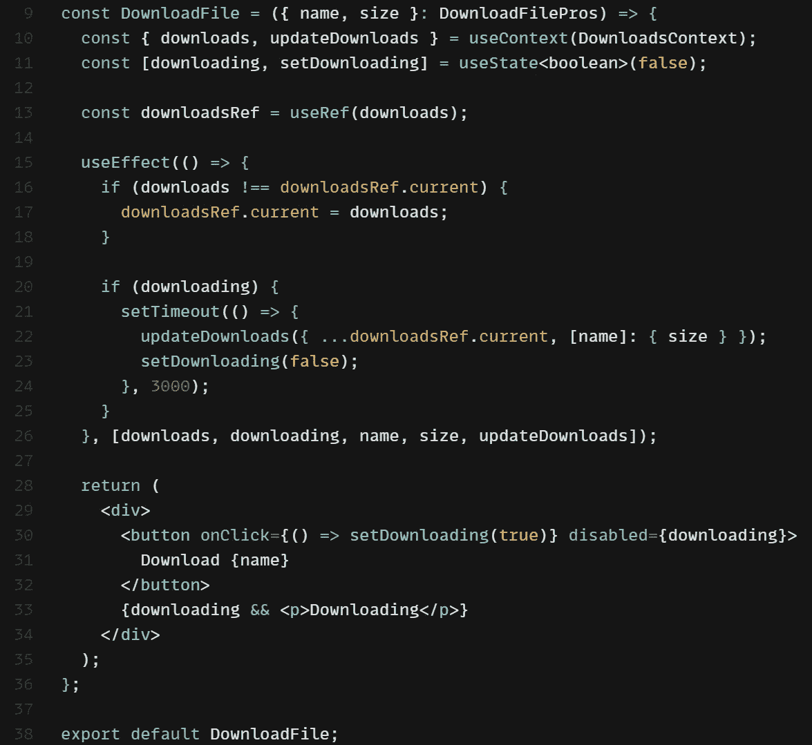

# React 上下文陷阱:如何避免

> 原文：<https://levelup.gitconnected.com/react-context-pitfall-how-to-avoid-it-47f8c205d139>

最近，我正在编写一段代码，遇到了一个有趣的问题。

**问题:** *当从一个冗长的操作内部更新* `*context*` *时，如果两个更新同时发生，先前的值可能被覆盖。*

为了重现这个问题，我在这个沙箱中编写了一个简单的应用程序，模拟文件下载并将其放入上下文中，这是在一个带有`setTimeout`的`useEffect`中发生的。

# 动作错误

如果两个文件的下载按顺序进行，则没有问题:

连续下载工作没有问题

但是，如果第二次文件下载在第一次下载完成之前开始，第一个文件将被删除:

同时下载会导致第一个文件被删除

# 有问题的代码

在这里，我将简要概述导致这个问题的代码。整个问题代码可以在[这个沙箱](https://codesandbox.io/s/context-issues-problem-code-76nsph?file=/src/DownloadPage.tsx)中找到。

`DownloadsContext.tsx`:

DownloadsContext.tsx

上下文提供者在`App.tsx`中是这样定义的:

App.tsx

`DownloadPage.tsx`文件本质上是 2 个`DownloadFile.tsx`组件的包装器，显示所有下载的文件名，所以我在这里省略了。

`DownloadFile.tsx`组件看起来像这样:

DownloadFile.tsx

这里我使用了一个`useEffect`块和一个`setTimeout`块来模拟一个下载文件的异步调用。这只是我想到的一个演示问题的例子，它可以是更新上下文的任何冗长的任务。

# 问题是

这段代码的问题是，当第二个文件“下载”在第一个文件“下载”启动之后启动，但在第一个文件完成下载之前，传递给`updateDownloads`的`downloads`对象已经过期。

单击“下载文件 1”按钮时，上下文为空，单击“下载文件 2”按钮时也是如此。即使“文件 2”是在“文件 1”之后下载的，组件仍然“认为”上下文是空的，因为从上下文中检索的“downloads”变量的值来自先前的渲染。

# 解决方案:useRef

使用`ref`值有一个简单的解决方案，如下所示:

DownloadFile.tsx 中的解决方案

我们可以在第 13 行初始化一个`downloadRef`变量来包含`downloads`值。然后我们可以在第 17 行的`useEffect`中更新它(但是只有当`downloads`的值改变时)。

这样，我们可以使用上下文的最新值，而不是过时的旧值。当第 22 行调用`updateDownloads`时，我们使用上下文中`downloads`变量的最新值，而不是组件第一次呈现时的值。这个解决方案的全部代码在[这个沙箱](https://codesandbox.io/s/context-issues-solution-code-jswod1?file=/src/DownloadFile.tsx)里。

现在，当两个文件同时下载并从`useEffect`放入上下文时，它按预期工作:

使用 ref 修复了这个错误，当同时下载时，两个文件都被持久化

# 解决方案:用函数设置状态

另一种方法是将`setState`定义为前一状态的函数，就像`setState(prev => fn(prev))`一样。这更好，因为它不需要我们在一个`ref`中存储一个`download`变量的副本，但是它需要更多的修改。整个代码都在这个沙箱里。

我们可以在`DownloadsContext.tsx`中将上下文改成这样:

已更改 DownloadsContext.tsx 中的上下文

这里我更改了函数类型和名称以避免混淆。

`App.tsx`也必须相应地改变，因为它包含上下文提供者:

App.tsx

这里对`setDownloads`的调用是通过前一状态的函数完成的。这确保了每当调用`addDownload`时，之前的值不会被删除。

以下是更新后的`DownloadFile.tsx`组件:

DownloadFile.tsx

# 比较

第二种方法更好，因为它消除了对`ref`的需求，T16 最终只保存所需数据的副本。

然而，在实践中，将所有现有代码改造成这种格式可能非常耗时，因此第一种方法可能更适合作为快速解决方案。

# 结论

在这里，我提出了两个解决问题的方案，一个是使用`ref`的快速修复方案，另一个更长但更健壮的方案是改变`setState`调用以使用前一个状态值的函数。

这是我遇到的一个现实世界的问题，我想分享给大家，希望它能帮助别人避免我犯的同样的错误！