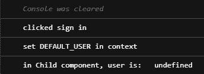
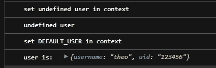

# 反应上下文:同步与异步

> 原文：<https://levelup.gitconnected.com/react-context-sync-vs-async-8d67562d4b4a>


最近，我在用 TypeScript 和 Firebase 写 React 的个人项目中偶然发现了一个小问题。当我在输入我的凭证后按下登录按钮时，应用程序没有将我重定向到主页。我可以看到上下文正在用 Firebase 中的用户对象进行更新，但是这些变化似乎并没有传播开来。我在 codesandbox 中重新创建了这个问题，用最小的上下文和应用程序来复制这个问题。

# 同步案例

上下文有一个用户(或未定义的用户)，一个设置默认用户的登录函数，和一个删除用户的注销函数。

Auth.tsx

```
import React, { useState, FC, useContext, createContext } from "react";interface User {
  username: string;
  uid: string;
}interface AuthContext {
  user?: User;
  signIn: () => void;
  signOut: () => void;
}const authContext = createContext({} as AuthContext);export const useAuth = () => {
  return useContext(authContext);
};const DEFAULT_USER: User = { username: "theo", uid: "123456" };function useProvideAuth() {
  const [user, setUser] = useState<User>();const signIn = () => {
    setUser(DEFAULT_USER)
  };const signOut = () => {
    setUser(undefined);
  };return { user, signIn, signOut };
}const ProvideAuth: FC = ({ children }) => {
  const auth: AuthContext = useProvideAuth();
  return(
    <authContext.Provider value={auth}>
      {children}
    </authContext.Provider>;
  );
};export default ProvideAuth;
```

App.tsx:

```
import React from 'react';
import ProvideAuth from "./Auth";
import Child from "./Child";export default function App() {
  return (
    <ProvideAuth>
    <Child />
    </ProvideAuth>
  );
}
```

Child.tsx

```
import React, { FC } from "react";
import { useAuth } from "./Auth";const Child: FC = () => {
  const { user, signIn, signOut } = useAuth();return (
    <div>
    <div>User: {user?.username}</div>
    {
      user ? 
        (<button onClick={signOut}>Sign Out</button>) : 
        (<button onClick={signIn}>Sign in</button>)
    }
    </div>
  );
};export default Child;
```

这是应用程序在两种可能状态下的外观:


当用户没有登录时


当用户登录时

这正如预期的那样工作，更改是即时的，只要单击按钮就会显示用户名。当让用户登录和退出的函数是同步的时，就没有问题，一切都按预期运行。

问题是，在许多情况下，这还不够。让用户登录的函数可以是异步的，就像我的例子一样。Firebase 必须发出一个网络请求，并且不确定该操作需要多长时间，以及是否完成。

# 异步案例

让`SignIn` 和`SignOut`函数返回一个`Promise<void>`反而有助于复制底层问题:

在 Auth.tsx 中，更新界面:

```
interface AuthContext {
  user?: User;
  signIn: () => Promise<void>;
  signOut: () => Promise<void>;
}
```

以及功能:

```
const signIn = async () => {
  console.log('set DEFAULT_USER in context');
  setUser(DEFAULT_USER);
};const signOut = async () => {
  console.log('set undefined user in context');
  setUser(undefined);
};
```

为了查看`Child.tsx`组件是如何看到这些变化的，我对其进行了修改，以便在点击 登录按钮时，在 ***显示用户的用户名。***

对 Child.tsx 的修改:

```
const Child: FC = () => {
  const { user, signIn, signOut } = useAuth();const handleSignIn = async () => {
    console.log("clicked sign in");
    await signIn();
    console.log("in Child component, user is: ",user ? user.username : "undefined");
  };return (
    <div>
      <div>User: {user?.username}</div>
      {
        user ? 
          (<button onClick={signOut}>Sign Out</button>) : 
          (<button onClick={handleSignIn}>Sign in</button>)
      }
    </div>
  );
};export default Child;
```

结果揭示了根本问题:



尽管用户是在上下文中设置的，但它在嵌套组件中并不立即可用

控制台输出显示，当单击按钮时，`DEFAULT_USER`在上下文中被签名，但是嵌套的`Child.tsx`组件可用的用户仍未定义。

这表明在当前渲染中，即使我们等待异步函数完成，`Child.tsx`组件的状态也不会立即更新，`user`对象仍然是`undefined`。

在这个简化的例子中，这不是问题，因为下一次渲染进行得非常快，并且显示了用户名。只有当一些代码依赖于异步函数的输出时，这才是一个问题。

# 使用效果:次优方法

当我第一次写这个的时候，我最初的方法是以下面的方式使用`useEffect`**(不要这样做，因为它会导致双重渲染！)**:

Child.tsx:

```
const Child: FC = () => {
  const { user, signIn, signOut } = useAuth();useEffect(() => {
    console.log(user ? user.username : "undefined");
  }, [user]);return (
    <div>
      <div>User: {user?.username}</div>
      {
        user ? 
          (<button onClick={signOut}>Sign Out</button>) : 
          (<button onClick={signIn}>Sign in</button>)
      }
    </div>
  );
};
```

正如[**Alex Azvezdo**](https://medium.com/@alexndreazevedo)**所指出的，这是次优的。我浏览了一下，发现了一篇[精彩的文章](https://betterprogramming.pub/updating-state-from-properties-with-react-hooks-5d48693a4af8)讨论了这个确切的问题(这篇文章是关于作为道具传递的价值观，而不是通过上下文获得它们，但我认为同样的逻辑也适用)。**

**如果任何状态正在被更新，那么`useEffect`钩子将导致**第二次渲染**,这是浪费。**

# **更好的方法**

**在这个简单的例子中，可以完全避免在钩子内部进行某些操作。**

**Child.tsx**

```
const Child: FC = () => {const { user, signIn, signOut } = useAuth();if(user){
  console.log("user is: ", user);
  *//DO other operations here* } else {
  console.log("undefined user");
}return (
  <div>
  <div>User: {user?.username}</div>
    {user ? 
      (<button onClick={signOut}>Sign Out</button>) : 
      (<button onClick={signIn}>Sign in</button>)
    }
  </div>
  );
};
```

**之前我有一个**异步** `handleSignIn`函数，当点击**按钮时触发，**将**等待**来自**上下文的登录函数。**这是**没有必要的。****

**相反，来自**上下文**的`signIn`函数可以被按钮的`onClick`函数直接调用**。这避免了完全使用钩子。****

**这分离了用户登录的逻辑(这是在上下文中完成的，**然后**传播到子组件)，然后用它做一些事情(在我的例子中，导航到其他页面)。**

****

**如上所示，这比我以前的方法简单多了。**

# **当前组件的挂钩**

**[Michael Landis](https://michaellandis.medium.com/) 提议将[反应功能组件视为有限状态机](/think-of-react-hooks-as-state-machines-not-functions-39cf9d086a94)而非功能。这是一个很好的见解，对我解决这个问题很有帮助。**

**将功能组件状态视为**确定性有限状态机**中的状态，并将钩子视为这些状态之间的**转换**，由此可见`useEffect`钩子对于更新其所属组件**的状态是有用的。如果 useEffect 依赖于组件状态之外的东西，那么它就不是一个确定性的转移函数。****

**我认为解决方案是确保钩子不依赖于其组件之外的东西。在我的例子中，`useEffect`在依赖数组中有`user`，它来自**上下文，这是错误的。****

**作为**道具**接收的变量和从**上下文**获得的变量将总是**新鲜的，**因为当它们改变时，会触发重新渲染。在这种情况下，当`user`在**上下文**中被更新时，更新的值被传播给任何观察者。这导致了重新渲染，并且`Child`组件可以确保它得到最新的`user`。**

# **结论**

**我不得不艰难地学习如何尊重 React 生命周期，并且我希望与任何面临类似挑战的人分享我的经验。希望这能帮助某人避免我的错误！**