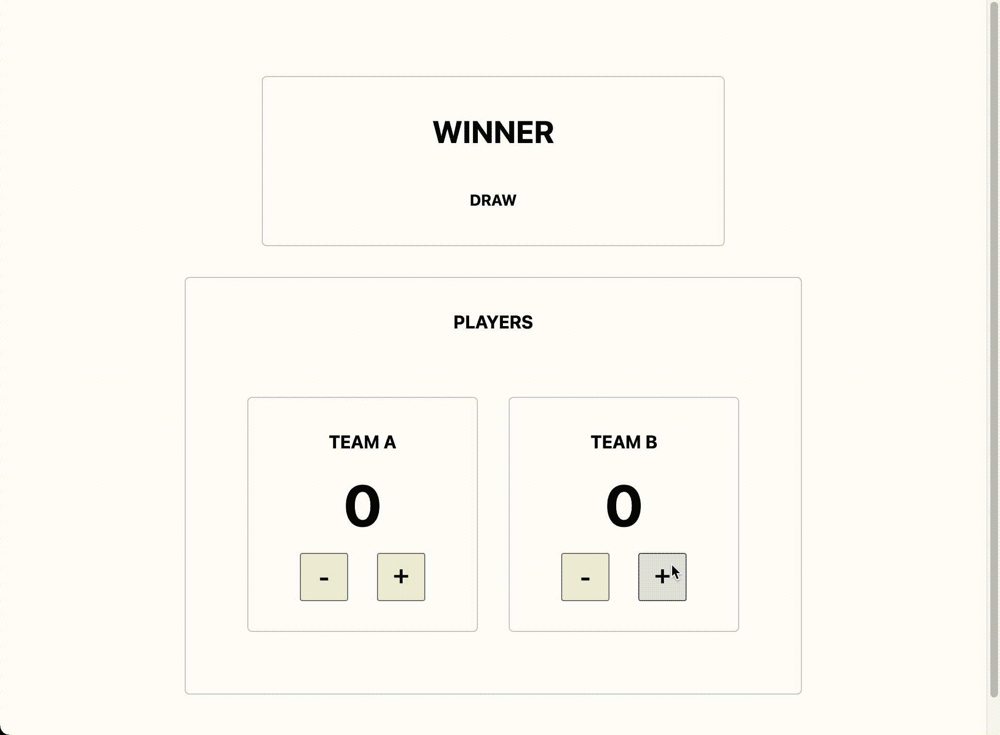

# 反应环境—最佳实践的权威指南

> 原文：<https://levelup.gitconnected.com/react-context-the-definitive-guide-to-best-practices-fd095568be03>

让我猜猜，你已经阅读了至少 3 篇关于如何使用上下文、为什么你不应该使用上下文、什么是上下文、将上下文比作状态管理库的文章，并且*列表继续下去。*

虽然有许多文章涵盖了非常基础的上下文，但是很少有文章会涵盖高级概念、性能优化和最佳实践。他们通常要么不讨论这类话题，要么更糟的是，在没有向读者提供完整故事的情况下，与野生图书馆进行比较。

> 告诉我，孩子——你不厌倦试图填补那个空白吗？

一个简单的事实是，就像 React(或软件工程)中的任何其他东西一样，上下文也有其权衡，但只要你知道这些权衡以及如何减轻它们，上下文就可以填补你的空白，而不需要引入额外的库。

# **消费语境——勾起来！**

> 钩子把你带回来，我不会骗你。钩子会把你带回来，你可以依靠它。

不，不是*那个*挂钩——一个*定制*挂钩。上下文总是通过一个定制的钩子来使用。在我们进入为什么之前，这里有一个基本的例子:

给你的生活增添情趣！

为什么？很高兴你问了，主要原因:

*   保证在其提供者内上下文的正确访问(否则它将抛出)。
*   不需要导出上下文本身。

其他非常固执己见的原因:

*   增加可读性——钩子名称告诉任何开发者它是什么。
*   增加 DX-谁不爱一个好的勾手？

# 定制提供商—永不停止提供服务

> 永远不会放弃你，永远不会让你失望。

提供者是上下文的主力——这是一篇在街上仔细撰写的经过事实检验的文章，但也可能是文章中未经授权的评论部分。这就是定制提供者的魅力所在，也是为什么无论何时使用上下文，都应该使用定制提供者。他们可以在一个非常简单的 api 后面隐藏很多复杂性。

让我们看一个基本的例子:

为什么？很高兴你问了，主要原因:

*   将(可能的)复杂逻辑封装到自己的组件中。

这种方法通过限制使用提供者的组件大小，并公开一个非常简单、易于理解的 api 来进行更改，从而提供了一个更清晰的代码库(更好的 DX)。

您可能注意到了提供程序中的 api 对象——这是定制提供程序支持的另一个最佳实践。始终提供一个 api 供消费者使用，这是一种“包含电池”的方法，它将限制人为错误，并通过简单地调用命名良好的 api 函数，而不必担心逻辑或可能的状态，使它立即可供任何没有上下文的人使用。旁注:我也是 TypeScript 的大力支持者，这将有助于上述所有内容，但那是另一篇文章。

# 性能优化—让我们的力量结合起来

> "这有糟糕的性能，它将重新渲染这么多，粉碎你的应用程序，你是一个多么糟糕的开发人员！"

我已经能听到巨魔，仇恨者，秃鹰，吸血鬼。不要担心杰出的读者，因为仇恨者会恨，恨，恨。在这种情况下，虽然巨魔是绝对正确的**暂停震惊**。

是的，下面讨论的改进可以从一开始就作为一种防御方法加入，但是如果你在你的应用程序中保持上下文范围狭窄并且尽可能低，那么很有可能不需要它们。说到这里，让我们讨论一下使用上下文最大的问题以及如何减轻它的影响。简单地说，直接从 React 文档:

> 每当提供者的`value`属性改变时，作为提供者后代的所有消费者都将重新呈现。

在我们前面的例子中，这意味着`<SpiceButtons />`，尽管没有使用`spice`值，将在值改变时重新渲染。通常情况下，你可能对此没有意见，但如果它造成了性能问题，防止重新渲染的最佳方式是使用多个上下文——更具体地说，是从 api 函数*中分离出变化的值(因为你总是在阅读完这篇文章后使用 api 函数，对吗？？)*。

让我们看另一个例子，它建立在我们之前的例子之上:

额外的`SpicyApiCtx`上下文与 api 的`useMemo`相结合，使得 api 函数能够在呈现之间保持它们的引用身份稳定(当`spicy`值改变时),并且不会使用`useSpicyApi`钩子*在任何组件中触发重新呈现(因为您总是在阅读此权利后创建一个自定义钩子来消耗上下文？？)*。

这种方法(多上下文)可以呈指数增长——当然在某些时候你可能会考虑使用状态管理库，我只是说*这是可能的*。

让我们考虑最后一个例子——我最近读了一篇[文章](https://medium.com/@viraj.vimu/react-context-api-vs-zustand-state-manager-98ca9ac76904)比较了 context 和 [zustand](https://github.com/pmndrs/zustand) 的性能。 ***文章*** 的 TLDR 是一个稍微复杂一点的典型反例。其中有两个“玩家”,你可以增加或减少他们的分数(计数),记分牌显示获胜者，同时在`hightlight updates when components render`设置打开的情况下使用 React Profiler 扩展。正如您所想象的那样，上下文示例显示了当发生更改时所有内容的重新呈现，而 zustand 示例只显示了播放器递增或递减，以及当发生更改时记分板的重新呈现。

从表面上看，这篇文章没有任何问题，它写得很好，有很好的视频示例，提供代码是为了让您有机会体验一下。我对这篇文章的主要担心是，这种比较没有包括上下文示例的任何性能优化，也没有提到这种优化的存在以及如何使上下文示例与 zustand 示例内联。这对于那些可能不知道去别处找更好的东西的新手来说有点误导。

下面，我重构了本文中提供的上下文示例，应用了本文中讨论的性能优化，并将其嵌入到 zustand 示例中。(此处代码[为](https://github.com/cdaz5/ctx-example))

需要澄清的是，我并不是说 context 比 zustand 更好——它们在 React 世界中都有权衡和用例。作为开发人员，我们的工作是从我们的工具包中挑选适合这项工作的工具，我只是指出这种重构在上下文中是可能的。在给定的情况下，这可能不是正确的选择，但是作为读者，您现在对上下文有了更好的了解，并且可以围绕在给定的情况下您可能使用的工具做出更明智的决定。

如果你觉得这篇文章有帮助，请给它一个赞！

附言:我是 zustand 的超级粉丝，下次你考虑州管理图书馆的时候一定要考虑它。