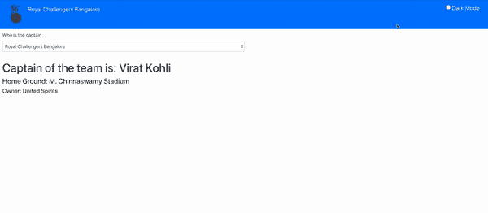

# 使用类型脚本反应上下文

> 原文：<https://levelup.gitconnected.com/react-context-using-typescript-c717f1dee2d1>

ReactJS 很简单，当数据发生变化时，它可以有效地更新和呈现正确的组件。React 使用基于组件的方法来管理自己的状态。

通常在 React 应用中，数据是通过 props 自上而下传递的(从父到子)。但这可能会使事情复杂化。假设我们有 10 个组件，用户更新了他的首选语言。现在，我们需要将这些信息传递给所有 10 个组件，这既复杂又耗时。

为了克服这个问题，我们使用**上下文。** React 文档称*上下文提供了一种通过组件树传递数据的方式，而不必在每一层手动传递道具。*

**最重要的问题是什么时候使用上下文？**

Context 旨在共享可以被视为 React 组件树的“全局”数据，例如当前经过身份验证的用户、主题或首选语言。

但是使用上下文使得组件的重用变得困难。所以在设计阶段，我们需要格外小心，确保组件的可重用性不受干扰。

**演示项目**



演示项目，允许黑暗模式，并提供关于你最喜欢的 IPL 队的信息😀

当我在禁闭和板球失踪期间写这篇文章的时候😒我在 IPL 上建立了一个简单的应用程序，它给你关于你最喜欢的球队的基本信息，并允许你改变主题。

**注意:** *我没有解释这个应用程序中使用的状态、道具和用户界面，因为它们非常基本，没有复杂之处*

代码可以从[这里下载](https://github.com/suhas86/react-context-typescript)

上下文可以分为三个部分

1.  创建上下文
2.  提供创建的上下文(给组件)
3.  使用上下文(在任何子组件中)

**1。创建上下文**

我们可以使用`createContext` API 创建一个上下文。请记住，订阅上下文的组件将从最近的提供者那里读取当前的上下文值。我们可以从 react 导入它:

```
import React, {createContext} from "react";
```

在我们的例子中，我们需要两个上下文——一个是处理主题，另一个是跨应用程序更新团队。

```
**TeamContext.tsx** 
export const TeamContext = createContext<{team:string,changeTeam:any}>({team:"rcb",changeTeam:null})**ThemeContext.tsx**
export const ThemeContext = createContext<themeState>({  isDarkMode: false,  toggleTheme: null,});
```

**2。提供背景**

每个上下文都有一个提供者组件。这允许消费组件订阅上下文更改。

在将上下文提供者包含到我们的上下文中之后，我们的代码将如下所示

*注意:这两个文件都有更新主题和团队细节的方法*

**3。消费语境**

在基于类的组件中，从上下文中获取值非常简单。下面是在基于类的组件中获取上下文的示例代码。我稍后将讨论功能组件。

```
const {isDarkMode} = this.context
```

但是具有挑战性的部分是当我们想要在一个组件中使用两个上下文时。在我们的例子中，Navbar 既需要改变颜色的上下文，也需要更新团队标志。根据文档，我们需要通过订阅来消费

```
<MyContext.Consumer>
  {value => /* render something based on the context value */}
</MyContext.Consumer>
```

为了处理这个问题，我在 TeamContext.tsx 中包含了高阶组件

上述步骤增加了代码，也使实现变得复杂。所以最好的处理方法是使用基于功能的组件。这避免了高阶组件，我们可以通过使用`useContext` hook 简单地在组件中使用任意数量的上下文:

```
const {isDarkMode, toggleTheme} = useContext(ThemeContext);    
const {team} = useContext(TeamContext);
```

您可以在 Github 中找到完整的解决方案

对于基于类的组件，请参考此处的。基于功能的组件的例子可以在[这里](https://github.com/suhas86/react-context-typescript/tree/function_based_context)找到。

这是我的第一篇文章，所以如果你有任何反馈，请在评论区告诉我。希望这篇文章能让你对 React 上下文有一些基本的了解