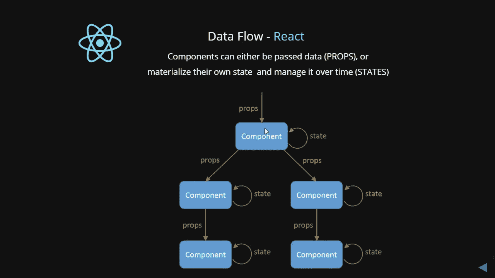
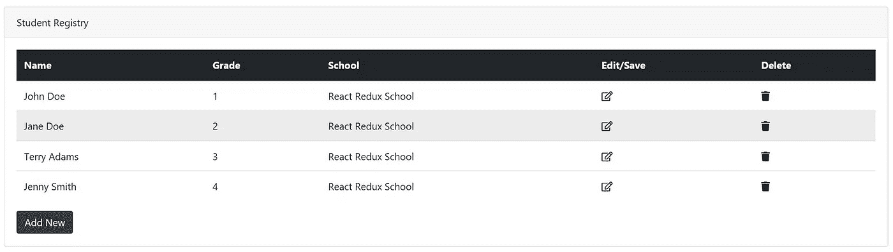
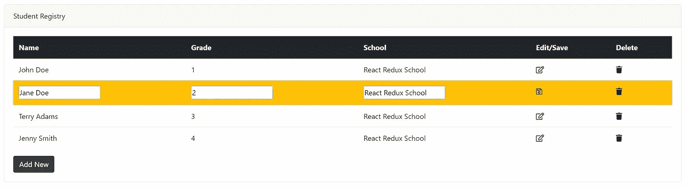
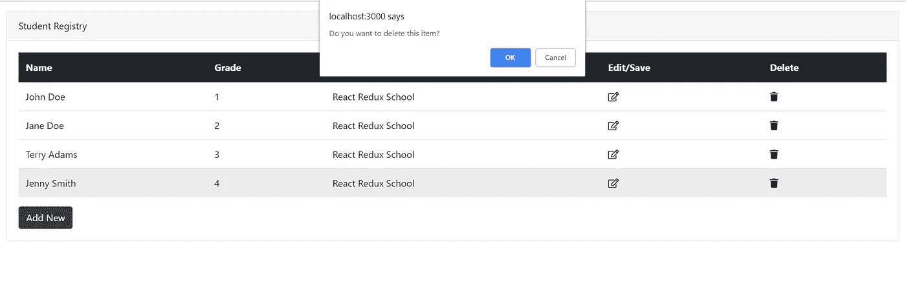
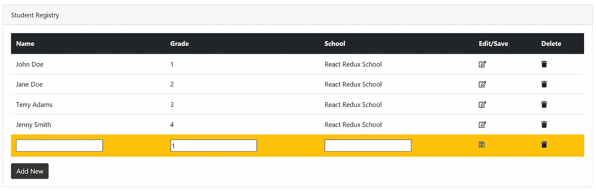
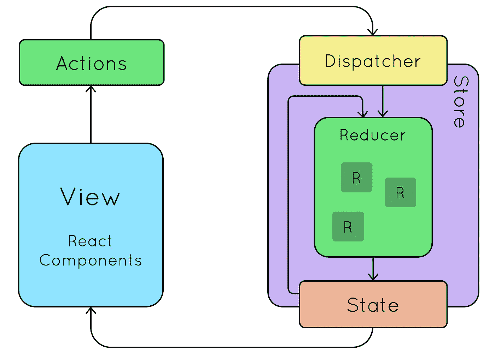

# 带和不带 Redux 的 React CRUD 应用程序—将 React 应用程序转换为 React+Redux 应用程序

> 原文：<https://levelup.gitconnected.com/react-crud-app-without-and-with-redux-da4cd87f2eab>

## 创建一个没有 Redux 的应用程序，然后将其转换为 Redux 应用程序



我使用 React 已经有几年了。这是一次有趣的旅程，所有的事情都变得美妙而简单。有些父组件可以有子组件。他们可以使用 state 和 props 共享数据。React 有一个强大的构图模型，在开始涉足 Flux/Redux 之前，我一直很喜欢构图。我很高兴使用 axios 从服务器获取数据，在父节点上设置状态，将道具传递给子节点，并冒泡事件以将数据传递给父节点。一切都很好，直到我把脚伸进 Redux。

我对 Redux 的最初尝试感觉有点困难，尤其是当我看到一个完整的工作示例，它的所有活动部分都编织在一起时——这有点让人不知所措。

对我来说，理解 Redux 商店的所有组件是如何配合和协同工作的并不容易。因此，我想为什么不创建一个没有 Redux 的 React 应用程序，并将其转换为带有 Redux 的 React 应用程序。这个过程将帮助我们理解 Redux 的不同部分以及它们是如何协同工作的。此外，由于我们将有一个工作的非 Redux，应用程序将更容易理解 Redux 范式。我们在现实生活中创建的大多数应用程序都是 CRUD 应用程序，因此有了这个选择。

我将要创建的示例是一个非常基本的学生注册表。这个应用程序将有能力创建，编辑和删除学生数据，如他们的姓名，年级和学校。学生数据将存储在浏览器本地存储中，以便离线保存。

首先，让我们启动一个新项目，在没有 Redux 的情况下创建 React 应用程序。

```
npx create-react-app studentregistry
cd studentregistry
npm start
```

关于 https://reactjs.org/docs/create-a-new-react-app.html`create-react-app`→[的更多细节](https://reactjs.org/docs/create-a-new-react-app.html)

上面的命令将创建一个样板 react 项目，然后运行它。对 **App.js** 做如下修改，添加两个新文件 **StudentList.jsx** 和 **StudentItem.jsx** ，代码如下。

# **App.js**

```
*import React, { Component } from 'react';
import logo from './logo.svg';
import './App.css';
import StudentList from './StudentList.jsx';*const studentList = [
  {id:1,name:'John Doe',grade:1,school:'React Redux School'},
  {id:2,name:'Jane Doe',grade:2,school:'React Redux School'},  
  {id:3,name:'Terry Adams',grade:3,school:'React Redux School'},
  {id:4,name:'Jenny Smith',grade:4,school:'React Redux School'}
];if (localStorage.getItem("students") === null) {
  localStorage.setItem('students', JSON.stringify(studentList));
}**class App extends Component** {
  **constructor**(props) {
    super(props);
    this.state = {
      studentList: []
    } this.editStudentSubmit = this.editStudentSubmit.bind(this);
    this.deleteStudent = this.deleteStudent.bind(this);
    this.addNewStudent = this.addNewStudent.bind(this);
  } **componentWillMount**() {
    let studentList = JSON.parse(localStorage.getItem("students"));
    this.setState((prevState, props) => ({
      studentList: studentList
    });
  } **addNewStudent**() {
    this.setState((prevState, props) => ({
      studentList: [...prevState.studentList, {  
        id: Math.max(...prevState.studentList.map(function(o){
          return o.id
        })) + 1,name: '', grade: 1, school: '' 
      }]
    }));
  } **deleteStudent**(id) {
    let r = window.confirm("Do you want to delete this item");
    if (r === true) {
      let filteredStudentList = this.state.studentList.filter(
        x => x.id !== id
      ); this.setState((prevState, props) => ({
          studentList: filteredStudentList
       })); localStorage.setItem(
         'students',
         JSON.stringify(filteredStudentList)
       );
    }
  } **editStudentSubmit**(id,name, grade, school) {
    let studentListCopy = this.state.studentList.map((student) => {

      if (student.id === id) {
        student.name = name;
        student.grade = grade;
        student.school = school;
      } return student;
    }); this.setState((prevState, props) => ({
      studentList: studentListCopy
    })); localStorage.setItem(
      'students',
      JSON.stringify(studentListCopy)
    );
  } **render**() {
    return (
      <div className="container-fluid">
        <div className="row mt-3"><div className="col-lg-12">
          <div className="card">
            <div className="card-header">
              Student Registry
            </div>
            <div className="card-body">
              <table className="table table-hover">
                <thead className="thead-dark"><tr><th>Name</th><th>Grade</th><th>School</th><th>Edit/Save</th><th>Delete</th></tr></thead>
                <StudentList
                  deleteStudent={this.deleteStudent}
                  studentList={this.state.studentList}
                  editStudentSubmit={this.editStudentSubmit}
                />
              </table>
            <button
              className="btn btn-dark pull-left"
              onClick={this.addNewStudent}>
              Add New
            </button>
          </div>
        </div>
      </div>
     </div>
    </div>
   );
  }
}export default App;
```

# **StudentList.jsx**

```
*import React, { Component } from 'react';
import StudentItem from './StudentItem.jsx';***export default class StudentList extends Component** {
  **render**() {
    let students = this.props.studentList;
    const trItem = students.map((item,index) => (
      <StudentItem
        key={index}
        student={item}
        index={index}
        editStudentSubmit={this.props.editStudentSubmit}      
        deleteStudent={this.props.deleteStudent}
      />
    )); return <tbody>{trItem}</tbody>;
  }
}
```

# **StudentItem.jsx**

```
*import React, { Component } from 'react';***export default class StudentItem extends Component** {
  **constructor**(props){
    super(props);
    this.state ={isEdit:false}
    this.editStudent = this.editStudent.bind(this);
    this.editStudentSubmit = this.editStudentSubmit.bind(this);
    this.deleteStudent = this.deleteStudent.bind(this);
  } **deleteStudent**(){
    const {id} = this.props.student;
    this.props.deleteStudent(id);
  } **editStudent**(){
    this.setState((prevState,props) => ({
      isEdit : !prevState.isEdit
    }))
  } **editStudentSubmit**(){
    const {id} = this.props.student;
    this.setState((prevState,props) => ({
      isEdit : !prevState.isEdit
    })); this.props.editStudentSubmit(
      id,
      this.nameInput.value,
      this.gradeInput.value,
      this.schoolInput.value
    );
  } **render**() {
    const {name,grade,school} = this.props.student; return (
      this.state.isEdit === true ? (
        <tr className="bg-warning" key={this.props.index}>
          <td>
            <input ref={nameInput => this.nameInput = nameInput} defaultValue ={name}/>
          </td>
          <td><input defaultValue={grade} ref={gradeInput => this.gradeInput = gradeInput}/>
          </td>
          <td>
            <input ref={schoolInput => this.schoolInput = schoolInput} defaultValue={school}/>
          </td>
          <td><i className="far fa-save" onClick={this.editStudentSubmit}></i>
          </td>
          <td><i className="fas fa-trash"></i></td>
        </tr>
      ) : (
        <tr key={this.props.index}>
          <td>{name}</td>
          <td>{grade}</td>
          <td>{school}</td>
          <td><i className="far fa-edit" onClick={this.editStudent}></i></td>
          <td><i className="fas fa-trash" onClick={this.deleteStudent}></i></td>
</tr>
      )
    );
  }
}
```



对 ***App.js、StudentList.jsx 和 StudentItem.jsx*** 做了这些更改后，如果现在运行`**npm start**`，上面的页面应该会打开。这是一个简单的 React CRUD 应用程序，完成了所有的 CRUD 操作。

## **还原 React 应用:**



这是我们将要创建的同一个学生注册应用程序，但是状态管理现在将由 Redux 处理。让我们使用 CRA CLI 创建一个常规的 React 应用程序，然后安装 Redux 及其 React 绑定。所以回到终端，输入以下命令-

```
**npx create-react-app studentregistryredux
npm install --save redux react-redux**
```

**Redux** 是一个状态管理库，可以用来**管理任何应用的状态**，而不仅仅是 React。当使用 Redux 时，你会发现我们可能需要写更多的代码来完成同样的事情。这是由设计决定的，但是您的应用程序状态更易于管理，测试也变得容易。

# Redux 的三大支柱

> **商店**
> 
> **动作**
> 
> **减速器**

让我们通过执行以下操作对`index.js`进行更改:

1.  添加具有初始状态的存储。向存储提供初始状态是可选的。
2.  **存储:**存储是将动作和还原器集合在一起的对象。
3.  商店有以下责任:

保存应用程序状态。允许通过`getState()`访问状态。允许通过`dispatch(action)`更新状态。

4.用来自`react-redux`的`Provider`封装`App`并将存储注入提供者

接下来，让我们在`src`下创建一个名为`reducers`的文件夹，添加一个名为`studentReducer.js`的文件，并粘贴以下代码。

**reducer**—reducer 指定应用程序的状态如何改变，以响应发送到商店的[动作](https://redux.js.org/basics/actions)。记住，动作只描述了发生了什么，而没有描述应用程序的状态是如何变化的。[https://redux.js.org/basics/reducers](https://redux.js.org/basics/reducers)

接下来，让我们在`src`下创建一个名为 actions 的新文件夹，并创建一个名为`studentActions.js`的文件，然后粘贴以下代码。我为每个动作创建了独立的导出函数，因为它在导入它们方面提供了更多的灵活性。它们可以像这里一样单独导入，也可以使用 i `mport *`批量导入。

**操作—** 操作是将数据从您的应用程序发送到您的商店的有效信息负载。他们是商店唯一的信息来源。Reducers 知道如何根据执行的动作更新应用程序存储/状态。[https://redux.js.org/basics/actions](https://redux.js.org/basics/actions)

需要对 **App.js** 文件进行重大修改。这是与 Redux 存储器连接的容器或**智能组件**，而`StudentList`和`StudentItem`是不与存储器连接的**虚拟组件**。所有传统的状态管理代码已经从 App.js 中移除，现在状态由 **Redux** 管理。

下面的代码部分显示了使用 Redux `**connect**`中的`**mapStateToProps**` 将商店中的状态映射到`props`的位置。我们在`studentActions.js`中创建的动作也使用`**connect**` 中的`**mapDispatchToProps**` 与它们对应的用户事件进行映射，如下所示。

```
const **mapStateToProps** = (state) => {
  return {
    studentList : state
  }
}const **mapDispatchToProps** = (dispatch) => {
  return bindActionCreators({
    addStudent:addStudent,
    deleteStudent:deleteStudent,
    updateStudent:updateStudent
  },dispatch);
}export default **connect(mapStateToProps,mapDispatchToProps)**(App);
```

通过这些更改，我们完成了简化 react 应用程序所需的所有更改。

万岁！！我们完成了，我们可以看到学生注册的行为和没有 Redux 时一样。

## 简化应用程序的更改摘要:

1.  安装 npm 软件包`redux react-redux`
2.  添加具有可选初始状态的 Redux 存储
3.  添加减速器
4.  用来自`react-redux`的`Provider`封装`App`，并将存储注入提供者
5.  添加操作
6.  在容器组件中添加`**mapStateToProps**` **、** `**mapDispatchToProps**` 和`**connect**` 。

这两款应用都使用 bootstrap 4 和 fontawesome 图标。这是一个基本的示例应用程序，通过与常规的 React 应用程序进行比较和对比来帮助您理解 Redux，并解释如何将 Redux 的基本组件放在一起。希望对你有用。

暂时就这样了。快乐编码。

让我知道它是否适合你，或者如果你有任何问题，请评论。

如果你觉得这篇文章有帮助，鼓掌！👏👏👏。

**GitHub 链接:**

[](https://github.com/cakiran/StudentRegistryRedux) [## cakiran/StudentRegistryRedux

### 用 Redux 反应 CRUD app。在 GitHub 上创建一个帐户，为 cakiran/StudentRegistryRedux 开发做贡献。

github.com](https://github.com/cakiran/StudentRegistryRedux) [](https://github.com/cakiran/StudentRegistry) [## caki ran/学生注册表

### React CRUD app 不带 Redux。在 GitHub 上创建一个帐户，为 cakiran/StudentRegistry 的开发做出贡献。

github.com](https://github.com/cakiran/StudentRegistry) [](https://gitconnected.com/learn/react) [## 学习 React -最佳 React 教程(2019) | gitconnected

### React 是一个现代 JavaScript 库，前端 web 开发人员使用它来构建用户界面(UI)。它用于…

gitconnected.com](https://gitconnected.com/learn/react)