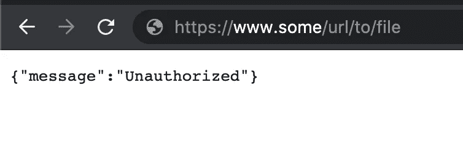
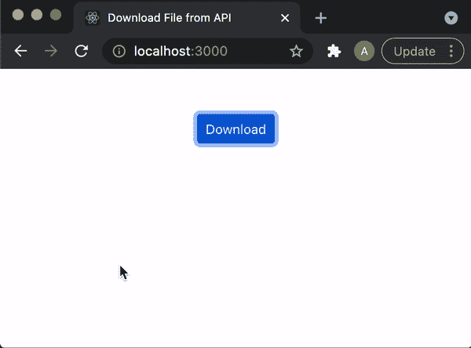
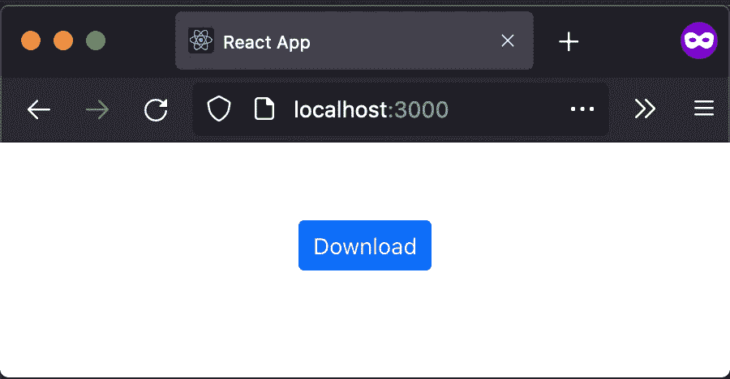
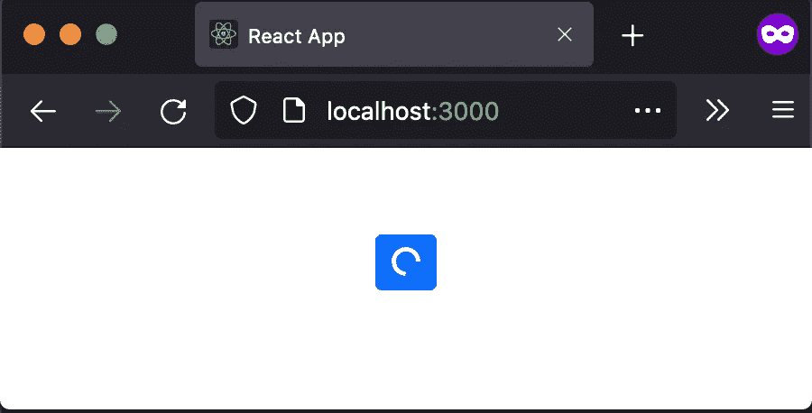
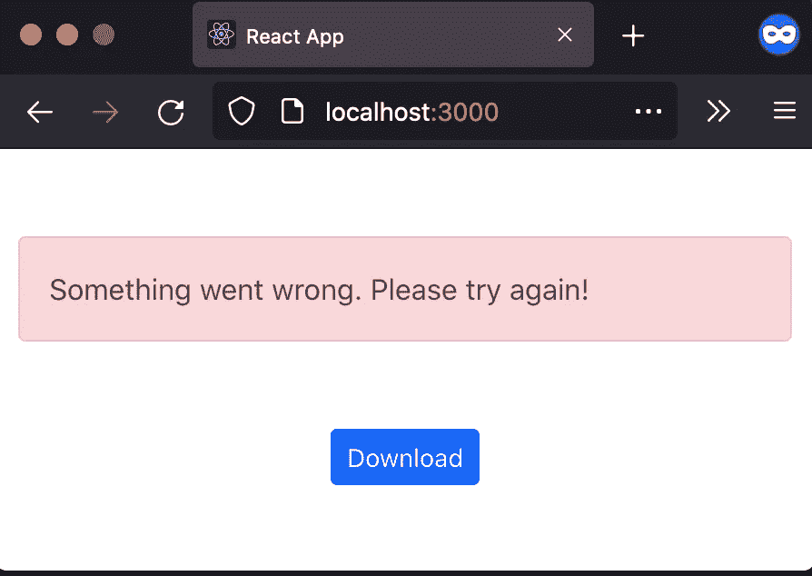

# React +自定义钩子+ typescript 通过 API 下载文件

> 原文：<https://levelup.gitconnected.com/react-custom-hook-typescript-to-download-a-file-through-api-b766046db18a>

想知道如何通过调用认证背后的 API 在 UI 上下载文件？


# 问题陈述

*   文件需要在前端下载。
*   该文件的数据由后端提供服务。

# 可能的解决方案

***1。在< a/ >标签上嵌入要下载文件的链接，在新标签页下载文件。***

```
<a
href="https://www.some/url/to/file"
target="__blank">
Download
</a>
```

当所提供的文件是公共的并且全世界都可以访问时，上述方法对于较简单的用例很有效。

但是，如果文件在某种认证之后，并且只能通过 API 提供必要的认证细节(如请求授权头中的载体令牌)来调用，该怎么办呢？

这将导致下载文件时出错，你会发现后端错误显示在用户界面上。



由于未提供身份验证详细信息，下载文件时出错

**2*。调用 API***
为了克服方法一中面临的问题，我们必须通过调用 API 来访问文件。在 API 请求中，我们可以额外提供必要的细节，让后端应用程序知道我们可以访问所请求的文件。

这就是我们将要讨论的方法，即调用 API，获取数据，将这些数据作为文件下载到浏览器上。



点击带有提供的文件名的按钮后，文件被下载

# **接近**

1.  单击按钮，调用需要作为 BLOB 下载的文件的下载 API。
2.  从 blob 创建 url，并将下载的对象存储在浏览器内存中。
3.  单击隐藏的锚标记，它链接到上面生成的 url。

# 使用的技术

1.  React + Typescript:用于单页应用程序
2.  Axios:用于 api 调用
3.  react-bootstrap + bootstrap:用于现成的组件和样式
4.  卢克森:处理日期

# 应用程序设置

1.  创建一个 react + typescript 样板文件，如 react 官方文档(https://create-react-app.dev/docs/adding-typescript/)所述

```
npx create-react-app react-download-file-axios --template typescript
```

2.安装助手库

```
npm i axios @types/axios luxon @types/react bootstrap react-bootstrap
```

# *我们开始编码:*

## 按钮组件

一个简单的可重复使用的按钮组件，可以在调用 API 时处理加载状态。

接受三个道具:
1。**按钮状态**:按钮可以处于加载或正常状态(初级)
2。 **onClick** :点击按钮
3 时需要调用的点击处理函数。**标签**:按钮上显示的文字

src/components/button/index . tsx

## 可重用的自定义挂钩:useDownloadFile.ts

这段代码的目的是将下载文件的功能抽象成一个可重用的*自定义钩子*，这样它就可以在许多页面上重用。
永远最好遵循著名的*不要重复自己(干)*编程原则。

src/custom hooks/usedownloadfile . ts

现在让我们来看一下这个函数。

**DownloadFileProps** 钩子接受各种参数:

1.`apiDefinition`
包含 API 定义的函数中调用的 axios API。

2.`preDownloading` 在调用 API 之前执行的函数。
该函数可以作为一个 pre hook 来执行任何需要在 API 调用之前 ***完成的任务。
示例:禁用按钮/将按钮状态更改为正在加载。***

3.`postDownloading`
进行 API 调用后执行的函数。
在 进行 API 调用后，该函数可以作为 post 挂钩来完成任何需要 ***完成的任务。
示例:启用按钮/将按钮状态更改为主要。***

4.`onError`
API 失败时调用的函数。错误处理可以在这里完成。
示例:向用户显示一个警告，告诉用户出现了问题，文件没有被下载。

**被钩子**暴露的实用程序
1。 **ref:** ref，将被附加到父组件中的`<a />`标签上。
2。 **url:** 表示从 API 获取的数据的 url。
3。**名称:**用户在系统上下载时看到的文件的名称。
4。**下载:**需要下载文件时需要调用的函数。

下载功能流程:
1。调用`preDownloading`功能。
2。打电话给 API。如果出现错误，将调用`onError`函数来处理错误。
3。创建一个代表下载数据的 url，并将它存储在状态中。这个 url 被提供给`<a href... />`。
4。生成将在浏览器中下载的文件的名称。在州中存储相同的名称。
5。点击 DOM 中的`<a />`下载文件。
6。调用`postDownloading`功能。
7。销毁生成的 url。

## 下载文件的组件:downloadSampleCsvFile

最后，让我们将所有代码拼接起来，单击一个按钮就可以下载一个示例 csv 文件。

src/components/downloadSampleCsvFile/index . tsx

这个文件非常简单。

有两个状态变量来维护按钮的状态，并在调用 API 时出现错误时显示警告。

向`useDownloadHook`自定义钩子传递各种函数:
1。 **preDownloadFile** :设置按钮状态为正在加载。
2。 **postDownloadFile** :将按钮状态设置回主状态。
3。 **onError** :显示出错警告。
4。**API definition**:axios get 调用带有 blob 类型的 responseType 的 API。
5。**获取文件名**:根据当前时间生成文件名。

然后组件返回 JSX:
1。`<a />`:隐藏标签，用户看不到。使用 refs 下载文件后，功能`download`内部点击该按钮。
2。`<Button />`:用户点击下载所需文件的按钮。



不同的按钮状态

3.`<Alert />`:负责在 UI 上显示错误信息



调用 API 导致错误时发出警报

## App.tsx 文件

最后将`<DownloadSampleCsv />`组件集成到`<App />`

src/App.tsx

# 启动应用程序并测试功能

```
npm start / yarn start
```

# 结论

1.  定制钩子可以被增强以支持更多的功能。
2.  Github 回购可以在[https://github.com/anubhav-goel/react-download-file-axios](https://github.com/anubhav-goel/react-download-file-axios)上找到。