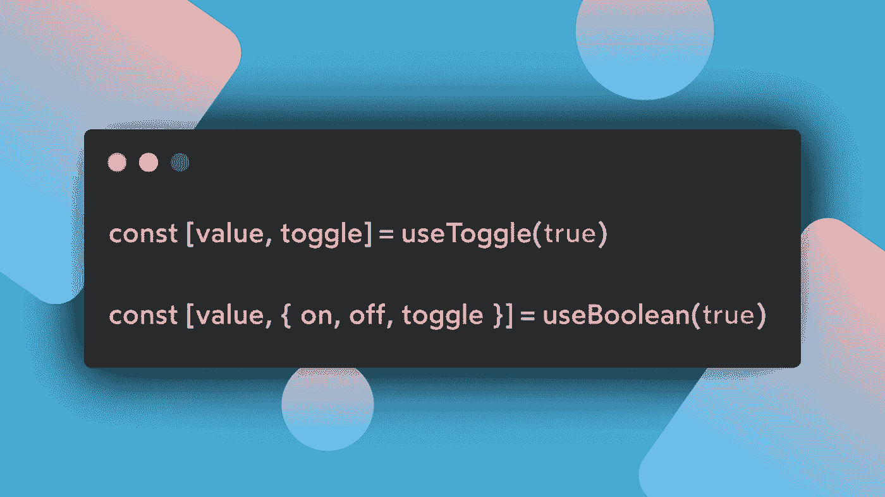
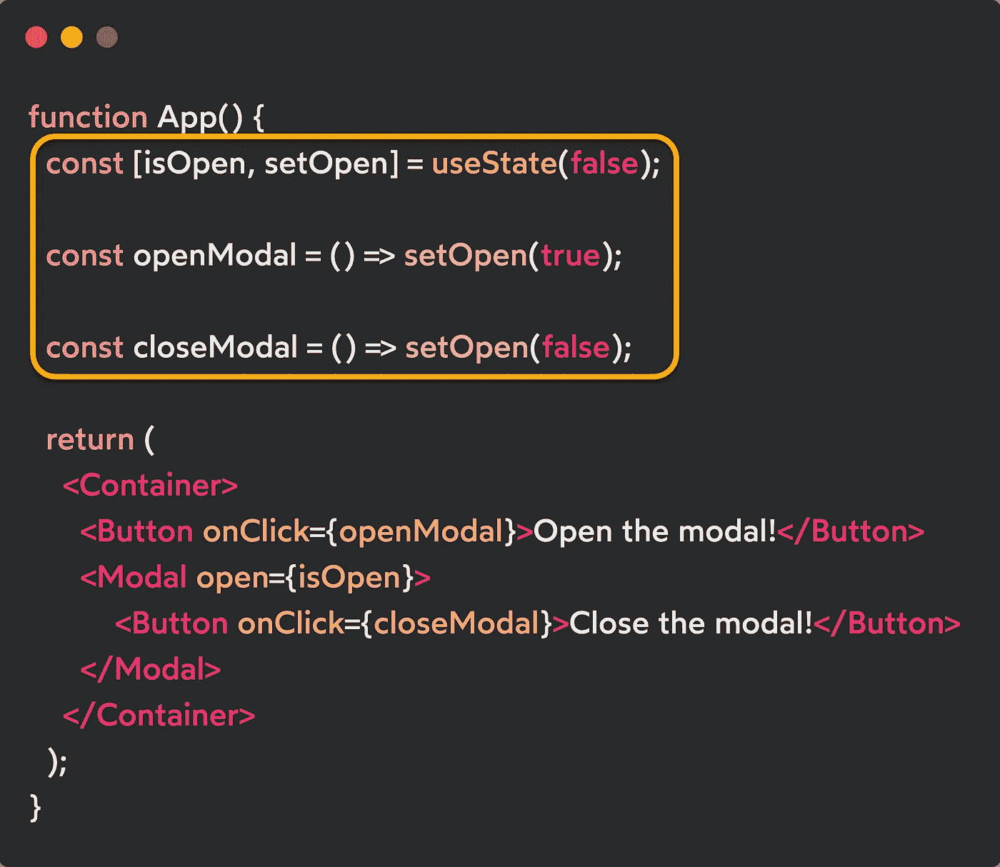
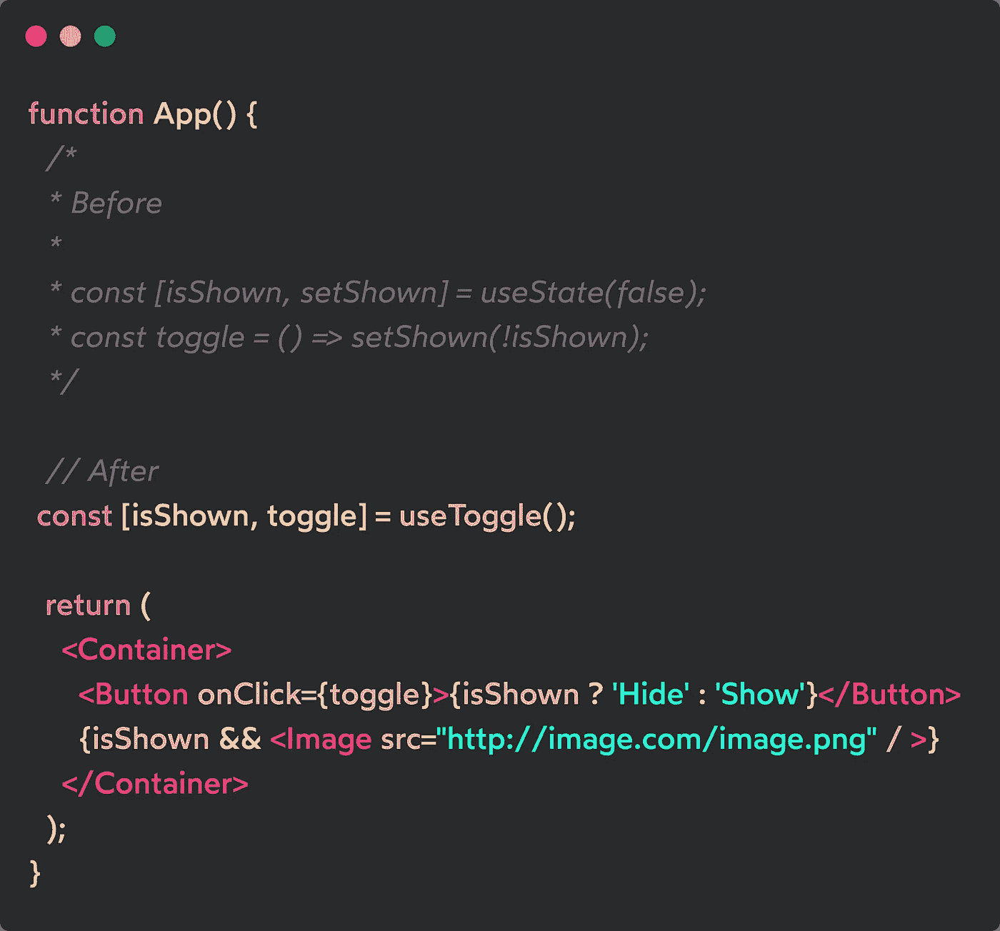
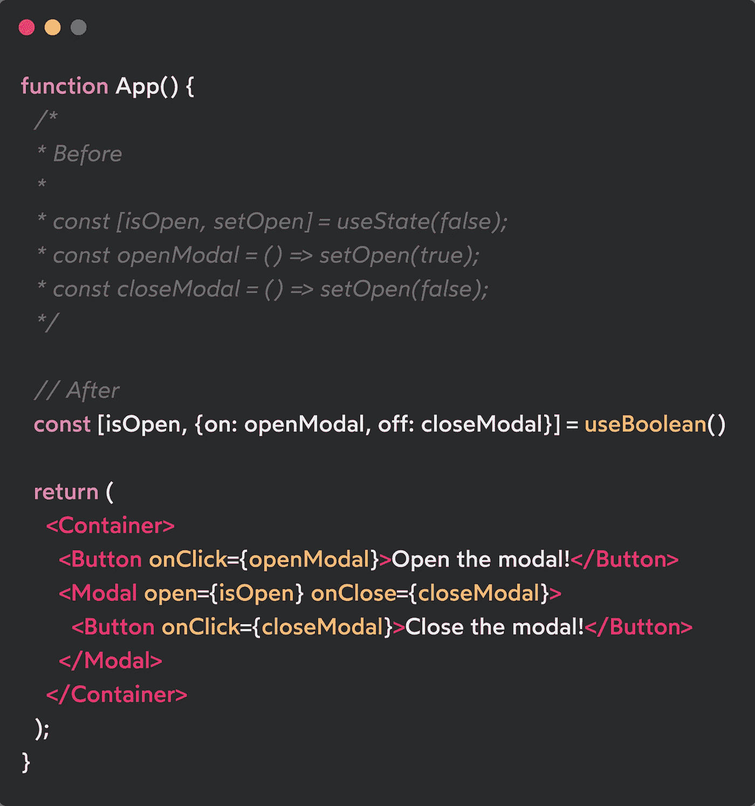

# React 自定义钩子#3: useToggle 和 useBoolean

> 原文：<https://levelup.gitconnected.com/react-custom-hooks-3-usetoggle-and-useboolean-af842c5b8b47>

## REACT HOOKS 食谱

## 使用这些定制挂钩改进您有条件地呈现 React 组件的方式。

React 最受欢迎的方面之一是它允许有条件地呈现组件和单个元素。这个特性，以及其他许多特性，使得这个库成为 JavaScript 生态系统中最受欢迎的。

因为我们把所有的条件建立在真和假的基础上，所以我们经常重复一些常见的场景，在这些场景中，需要把一个布尔值转换成它的反义词，或者我们总是需要把一个标志转换成一个特定的值。

检查你的代码并告诉我:**你是否在不同的组件上重复了很多代码**。我想我们都知道答案，对吧？

这就是为什么用几行代码就可以抽象出几个定制的钩子，使我们的组件可读性更好。这就是为什么 **useToggle** 和 **useBoolean** 成为我最喜欢的 React 定制钩子！

## 完美的用例:模态组件

模态是任何现代 web 应用程序中常用的组件，它们适用于通知和与用户的交流。

在技术行为下，它们通常需要被打开、关闭，当点击一个按钮时，我们可能想要切换它们在屏幕上的外观。

看看这个例子，记住我们是如何处理创建各种处理程序的模态的，我们稍后会需要它来进行比较。

模态分量的使用

你知道`openModal`和`closeModal`的处理程序吗？现在想象一下，你必须在不同的页面上使用一个模态，并通过不同于简单按钮的 UI 交互来控制它的行为。

你真的每次都要重写所有那些处理程序吗？不，谢谢！

## 使用开关

我们需要创建的第一个定制钩子是 **useToggle。**

它允许立即切换一个布尔值，而不需要为它创建一个函数。在大多数情况下，它对处理复选框组件、隐藏元素等非常有用，我认为它是处理条件呈现的基础。

它使用 [**useReducer 钩子**](https://marcoghiani.com/blog/how-to-use-react-reducer-effectively) 来定义调度函数的实现，以便在被调用时切换到其相反的值。
这种方法的好处是调度函数总是被记忆，所以你可以把它的引用传递给任何事件属性，而不用触发接收它的组件的重新呈现器。

在本例中，您可以看到它是如何更清晰地实现隐藏元素的:

使用 useToggle 重构切换特征

也许我错了，但在我看来它非常干净，✨

## 使用布尔值

既然 useToggle 钩子已经成为现实，并且我们知道如何使用它，useBoolean 钩子将向我们展示为什么 ***可组合性和可重用性是 React 范例*** 的支柱。

几分钟前，我们已经看到了模态组件的用法和所有必要的处理程序打开/关闭它。它基本上告诉我们，我们需要设置布尔值的所有可能的方法。这就是使用布尔钩子的目的。眼睛看着屏幕，让我们读一下实现:

与 useToggle 类似，它返回一个数组，该数组将值作为第一个元素，作为第二个参数，它返回一个对象，该对象包含允许设置布尔值的所有可能的处理程序:

*   **开:**将布尔值切换到*真。*
*   **关**:将布尔切换到*假。*
*   **toggle:** 同一个处理程序从 useToggle 调用返回。

正如你所看到的，我们重用了 useToggle 钩子来抽象一些内部逻辑，并且我们用 **useMemo** 钩子包装了我们的处理程序，以便总是提供我们的处理程序的相同引用。

> **N.B.** 在这里使用 useMemo 被认为是一种预优化，但是因为这个钩子的目的是作为库的一部分发布，所以我想为未来的用户提供最好的保证。与 React 对 useState 和 useReducer 分派函数所做的工作没有什么不同。

此时，我们得到了一个新的自定义钩子来处理我们的模态外观。是时候重构我以前的实现了，以提高它的可读性，并抽象出所有那些冗长的处理程序！

重构模态用法

就这样，清楚地描述了我们在应用程序内部管理的内容！您可能希望使用它的场景还有很多，这只是有条件地在屏幕上呈现某些内容时最常见的场景之一。

# 结论

有了这两个定制的钩子，你的反应技能和自信将会比以前增长得更快！

我希望它能对你有所帮助，如果你有任何疑问，我希望你能告诉我，你可以直接在 [**Twitter**](https://twitter.com/tonyghiani) 上联系我，或者在这里发表评论！

您还可以在以下页面找到更多关于我正在使用的资源的信息:

*   [**山-ui**](https://github.com/tonyghiani/mountain-ui)
*   [**我的个人页面**](https://marcoghiani.com/)

在这里你也可以找到这个系列以前的帖子！

 [## React 自定义钩子#1: useLocalStorage

### 使用 React 在 localStorage 上创建简单的持久化数据，以保存用户首选项。图片由马可在我开始后…

marcoghiani.com](https://marcoghiani.com/blog/react-custom-hooks-uselocalstorage)  [## React 自定义钩子#2: useFontSize

### 设置并使用一个全局 CSS 变量来改变页面的基本字体大小。图片由马可遵循第一…

marcoghiani.com](https://marcoghiani.com/blog/react-custom-hooks-usefontsize) 

感谢您花时间阅读，下一篇文章再见！🚀