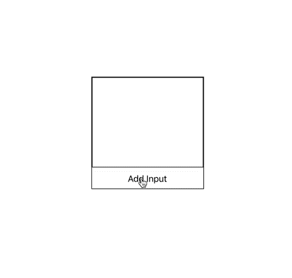
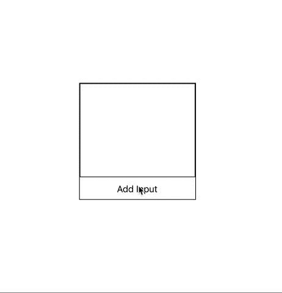
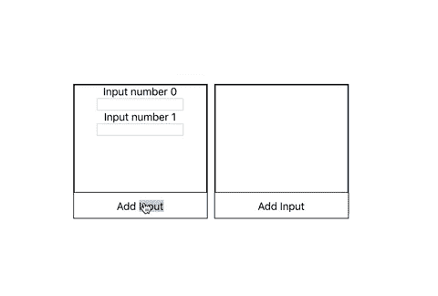

# 反应自定义挂钩—使用自动滚动

> 原文：<https://levelup.gitconnected.com/react-custom-hooks-useautoscroll-d63f17037a2d>


草莓

*与本文相关的回购可以在* [*这里找到*](https://github.com/MarkGeeRomano/useAutoScroll)

最近在工作中，我开发了一个具有固定高度的 React 组件，但是它的内容*可以比父 div 具有更高的高度。div 保存可变数量的输入，其数量由用户决定，用户可以通过单击按钮来添加输入。我应用了一个`overflow: scroll` css 属性，这样用户可以向下滚动并使用他们添加的输入。下面是组件的简化:*



但是我还希望每次添加输入时，输入容器滚动到底部，这样用户就可以看到输入。这可以通过组合使用`useRef`和`useEffect`挂钩来实现。

首先实例化两个引用。让我们调用第一个`prevLengthRef`，我们将它设置为我们的`inputs`数组的初始长度。接下来，我们将实例化另一个 ref，称为`containerRef`，我们将用`null`初始化它。最后，我们将创建另一个名为`prevLength`的变量，并将其设置为`prevLengthRef.current`。这在目前看来是多余的，但过一会儿就有意义了。

```
function View() {
  const [inputs, setInputs] = useState([])
  const prevLengthRef = useRef(inputs.length)
  const containerRef = useRef(null)
  const prevLength = prevLengthRef.current
  ...
}
```

接下来我们将利用`useEffect`来比较`prevLengthRef`和`inputs.length`的值，以确定我们是否应该在渲染后执行自动滚动。我们希望在`inputs`数组的长度改变时进行比较。因此，让我们将该值放入 deps 数组中。

```
function View() {
  ...
  useEffect(() => {
    //some logic to perform autoscroll
  }, [inputs.length])
  ...
}
```

我们声明我们希望在`inputs`的`.length`属性改变时触发回调，并可能触发自动滚动。实际上，我们只希望自动滚动在长度*增加时发生。我们不能在 dep 数组中进行这种检查，所以我们将把这个逻辑放在回调函数中。这就是我们要利用上面声明的看似多余的变量— `prevLength`的地方。这个变量保存了对先前渲染的`inputs.length`值的引用。在`useEffect`回调中，我们将该值与`inputs.length`的当前值进行比较，如果它较小，我们知道我们添加了一个输入元素，并执行自动滚动。在回调结束时，我们将 ref 的`.current`属性设置为`inputs.length`的值，以期待下一次的渲染和比较。*

```
function View() {
  ...
  const prevLength = prevLengthRef.current
  useEffect(() => {
    if (prevLength > length) {
      //some logic to perform autoscroll   
    }
    prevLengthRef.current = length
  }, [inputs.length])
  ...
}
```

大部分碎片都在那里。现在我们需要编写逻辑来改变我们的 DOM 并滚动到我们的 div 的底部。首先要做的是将`containerRef`作为`ref`道具传递到我们的输入容器中。

```
function View() {
  ...
  return (
    <div className="view-container">
      <div ref={containerRef} className="inputs-container">
  ...
}
```

在我们的`useEffect`内部，我们将在`ref`上执行我们的操作。这很简单。我们的`containerRef`的`.current`属性指向 div 节点，因此包含了`.scrollHeight`和`.scrollTop`属性。`scrollTop`是从元素顶部到其最顶端的*可见*内容的距离。`scrollHeight`是代表元素高度的值，包括不可见的像素。如果我们将`scrollTop`设置为`scrollHeight`，就会产生自动滚动✨.的效果

```
function View() {
  ...
  const prevLength = prevLengthRef.current
  useEffect(() => {
    if (prevLength > length) {
     const container = containerRef.current
     container.scrollTop = container.scrollHeight
    }
    prevLengthRef.current = length
  }, [inputs.length])
  ...
}
```

现在，每当我们用按钮添加输入时，我们的`useEffect`回调就会触发，并且会滚动到底部。这是实际操作和组件的完整代码。



几个星期后，我发现自己需要再次自动滚动以获得类似的视图。我的第一反应是再次实现这组钩子——毕竟，这相当简单。但事实证明，这是一个创建自定义挂钩的好机会，并为我自己节省了十几行组件代码。

把它抽象成一个广义的函数需要你问自己:

*哪些特定于组件的信息需要与钩子共享？*

*钩子生成了什么信息，组件需要利用这些信息来达到预期的效果？*

*什么逻辑是真正通用的，并且可以留在钩子内？*

在查看组成自动滚动的组件内钩子集时，我们可以看到触发事件集的值是`inputs.length`。这是我们将`prevLength`设置为的值，这是`useEffect` dep 数组中的值，这是我们的条件中的值，它决定是否应该发生自动滚动——该值是基于给定组件中的元素数量生成的。因此，这个值是需要传递到我们的定制钩子中的信息——函数的参数。

```
function useAutoscroll(length) {
  // ???
}
```

很好——我们已经确定了钩子的输入应该是什么。让我们跟进一下输出应该是多少。输出是专门为使用它的组件创建的值。在查看我们的`<View/>`组件时，我们可以看到 jsx 使用的钩子产生的实际值是`containerRef`。这是我们传递给 div 的一个`ref`，允许自动滚动。这是我们自定义钩子函数的输出。让我们给它一个更通用的名字。

```
function useAutoscroll(length) {
  const elementRef = useRef(null)
  // ???
  return elementRef
}
```

我们已经弄清楚了输入、输出，接下来是确定钩子中的逻辑，使用它的组件不关心的逻辑。这段代码自己编写—它只是剩下的逻辑。剩下的逻辑是这组钩子本身的绝大部分逻辑，这意味着我们从组件中取出了一堆代码。这就是为什么它是定制钩子的一个很好的用例。这是所有的一切:

现在让我们利用我们的`<View2/>`组件——一个与`<View/>`几乎相同的组件，但是它使用下拉菜单而不是输入。

我们已经将几乎所有的钩子逻辑提取到一个定制钩子中。它缩短了我们组件的代码行，使用起来非常简单，现在它可以跨任何组件使用。在这里，它和`<View/>`一起工作——每个人都在使用自己的定制钩子，并且彼此完全独立。



感谢阅读！

*与本文相关的回购可以在* [*这里找到*](https://github.com/MarkGeeRomano/useAutoScroll)