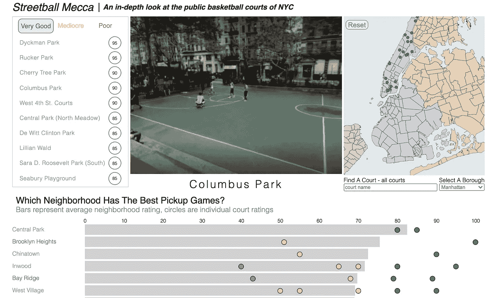
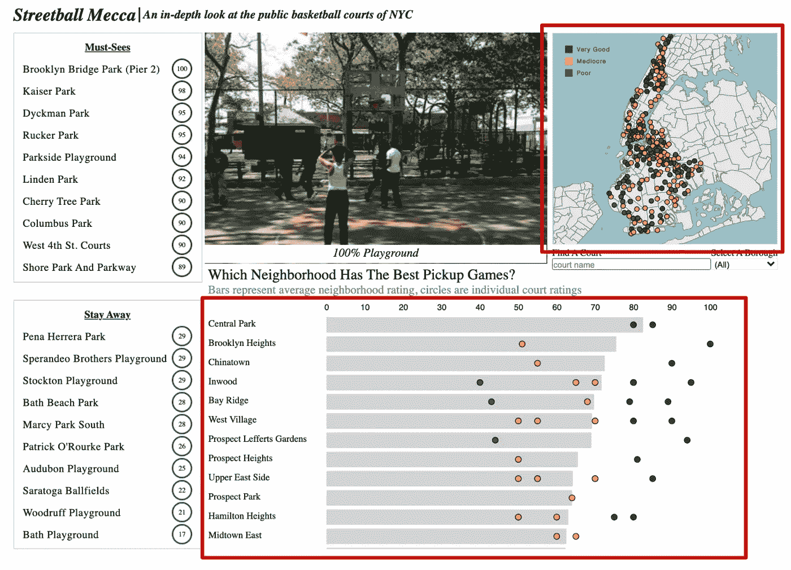
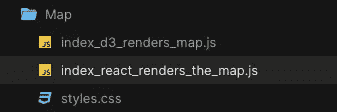

# React & D3:渲染地图

> 原文：<https://levelup.gitconnected.com/react-d3-rendering-a-map-5e006b2f4895>



自从我发现了 D3，我立刻就被它的所有功能迷住了。它是作为一个低级的 JavaScript 数据可视化库而构建的，这意味着你可以在屏幕上构建、渲染和交互的内容只受到你的想象力的限制。它也是 Github 上使用最广泛的 JavaScript 数据 viz 库之一，拥有超过 95k 颗星。

早在 2015 年，我从 GA 的 WDI(网络开发沉浸式)项目毕业后，我就认真研究了几年，甚至在 2018 年，在他们的纽约校园里举办了一次每周聚会。

2016 年，我被 GA 聘用，教授我的第一个 WDI 项目，我需要学习 React pronto，因为我的团队决定将它纳入我们的课程。我对 React 了解得越多，我就越感兴趣，因为要求掌握所有内容，D3 被搁置了。

直到最后几个月，我决定最终跳回 D3，并决定重构我以前构建的名为[街球圣地](https://codepen.io/jkeohan/project/full/ZvKkKE)的 D3 仪表板项目。

这种重构大部分涉及替换 D3 来创建和/或更新/删除元素，并将其交给 React。Reacts 的优势之一是管理状态，所以最初选择了 **useState** ，但后来将其重构为 **useReducer** ，因为它是管理状态和复杂业务逻辑的更好选择。最后，为了便于管理，我将设计分成越来越小的组件。

## **整合 D3 并做出反应**

集成 React 和 D3 需要决定给 D3 多少控制权，或者从 D3 拿走多少控制权，因为 D3 和 React 都希望完全控制 DOM。

以下是你应该考虑的 3 种基本方法:

*   React 中的 D3——React 呈现一个 svg，D3 完成所有其他工作
*   D3 独特的方法(比例、轴、投影等..)并对管理状态和更新 DOM 做出反应
*   使用第三方 React/D3 库，比如像 [Nivo](https://nivo.rocks/#/) 这样的高级库或者像 [VX](https://vx-demo.now.sh/https://vx-demo.now.sh/) 这样的低级库。

每种方法都有其优点/缺点，最终归结为你最精通哪种技术，D3 还是 React。

## 反应中的 D3

起初，我在 React 方法中采用了 **D3，因为这是移植现有代码库的最简单方法。在这一点上，我精通这两个库，但是将这两个库结合起来是一个新的尝试，需要一些研究和许多考验。**

在我检查了最初的设计后，我决定将 D3 限制在仅仅是**地图、圆圈**和**条形图(包括 x 轴)**，并允许 React 渲染所有其他元素。



## D3 地图组件

对于地图，我主要是复制了**的 renderChart** 函数，并创建了一个对 svg 的**引用(引用)**。React 中的 Ref 只是对 DOM 节点或 JavaScript 值的引用。在 svg 的用例中，我将其等同于使用 **document.querySelector** 抓取一个 DOM 元素。另一方面，将 ref 分配给 JS 值是为了在一个或多个状态变化期间保持该值。

ref 是一个对象，它存储分配给当前键**的值，然后将该值传递给 **d3.select()** 以获取 DOM 元素。**

这里使用 **useRef** 钩子实例化 ref，然后使用 **ref={svgRef}将 **svgRef** 分配给 svg 元素。**

```
import React from 'react'
import * as d3 from 'd3'const Map = (props) => { //////////////////////////////////////////////////////
   // REFs
   ////////////////////////////////////////////////////// const svgRef = useRef();   ////////////////////////////////////////////////////// 
   // RENDER THE CHART USING D3
   //////////////////////////////////////////////////////      const renderChart = (nyc, path) => {
     d3.select(svgRef.current)
      //...additional d3 code...
   }; ////////////////////////////////////////////////////// 
    // RENDER THE SVG
    ////////////////////////////////////////////////////// return(    
     <svg id="boroughs-map" ref={svgRef}></svg>
   )
}
```

然后为 D3 投影实例化了另一个 ref，在本例中是 **d3.geoMercator()。**在本例中，它被用作功能组件中的**实例变量**，因为该值将在组件生命周期的不同时间被地图和圆圈引用。

```
//////////////////////////////////////////////////////
// REFs
//////////////////////////////////////////////////////
const svgRef = useRef()
const projRef = useRef(d3.geoMercator()
   .center([-73.93, 40.72]).scale(57500));
```

**useEffect** is 然后用于抓取用于使投影居中的 svg 的高度/宽度。 **useEffect** 在这里被实现为一个 **componentDidUpdate** 生命周期方法，它有一个**依赖项。**依赖关系值的任何变化都会导致 **useEffect** 方法重新运行。

```
//////////////////////////////////////////////////////
// USEEFFECT AS COMPONENTDIDUPDATE WITH DEPENDENCY
//////////////////////////////////////////////////////
useEffect(() => { const height = svgRef.current.clientHeight
  const width = svgRef.current.clientWidth projRef.current.translate([width  / 2, height  / 2 ]);}, [data])
```

投影是 D3 特有的，它定义了地图将如何显示。D3 带有各种带有**的凸起。geometric ator()**最常用。在这个特殊的用例中，需要使用**平移**来居中，这需要高度/宽度值。

```
//////////////////////////////////////////////////////
// USEEFFECT AS COMPONENTDIDUPDATE WITH DEPENDENCY
//////////////////////////////////////////////////////
useEffect(() => { const height = svgRef.current.clientHeight
   const width = svgRef.current.clientWidth projRef.current.translate([width  / 2, height  / 2 ]);}, [data])
```

然后将投影传递给 **d3.geoPath()** 来绘制实际的 svg 路径，这些路径定义了地图中行政区的形状。我还包含了一个 **if** 语句，该语句仅在有实际数据要渲染时将地图数据和路径传递给 renderChart。

```
//////////////////////////////////////////////////////
// USEEFFECT AS COMPONENTDIDUPDATE WITH DEPENDENCY
//////////////////////////////////////////////////////
useEffect(() => { const height = svgRef.current.clientHeight
   const width = svgRef.current.clientWidth projRef.current.translate([width  / 2, height  / 2 ]); const path = d3.geoPath().projection(projeRef.current) if (data.length) {
     renderChart(data[0], path)
   }}, [data])
```

这是目前为止所有的代码。

```
//////////////////////////////////////////////////////
// REFs
//////////////////////////////////////////////////////
const svgRef = useRef()
const projRef = useRef(d3.geoMercator()
   .center([-73.93, 40.72]).scale(57500));//////////////////////////////////////////////////////
// USEEFFECT AS COMPONENTDIDUPDATE WITH DEPENDENCY
//////////////////////////////////////////////////////
useEffect(() => { const height = svgRef.current.clientHeight
   const width = svgRef.current.clientWidth projRef.current.translate([width  / 2, height  / 2 ]); const path = d3.geoPath().projection(projeRef.current) if (data.length) {
     renderChart(data[0].features, path)
   }}, [data])
```

至于 **renderChart** 函数，它只有 8 行实际代码，全部是 D3:

*   数据绑定— **。数据(data)**
*   数据输入— **。回车()**
*   追加数据 **—。追加('路径')**
*   附加属性-。**属性(' d '，路径)**
*   附加样式-。 **style('fill '，(d)=>boroughLegend(d . properties . borough))**

```
const renderChart = (data, path) => {
   d3.select(svgRef.current).selectAll('path')
     .data(data).enter().append('path')
     .attr('class', (d) => d.properties.name)
     .attr('d', path)
     .style(‘fill’, (d) => boroughLegend(d.properties.borough))
};
```

## D3 用于数学，React 用于 DOM

虽然这可以渲染地图，但我知道 D3 代码的某些部分可以用 React 代替。所以问题是 React 可以很容易地呈现哪些元素，答案非常清楚，即**路径**元素。

因此，需要进行以下重构:

*   创建一个新的 ref 来存储 d3.geoPath()的值—这是因为我决定将条件逻辑从 useEffect 移到 return 语句中
*   更新 useEffect 以更新新的 pro
*   使用。map()迭代数据，创建路径元素，并为它们分配所需的属性
*   如果有数据，请在组件返回语句中使用条件逻辑来呈现路径

添加新的 ref 几乎不费吹灰之力。

```
//////////////////////////////////////////////////////
// REFs
//////////////////////////////////////////////////////
const svgRef = useRef()
const projRef = useRef(d3.geoMercator()
   .center([-73.93, 40.72]).scale(57500));
const pathRef = useRef()
```

更新 useEffect 中的 pathRef 也没什么大不了的。我还通过移除条件逻辑来稍微清理了一下 **useEffect** 。

```
//////////////////////////////////////////////////////
// USEEFFECT AS COMPONENTDIDUPDATE WITH DEPENDENCY
//////////////////////////////////////////////////////
useEffect(() => { const height = svgRef.current.clientHeight
  const width = svgRef.current.clientWidth projRef.current.translate([width  / 2, height  / 2 ]); pathRef.current = d3.geoPath().projection(projRef.current);}, [data])
```

renderChart() 需要最大的努力，但我甚至不会走那么远。它所做的只是用数组映射替换了 **D3 的数据绑定**和 **enter** 方法，创建路径并分配属性。

```
const renderChart = () => {
  return data[0].features.map((d,i) => {
    const featurePath = `${pathRef.current(d)}`
      return (
        <path 
          key={i} 
          d={featurePath} 
          className={d.properties.name}
          fill={boroughLegend(d.properties.borough)}
        />
       )
   })
};
```

最后一步是向 Map components return 语句添加条件逻辑。

```
return (
  <svg id="boroughs-map" ref={svgRef}>
    {data.length && renderChart()}
  </svg>
);
```

# **结论**

我不得不说，比起使用 D3 来渲染地图，我更喜欢这种方法。我想这是因为这些天我一直在与 React 打交道，所以我认为它应该尽可能地管理 DOM，这几乎总是如此。

在某种程度上，我几乎很难过用 React 来取代 D3 的这一功能，因为我已经习惯了 D3 的**数据绑定**和**输入/更新/退出**模式，这是我在任何 D3 课程介绍中一直强调的。

事实上，React 似乎更适合呈现元素，并通过 **useState** 或 **useReducer 跟踪任何状态变化。D3 本身仍然是强大和高效的，并且提供了许多 React 中没有的特性，所以我很高兴我仍然能够将它融入到这个项目中。**

这是用于地图和圆圈的[**代码沙箱**](https://codesandbox.io/s/d3-streetball-mecca-map-only-rsqpv?file=/src/components/Map/indexV2.js) ，包括 2 个文件，其中包含通过 D3 渲染地图的代码和 refactor over。给他们两个都试一试，让我知道你是否看到任何额外的改进空间。



我还包括了输入和下拉功能，用于根据选择的公园或选择的行政区过滤公园。

我正在写一篇后续文章，用一个 React Circle 组件替换 D3 来生成圆形并制作动画，同时加入[**React-Spring**](https://www.react-spring.io/)**来制作圆形动画。**

**如果你有兴趣阅读关于这个项目的更多信息，请查看我以前的文章 [React:用 useReducer](https://jkeohan.medium.com/react-managing-complex-state-transitions-with-usereducer-e37536b12944) 管理复杂的状态转换。**