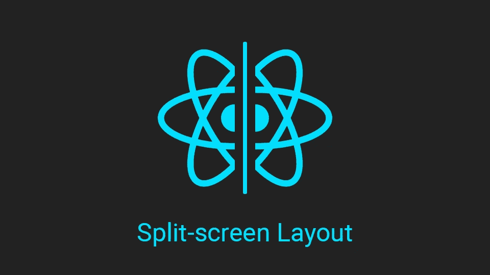
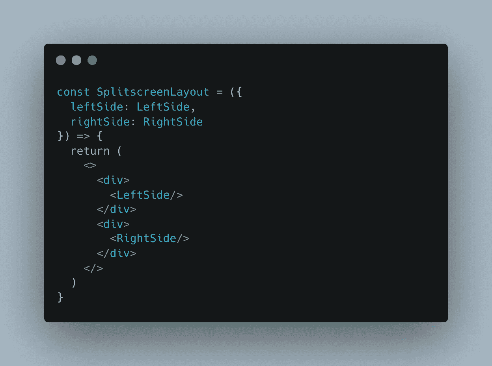
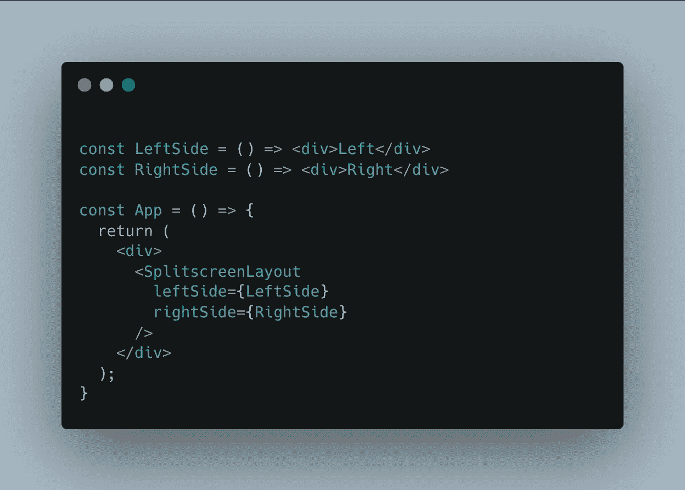
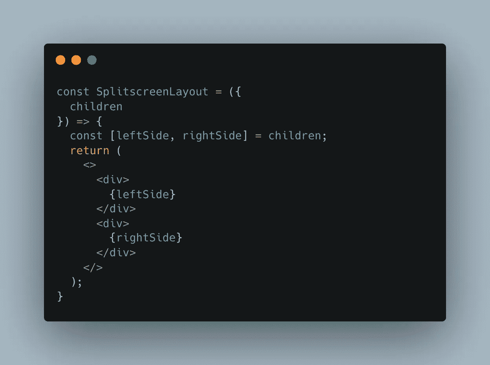
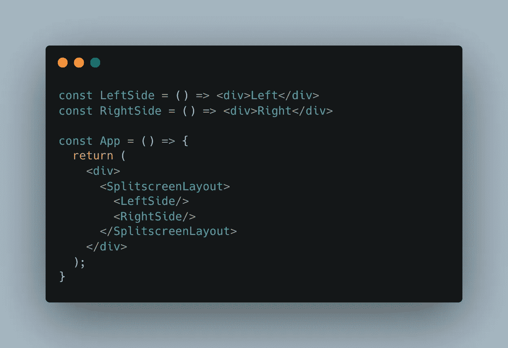

# React 设计模式:分屏布局和可迭代子元素

> 原文：<https://levelup.gitconnected.com/react-design-pattern-split-screen-layout-and-iterable-children-9de6896c5b42>

## 你知道孩子可以是一个数组吗？

在这篇文章中，我们将要谈论的是**分屏布局**。

分屏布局是一种**设计模式**，它不仅可以在 **React** 中使用，还可以在任何**现代 UI 框架**中使用。

> 分屏布局的要点是将你的 UI 树分成两个子树，每个子树有自己的内容

例如，当你想在你的页面上显示大量的数据，并且需要把你的屏幕分成两部分时，你可以使用这个。

## 用法示例

以下是一些分屏设计的好例子:

[https://pin.it/10NeKVt](https://pin.it/10NeKVt)

[https://www . mock plus . com/blog/post/split-screen-web-design #:~:text = What % 20 is % 20a % 20 split % 2d screen，messages % 20 on % 20 the % 20 same % 20 page](https://www.mockplus.com/blog/post/split-screen-web-design#:~:text=What%20is%20a%20split%2Dscreen,messages%20on%20the%20same%20page)。

# 实现模式

在本文中，我们将对实现这种模式的两种方式感兴趣。第一个大概是大部分开发者用的。这是一种很好的方式，也有它的优点，但是，我们将看到第二种实现方式，我们可以使用一种更简单的方式来实现这种模式。

我们开始吧！

## 首次实施

对于我们的第一个实现，我们将有一个名为`SplitscreenLayout`的组件，它的目标是**呈现左侧和右侧**:

> 我没有在这里放置任何样式，因为本文的重点纯粹是关于 React 和 HTML

现在，在父组件中，我们希望呈现这两个面:

> 我们可以选择将**左侧**和**右侧**渲染，而不是将组件作为道具发送，但是在道具中渲染组件并不是一个很好的做法。如果组件本身渲染它，总是会更好。

这个实现很好，但是它没有使用 React 的所有功能。这也迫使我们在本可以使用孩子的地方使用道具。现在让我们用第二个实现来改变这种情况。

## 第二次实施

你知道`**children**` **可以是数组**吗？在我们的例子中，这就是实现的原因。

让我们稍微改变一下 SplitscreenLayout 组件

> 我们用**小写**表示`**leftSide**`和`**rightSide**`，因为它们是**元素而不是**组件。

我们在这里大大简化了组件！以及它的用法:

> 尽管我们在布局的主体中发送多个组件，但我们在这里没有使用片段。这是因为我们的布局将子元素视为一个元素数组，而不是单个元素。

这种渲染方式的伟大之处在于**完全使用了 JSX** 。HTML**中不再需要 JS**或者**传递组件作为道具**，干净了很多。

# 结论

我们的第一个实现使我们的布局组件**知道**它正在渲染什么(*左侧和右侧*)，并使**难以在当前状态下重用**。此外，你可能需要将**附加道具**传递给布局组件，然后再将**传递给左右两侧的**。

另一方面，第二个实现**解决了所有这些缺点**。布局组件**只负责包装**已经从父级渲染的左侧和右侧。所有的道具也在那里处理，我们最终得到一个**单一用途**、**高度可重复使用**的布局。

感谢您阅读本文！我希望它是有用的！

不要犹豫留下掌声或跟随它！

 [## 使用 Console.log 进行调试并不容易

### 让我们看看如何改进我们调试 web 应用程序的方式！

javascript.plainenglish.io](https://javascript.plainenglish.io/using-console-log-for-debugging-is-not-the-easy-way-92aca00ee2f1)  [## 使用 React 从头开始拖放

### 关于如何创建一组 React 组件来处理拖放的教程

javascript.plainenglish.io](https://javascript.plainenglish.io/drag-and-drop-from-scratch-with-react-be2aa96cc210)  [## 钩子如何让我们拥有更干净、更简单的组件

### 为什么您应该将您的逻辑导出到 React 挂钩中。

javascript.plainenglish.io](https://javascript.plainenglish.io/how-hooks-allow-us-to-have-cleaner-simpler-components-34a773355282)  [## 测试 React 挂钩时处理错误

### 如何在测试 React 挂钩时处理错误，并针对特定的错误

javascript.plainenglish.io](https://javascript.plainenglish.io/handle-error-while-testing-your-hooks-e845a08045a4)