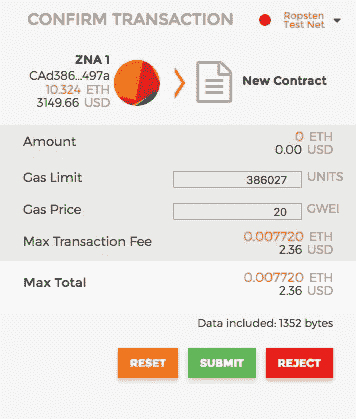

# React & Ethereum:从所需的最少工具集开始—第 2 部分，共 4 部分

> 原文：<https://levelup.gitconnected.com/react-ethereum-getting-started-with-the-minimum-toolset-required-part-2-of-4-ad4d258ebe53>

了解如何使用所需的最少工具集创建智能合约并将其部署到以太坊区块链:Remix、Metamask 和任何文本编辑器。

**[*第 1 部分*](https://medium.com/@zubairnahmed/https-medium-com-zubairnahmed-react-ethereum-getting-started-with-the-minimum-toolset-required-part-1-of-4-9562efa23d18)***第 2 部分***[*第 3 部分*](https://medium.com/@zubairnahmed/react-ethereum-getting-started-with-the-minimum-toolset-required-part-3-of-4-6f8c55c751f5)[*第 4 部分*](https://medium.com/@zubairnahmed/react-ethereum-getting-started-with-the-minimum-toolset-required-part-4-of-4-478be958c16f)**

**********

*****Pixabay 图像，在[知识共享 CC0](https://creativecommons.org/publicdomain/zero/1.0/deed.en) 下发布。*****

*******更新**:此博客系列不再维护。*****

*****[*GitHub 仓库*](https://github.com/zubairnahmed/react_ethereum_blockchain) :如果你愿意，你可以和仓库一起编码。我添加了一些评论作为指导。*****

# *****阶段 2:设置 React 并与之交互*****

*****既然我们已经在 Solidity 中编写了一个智能契约，并在 Remix JavaScript VM 上使用了它，那么是时候添加几行代码并在以太坊 Ropsten Testnet 上部署一个契约了。*****

*****这个阶段的本质是连接 React 以从我们的智能契约中读取变量。该合同将存在于以太坊 Ropsten Testnet 中。React 与该测试网络的连接将通过元掩码发生。*****

*****首先，我们将添加一个状态变量，然后在构造函数中初始化它，并添加一个返回该变量的函数。*****

**********

*****string 类型的私有状态变量，称为 **secret*******

******第 6 行*:声明一个 [***私有***](http://solidity.readthedocs.io/en/latest/contracts.html?highlight=private#visibility-and-getters) 状态变量。我称之为 ***秘密*** 因为它将只对合同可见。*****

**********

*****添加第 11 行，将 **secret** 变量初始化为“secret data”*****

******第 11 行*:在我们的 [***构造函数***](http://solidity.readthedocs.io/en/latest/contracts.html?highlight=constructor#creating-contracts) 中初始化 ***secret*** 变量为*secret data】*。任何人都可以看到这个数据，所以在这一点上它不是私有的。我们正在初始化它，因为我们不想玩一个空字符串。如果我们编写一个函数，将 ***secret*** 变量设置为其他任何值，那么它就实现了隐私。*注意*:由于我们不知道 [*msg.sender*](http://solidity.readthedocs.io/en/latest/units-and-global-variables.html?highlight=msg.sender#block-and-transaction-properties) 的内容，所以 ***owner*** 变量即使在初始化时也是私有的。*****

**********

*****允许外部客户端读取名为 **secret** 的私有状态变量的函数*****

******第 14 行*:提供了一个名为 ***getSecret*** 的函数，其可见性为[***public***](http://solidity.readthedocs.io/en/latest/miscellaneous.html?highlight=public#function-visibility-specifiers)，并具有[***view***](http://solidity.readthedocs.io/en/latest/miscellaneous.html?highlight=view#modifiers)*和 ***returns*** 。 ***视图*** 通知 Solidity 编译器，该函数只读取契约的状态变量，不修改它们。*注*:截至 2017 年 11 月 8 日， ***以太坊虚拟机(****【EVM】)*不强制执行这种只读能力，以太坊区块链上代码运行的地方。在编译时，编译器需要知道函数是否返回任何值，这就是 ***返回*** 修饰符的原因。******

*******第 15 行*:将 ***secret*** 状态变量的值返回给函数的调用者，在我们的例子中会有 React。******

******继续编译契约，将其部署在 **JavaScript VM** *环境*中，并使用它。完成后，我们将设置元掩码。******

## ******设置元掩码******

******如果你还没有，请[安装 Metamask 作为 Chrome 扩展](https://chrome.google.com/webstore/detail/metamask/nkbihfbeogaeaoehlefnkodbefgpgknn)并设置你的帐户。我发现这个过程相当简单。******

******创建您的帐户后，点击左上方的*主网络*菜单。******

************

******在 Metamask 上选择 Ropsten 测试网络******

******然后，选择 *Ropsten 测试网络*。接下来，我们将把一些假的乙醚放入我们的测试账户。但首先，先说一句。******

*******Ropsten 测试网*就是我在这次学习经历中一直影射的以太坊 Ropsten Testnet。这里部署的智能合约是实时的，对全世界都是可见的。开发人员使用这些测试网络来确保他们的合同在*主以太坊网络*中的行为符合预期，这是真正的以太坊区块链。******

> ******通过 Metamask 在*主以太坊网络*上部署智能合约就像点击一样简单。只需选择主网络，并通过 Remix 部署合同。******

******随着 *Ropsten 测试网络*被选中，我们将从[该站点](https://faucet.metamask.io/)请求一些假*乙醚*。点击“*从龙头*请求 1 以太”按钮，它将创建一个交易，向您的 Metamask 帐户发送一些假加密货币。我通常点击它几次，这样我就有足够的时间来测试我的应用程序。******

## ******在以太坊 Ropsten Testnet 上部署智能合约******

******我们已经准备好将我们的合同部署到一个实时测试网络。我们将遵循我们创建第一个契约时呈现的*一般流程*，除了这次我们将使用**注入 Web3** *环境*。请记住*调试注释* : 请确保您已登录元掩码。******

******单击“创建”按钮时，Metamask 将显示如下屏幕:******

************

******来自元掩码的事务通知******

******每当我们要在任何网络上花费*乙醚*时，我们会被告知我们的选择是*重置*、*提交*还是*拒绝*交易。请点击*提交*。******

******一旦提交，我们会在 Remix 控制台上看到一个未决的消息。******

************

******我们的智能合同需要时间才能在实际的区块链上部署******

******以太坊区块链和它的生态系统网络通常每 15 秒创造一个新的街区。所以，我们必须等待我们的合同生效。很快我们会看到如下屏幕:******

************

******以太坊 Ropsten Testnet 上的实时智能合约，显示在屏幕底部“0 待处理交易”的正下方******

******我们的智能合同现已启动并运行。接下来，我们将开始设置我们的 React 环境，并将我们的契约连接到前端。******

## ******Create-React-App 入门******

******在本次学习体验中，我们将使用 *create-react-app* 来启动并运行 react 应用程序。我选择这种方法，因为这个项目的重点不是 React，而是 React 如何与以太坊区块链交谈。******

*******注意*:我使用的是 Mac OS，但是这里介绍的过程应该在 Windows / Linux 上兼容或相似。******

******请打开命令行，并键入以下内容:******

************

******在你的电脑上全局安装 create-react-app******

******安装完成后，创建一个名为*React _ ether eum _ connection*的 React 应用程序，或者任何你想给它起的名字。******

************

******创建一个 React 应用程序支架******

******接下来，我们将 *cd* 到创建的目录中。******

************

******输入应用程序目录******

******然后，我们将使用 npm 来启动 React 应用程序。******

************

******启动我们的 React 应用程序******

************

******创建-反应-应用程序的欢迎页面******

******我们将只编辑应用程序中的一个文件， *App.js* 。请在您选择的文本编辑器中打开项目。我将使用 Atom。******

************

******在 Atom 文本编辑器中打开**react _ ether eum _ connection**中的所有文件******

******我们现在准备通过 Metamask 将 React 与我们部署的智能契约连接起来，该契约位于以太坊 Ropsten Testnet 上。******

## ******React 和以太坊接口******

******为了开始 React 与以太坊的连接，特别是测试网络上部署的智能合约，我们将编写一个组件构造器框架，如下所示:******

************

******准备好与以太坊互动******

*******假设*:如本文开头所述，我假设对 React 有基本的了解。所以我将重点介绍与以太坊对话的代码。******

*******第 9 行*:创建一个名为 ***MyContract*** 的变量，该变量将包含我们的智能合约的 [***应用二进制接口*** ( *ABI* )](http://solidity.readthedocs.io/en/latest/abi-spec.html) ，这是一个对象数组。ABI 告诉外界智能合约可以进行哪些交互。它类似于一个[应用编程接口(API)](https://en.wikipedia.org/wiki/Application_programming_interface) 。注:我们将很快看到如何为我们的合同获得 ABI。******

*******第 9 行续*:注意浏览器 ***窗口*** 对象中的 ***web3*** 对象。在引擎盖下， ***web3*** 是让与以太坊对话成为可能的魔法物体。通过元掩码注入到 ***窗口*** 对象中。这个 ***web3*** 对象和它的库有足够的深度，尽管在这个体验中我们将很少使用它。探索 ***Web3*** 需要自己的博文。******

*******第 12 行*:创建一个组件状态属性，它将保存我们的智能契约的 ***地址*** 。就像，它将包含我们的合同在以太网 Ropsten Testnet 上的确切位置的十六进制字符串。******

******现在我们已经写好了那段代码，让我们转到 Remix 来获得我们的***【ABI】***和契约 ***地址*** 。******

*******一般流程注释*:获取***【ABI】***和 ***智能合同地址*** 的过程将在我们更改或更新合同时重复。请练习一下，因为我们将在第 3 和第 4 阶段使用它。******

******转到 Remix 上的**运行**选项卡。******

************

******在**运行**选项卡中，我们可以在屏幕底部找到智能合同地址，如上面的截图所示******

******点击“ *x* ”左侧的*复制图标*，将我们的智能合同地址复制到剪贴板。******

******然后将其粘贴到第 12 行:******

************

******将合同**地址**字符串添加到 React 接口******

******现在回到 Remix，点击**编译**标签。******

************

******注意**细节**按钮，在**发布到群组**按钮旁边******

******点击*细节*按钮，将弹出如下模式:******

************

******详细信息按钮显示此模态— **界面 ABI** 是我们的，**你猜对了，**住在哪里******

******请点击字节码部分下面界面— ABI 部分中问号图标旁边的*复制图标*。这将把我们的智能合约的 ABI 复制到剪贴板。******

******接下来，将其粘贴到第 9 行。******

************

******ABI 插进 React 界面。请原谅小字体******

******我们的 React 应用程序现在与我们在 Ethereum Ropsten Testnet 上部署的智能合约连接起来了！就这么简单。******

******最后，让我们创建一个按钮，从我们的合同中查询秘密数据。******

************

******React 组件的 render()内容。第 37 行添加了按钮标签******

*******第 32 行*:在 *< h1 >* 标签内添加“ *React &以太坊简单应用*”文本。******

*******第 35–39 行*:添加一个 *<按钮>* 标签和一个 *onClick* 事件处理程序来触发将属于我们组件的 *querySecret* 函数。我将按钮“*查询智能合同的秘密*”称为描述性按钮。 *< br / >* 标签是为了增加间距，让按钮在浏览器上看起来好看。******

******然后，我们将编写 *querySecret* 函数，并将其绑定到我们的组件实例。******

************

******注意:绑定发生在 React 组件的构造函数内部******

*******第 15 行*:绑定*查询密件*。每当在基于类的 React 组件内的函数中使用 *this* 关键字时，函数必须绑定到组件实例，这发生在构造函数中。******

*******第 19 行*:将 *getSecret* 函数从 *ContractInstance* 对象中解构为自己的变量。 *getSecret* 函数看起来眼熟吗？这和我们在智能合约中写的功能是一样的。我们在契约中编写的所有函数都将在 *ContractInstance* 对象上可用。******

*******第 21 行*:通过回调调用 *getSecret* 函数。如果没有错误，智能合约的秘密字符串将被记录在我们的浏览器中。我们将在 Chrome 开发者工具中看到它。******

******我们现在可以看到结果了。切换您的浏览器，找到我们新创建的按钮。它会自动出现，除非你关闭服务器。如果是这样，在命令行上运行 *npm start* 。******

*******调试注意事项*:存在竞争情况:如果 React 组件在 Metamask 将 ***web3*** 对象注入 ***window*** 对象之前加载，就会发生崩溃。请用*Cmd+R*(Mac OS)/*Ctrl+R*(Windows/Linus)刷新你的页面。这将解决问题。******

************

******用我们的按钮查询智能合同的反应前端******

*******注*:我加了一些 CSS，让按钮字体变大。如果您愿意，请添加'*按钮，输入{ font-size:20px；}* 在 *App.css* 文件的底部。******

******打开 Chrome Developer Tools，方法是右键单击并从菜单中选择 *Inspect* ，或者按键*Cmd+Option+J*(Mac OS)/*Ctrl+Shift+J*(Windows/Linux)。******

******确保选择了开发工具的**控制台**选项卡。单击按钮，见证从智能合同中检索的数据！******

************

******Chrome 开发者工具显示了我们的'**秘密数据**，它位于以太坊 Ropsten Testnet 上。请注意对未来的警告，虽然在这个项目中可以忽略它******

*******回忆*:‘*秘密数据*在我们智能合约的构造函数中初始化。看到它显示在我们的浏览器控制台上，这清楚地表明我们已经直接从现场以太坊区块链进行了查询。******

******第二阶段到此为止。我们已经成功地通过 Metamask 连接了 React，与以太坊测试网络进行对话。相当酷！在下一阶段，我们将在 Remix 上向我们的智能契约添加一些代码，并通过 React 编辑我们的契约的状态变量。******

********[*第 1 部分*](https://medium.com/@zubairnahmed/https-medium-com-zubairnahmed-react-ethereum-getting-started-with-the-minimum-toolset-required-part-1-of-4-9562efa23d18)***第 2 部分***[*第 3 部分*](https://medium.com/@zubairnahmed/react-ethereum-getting-started-with-the-minimum-toolset-required-part-3-of-4-6f8c55c751f5)[*第 4 部分*](https://medium.com/@zubairnahmed/react-ethereum-getting-started-with-the-minimum-toolset-required-part-4-of-4-478be958c16f)********

*************************** [## 学习坚固性-最佳坚固性教程(2019) | gitconnected

### 14 大坚实度教程。课程由开发者提交并投票，让你找到最好的稳定性…

gitconnected.com](https://gitconnected.com/learn/solidity)*********