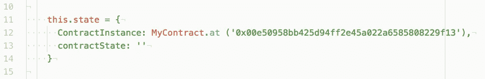

# React & Ethereum:从所需的最少工具集开始—第 3 部分，共 4 部分

> 原文：<https://levelup.gitconnected.com/react-ethereum-getting-started-with-the-minimum-toolset-required-part-3-of-4-6f8c55c751f5>

了解如何使用所需的最少工具集创建智能合约并将其部署到以太坊区块链:Remix、Metamask 和任何文本编辑器。

**[*第 1 部分*](https://medium.com/@zubairnahmed/https-medium-com-zubairnahmed-react-ethereum-getting-started-with-the-minimum-toolset-required-part-1-of-4-9562efa23d18)[*第 2 部分*](https://medium.com/@zubairnahmed/react-ethereum-getting-started-with-the-minimum-toolset-required-part-2-of-4-ad4d258ebe53)***第 3 部分***[*第 4 部分*](https://medium.com/@zubairnahmed/react-ethereum-getting-started-with-the-minimum-toolset-required-part-4-of-4-478be958c16f)**

**********

*****Pixabay 图像，在[知识共享 CC0](https://creativecommons.org/publicdomain/zero/1.0/deed.en) 下发布。*****

*******更新**:此博客系列不再维护。*****

*****[*GitHub 仓库*](https://github.com/zubairnahmed/react_ethereum_blockchain) :如果你愿意，你可以和仓库一起编码。我添加了一些评论作为指导。*****

# *****阶段 3:智能契约状态操纵*****

*****现在我们已经有了一个与 Ethereum Ropsten Testnet 连接的 React 应用程序，我们将开始操作智能契约的状态。*****

## *****在重新混合时向智能合约添加状态变量*****

*****请打开 Remix 并添加以下代码行。*****

**********

*****添加一个名为' **state** '的智能合约状态变量*****

******第 7 行*:声明一个 [***字符串***](http://solidity.readthedocs.io/en/latest/types.html?highlight=string#string-literals) 类型的状态变量，命名为 ***状态*** 。它被声明为[***private***](http://solidity.readthedocs.io/en/latest/contracts.html?highlight=private#visibility-and-getters)，所以它的值在契约之外是不可见的。*消除歧义注释*:出于学习的原因，我将我们的状态变量命名为 ***state*** 。一个契约可以有任意数量的状态变量，并根据它们的项目上下文适当地命名。*****

**********

*****将我们的'**状态'**变量初始化为“初始状态”*****

******第 13 行*:初始化 ***状态*** 变量为*初始状态*在我们的 [***构造函数***](http://solidity.readthedocs.io/en/latest/contracts.html?highlight=constructor#creating-contracts) 。*****

**********

*****添加一个返回智能合约当前状态的函数*****

******第 20 行*:提供了一个名为 ***getState*** 的函数，其可见性为[***public***](http://solidity.readthedocs.io/en/latest/miscellaneous.html?highlight=public#function-visibility-specifiers)，有修饰符[***view***](http://solidity.readthedocs.io/en/latest/miscellaneous.html?highlight=view#modifiers)*和 ***returns*** 。 ***视图*** 通知 Solidity 编译器该函数只读取契约的状态变量，不修改它们。*回忆*:截至 2017 年 11 月 8 日， ***以太坊虚拟机(*** *EVM)，*不强制执行这种只读能力，以太坊区块链上的代码运行在这里。 ***返回*** 修饰符告诉编译器，在编译时，函数是否返回任何值。******

************

******增加设置智能合约的**状态**变量的函数******

*******第 24 行*:提供了一个名为 ***setState*** 的函数，其可见性为[***public***](http://solidity.readthedocs.io/en/latest/miscellaneous.html?highlight=public#function-visibility-specifiers)，有一个 ***应付款*** 的修饰符。这个 ***应付款*** 修饰符允许一个函数接收*以太*。该函数采用一个名为 **newState** 的 ***string*** 类型参数，这将是我们的智能合约的 ***state*** 变量的新状态。******

******这就是这个阶段的混音部分。请在 **JavaScript VM** *环境*上使用 Remix 部署契约，玩转契约，浅尝辄止。这是检验我们的合同是否如预期那样工作的好方法。******

******看起来不错后，通过**注入 web 3**环境部署在以太坊 Ropsten Testnet 上。Metamask 将与 Remix 合作，为我们的 React 应用程序创建一个实时合同。******

## ******使用 React 更改智能合同状态******

******首先，我们将使用用新的智能契约***【ABI】、*** 更新我们的 ***MyContract*** 变量，以及用契约的 ***地址*** 更新我们的***contract instance***属性的通用过程。我有意不重写这个过程，这样可以锻炼记忆。******

******一旦我们的新合同建立起来，我们将编写一些代码，类似于我们在第 2 阶段获取秘密数据时所做的。******

************

******带有 onClick 事件处理程序的按钮标签，用于触发 **queryContractState** 函数******

************

********queryContractState** 函数调用我们的智能契约的 **getState** 函数，它位于我们的 React 组件状态的 **ContractInstance** 属性中******

******由于上面的代码已经解释过了，我觉得尝试不加解释地阅读它是个好习惯。******

******请在浏览器上测试您的代码，并确保它正常工作。点击“*查询智能合同状态*按钮。如果一切都连接正确，您将在 Chrome 开发工具的控制台选项卡中看到以下内容:******

************

******看到控制台上出现“**初始状态**，验证与以太坊智能合约的连接******

******接下来，我们将编写代码，让 React 能够操纵智能合约的初始状态。******

************

******表单元素的受控输入将在提交时调用**handlecontractstatsubmit**来更改智能合同状态******

************

********添加 contractState** 来反应受控输入的组件状态，用户在输入字段中添加或删除时触发******

******上面是一个 [*反应控制输入*](https://reactjs.org/docs/forms.html#controlled-components) ，它为我们的智能合约设置进入一个新的状态。如果您不知道受控组件，我已经添加了 React 文档的链接。******

************

******用于处理智能合同状态更改表单提交的代码******

******在***handleContractStateSubmit***函数中，我们从 React 组件的状态中提取出 ***setState*** 和 ***newState*** 。然后我们调用 ***setState*** 函数。******

*******第 45 行*:为 ***setState*** 函数提供第一个参数 ***newState*** ，这个参数是我们使用对象解构和变量别名从 *this.state* 中获得的。第二个参数是包含支付信息的对象:我们使用属性 *gas* 、中的*和 *value* 来提供该信息。第三个参数是回调函数。*******

******Line 48–50*:从 ***web3*** 对象获取信息，提供*从*转账*以太*哪个账户，以及要转账多少*值*。由于这个学习经历不是重点放在 ***Web3*** 这种需要深入看的，我就留着研究吧。*气体*属性设置了*气体*消耗的上限。*****

*****现在，我们准备改变我们部署的智能合约的状态。网页看起来像:*****

**********

*****获取和设置智能合同状态的应用程序设置*****

*****继续查询智能合约的状态。然后输入任何新状态，点击*提交*。然后再次查询契约的状态。您会注意到状态没有立即更新。*****

**********

*****更新智能合约的状态需要时间*****

*****这就是为什么我选择了*console . log**智能合约状态正在改变。*“由于任何以太坊区块链上的块平均每 15 秒更新一次，我们必须等待才能查询我们的新状态。我一直点击“*查询智能合同的状态*按钮，直到我看到新的状态。这很不方便，在下一阶段，我们将看到如何发出一个事件来通知我们契约的状态何时更新，而不是猜测。*****

*****这是第三阶段！当看到新的状态出现在 Chrome Developer Tools 的控制台选项卡中时，我们已经验证了我们操作了以太坊 Ropsten Testnet 上的实时智能合约的状态。*****

*****在下一阶段，我们将了解如何处理智能合约事件，以及探索以太坊智能合约技术的含义。*****

*******[*第 1 部分*](https://medium.com/@zubairnahmed/https-medium-com-zubairnahmed-react-ethereum-getting-started-with-the-minimum-toolset-required-part-1-of-4-9562efa23d18)[*第 2 部分*](https://medium.com/@zubairnahmed/react-ethereum-getting-started-with-the-minimum-toolset-required-part-2-of-4-ad4d258ebe53)***第 3 部分***[*第 4 部分*](https://medium.com/@zubairnahmed/react-ethereum-getting-started-with-the-minimum-toolset-required-part-4-of-4-478be958c16f)*******

************************ [## 学习坚固性-最佳坚固性教程(2019) | gitconnected

### 14 大坚实度教程。课程由开发者提交并投票，让你找到最好的稳定性…

gitconnected.com](https://gitconnected.com/learn/solidity)********