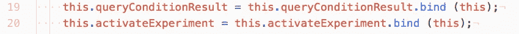

# React & Ethereum:从所需的最少工具集开始—第 4 部分，共 4 部分

> 原文：<https://levelup.gitconnected.com/react-ethereum-getting-started-with-the-minimum-toolset-required-part-4-of-4-478be958c16f>

了解如何使用所需的最少工具集创建智能合约并将其部署到以太坊区块链:Remix、Metamask 和任何文本编辑器。

**[*第 1 部分*](https://medium.com/@zubairnahmed/https-medium-com-zubairnahmed-react-ethereum-getting-started-with-the-minimum-toolset-required-part-1-of-4-9562efa23d18)[*第 2 部分*](https://medium.com/@zubairnahmed/react-ethereum-getting-started-with-the-minimum-toolset-required-part-2-of-4-ad4d258ebe53)[*第 3 部分*](https://medium.com/@zubairnahmed/react-ethereum-getting-started-with-the-minimum-toolset-required-part-3-of-4-6f8c55c751f5)***第 4 部分*****

**********

*****Pixabay 图像，在[知识共享 CC0](https://creativecommons.org/publicdomain/zero/1.0/deed.en) 下发布。*****

*******更新**:此博客系列不再维护。*****

*****[*GitHub 仓库*](https://github.com/zubairnahmed/react_ethereum_blockchain) :如果你愿意，你可以和仓库一起编码。我添加了一些评论作为指导。*****

# *****阶段 4:智能合约的条件*****

*****在我们的最后阶段，我们将遵循前面介绍的过程:在 Remix 中编写 Solidity 代码，在 JavaScript VM 环境中测试该代码，在 Ethereum Ropsten Testnet 上部署它，使用 Metamask 作为中介将它与 React 连接起来。*****

*****但是不同于以前的阶段，我们现在将得到更多的元。为什么选择智能合同？它为世界开启了创新的什么本质？我们如何用一些简单的代码挖掘其本质呢？*****

*****智能合同就像一份'*现实生活'*合同，即我们在日常生活中常见的合同，如租金和汽车租赁、雇主和雇员之间的协议、法律强制执行的社会协议、商业交易等等。两个或两个以上的人参与某种结构的任何地方，都存在一种内在的契约，这种契约使这种结构成为可能。与'*现实生活'*合同和智能合同的主要区别在于执行:当给定的**条件**满足或不满足时，智能合同自动执行。现实生活中，合同是由人来执行的。*****

*****将这种自我执行能力与区块链技术的属性(透明性、不变性、非信任节点之间的价值转移、减少第三方的参与等)相结合，使智能合同成为创新的游乐场，我们可以想象出前所未有的创造价值的新颖和令人兴奋的方式。潜力是巨大的。*****

*****我相信有很多方法可以挖掘这种潜力，我能想到的最简单的方法就是**条件句**。常规的 *if … then* 语句。*****

*****智能合约上的条件可以依赖于逻辑、交互、时间、空间。条件的*真*或*假*可以由启用*物联网*的物理传感器、天气、使用时钟的特定时间、使用地理定位的空间、人类和程序之间的任何种类的交互来触发。*****

*****让我们编写一个简单的条件代码。请打开混音。*****

**********

*****在智能合同上设置状态变量*****

*****第 8 行:声明一个 [***公共***](http://solidity.readthedocs.io/en/latest/miscellaneous.html?highlight=public#function-visibility-specifiers) 状态变量的 [***布尔***](http://solidity.readthedocs.io/en/latest/types.html?highlight=booleans#booleans)-类型。我把它叫做 ***伪随机数结果*** 来传达它会随机返回*真*或*假*。*****

******第 9 行*:声明一个 [***事件***](http://solidity.readthedocs.io/en/latest/contracts.html#events) ，命名为 ***实验完成*** 。这种命名背后的意图是传达一个抽象的实验，任何实验，智能契约都可以执行。*****

**********

*****提供一个 **setExperimentInMotion** ，返回一个伪随机**真**或**假*******

******第 35 行*:提供了一个名为***setExperimentInMotion***的函数，其可见性为 [***public***](http://solidity.readthedocs.io/en/latest/miscellaneous.html?highlight=public#function-visibility-specifiers) ，有一个****returns***的修饰符。这个 ***应付款*** 修改器允许一个函数接收*以太*。 ***返回*** 修饰符告诉编译器，在编译时，一个函数是否返回任何值以及是什么类型。在这种情况下，函数 ***返回*** 一个类型为[***bool***](http://solidity.readthedocs.io/en/latest/types.html?highlight=booleans#booleans)的值。******

*******第 36 行*:使用 Solidity 提供的加密函数[***keccak 256***](http://solidity.readthedocs.io/en/latest/units-and-global-variables.html?highlight=keccak256#mathematical-and-cryptographic-functions)，返回一个[***bytes 32***](http://solidity.readthedocs.io/en/latest/types.html?highlight=bytes32#fixed-size-byte-arrays)*类型。这个值存储在一个名为***_ pseudoRandomResult***的内部变量中。我使用下划线来区分这个局部变量和状态变量***pseudoRandomResult***。*******

*******第 36 行续*:如果 ***keccak256*** 函数的输入稍有变化，它将返回一个不同的散列。所以从技术上来说，既然 [***味精。***](http://solidity.readthedocs.io/en/latest/units-and-global-variables.html?highlight=msg.#block-and-transaction-properties) [ *属性* ]对于每个调用者来说都是不同的，将会生成一个伪随机值。******

*******第 37 行*:提供一个随机条件，将 ***伪随机结果*** 变量设置为*真*或*假*。这是我随意设置的。******

*******行 40* :发出一个 [***事件***](http://solidity.readthedocs.io/en/latest/contracts.html#events) 来报告 ***伪随机数结果*** 的值。以太坊智能合约事件可以被外部实体观察，在我们的例子中是 React。发出的事件的参数存储在事务日志中，这是区块链中的一种特殊数据结构。******

******请在 Remix**JavaScript VM***环境*上部署并测试此合同。******

******当我们创建契约时，我们的编译器将执行***setExperimentInMotion***函数，并填充***pseudoRandomResult***的值。创建时，我们契约中的所有代码都运行一次。当我们在**JavaScript VM**环境中玩部署时，可以在 Remix 控制台中观察到这一点。******

******对代码满意后，请将其部署在**注入 Web3** *环境*中，并在 React 中连接智能合约***【ABI】******地址*** 。******

************

******带有 onClick 事件处理程序的按钮标签，用于触发 **queryConditionResult** 和 **activateExperiment** 功能******

******添加这些代码行后，我们的应用程序将看起来像这样:******

************

******我们学习项目的最终亮相******

******接下来的三段代码将在标题中简要说明。和以前一样，如果可能的话，请练习阅读并凭记忆打字。这种实践将帮助我们成为更流畅的编码者。******

************

******将 **queryConditionResult** 和 **activeExperiment** 绑定到我们类的构造函数中的 React 组件实例，因此我们可以在它们的函数代码中使用 **this********

************

********查询条件结果**功能代码。它从智能合同中检索信息，就像我们以前做的那样******

************

********activateExperiment** 功能代码。虽然这个函数使用 gas，但它不接受任何输入，因此可以跳过输入参数******

******一旦上面的代码写好了，我们的'*'实验完成后，我们将监听智能合约发出的 [***事件***](http://solidity.readthedocs.io/en/latest/contracts.html#events) 。*******

************

******React 类组件的**构造函数**中初始化的代码允许监听智能合约发出的事件******

************

******React 接收到事件后，将在 **render ()** 函数中执行的代码。注意:它位于 return 语句之外******

******我翻译了[事件](http://solidity.readthedocs.io/en/latest/contracts.html#events)文档中的 JavaScript API，使其成为上面的 React 友好代码。当我们的事件被接收时，它触发一个回调函数，这个函数将 *console.log* 我们在 Chrome 开发者工具上的结果。******

******继续并点击'*查询智能合同条件*按钮查看我们的初始结果。然后点击“*开始智能合约实验*”按钮，提交 Metamask 付款，等待我们的结果。******

************

******由智能合同发出的事件触发的日志******

*******App.js: 65 —* 记录我们智能合约上的***pseudoRandomResult***状态变量的值，当先点击“*查询智能合约条件*”时，该值为 *false* 。******

*******App.js: 77* —显示我们在 React 函数***activate experiment***中输入的 *console.log* 。这条消息告诉用户他们的点击做了什么，并且在我们使用 Metamask 确认我们的事务后被调用。******

*******回想一下*:当我们在阶段 3 中操作智能合约的状态时，我们必须一直点击“*查询智能合约的状态*”按钮，直到我们看到我们的更改得到反映。在这个阶段，我们通过使用事件来改进这个 UI。******

*******App.js: 84* —记录以太坊 Ropsten Testnet 触发的事件。事件是一个对象，它具有上面屏幕截图中显示的属性。这些属性可用于通知前端的各种交互。对于这种学习体验，我们只是使用 *args* 属性来获得*结果*。******

******App.js: 85 —展示了实验的结果，这是生活在我们智能契约中的***pseudoRandomResult***状态变量。注意，它现在翻转到*真*。******

*******开发者备注&*[*纯函数的潜在需求*](https://en.wikipedia.org/wiki/Pure_function)*(2017 年 11 月 8 日)*:我注意到这个应用程序正在捕捉我们的一个函数调用发出的多个事件。有时我会得到一个事件日志，有时两个，有时更多。你可能会注意到类似的东西。我做了一些根本原因分析，并得出结论，这些多重触发可能是由于叔叔/ommer 块。也就是说，当以太坊测试网络挖掘器对我们的块进行验证时，多个挖掘器会到达同一个有效块，导致创建大叔/ommer 块以及主块。这些多个块发出多个事件，这些事件被我们的 React 前端捕获。我欢迎你在评论中得出的任何结论。基于这一观察，我们构建的任何依赖于智能合约事件的函数都应该是纯函数。******

******这是最后一期的文章！我们现在已经看到 React 如何与以太坊对话。我们已经编写了一个简单的程序，它代表了可以在以太坊区块链上构建更复杂的应用程序的想法。祝贺你向你的创新想法迈出了第一步。******

*******回想一下*:要在以太坊区块链而不是 Ropsten Testnet 上发布智能合约，只需点击 Metamask。只需选择主以太网和部署。******

******我希望你喜欢这次学习经历！这是我的第一个博客系列。这是一个单一的职位，然后我意识到这将是最好的四部分系列。我希望能给你带来一些价值。******

******愿编码继续！下次见。******

********[*第一部分*](https://medium.com/@zubairnahmed/https-medium-com-zubairnahmed-react-ethereum-getting-started-with-the-minimum-toolset-required-part-1-of-4-9562efa23d18)[*第二部分*](https://medium.com/@zubairnahmed/react-ethereum-getting-started-with-the-minimum-toolset-required-part-2-of-4-ad4d258ebe53)[*第三部分*](https://medium.com/@zubairnahmed/react-ethereum-getting-started-with-the-minimum-toolset-required-part-3-of-4-6f8c55c751f5)***第四部分****【T30*********

********关于本文作者*:*******

******祖贝尔·艾哈迈德是孟加拉人，2005 年来到美国。他在斯坦福大学学习工程，他喜欢分享知识。他相信区块链技术的力量能够创造一个公平的竞争环境，创造一个新的多元化、包容性的全球经济。******

****************** [## 学习坚固性-最佳坚固性教程(2019) | gitconnected

### 14 大坚实度教程。课程由开发者提交并投票，让你找到最好的稳定性…

gitconnected.com](https://gitconnected.com/learn/solidity)******